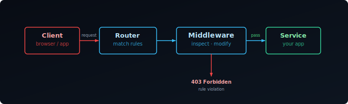
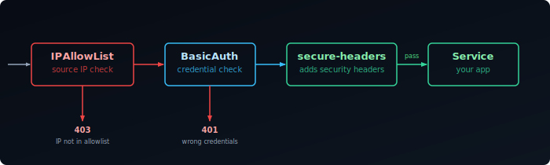

## What is Traefik

Traefik is an open-source reverse proxy and load balancer that works well with Docker, automatically detecting services and securing connections with SSL. It adapts in real-time, making it ideal for dynamic homelab setups.

In this guide, we will install Traefik — first in Docker, then as a bare metal binary for hosts where you'd rather not depend on Docker — enable automatic Let's Encrypt SSL via the Cloudflare DNS challenge, secure it with middlewares, and monitor it with Prometheus, Loki, and Grafana.


## Cloudflare API Token

Traefik uses the DNS-01 ACME challenge to obtain certificates. This works by creating a temporary DNS TXT record to prove domain ownership, which means it works even for services not exposed to the internet. This guide uses Cloudflare as the DNS provider — see the [lego docs][lego] for other providers.

Create a scoped API token in the Cloudflare dashboard with **Zone / Zone → Read** and **Zone / DNS → Edit** permissions. Where you store this token depends on whether you're running Traefik in Docker or on bare metal — each section below covers its own version.

## Docker

### Install Traefik with Docker Compose

Create the directory and `docker-compose.yml`:

```bash
mkdir traefik
nano traefik/docker-compose.yml
```

Add the following configuration to the file:

```yaml {filename="docker-compose.yml"}
services:
  traefik:
    image: traefik:3.6.7
    container_name: traefik
    restart: unless-stopped
    security_opt:
      - no-new-privileges:true
    environment:
      - TZ=Europe/Amsterdam
    env_file:
      - .env
    command:
      - "--api.insecure=true"
      - "--api=true"
      - "--api.dashboard=true"
      - "--ping=true"
      - "--providers.docker=true"
      - "--providers.docker.exposedbydefault=false"
      - "--providers.docker.network=traefik"
      - "--entryPoints.web.address=:80"
      - "--entryPoints.websecure.address=:443"
      - "--entryPoints.websecure.http.tls=true"
      - "--entryPoints.web.http.redirections.entryPoint.to=websecure"
      - "--entryPoints.web.http.redirections.entryPoint.scheme=https"
      - "--certificatesresolvers.le.acme.dnschallenge=true"
      - "--certificatesresolvers.le.acme.dnschallenge.provider=cloudflare"
      - "--certificatesresolvers.le.acme.email=${ACME_EMAIL}"
      - "--certificatesresolvers.le.acme.dnschallenge.delaybeforecheck=60s"
      - "--certificatesresolvers.le.acme.storage=/certs/acme.json"
      - "--log.level=INFO"
    networks:
      - traefik
    ports:
      - 80:80
      - 443:443
      - 8080:8080
    volumes:
      - /var/run/docker.sock:/var/run/docker.sock:ro
      - traefik_data:/certs
    healthcheck:
      test: wget --quiet --tries=1 --spider http://127.0.0.1:8080/ping || exit 1
      interval: 5s
      timeout: 1s
      retries: 3
      start_period: 10s

volumes:
  traefik_data:
    name: traefik_data

networks:
  traefik:
    name: traefik
```

### Store Your Credentials

Store the API token you created above, along with your domain and Let's Encrypt contact email, in a `.env` file in the same directory as your `docker-compose.yml`:

```bash
nano traefik/.env
```

```bash {filename=".env"}
CF_API_EMAIL=<your-cloudflare-email>
CF_DNS_API_TOKEN=<your-api-token>
DOMAIN=<your-domain>
ACME_EMAIL=<your-email>
```

### Start Traefik

```bash
docker compose -f traefik/docker-compose.yml up -d
```

Access the dashboard at `http://<server-ip>:8080`.

### Add a Test Service

To verify Traefik is working correctly, deploy the `whoami` test service:

```bash
mkdir whoami
nano whoami/docker-compose.yml
```

```yaml {filename="docker-compose.yml"}
services:
  whoami:
    container_name: simple-service
    image: traefik/whoami
    labels:
      - "traefik.enable=true"
      - "traefik.http.routers.whoami.rule=Host(`whoami.${DOMAIN}`)"
      - "traefik.http.routers.whoami.entrypoints=websecure"
      - "traefik.http.routers.whoami.tls=true"
      - "traefik.http.routers.whoami.tls.certresolver=le"
      - "traefik.http.services.whoami.loadbalancer.server.port=80"
    networks:
      - traefik

networks:
  traefik:
    name: traefik
```

#### DNS and Testing

1. Point `whoami.your-domain.com` to your server's IP address in your DNS settings
2. Verify DNS propagation with `nslookup` or an online DNS checker
3. Start the service:
   ```bash
   docker compose -f whoami/docker-compose.yml up -d
   ```
4. Open `https://whoami.your-domain.com` — you should see the whoami response with a valid SSL certificate
5. Once verified, remove the test service:
   ```bash
   docker compose -f whoami/docker-compose.yml down
   ```

## Bare Metal

Docker is great for container-heavy homelabs, but sometimes you want Traefik running directly on the host — no Docker dependency, full control over the process, and a clean systemd service. The rest of this guide covers a bare metal install from binary to running service.

### Download the Binary

Grab the latest release from GitHub. The `ARCH` variable auto-detects your architecture so the same commands work on both `amd64` and `arm64` machines.

```bash
TRAEFIK_VERSION="3.3.4"
ARCH=$(dpkg --print-architecture 2>/dev/null || uname -m | sed 's/x86_64/amd64/;s/aarch64/arm64/')
wget https://github.com/traefik/traefik/releases/download/v${TRAEFIK_VERSION}/traefik_v${TRAEFIK_VERSION}_linux_${ARCH}.tar.gz
tar -xzf traefik_v${TRAEFIK_VERSION}_linux_${ARCH}.tar.gz
sudo mv traefik /usr/local/bin/
sudo chmod +x /usr/local/bin/traefik
```

Verify the install:

```bash
traefik version
```

### Create Directory Structure

Set up the directories Traefik needs for config, dynamic routing rules, logs, and certificate storage. The `acme.json` file is where Let's Encrypt certificates are stored — it must be owner-readable only or Traefik will refuse to use it.

```bash
sudo mkdir -p /etc/traefik/conf.d
sudo mkdir -p /var/log/traefik
sudo touch /etc/traefik/acme.json
sudo chmod 600 /etc/traefik/acme.json
```

### Create a Dedicated User

Running Traefik as a dedicated non-root user limits what a compromised process can do. The `-r` flag creates a system account with no home directory, and `-s /sbin/nologin` prevents interactive login.

The `setcap` command grants the binary permission to bind to privileged ports (80 and 443) without needing root.

```bash
sudo useradd -r -s /sbin/nologin -M traefik
sudo chown -R traefik:traefik /etc/traefik
sudo chown -R traefik:traefik /var/log/traefik
```

### Store the Cloudflare Token

Store the token you created above in an environment file that the systemd service will load:

```bash {filename="/etc/traefik/traefik.env"}
CF_DNS_API_TOKEN=your_cloudflare_api_token
```

Lock down the file so only the `traefik` user can read it:

```bash
sudo chmod 600 /etc/traefik/traefik.env
sudo chown traefik:traefik /etc/traefik/traefik.env
```

### Main Config

This is the static config — it sets up entry points, the certificate resolver, and tells Traefik to watch `/etc/traefik/conf.d/` for dynamic service configs. Replace the `email` field with your own address for Let's Encrypt notifications.

```yaml {filename="/etc/traefik/traefik.yml"}
global:
  checkNewVersion: false
  sendAnonymousUsage: false

api:
  dashboard: true
  insecure: true

entryPoints:
  web:
    address: ":80"
    http:
      redirections:
        entryPoint:
          to: websecure
          scheme: https
  websecure:
    address: ":443"

certificatesResolvers:
  letsencrypt:
    acme:
      email: you@example.com
      storage: /etc/traefik/acme.json
      dnsChallenge:
        provider: cloudflare
        resolvers:
          - "1.1.1.1:53"
          - "8.8.8.8:53"

providers:
  file:
    directory: /etc/traefik/conf.d
    watch: true

log:
  level: INFO
  filePath: /var/log/traefik/traefik.log

accessLog:
  filePath: /var/log/traefik/access.log
```

### systemd Service

The service unit loads the Cloudflare token from the env file, runs as the `traefik` user, and restarts automatically on failure. `AmbientCapabilities` and `CapabilityBoundingSet` grant the process permission to bind to privileged ports (80 and 443) without root — and because these are systemd directives, they apply automatically on every start, including after a binary update. `NoNewPrivileges` and `PrivateTmp` add extra sandboxing on top of the non-root user.

```ini {filename="/etc/systemd/system/traefik.service"}
[Unit]
Description=Traefik reverse proxy
After=network-online.target
Wants=network-online.target

[Service]
Type=simple
User=traefik
Group=traefik
EnvironmentFile=/etc/traefik/traefik.env
ExecStart=/usr/local/bin/traefik --configFile=/etc/traefik/traefik.yml
Restart=on-failure
RestartSec=5s
AmbientCapabilities=CAP_NET_BIND_SERVICE
CapabilityBoundingSet=CAP_NET_BIND_SERVICE
NoNewPrivileges=true
PrivateTmp=true

[Install]
WantedBy=multi-user.target
```

Reload systemd, enable the service to start on boot, and start it now:

```bash
sudo systemctl daemon-reload
sudo systemctl enable --now traefik
sudo systemctl status traefik
```

Access the dashboard at `http://<server-ip>:8080`.

### Add a Service

Each service gets its own file in `/etc/traefik/conf.d/`. Because `watch: true` is set in the main config, Traefik picks up new files and changes instantly — no restart needed.

The router matches incoming requests by hostname and routes them to the service's local port. Traefik will automatically request a certificate from Let's Encrypt on first access.

```yaml {filename="/etc/traefik/conf.d/myapp.yml"}
http:
  routers:
    myapp:
      rule: "Host(`myapp.example.com`)"
      entryPoints:
        - websecure
      service: myapp
      tls:
        certResolver: letsencrypt

  services:
    myapp:
      loadBalancer:
        servers:
          - url: "http://127.0.0.1:PORT"
```

### Updating Traefik

Stop the service, swap the binary, re-apply the `setcap` capability, and start again. The config and certificates in `/etc/traefik/` are untouched.

```bash
TRAEFIK_VERSION="3.x.x"
ARCH=$(dpkg --print-architecture 2>/dev/null || uname -m | sed 's/x86_64/amd64/;s/aarch64/arm64/')
wget https://github.com/traefik/traefik/releases/download/v${TRAEFIK_VERSION}/traefik_v${TRAEFIK_VERSION}_linux_${ARCH}.tar.gz
tar -xzf traefik_v${TRAEFIK_VERSION}_linux_${ARCH}.tar.gz

sudo systemctl stop traefik
sudo mv traefik /usr/local/bin/traefik
sudo chmod +x /usr/local/bin/traefik
sudo systemctl start traefik
```

Verify after update:

```bash
traefik version
sudo systemctl status traefik
```

> Always check the [Traefik changelog](https://github.com/traefik/traefik/releases) before upgrading for breaking config changes.

## Middlewares

When a request reaches Traefik, it is matched against a router. Before that request is forwarded to your service, middlewares have a chance to inspect or modify it. A middleware can reject the request outright (wrong IP, missing credentials), rewrite headers, or add security headers to the response on the way back.

Middlewares are reusable — you define one and attach it to as many routers as you want. You never change the app itself.



## How Middlewares Work

Each middleware has two parts: a **definition** (what it does and how it is configured) and an **attachment** (which routers it applies to).

In Docker, both happen in labels on the service container. For bare metal, or when you want to share a middleware across many services, you define them once in a `conf.d/` file and reference them by name from any router.

Throughout this guide we use `lan-only`, `my-auth`, and `secure-headers` as the middleware names. You can name them anything — the name is just how Traefik identifies them internally.

## IPAllowList

IPAllowList lets requests through only if the source IP matches an allowed range. Everything else gets a 403 immediately, before the request reaches your service.

This is useful for services that should only be reachable from your home network — Grafana, Home Assistant, internal dashboards.

```yaml {filename="docker-compose.yml"}
labels:
  - "traefik.http.middlewares.lan-only.ipallowlist.sourcerange=192.168.0.0/16,127.0.0.1/32"
  - "traefik.http.routers.myapp.middlewares=lan-only"
```

For bare metal, or to reuse the middleware across multiple services, define it once in a shared file:

```yaml {filename="conf.d/middlewares.yml"}
http:
  middlewares:
    lan-only:
      ipAllowList:
        sourceRange:
          - "192.168.0.0/16"
          - "127.0.0.1/32"
```

Then reference it by name from any router config:

```yaml {filename="conf.d/myapp.yml"}
http:
  routers:
    myapp:
      rule: "Host(`myapp.example.com`)"
      entryPoints: [websecure]
      middlewares: [lan-only]
      service: myapp
      tls:
        certResolver: letsencrypt
```

## BasicAuth

BasicAuth adds a username/password prompt in the browser before the request reaches your service. The browser sends the credentials as a base64-encoded header on every request — Traefik checks the hash and either forwards or rejects.

This is a good fit for services that have no built-in login page, like Prometheus or a simple status page.

First, generate a hashed password with `htpasswd`:

```bash
sudo apt install apache2-utils
htpasswd -nb admin your-password
# admin:$apr1$xyz...
```

Copy the full output — you need the hash, not the plain password.

In Docker labels, every `$` in the hash must be escaped as `$$` because Docker interprets single `$` as a variable:

```yaml {filename="docker-compose.yml"}
labels:
  - "traefik.http.middlewares.my-auth.basicauth.users=admin:$$apr1$$xyz..."
  - "traefik.http.routers.myapp.middlewares=my-auth"
```

In dynamic config no escaping is needed — paste the hash directly:

```yaml {filename="conf.d/middlewares.yml"}
http:
  middlewares:
    my-auth:
      basicAuth:
        users:
          - "admin:$apr1$xyz..."
```

## Security Headers

Browsers trust a lot of content by default. Security headers are instructions you send back in the HTTP response that tell the browser to be stricter — don't load this page in an iframe, don't sniff the content type, only connect over HTTPS.

These headers protect your users even if someone finds a URL to one of your services.

Because there are many options and the values are long, defining them as Docker labels is impractical. Use a dynamic config file:

```yaml {filename="conf.d/middlewares.yml"}
http:
  middlewares:
    secure-headers:
      headers:
        stsSeconds: 31536000          # tell browsers to use HTTPS for 1 year
        stsIncludeSubdomains: true
        forceSTSHeader: true          # send HSTS even on plain HTTP responses
        contentTypeNosniff: true      # stop browsers guessing content types
        frameDeny: true               # block the page from loading in an iframe
        browserXssFilter: true        # enable browser XSS protection
        referrerPolicy: "strict-origin-when-cross-origin"
```

## Chaining

You can attach multiple middlewares to a single router. Traefik runs them in the order listed — if one rejects the request, the rest are skipped.

A sensible order for homelab use: filter by IP first (cheapest check), then require auth, then add headers on the way out.

In Docker labels, list them comma-separated:

```yaml {filename="docker-compose.yml"}
labels:
  - "traefik.http.routers.myapp.middlewares=lan-only,my-auth,secure-headers"
```

In dynamic config:

```yaml
http:
  routers:
    myapp:
      middlewares:
        - lan-only
        - my-auth
        - secure-headers
```



A request from outside your LAN is blocked by `lan-only` and never reaches `my-auth`. A request from inside with wrong credentials is blocked by `my-auth` and never reaches the service. Only a request that passes all checks gets through — and it arrives at your service with the security headers already attached to the response.

With `lan-only`, `my-auth`, and `secure-headers` defined, we can put them to use right away — starting with the Traefik dashboard itself.

## What the Dashboard Shows

The Traefik dashboard gives you a live view of everything Traefik has loaded — routers, services, middlewares, and entry points. It is the first place to check when a service is not routing correctly, and the API that powers it can be queried directly from the terminal.

The dashboard has four sections:

- **Routers** — every routing rule Traefik has loaded, with its current status (green = active, red = error)
- **Services** — the backends requests are forwarded to, including health check state
- **Middlewares** — all defined middlewares and which routers they are attached to
- **Entry Points** — the ports Traefik is listening on (typically `web :80` and `websecure :443`)

When a service is not routing, the dashboard tells you whether the router was picked up, whether the TLS certificate resolved, and whether a middleware is rejecting the request before it reaches the service.

## Initial Access

As set up above, the dashboard is already available on `http://<server-ip>:8080` via `--api.insecure=true` (Docker) or `insecure: true` (bare metal). That is convenient for initial testing, but it exposes the API over plain HTTP with no authentication.

The better approach is to route the dashboard through Traefik itself — behind TLS and your existing middlewares.

## Securing the Dashboard

The dashboard is served by `api@internal`, a built-in Traefik service. You create a router that points to it and attach middlewares exactly as you would for any other service.

### Docker

Remove `--api.insecure=true` from your command flags and add a router via labels on the Traefik container itself:

```yaml {filename="docker-compose.yml"}
command:
  - "--api=true"
  - "--api.dashboard=true"
  # remove: --api.insecure=true
  # ... rest of your existing flags

labels:
  - "traefik.enable=true"
  - "traefik.http.routers.dashboard.rule=Host(`traefik.example.com`)"
  - "traefik.http.routers.dashboard.entrypoints=websecure"
  - "traefik.http.routers.dashboard.tls=true"
  - "traefik.http.routers.dashboard.tls.certresolver=le"
  - "traefik.http.routers.dashboard.service=api@internal"
  - "traefik.http.routers.dashboard.middlewares=lan-only,my-auth"
```

Replace `traefik.example.com` with your domain and point a DNS record to your server.

### Bare Metal

Add a dynamic config file for the dashboard router. The rule must cover both `/api` and `/dashboard` path prefixes — the dashboard UI calls the API internally:

```yaml {filename="conf.d/dashboard.yml"}
http:
  routers:
    dashboard:
      rule: "Host(`traefik.example.com`) && (PathPrefix(`/api`) || PathPrefix(`/dashboard`))"
      entryPoints: [websecure]
      middlewares: [lan-only, my-auth]
      service: api@internal
      tls:
        certResolver: letsencrypt
```

Update your static config to disable insecure mode:

```yaml {filename="/etc/traefik/traefik.yml"}
api:
  dashboard: true
  insecure: false
```

Restart Traefik to apply:

```bash
sudo systemctl restart traefik
```

## Querying the API

The API is available under the same domain as the dashboard and accepts the same BasicAuth credentials:

```bash
# list all HTTP routers
curl -s -u admin:your-password https://traefik.example.com/api/http/routers | jq

# list all HTTP services
curl -s -u admin:your-password https://traefik.example.com/api/http/services | jq

# list all middlewares
curl -s -u admin:your-password https://traefik.example.com/api/http/middlewares | jq
```

The three middlewares above cover the most common homelab needs, but Traefik has many more — rate limiting, redirects, compression, and request rewriting among them. The full list is in the [Traefik middleware documentation][middleware-docs]. The full API endpoint reference is in the [Traefik API documentation][api-docs].

## Observability

Traefik exposes metrics on EntryPoints, Routers, Services, and more. This section shows you how to collect these metrics with Prometheus and aggregate logs with Loki via Grafana Alloy for a complete monitoring solution — assuming Grafana, Prometheus, Loki, and Alloy are already running, see [Setting Up Your Observability Stack]().


### Metrics

Add the following command flags to your Traefik `docker-compose.yml`:

```yaml {filename="docker-compose.yml"}
command:
  # ... existing commands ...
  - "--metrics.prometheus=true"
  - "--metrics.prometheus.addEntryPointsLabels=true"
  - "--metrics.prometheus.addRoutersLabels=true"
  - "--metrics.prometheus.addServicesLabels=true"
```

Re-create the Traefik container to apply the changes:

```bash
docker compose -f traefik/docker-compose.yml up -d --force-recreate
```

Verify metrics are available at `http://<traefik-ip>:8080/metrics`.

#### Configure Prometheus

Add a scrape job to your `prometheus.yml`:

```yaml {filename="prometheus.yml"}
scrape_configs:
  - job_name: 'traefik'
    scrape_interval: 5s
    static_configs:
      - targets: ['<traefik-ip>:8080']
```

Replace `<traefik-ip>` with your Traefik server's IP address, then restart Prometheus:

```bash
docker restart prometheus
```

#### Verify Metrics

Query for Traefik metrics in Grafana's Explore view:

```promql
traefik_router_requests_total
```

### Log Files

Add the following command flags to your Traefik `docker-compose.yml`:

```yaml {filename="docker-compose.yml"}
command:
  # ... existing commands ...
  - "--accesslog=true"
  - "--accesslog.filepath=/log/access.log"
  - "--accesslog.format=json"
  - "--accesslog.fields.defaultmode=keep"
  - "--accesslog.fields.names.StartUTC=drop"
  - "--log.filepath=/log/traefik.log"
  - "--log.format=json"
```

>  Setting a `filepath` redirects logs to a file — they will no longer appear in `docker logs`.

Also add a volume mapping for the log directory:

```yaml {filename="docker-compose.yml"}
volumes:
  # ... existing volumes ...
  - /var/log/traefik:/log
```

Re-create the Traefik container:

```bash
docker compose -f traefik/docker-compose.yml up -d --force-recreate
```

#### Configure Grafana Alloy

Create a new Alloy config file for Traefik log collection:

```bash
nano alloy/config/traefik.alloy
```

```hcl {filename="traefik.alloy"}
// Traefik logs collection
local.file_match "traefik" {
  path_targets = [{
    __path__ = "/var/log/traefik/*.log",
  }]
}

loki.source.file "traefik" {
  targets    = local.file_match.traefik.targets
  forward_to = [loki.process.traefik.receiver]
}

loki.process "traefik" {
  stage.static_labels {
    values = {
      job = "traefik",
    }
  }
  forward_to = [loki.write.default.receiver]
}
```

Ensure your Alloy `docker-compose.yml` has `/var/log` mounted:

```yaml {filename="docker-compose.yml"}
volumes:
  - ./config/:/etc/alloy/config/:ro
  - /var/log:/var/log:ro
  - alloy-data:/var/lib/alloy/data
```

Restart Alloy to pick up the new configuration:

```bash
docker restart alloy
```

#### Verify Logs

Open the Alloy Web UI and confirm the `loki.source.file` component is healthy, then query in Grafana:

```logql
{job="traefik"}
```

### Grafana Dashboard

You can use the pre-built [Traefik Dashboard][grafana-dashboard] from GitHub, or explore available metrics from the [official Traefik metrics overview][metrics-overview].

[lego]: https://go-acme.github.io/lego/dns/
[middleware-docs]: https://doc.traefik.io/traefik/middlewares/http/overview/
[api-docs]: https://doc.traefik.io/traefik/operations/api/
[grafana-dashboard]: https://github.com/svenvg93/Grafana-Dashboard/tree/master/traefik
[metrics-overview]: https://doc.traefik.io/traefik/observability/metrics/overview/#global-metrics
