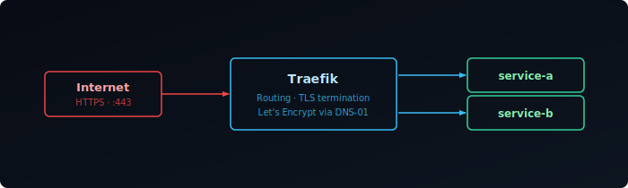

## What is Traefik

Traefik is an open-source reverse proxy and load balancer that works well with Docker, automatically detecting services and securing connections with SSL. It adapts in real-time, making it ideal for dynamic homelab setups.

In this guide, we will install Traefik — first in Docker, then as a bare metal binary for hosts where you'd rather not depend on Docker — and enable automatic Let's Encrypt SSL via the Cloudflare DNS challenge.

This is part of a series:

1. **Installing on Docker & Bare Metal** (this post)
2. [Middlewares & Dashboard Security][2]
3. [Observability with Prometheus, Loki & Grafana][3]
4. [TCP and UDP Routing][4]



## Cloudflare API Token

Traefik uses the DNS-01 ACME challenge to obtain certificates. This works by creating a temporary DNS TXT record to prove domain ownership, which means it works even for services not exposed to the internet. This guide uses Cloudflare as the DNS provider — see the [lego docs][lego] for other providers.

Create a scoped API token in the Cloudflare dashboard with **Zone / Zone → Read** and **Zone / DNS → Edit** permissions. Where you store this token depends on whether you're running Traefik in Docker or on bare metal — each section below covers its own version.

## Docker

### Install Traefik with Docker Compose

Create the directory and `docker-compose.yml`:

```bash
mkdir traefik
nano traefik/docker-compose.yml
```

Add the following configuration to the file:

```yaml {filename="docker-compose.yml"}
services:
  traefik:
    image: traefik:3.6.7
    container_name: traefik
    restart: unless-stopped
    security_opt:
      - no-new-privileges:true
    environment:
      - TZ=Europe/Amsterdam
    env_file:
      - .env
    command:
      - "--api.insecure=true"
      - "--api=true"
      - "--api.dashboard=true"
      - "--ping=true"
      - "--providers.docker=true"
      - "--providers.docker.exposedbydefault=false"
      - "--providers.docker.network=traefik"
      - "--entryPoints.web.address=:80"
      - "--entryPoints.websecure.address=:443"
      - "--entryPoints.websecure.http.tls=true"
      - "--entryPoints.web.http.redirections.entryPoint.to=websecure"
      - "--entryPoints.web.http.redirections.entryPoint.scheme=https"
      - "--certificatesresolvers.le.acme.dnschallenge=true"
      - "--certificatesresolvers.le.acme.dnschallenge.provider=cloudflare"
      - "--certificatesresolvers.le.acme.email=${ACME_EMAIL}"
      - "--certificatesresolvers.le.acme.dnschallenge.delaybeforecheck=60s"
      - "--certificatesresolvers.le.acme.storage=/certs/acme.json"
      - "--log.level=INFO"
    networks:
      - traefik
    ports:
      - 80:80
      - 443:443
      - 8080:8080
    volumes:
      - /var/run/docker.sock:/var/run/docker.sock:ro
      - traefik_data:/certs
    healthcheck:
      test: wget --quiet --tries=1 --spider http://127.0.0.1:8080/ping || exit 1
      interval: 5s
      timeout: 1s
      retries: 3
      start_period: 10s

volumes:
  traefik_data:
    name: traefik_data

networks:
  traefik:
    name: traefik
```

### Store Your Credentials

Store the API token you created above, along with your domain and Let's Encrypt contact email, in a `.env` file in the same directory as your `docker-compose.yml`:

```bash
nano traefik/.env
```

```bash {filename=".env"}
CF_API_EMAIL=<your-cloudflare-email>
CF_DNS_API_TOKEN=<your-api-token>
DOMAIN=<your-domain>
ACME_EMAIL=<your-email>
```

### Start Traefik

```bash
docker compose -f traefik/docker-compose.yml up -d
```

Access the dashboard at `http://<server-ip>:8080`.

### Add a Test Service

To verify Traefik is working correctly, deploy the `whoami` test service:

```bash
mkdir whoami
nano whoami/docker-compose.yml
```

```yaml {filename="docker-compose.yml"}
services:
  whoami:
    container_name: simple-service
    image: traefik/whoami
    labels:
      - "traefik.enable=true"
      - "traefik.http.routers.whoami.rule=Host(`whoami.${DOMAIN}`)"
      - "traefik.http.routers.whoami.entrypoints=websecure"
      - "traefik.http.routers.whoami.tls=true"
      - "traefik.http.routers.whoami.tls.certresolver=le"
      - "traefik.http.services.whoami.loadbalancer.server.port=80"
    networks:
      - traefik

networks:
  traefik:
    name: traefik
```

#### DNS and Testing

1. Point `whoami.your-domain.com` to your server's IP address in your DNS settings
2. Verify DNS propagation with `nslookup` or an online DNS checker
3. Start the service:
   ```bash
   docker compose -f whoami/docker-compose.yml up -d
   ```
4. Open `https://whoami.your-domain.com` — you should see the whoami response with a valid SSL certificate
5. Once verified, remove the test service:
   ```bash
   docker compose -f whoami/docker-compose.yml down
   ```

## Bare Metal

Docker is great for container-heavy homelabs, but sometimes you want Traefik running directly on the host — no Docker dependency, full control over the process, and a clean systemd service. The rest of this guide covers a bare metal install from binary to running service.

### Download the Binary

Grab the latest release from GitHub. The `ARCH` variable auto-detects your architecture so the same commands work on both `amd64` and `arm64` machines.

```bash
TRAEFIK_VERSION="3.3.4"
ARCH=$(dpkg --print-architecture 2>/dev/null || uname -m | sed 's/x86_64/amd64/;s/aarch64/arm64/')
wget https://github.com/traefik/traefik/releases/download/v${TRAEFIK_VERSION}/traefik_v${TRAEFIK_VERSION}_linux_${ARCH}.tar.gz
tar -xzf traefik_v${TRAEFIK_VERSION}_linux_${ARCH}.tar.gz
sudo mv traefik /usr/local/bin/
sudo chmod +x /usr/local/bin/traefik
```

Verify the install:

```bash
traefik version
```

### Create Directory Structure

Set up the directories Traefik needs for config, dynamic routing rules, logs, and certificate storage. The `acme.json` file is where Let's Encrypt certificates are stored — it must be owner-readable only or Traefik will refuse to use it.

```bash
sudo mkdir -p /etc/traefik/conf.d
sudo mkdir -p /var/log/traefik
sudo touch /etc/traefik/acme.json
sudo chmod 600 /etc/traefik/acme.json
```

### Create a Dedicated User

Running Traefik as a dedicated non-root user limits what a compromised process can do. The `-r` flag creates a system account with no home directory, and `-s /sbin/nologin` prevents interactive login.

The `setcap` command grants the binary permission to bind to privileged ports (80 and 443) without needing root.

```bash
sudo useradd -r -s /sbin/nologin -M traefik
sudo chown -R traefik:traefik /etc/traefik
sudo chown -R traefik:traefik /var/log/traefik
```

### Store the Cloudflare Token

Store the token you created above in an environment file that the systemd service will load:

```bash {filename="/etc/traefik/traefik.env"}
CF_DNS_API_TOKEN=your_cloudflare_api_token
```

Lock down the file so only the `traefik` user can read it:

```bash
sudo chmod 600 /etc/traefik/traefik.env
sudo chown traefik:traefik /etc/traefik/traefik.env
```

### Main Config

This is the static config — it sets up entry points, the certificate resolver, and tells Traefik to watch `/etc/traefik/conf.d/` for dynamic service configs. Replace the `email` field with your own address for Let's Encrypt notifications.

```yaml {filename="/etc/traefik/traefik.yml"}
global:
  checkNewVersion: false
  sendAnonymousUsage: false

api:
  dashboard: true
  insecure: true

entryPoints:
  web:
    address: ":80"
    http:
      redirections:
        entryPoint:
          to: websecure
          scheme: https
  websecure:
    address: ":443"

certificatesResolvers:
  letsencrypt:
    acme:
      email: you@example.com
      storage: /etc/traefik/acme.json
      dnsChallenge:
        provider: cloudflare
        resolvers:
          - "1.1.1.1:53"
          - "8.8.8.8:53"

providers:
  file:
    directory: /etc/traefik/conf.d
    watch: true

log:
  level: INFO
  filePath: /var/log/traefik/traefik.log

accessLog:
  filePath: /var/log/traefik/access.log
```

### systemd Service

The service unit loads the Cloudflare token from the env file, runs as the `traefik` user, and restarts automatically on failure. `AmbientCapabilities` and `CapabilityBoundingSet` grant the process permission to bind to privileged ports (80 and 443) without root — and because these are systemd directives, they apply automatically on every start, including after a binary update. `NoNewPrivileges` and `PrivateTmp` add extra sandboxing on top of the non-root user.

```ini {filename="/etc/systemd/system/traefik.service"}
[Unit]
Description=Traefik reverse proxy
After=network-online.target
Wants=network-online.target

[Service]
Type=simple
User=traefik
Group=traefik
EnvironmentFile=/etc/traefik/traefik.env
ExecStart=/usr/local/bin/traefik --configFile=/etc/traefik/traefik.yml
Restart=on-failure
RestartSec=5s
AmbientCapabilities=CAP_NET_BIND_SERVICE
CapabilityBoundingSet=CAP_NET_BIND_SERVICE
NoNewPrivileges=true
PrivateTmp=true

[Install]
WantedBy=multi-user.target
```

Reload systemd, enable the service to start on boot, and start it now:

```bash
sudo systemctl daemon-reload
sudo systemctl enable --now traefik
sudo systemctl status traefik
```

Access the dashboard at `http://<server-ip>:8080`.

### Add a Service

Each service gets its own file in `/etc/traefik/conf.d/`. Because `watch: true` is set in the main config, Traefik picks up new files and changes instantly — no restart needed.

The router matches incoming requests by hostname and routes them to the service's local port. Traefik will automatically request a certificate from Let's Encrypt on first access.

```yaml {filename="/etc/traefik/conf.d/myapp.yml"}
http:
  routers:
    myapp:
      rule: "Host(`myapp.example.com`)"
      entryPoints:
        - websecure
      service: myapp
      tls:
        certResolver: letsencrypt

  services:
    myapp:
      loadBalancer:
        servers:
          - url: "http://127.0.0.1:PORT"
```

### Updating Traefik

Stop the service, swap the binary, re-apply the `setcap` capability, and start again. The config and certificates in `/etc/traefik/` are untouched.

```bash
TRAEFIK_VERSION="3.x.x"
ARCH=$(dpkg --print-architecture 2>/dev/null || uname -m | sed 's/x86_64/amd64/;s/aarch64/arm64/')
wget https://github.com/traefik/traefik/releases/download/v${TRAEFIK_VERSION}/traefik_v${TRAEFIK_VERSION}_linux_${ARCH}.tar.gz
tar -xzf traefik_v${TRAEFIK_VERSION}_linux_${ARCH}.tar.gz

sudo systemctl stop traefik
sudo mv traefik /usr/local/bin/traefik
sudo chmod +x /usr/local/bin/traefik
sudo systemctl start traefik
```

Verify after update:

```bash
traefik version
sudo systemctl status traefik
```

> Always check the [Traefik changelog](https://github.com/traefik/traefik/releases) before upgrading for breaking config changes.

With Traefik installed and issuing certificates, the next step is locking it down — see [Middlewares & Dashboard Security][2] for IP allowlisting, basic auth, security headers, and securing the dashboard itself.

[lego]: https://go-acme.github.io/lego/dns/
[2]: 
[3]: 
[4]: 
