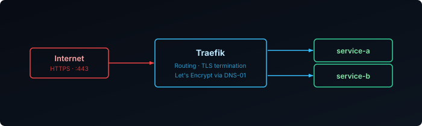

## What is Traefik

Traefik is an open-source reverse proxy and load balancer that works well with Docker, automatically detecting services and securing connections with SSL. It adapts in real-time, making it ideal for dynamic homelab setups.

This guide covers running Traefik with Docker Compose, issuing certificates automatically via Let's Encrypt using the Cloudflare DNS challenge.

This is part of a series:

1. **Installation** (this post)
2. [Middlewares & Dashboard Security][2]
3. [Observability with Prometheus, Loki & Grafana][3]
4. [TCP and UDP Routing][4]



## Prerequisites

- A domain name with DNS managed by Cloudflare (for the DNS-01 ACME challenge)
- A server running Docker

## Cloudflare API Token

Traefik uses the DNS-01 ACME challenge to obtain certificates. This works by creating a temporary DNS TXT record to prove domain ownership, which means it works even for services not exposed to the internet. This guide uses Cloudflare as the DNS provider — see the [lego docs][lego] for other providers.

Create a scoped API token in the Cloudflare dashboard with **Zone / Zone → Read** and **Zone / DNS → Edit** permissions. You'll store this token in a `.env` file for Docker Compose, covered below.

## Install Traefik

Create the directory and `docker-compose.yml`:

```bash
mkdir traefik
nano traefik/docker-compose.yml
```

Add the following configuration to the file:

```yaml {filename="docker-compose.yml"}
services:
  traefik:
    image: traefik:3.7.10
    container_name: traefik
    restart: unless-stopped
    security_opt:
      - no-new-privileges:true
    environment:
      - TZ=Europe/Amsterdam
    env_file:
      - .env
    command:
      - "--api.insecure=true"
      - "--api=true"
      - "--api.dashboard=true"
      - "--ping=true"
      - "--providers.docker=true"
      - "--providers.docker.exposedbydefault=false"
      - "--providers.docker.network=traefik"
      - "--entryPoints.web.address=:80"
      - "--entryPoints.websecure.address=:443"
      - "--entryPoints.websecure.http.tls=true"
      - "--entryPoints.web.http.redirections.entryPoint.to=websecure"
      - "--entryPoints.web.http.redirections.entryPoint.scheme=https"
      - "--certificatesresolvers.le.acme.dnschallenge=true"
      - "--certificatesresolvers.le.acme.dnschallenge.provider=cloudflare"
      - "--certificatesresolvers.le.acme.email=${ACME_EMAIL}"
      - "--certificatesresolvers.le.acme.dnschallenge.delaybeforecheck=60s"
      - "--certificatesresolvers.le.acme.storage=/certs/acme.json"
      - "--log.level=INFO"
    networks:
      - traefik
    ports:
      - 80:80
      - 443:443
      - 8080:8080
    volumes:
      - /var/run/docker.sock:/var/run/docker.sock:ro
      - traefik_data:/certs
    healthcheck:
      test: wget --quiet --tries=1 --spider http://127.0.0.1:8080/ping || exit 1
      interval: 5s
      timeout: 1s
      retries: 3
      start_period: 10s

volumes:
  traefik_data:
    name: traefik_data

networks:
  traefik:
    name: traefik
```

`delaybeforecheck=60s` gives the DNS TXT record time to propagate before Traefik asks Let's Encrypt to verify it — without it, the ACME challenge can fail on a lookup that just hasn't propagated yet.

**Store your credentials** — the API token you created above, along with your domain and Let's Encrypt contact email — in a `.env` file in the same directory as your `docker-compose.yml`:

```bash
nano traefik/.env
```

```bash {filename=".env"}
CF_API_EMAIL=<your-cloudflare-email>
CF_DNS_API_TOKEN=<your-api-token>
DOMAIN=<your-domain>
ACME_EMAIL=<your-email>
```

**Start Traefik:**

```bash
docker compose -f traefik/docker-compose.yml up -d
```

Access the dashboard at `http://<server-ip>:8080`.

## Add a Service

To verify Traefik is working correctly, deploy the `whoami` test service:

```bash
mkdir whoami
nano whoami/docker-compose.yml
```

```yaml {filename="docker-compose.yml"}
services:
  whoami:
    container_name: simple-service
    image: traefik/whoami
    labels:
      - "traefik.enable=true"
      - "traefik.http.routers.whoami.rule=Host(`whoami.${DOMAIN}`)"
      - "traefik.http.routers.whoami.entrypoints=websecure"
      - "traefik.http.routers.whoami.tls=true"
      - "traefik.http.routers.whoami.tls.certresolver=le"
      - "traefik.http.services.whoami.loadbalancer.server.port=80"
    networks:
      - traefik

networks:
  traefik:
    name: traefik
```

**DNS and testing:**

1. Point `whoami.your-domain.com` to your server's IP address in your DNS settings
2. Verify DNS propagation with `nslookup` or an online DNS checker
3. Start the service:
   ```bash
   docker compose -f whoami/docker-compose.yml up -d
   ```
4. Open `https://whoami.your-domain.com` — you should see the whoami response with a valid SSL certificate
5. Once verified, remove the test service:
   ```bash
   docker compose -f whoami/docker-compose.yml down
   ```

## Updating Traefik

Bump the image tag in `docker-compose.yml`, then recreate the container:

```bash
docker compose -f traefik/docker-compose.yml up -d --force-recreate
```

> Always check the [Traefik changelog](https://github.com/traefik/traefik/releases) before upgrading for breaking config changes.

With Traefik installed and issuing certificates, the next step is locking it down — see [Middlewares & Dashboard Security][2] for IP allowlisting, basic auth, security headers, and securing the dashboard itself.

[lego]: https://go-acme.github.io/lego/dns/
[2]: 
[3]: 
[4]: 
