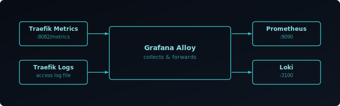

## Prerequisites

- Traefik running — see [Installing on Docker & Bare Metal][1]
- Grafana, Prometheus, Loki, and Alloy already running — see [Setting Up Your Observability Stack][stack]

Traefik exposes metrics on EntryPoints, Routers, Services, and more. This post shows you how to collect these metrics with Prometheus and aggregate logs with Loki via Grafana Alloy for a complete monitoring solution.



## Metrics

Add the following command flags to your Traefik `docker-compose.yml`:

```yaml {filename="docker-compose.yml"}
command:
  # ... existing commands ...
  - "--metrics.prometheus=true"
  - "--metrics.prometheus.addEntryPointsLabels=true"
  - "--metrics.prometheus.addRoutersLabels=true"
  - "--metrics.prometheus.addServicesLabels=true"
```

Re-create the Traefik container to apply the changes:

```bash
docker compose -f traefik/docker-compose.yml up -d --force-recreate
```

Verify metrics are available at `http://<traefik-ip>:8080/metrics`.

### Configure Prometheus

Add a scrape job to your `prometheus.yml`:

```yaml {filename="prometheus.yml"}
scrape_configs:
  - job_name: 'traefik'
    scrape_interval: 5s
    static_configs:
      - targets: ['<traefik-ip>:8080']
```

Replace `<traefik-ip>` with your Traefik server's IP address, then restart Prometheus:

```bash
docker restart prometheus
```

### Verify Metrics

Query for Traefik metrics in Grafana's Explore view:

```promql
traefik_router_requests_total
```

## Log Files

Add the following command flags to your Traefik `docker-compose.yml`:

```yaml {filename="docker-compose.yml"}
command:
  # ... existing commands ...
  - "--accesslog=true"
  - "--accesslog.filepath=/log/access.log"
  - "--accesslog.format=json"
  - "--accesslog.fields.defaultmode=keep"
  - "--accesslog.fields.names.StartUTC=drop"
  - "--log.filepath=/log/traefik.log"
  - "--log.format=json"
```

>  Setting a `filepath` redirects logs to a file — they will no longer appear in `docker logs`.

Also add a volume mapping for the log directory:

```yaml {filename="docker-compose.yml"}
volumes:
  # ... existing volumes ...
  - /var/log/traefik:/log
```

Re-create the Traefik container:

```bash
docker compose -f traefik/docker-compose.yml up -d --force-recreate
```

### Configure Grafana Alloy

Create a new Alloy config file for Traefik log collection:

```bash
nano alloy/config/traefik.alloy
```

```hcl {filename="traefik.alloy"}
// Traefik logs collection
local.file_match "traefik" {
  path_targets = [{
    __path__ = "/var/log/traefik/*.log",
  }]
}

loki.source.file "traefik" {
  targets    = local.file_match.traefik.targets
  forward_to = [loki.process.traefik.receiver]
}

loki.process "traefik" {
  stage.static_labels {
    values = {
      job = "traefik",
    }
  }
  forward_to = [loki.write.default.receiver]
}
```

Ensure your Alloy `docker-compose.yml` has `/var/log` mounted:

```yaml {filename="docker-compose.yml"}
volumes:
  - ./config/:/etc/alloy/config/:ro
  - /var/log:/var/log:ro
  - alloy-data:/var/lib/alloy/data
```

Restart Alloy to pick up the new configuration:

```bash
docker restart alloy
```

### Verify Logs

Open the Alloy Web UI and confirm the `loki.source.file` component is healthy, then query in Grafana:

```logql
{job="traefik"}
```

## Grafana Dashboard

You can use the pre-built [Traefik Dashboard][grafana-dashboard] from GitHub, or explore available metrics from the [official Traefik metrics overview][metrics-overview].

[1]: 
[stack]: 
[grafana-dashboard]: https://github.com/svenvg93/Grafana-Dashboard/tree/master/traefik
[metrics-overview]: https://doc.traefik.io/traefik/observability/metrics/overview/#global-metrics
