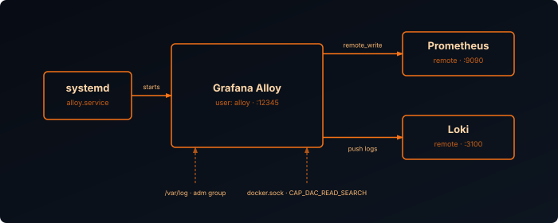

## What is Grafana Alloy

Alloy is the telemetry collection agent that replaces Promtail and Grafana Agent. It collects metrics, logs, and traces and forwards them to Prometheus and Loki using a modular config — each collector lives in its own `.alloy` file, and every file in the config directory is loaded automatically.

You can run Alloy either as a Docker container — simplest if the rest of your stack is already containerized on the same host — or directly on the host as a systemd service, which gives it direct access to the host filesystem without volume mounts and lets it start earlier in the boot process than Docker. Pick whichever matches your setup; both tracks below configure the same collectors and write to the same Prometheus and Loki instances.

This assumes Prometheus, Loki, and Grafana are already running — see [Building the Stack][stack] if you haven't set those up yet.



## Install Alloy



Create a directory for Alloy and its config files:

```bash
mkdir -p alloy/config
nano alloy/docker-compose.yml
```

```yaml {filename="docker-compose.yml"}
services:
  alloy:
    image: grafana/alloy:latest
    container_name: alloy
    hostname: ${HOSTNAME}
    restart: unless-stopped
    environment:
      - TZ=Europe/Amsterdam
    ports:
      - "12345:12345"
    volumes:
      - ./config/:/etc/alloy/config/:ro
      - alloy-data:/var/lib/alloy/data
    command:
      - run
      - --server.http.listen-addr=0.0.0.0:12345
      - --storage.path=/var/lib/alloy/data
      - /etc/alloy/config/
    networks:
      - backend

networks:
  backend:
    name: backend

volumes:
  alloy-data:
    name: alloy-data
```

Alloy loads every `.alloy` file in the `config/` directory automatically — adding a new collector is as simple as dropping in a new file. Port `12345` is the Alloy web UI for debugging component status.


Add the Grafana apt repository and install the `alloy` package:

```bash
sudo apt-get install -y apt-transport-https software-properties-common wget

sudo mkdir -p /etc/apt/keyrings/
wget -q -O - https://apt.grafana.com/gpg.key | gpg --dearmor | sudo tee /etc/apt/keyrings/grafana.gpg > /dev/null

echo "deb [signed-by=/etc/apt/keyrings/grafana.gpg] https://apt.grafana.com stable main" | \
  sudo tee /etc/apt/sources.list.d/grafana.list

sudo apt-get update
sudo apt-get install -y alloy
```

The package creates an `alloy` system user, installs the binary at `/usr/bin/alloy`, and registers a systemd unit. It does not start automatically after install.

The systemd unit reads startup options from `/etc/default/alloy`. Edit it to load a config directory instead of a single file:

```bash
sudo nano /etc/default/alloy
```

```bash {filename="/etc/default/alloy"}
CONFIG_FILE="/etc/alloy/config/"
CUSTOM_ARGS="--server.http.listen-addr=0.0.0.0:12345"
STATE_DIRECTORY="/var/lib/alloy"
```

By default Alloy only listens on `localhost:12345`, so `CUSTOM_ARGS` is used here to expose the web UI on all interfaces. This is optional.

Create the config directory:

```bash
sudo mkdir -p /etc/alloy/config
```



## Endpoints

Create `endpoint.alloy` to centralize write destinations. All collector configs reference these by name:



```bash
nano alloy/config/endpoint.alloy
```

```hcl {filename="endpoint.alloy"}
loki.write "default" {
  endpoint {
    url = "http://loki:3100/loki/api/v1/push"
  }
}

prometheus.remote_write "default" {
  endpoint {
    url = "http://prometheus:9090/api/v1/write"
  }
}
```


Unlike a Docker deployment on the same host, the systemd service isn't on a shared Docker network, so point it at the actual IP or hostname of your Prometheus and Loki instances:

```bash
sudo nano /etc/alloy/config/endpoint.alloy
```

```hcl {filename="endpoint.alloy"}
loki.write "default" {
  endpoint {
    url = "http://<LOKI_HOST>:3100/loki/api/v1/push"
  }
}

prometheus.remote_write "default" {
  endpoint {
    url = "http://<PROMETHEUS_HOST>:9090/api/v1/write"
  }
}
```



## Self-Monitoring

Create `self.alloy` so Alloy reports its own health metrics to Prometheus — `alloy/config/self.alloy` for Docker, `/etc/alloy/config/self.alloy` for systemd:

```hcl {filename="self.alloy"}
prometheus.exporter.self "alloy_metrics" {}

prometheus.scrape "alloy_metrics" {
  targets         = prometheus.exporter.self.alloy_metrics.targets
  scrape_interval = "60s"
  forward_to      = [prometheus.remote_write.default.receiver]
}
```



No extra step needed — the bind-mounted `config/` directory is already owned correctly on the host.


Fix permissions so the config files are readable by the `alloy` user:

```bash
sudo chown -R alloy:alloy /etc/alloy/config
sudo chmod -R 750 /etc/alloy/config
```



## Permissions



Nothing to configure yet — Docker permissions are granted per collector via read-only volume mounts (host filesystem, Docker socket, `/var/log`) when you add each one; see [Apply & Verify](/posts/grafana-observability-building-the-stack/#apply--verify) in Building the Stack.


The `alloy` user only has access to its own files by default. If you plan to collect system logs or Docker container stats and logs, you need to grant it read access to those resources.

**System logs** (`/var/log`):

```bash
sudo usermod -aG adm alloy
```

**Docker container logs and stats:**

Adding the `alloy` user to the `docker` group is not enough — Docker's cgroup files and log directories are owned by root and require `CAP_DAC_READ_SEARCH` to traverse. Create a systemd drop-in to grant that capability:

```bash
sudo mkdir -p /etc/systemd/system/alloy.service.d
sudo tee /etc/systemd/system/alloy.service.d/capabilities.conf <<'EOF'
[Service]
AmbientCapabilities=CAP_DAC_READ_SEARCH
CapabilityBoundingSet=CAP_DAC_READ_SEARCH
EOF
sudo systemctl daemon-reload
sudo usermod -aG docker alloy
```

A service restart is required after any permission change.



## Start Alloy



```bash
docker compose -f alloy/docker-compose.yml up -d
```


Enable and start the service:

```bash
sudo systemctl enable alloy
sudo systemctl start alloy
```

Check that it came up cleanly:

```bash
sudo systemctl status alloy
```

You should see `active (running)`. If it failed, check the journal:

```bash
sudo journalctl -u alloy -n 50
```



## Verify

Confirm Alloy is healthy and listening:

```bash
curl -s http://localhost:12345/-/healthy
```

Open the Alloy web UI at `http://<HOST_IP>:12345` and verify all components show green. The `prometheus.remote_write.default` and `loki.write.default` components should both be running.

With Alloy running, head back to [Building the Stack][stack-collectors] to configure host, container, and log collectors.

[stack]: 
[stack-collectors]: #host-metrics
