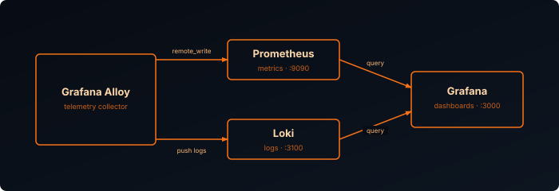
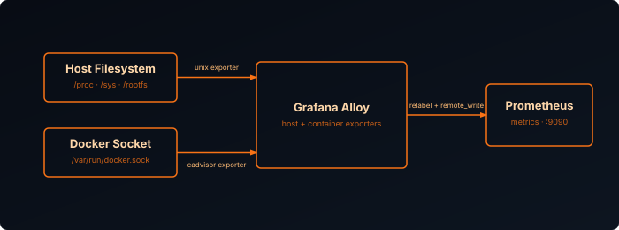
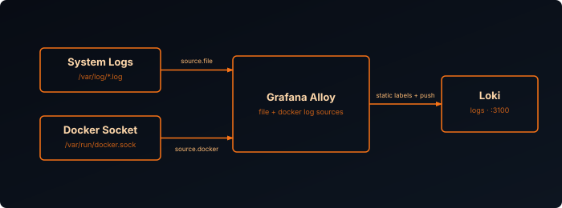

Before you can collect metrics or centralize logs, you need somewhere to store and visualize them — and an agent to collect the data. This post sets up all four components of a Grafana observability stack:

- **Prometheus** — metrics storage
- **Loki** — log storage
- **Grafana** — visualization
- **Grafana Alloy** — telemetry collection agent



## Prometheus

Prometheus is a time-series database that stores metrics. We'll enable the remote write receiver so Alloy can push metrics directly to it.

Create a directory and Docker Compose file:

```bash
mkdir prometheus
nano prometheus/docker-compose.yml
```

```yaml {filename="docker-compose.yml"}
services:
  prometheus:
    image: prom/prometheus
    container_name: prometheus
    environment:
      - TZ=Europe/Amsterdam
    volumes:
      - ./prometheus.yml:/etc/prometheus/prometheus.yml:ro
      - prometheus:/prometheus
    command:
      - '--config.file=/etc/prometheus/prometheus.yml'
      - '--storage.tsdb.path=/prometheus'
      - '--storage.tsdb.retention.time=90d'
      - '--storage.tsdb.retention.size=100GB'
      - '--web.enable-lifecycle'
      - '--web.enable-remote-write-receiver'
    restart: unless-stopped
    networks:
      - backend

networks:
  backend:
    name: backend

volumes:
  prometheus:
    name: prometheus
```

Create the Prometheus config file:

```bash
nano prometheus/prometheus.yml
```

```yaml {filename="prometheus.yml"}
global:
  scrape_interval: 15s
  evaluation_interval: 15s

scrape_configs: []
```

`scrape_configs` is empty because Alloy pushes metrics via remote write. Adjust `retention.time` and `retention.size` to match your available disk space — whichever limit is hit first triggers cleanup.

Start Prometheus:

```bash
docker compose -f prometheus/docker-compose.yml up -d
```

Verify it's ready:

```bash
curl -s http://localhost:9090/-/ready
```

## Loki

Loki stores logs indexed by labels rather than full-text, making it storage-efficient and fast for label-based queries.

Create a directory and Docker Compose file:

```bash
mkdir loki
nano loki/docker-compose.yml
```

```yaml {filename="docker-compose.yml"}
services:
  loki:
    image: grafana/loki
    container_name: loki
    restart: unless-stopped
    environment:
      - TZ=Europe/Amsterdam
    volumes:
      - ./loki-config.yaml:/etc/loki/loki-config.yaml:ro
      - loki-data:/loki
    command: -config.file=/etc/loki/loki-config.yaml
    networks:
      - backend

networks:
  backend:
    name: backend

volumes:
  loki-data:
    name: loki-data
```

Create the Loki config file:

```bash
nano loki/loki-config.yaml
```

```yaml {filename="loki-config.yaml"}
auth_enabled: false

server:
  http_listen_address: 0.0.0.0
  http_listen_port: 3100
  grpc_listen_port: 9095
  log_level: info

common:
  instance_addr: 127.0.0.1
  path_prefix: /loki
  storage:
    filesystem:
      chunks_directory: /loki/chunks
      rules_directory: /loki/rules
  replication_factor: 1
  ring:
    kvstore:
      store: memberlist

schema_config:
  configs:
    - from: 2020-10-24
      store: tsdb
      object_store: filesystem
      schema: v13
      index:
        prefix: index_
        period: 24h

limits_config:
  query_timeout: 600s
  retention_period: "365d"
  ingestion_rate_mb: 4
  ingestion_burst_size_mb: 6
  max_streams_per_user: 10000
  max_line_size: 256000
  reject_old_samples: true
  reject_old_samples_max_age: 168h
  creation_grace_period: 15m
  discover_log_levels: false
```

Adjust `retention_period` based on your available disk space.

Start Loki:

```bash
docker compose -f loki/docker-compose.yml up -d
```

Verify it's ready:

```bash
curl -s http://localhost:3100/ready
```

## Grafana

Grafana is the visualization layer — it connects to Prometheus and Loki and lets you build dashboards and explore data.

Create a directory and Docker Compose file:

```bash
mkdir grafana
nano grafana/docker-compose.yml
```

```yaml {filename="docker-compose.yml"}
services:
  grafana:
    image: grafana/grafana
    container_name: grafana
    hostname: ${HOSTNAME}
    environment:
      - TZ=Europe/Amsterdam
      - GF_SECURITY_ADMIN_PASSWORD=admin
    volumes:
      - grafana_data:/var/lib/grafana
    restart: unless-stopped
    ports:
      - 3000:3000
    networks:
      - backend

networks:
  backend:
    name: backend

volumes:
  grafana_data:
    name: grafana_data
```

Change `GF_SECURITY_ADMIN_PASSWORD` to a secure password before starting.

Start Grafana:

```bash
docker compose -f grafana/docker-compose.yml up -d
```

Open `http://<HOST_IP>:3000` and log in with username `admin` and your password.

### Add Datasources

Connect Grafana to Prometheus and Loki:

**Prometheus:**
1. Click **Connections** → search for **Prometheus** → **Add new Datasource**
2. Set name `prometheus`, URL `http://prometheus:9090`
3. Click **Save & Test**

**Loki:**
1. Click **Connections** → search for **Loki** → **Add new Datasource**
2. Set name `loki`, URL `http://loki:3100`
3. Click **Save & Test**

## Grafana Alloy

Alloy is the telemetry collection agent that replaces Promtail and Grafana Agent. It collects metrics, logs, and traces and forwards them to Prometheus and Loki using a modular config — each collector lives in its own `.alloy` file, and every file in the config directory is loaded automatically.

Install it now — see [Installing on Docker][alloy-docker] or [Installing on Bare Metal][alloy-bare-metal] — then come back here to configure host, container, and log collectors.

With the full stack running — whether Alloy is deployed as a Docker container or a systemd service — it's time to start adding collectors. Alloy's built-in exporters and log collectors gather host metrics, Docker container metrics, system logs, and Docker container logs, all through the single agent instead of separate containers per exporter. Metrics land in Prometheus, logs land in Loki, and both are visualized in Grafana.

Save each config file below into the Alloy config directory you set up in the install posts above — `alloy/config/` for Docker, `/etc/alloy/config/` for systemd.



## Host Metrics

Create an Alloy config file for host system metrics, `unix.alloy`:



```hcl {filename="unix.alloy"}
prometheus.exporter.unix "unix" {
  rootfs_path = "/rootfs"
  procfs_path = "/rootfs/proc"
  sysfs_path  = "/rootfs/sys"
  disable_collectors = ["ipvs", "btrfs", "infiniband", "xfs", "zfs"]
  enable_collectors  = ["meminfo", "processes"]

  filesystem {
    fs_types_exclude     = "^(autofs|binfmt_misc|bpf|cgroup2?|configfs|debugfs|devpts|devtmpfs|tmpfs|fusectl|hugetlbfs|iso9660|mqueue|nsfs|overlay|proc|procfs|pstore|rpc_pipefs|securityfs|selinuxfs|squashfs|sysfs|tracefs)$"
    mount_points_exclude = "^/(dev|proc|run/credentials/.+|sys|var/lib/docker/.+)($|/)"
    mount_timeout        = "5s"
  }

  netclass {
    ignored_devices = "^(veth.*|cali.*|[a-f0-9]{15})$"
  }

  netdev {
    device_exclude = "^(veth.*|cali.*|[a-f0-9]{15})$"
  }
}

prometheus.scrape "unix" {
  targets    = prometheus.exporter.unix.unix.targets
  forward_to = [prometheus.remote_write.default.receiver]
}
```


```hcl {filename="unix.alloy"}
prometheus.exporter.unix "unix" {
  rootfs_path = "/"
  procfs_path = "/proc"
  sysfs_path  = "/sys"
  disable_collectors = ["ipvs", "btrfs", "infiniband", "xfs", "zfs"]
  enable_collectors  = ["meminfo", "processes"]

  filesystem {
    fs_types_exclude     = "^(autofs|binfmt_misc|bpf|cgroup2?|configfs|debugfs|devpts|devtmpfs|tmpfs|fusectl|hugetlbfs|iso9660|mqueue|nsfs|overlay|proc|procfs|pstore|rpc_pipefs|securityfs|selinuxfs|squashfs|sysfs|tracefs)$"
    mount_points_exclude = "^/(dev|proc|run/credentials/.+|sys|var/lib/docker/.+)($|/)"
    mount_timeout        = "5s"
  }

  netclass {
    ignored_devices = "^(veth.*|cali.*|[a-f0-9]{15})$"
  }

  netdev {
    device_exclude = "^(veth.*|cali.*|[a-f0-9]{15})$"
  }
}

prometheus.scrape "unix" {
  targets    = prometheus.exporter.unix.unix.targets
  forward_to = [prometheus.remote_write.default.receiver]
}
```



Because Alloy runs inside Docker with the host filesystem bind-mounted at `/rootfs`, the `rootfs_path`, `procfs_path`, and `sysfs_path` fields tell the exporter where to find real system data rather than the container's own filesystem.

`disable_collectors` turns off collectors you are unlikely to need on a typical Linux homelab (IPVS load balancer, Btrfs, InfiniBand). `enable_collectors` adds `meminfo` and `processes`, which are not enabled by default.

The `filesystem` block excludes virtual filesystem types (tmpfs, cgroup, overlay, etc.) and Docker-internal mount points so only real disks appear in Grafana. `mount_timeout` prevents the scrape from hanging if a network mount is unresponsive.

Both `netclass` and `netdev` use the same pattern to ignore virtual Ethernet interfaces created by Docker and Calico, as well as the 15-character hex interface names Kubernetes generates — keeping the network panels focused on real physical or VLAN interfaces.

This exporter needs the host filesystem mounted read-only into the Alloy container — see [Apply & Verify](#apply--verify) below for the required volume mounts.

## Container Metrics

Create an Alloy config file for Docker container metrics, `docker-metrics.alloy`:

```hcl {filename="docker-metrics.alloy"}
// Docker container metrics (CPU, memory, network per container)
prometheus.exporter.cadvisor "dockermetrics" {
  docker_host      = "unix:///var/run/docker.sock"
  storage_duration = "5m"
}

prometheus.relabel "docker_filter" {
  forward_to = [prometheus.remote_write.default.receiver]

  rule {
    target_label = "job"
    replacement  = "docker"
  }
  rule {
    target_label = "instance"
    replacement  = constants.hostname
  }
  // Drop container_spec metrics that frequently contain NaN values
  rule {
    source_labels = ["__name__"]
    regex         = "container_spec_(cpu_period|cpu_quota|cpu_shares|memory_limit_bytes|memory_swap_limit_bytes|memory_reservation_limit_bytes)"
    action        = "drop"
  }
}

prometheus.scrape "dockermetrics" {
  targets         = prometheus.exporter.cadvisor.dockermetrics.targets
  forward_to      = [prometheus.relabel.docker_filter.receiver]
  scrape_interval = "10s"
}
```

This exporter needs the Docker socket mounted into the Alloy container — see [Apply & Verify](#apply--verify) below.

## System Logs



Centralized logging complements metrics by letting you search and correlate events across your infrastructure. Create an Alloy config file to collect `auth.log` and `syslog` from the host:

```hcl {filename="syslog.alloy"}
// System auth.log collection
local.file_match "authlog" {
  path_targets = [{
    __path__ = "/var/log/auth.log",
  }]
}

loki.source.file "authlog" {
  targets    = local.file_match.authlog.targets
  forward_to = [loki.process.authlog.receiver]
}

loki.process "authlog" {
  stage.static_labels {
    values = {
      job = "authlog",
    }
  }
  forward_to = [loki.write.default.receiver]
}

// System syslog collection
local.file_match "syslog" {
  path_targets = [{
    __path__ = "/var/log/syslog",
  }]
}

loki.source.file "syslog" {
  targets    = local.file_match.syslog.targets
  forward_to = [loki.process.syslog.receiver]
}

loki.process "syslog" {
  stage.static_labels {
    values = {
      job = "syslog",
    }
  }
  forward_to = [loki.write.default.receiver]
}
```

The `path_targets` field supports wildcards — you can use `/var/log/*.log` to collect all log files in a directory at once.

This collector needs the host's `/var/log` directory mounted into the Alloy container — see [Apply & Verify](#apply--verify) below.

## Docker Container Logs

Alloy can automatically discover and collect logs from all running Docker containers — no manual configuration needed per container.

Create an Alloy config file for Docker log collection, `docker-logs.alloy`:

```hcl {filename="docker-logs.alloy"}
// Discover all running Docker containers
discovery.docker "containers" {
  host = "unix:///var/run/docker.sock"
}

// Extract useful labels from container metadata
discovery.relabel "containers" {
  targets = discovery.docker.containers.targets

  rule {
    source_labels = ["__meta_docker_container_name"]
    target_label  = "container"
    regex         = "/(.*)"
    replacement   = "$1"
  }

  rule {
    source_labels = ["__meta_docker_container_log_stream"]
    target_label  = "stream"
  }
}

// Collect logs from discovered containers
loki.source.docker "containers" {
  host       = "unix:///var/run/docker.sock"
  targets    = discovery.relabel.containers.output
  forward_to = [loki.process.containers.receiver]
}

// Add a static job label and forward to Loki
loki.process "containers" {
  stage.static_labels {
    values = {
      job = "docker",
    }
  }
  forward_to = [loki.write.default.receiver]
}
```

This automatically picks up containers as they start and stop — no Alloy restart required once it's running. It reuses the same Docker socket mount as the container metrics collector above, so no additional volume mount is needed for this one.

## Apply & Verify



All four collectors above need volume mounts added to your Alloy `docker-compose.yml`:

```yaml {filename="docker-compose.yml"}
volumes:
  - /:/rootfs:ro
  - /sys:/sys:ro
  - /run/udev/data:/run/udev/data:ro
  - /var/run/docker.sock:/var/run/docker.sock:ro
  - /var/log:/var/log:ro
```

Recreate the Alloy container to pick up both the new mounts and the new config files in one step:

```bash
docker compose up -d alloy
```


No volume mounts are needed — the `adm`/`docker` group membership and `CAP_DAC_READ_SEARCH` capability set up when installing Alloy already grant it direct access to `/var/log` and the Docker socket.

Fix ownership and permissions on the new config files, then restart the service to pick them up:

```bash
sudo chown -R alloy:alloy /etc/alloy/config
sudo chmod -R 750 /etc/alloy/config
sudo systemctl restart alloy
```



Open the Alloy web UI and confirm all four components are healthy:

- `prometheus.exporter.unix.unix`
- `prometheus.exporter.cadvisor.dockermetrics`
- `loki.source.file.authlog` / `loki.source.file.syslog`
- `loki.source.docker.containers`

Then verify data is flowing in Grafana's Explore view — metrics first:

```promql
node_cpu_seconds_total{job="unix"}
```

```promql
container_cpu_usage_seconds_total{job="docker"}
```

Then logs:

```logql
{job="syslog"}
```

```logql
{job="docker"}
```

Filter by container name for more targeted queries:

```logql
{job="docker", container="traefik"}
```

## Grafana Dashboards

You can create your own dashboards or use these as a starting point:

- [System Dashboard][1] — host metrics
- [Docker Dashboard][2] — container metrics

[1]: https://github.com/svenvg93/Grafana-Dashboard/tree/master/systems
[2]: https://github.com/svenvg93/Grafana-Dashboard/tree/master/docker
[alloy-docker]: 
[alloy-bare-metal]: 

With the stack running, you can extend it further: forward [UniFi syslog events]() through Alloy into Loki, or move on to [alerting and dashboards as code]() to provision both from version control.
