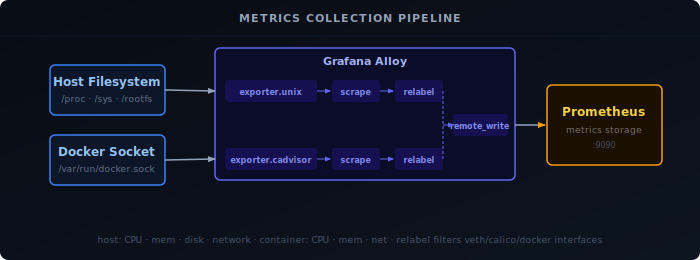

Monitoring your systems and containers is essential for maintaining a reliable homelab or home server. This guide uses Grafana Alloy's built-in exporters to collect host and container metrics, with Prometheus for storage and Grafana for visualization — all managed through a single agent instead of separate containers per exporter.



## Prerequisites

- Prometheus running and reachable
- Grafana running with Prometheus added as a datasource
- Grafana Alloy installed and running — see [Setting Up Your Observability Stack]()

## Host Metrics

Create an Alloy config file for host system metrics:

```bash
nano alloy/config/unix.alloy
```

```hcl {filename="unix.alloy"}
prometheus.exporter.unix "unix" {
  rootfs_path = "/rootfs"
  procfs_path = "/rootfs/proc"
  sysfs_path  = "/rootfs/sys"
  disable_collectors = ["ipvs", "btrfs", "infiniband", "xfs", "zfs"]
  enable_collectors  = ["meminfo", "processes"]

  filesystem {
    fs_types_exclude     = "^(autofs|binfmt_misc|bpf|cgroup2?|configfs|debugfs|devpts|devtmpfs|tmpfs|fusectl|hugetlbfs|iso9660|mqueue|nsfs|overlay|proc|procfs|pstore|rpc_pipefs|securityfs|selinuxfs|squashfs|sysfs|tracefs)$"
    mount_points_exclude = "^/(dev|proc|run/credentials/.+|sys|var/lib/docker/.+)($|/)"
    mount_timeout        = "5s"
  }

  netclass {
    ignored_devices = "^(veth.*|cali.*|[a-f0-9]{15})$"
  }

  netdev {
    device_exclude = "^(veth.*|cali.*|[a-f0-9]{15})$"
  }
}

prometheus.scrape "unix" {
  targets    = prometheus.exporter.unix.unix.targets
  forward_to = [prometheus.remote_write.default.receiver]
}
```

Because Alloy runs inside Docker with the host filesystem bind-mounted at `/rootfs`, the `rootfs_path`, `procfs_path`, and `sysfs_path` fields tell the exporter where to find real system data rather than the container's own filesystem.

`disable_collectors` turns off collectors you are unlikely to need on a typical Linux homelab (IPVS load balancer, Btrfs, InfiniBand). `enable_collectors` adds `meminfo` and `processes`, which are not enabled by default.

The `filesystem` block excludes virtual filesystem types (tmpfs, cgroup, overlay, etc.) and Docker-internal mount points so only real disks appear in Grafana. `mount_timeout` prevents the scrape from hanging if a network mount is unresponsive.

Both `netclass` and `netdev` use the same pattern to ignore virtual Ethernet interfaces created by Docker and Calico, as well as the 15-character hex interface names Kubernetes generates — keeping the network panels focused on real physical or VLAN interfaces.

## Container Metrics

Create an Alloy config file for Docker container metrics:

```bash
nano alloy/config/docker-metrics.alloy
```

```hcl {filename="docker-metrics.alloy"}
// Docker container metrics (CPU, memory, network per container)
prometheus.exporter.cadvisor "dockermetrics" {
  docker_host      = "unix:///var/run/docker.sock"
  storage_duration = "5m"
}

prometheus.relabel "docker_filter" {
  forward_to = [prometheus.remote_write.default.receiver]

  rule {
    target_label = "job"
    replacement  = "docker"
  }
  rule {
    target_label = "instance"
    replacement  = constants.hostname
  }
  // Drop container_spec metrics that frequently contain NaN values
  rule {
    source_labels = ["__name__"]
    regex         = "container_spec_(cpu_period|cpu_quota|cpu_shares|memory_limit_bytes|memory_swap_limit_bytes|memory_reservation_limit_bytes)"
    action        = "drop"
  }
}

prometheus.scrape "dockermetrics" {
  targets         = prometheus.exporter.cadvisor.dockermetrics.targets
  forward_to      = [prometheus.relabel.docker_filter.receiver]
  scrape_interval = "10s"
}
```

### Volume Mounts

The unix exporter needs access to the host filesystem, and the cAdvisor exporter needs the Docker socket. Add these volume mounts to your Alloy `docker-compose.yml` and recreate the container:

```yaml {filename="docker-compose.yml"}
volumes:
  - /:/rootfs:ro
  - /sys:/sys:ro
  - /run/udev/data:/run/udev/data:ro
  - /var/run/docker.sock:/var/run/docker.sock:ro
```

```bash
docker compose up -d alloy
```

## Apply Configuration

Restart Alloy to load the new config files:

```bash
docker restart alloy
```

## Verification

Open the Alloy Web UI and confirm both components are healthy:

- `prometheus.exporter.unix.unix`
- `prometheus.exporter.cadvisor.dockermetrics`

Then verify data is flowing in Grafana's Explore view:

```promql
node_cpu_seconds_total{job="unix"}
```

```promql
container_cpu_usage_seconds_total{job="docker"}
```

## Grafana Dashboards

You can create your own dashboards or use these as a starting point:

- [System Dashboard][1] — host metrics
- [Docker Dashboard][2] — container metrics

[1]: https://github.com/svenvg93/Grafana-Dashboard/tree/master/systems
[2]: https://github.com/svenvg93/Grafana-Dashboard/tree/master/docker
