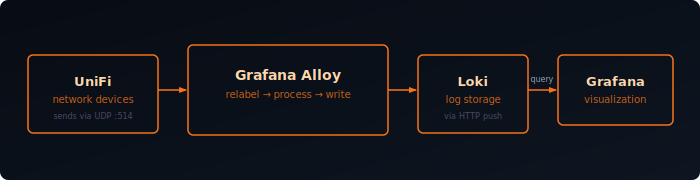

Unifi network devices generate valuable logs that can help you troubleshoot network issues and monitor your devices. By sending these syslog messages to Loki using Grafana Alloy, you can centralize your network logs alongside your application logs for unified observability.

This guide we will only focus on device logs. Securtiy and firewall logs are out of scope.



## Prerequisites

- Grafana Alloy installed (or can be deployed via Docker)
- Grafana and Loki instance running (see my [Log Monitoring with Grafana Alloy and Loki]() post)
- Unifi Controller with network devices configured

## Why Grafana Alloy?

Grafana Alloy is the next-generation telemetry collector that replaces Promtail. It supports multiple data formats including logs, metrics, traces, and profiles. For syslog collection, Alloy provides:

- Native syslog receiver (no need for external syslog daemons)
- Powerful log processing and relabeling capabilities
- Lower resource usage compared to traditional collectors
- Unified configuration for all telemetry types

## Setup Grafana Alloy

First, create a folder to hold the Docker Compose file and Alloy configuration:

```bash
mkdir alloy
```

Create the Docker Compose file:

```bash
nano alloy/docker-compose.yml
```

Paste the following content:

```yaml {filename="docker-compose.yml"}
services:
  alloy:
    image: grafana/alloy:latest
    container_name: alloy
    restart: unless-stopped
    environment:
      - TZ=Europe/Amsterdam
    ports:
      - "12345:12345"
      - "514:514/udp"  # Syslog UDP
    volumes:
      - ./config.alloy:/etc/alloy/config.alloy:ro
      - alloy-data:/var/lib/alloy/data
    command:
      - run
      - --server.http.listen-addr=0.0.0.0:12345
      - --storage.path=/var/lib/alloy/data
      - /etc/alloy/config.alloy
    networks:
      - backend

networks:
  backend:
    name: backend

volumes:
  alloy-data:
    name: alloy-data
```

## Configure Alloy for Syslog

Create the Alloy configuration file:

```bash
nano alloy/config.alloy
```

Paste the following configuration:

```hcl {filename="config.alloy"}
/* UniFi Syslog (RFC3164) - Relabel rules to capture syslog metadata */
loki.relabel "unifi_syslog" {
  forward_to = []

  // Copy severity first (for error, debug, or unknown values)
  rule {
    source_labels = ["__syslog_message_severity"]
    target_label  = "detected_level"
  }
  // Then normalize specific values (these overwrite the above)
  rule {
    source_labels = ["__syslog_message_severity"]
    regex         = "(?i)^(emergency|alert|critical)$"
    target_label  = "detected_level"
    replacement   = "critical"
  }
  rule {
    source_labels = ["__syslog_message_severity"]
    regex         = "(?i)^warning$"
    target_label  = "detected_level"
    replacement   = "warn"
  }
  rule {
    source_labels = ["__syslog_message_severity"]
    regex         = "(?i)^(notice|informational)$"
    target_label  = "detected_level"
    replacement   = "info"
  }

  rule {
    source_labels = ["__syslog_message_hostname"]
    target_label  = "host"
  }
}

loki.source.syslog "unifi" {
  listener {
    address       = "0.0.0.0:514"
    protocol      = "udp"
    syslog_format = "rfc3164"
    use_incoming_timestamp = false
    labels        = {
      job      = "unifi",
    }
  }

  relabel_rules = loki.relabel.unifi_syslog.rules
  forward_to    = [loki.process.unifi.receiver]
}

loki.process "unifi" {
  // Extract device MAC and firmware from AP/Switch prefix: "1c6a1b3f7059,U7-Pro-Wall-8.5.21+18681: ..."
  // Gateway logs don't have this prefix — stages are no-ops for those.
  stage.regex {
    expression = `^(?P<device_mac>[0-9a-f]{12}),(?P<firmware>[^:\s]+):\s+`
  }

  stage.labels {
    values = {
      device_mac = "",
      firmware   = "",
    }
  }

  // Extract app and message from UniFi syslog content
  // Format 1 (AP/Switch): "mac,device-firmware: process[pid][pid2]: message"
  //   Example: "6c63f8863465,U7-Pro-Wall-8.3.2+18064: hostapd[5343]: wifi1ap6: STA ..."
  //   Example: "1c6a1b3f7059,...: syswrapper[2807][16721]: [configure_vap] up wifi0ap0"
  // Format 2 (Gateway): "hostname process[pid]: message"
  //   Example: "UCG-Fiber bash[2616997]: HISTORY: ..."
  stage.regex {
    expression = `^(?:[\w,\-\.\+]+:\s+|[\w\-]+\s+)?(?P<app>[\w\-]+)(?:\[\d+\])?:\s*(?P<message>.*)`
  }

  stage.labels {
    values = {
      app = "",
    }
  }

  // For stahtd lines, extract the embedded JSON payload into structured metadata
  stage.match {
    selector = `{app="stahtd"}`

    stage.regex {
      expression = `(?P<json_payload>\{.*?\})`
    }

    stage.structured_metadata {
      values = {
        json_payload = "",
      }
    }
  }

  stage.output {
    source = "message"
  }

  forward_to = [loki.write.default.receiver]
}

// Loki write endpoint
loki.write "default" {
  endpoint {
    url = "http://loki:3100/loki/api/v1/push"
  }
}
```

### Configuration Breakdown

#### 1. Relabel Rules (`loki.relabel "unifi_syslog"`)

Runs before log processing to normalize metadata from the raw syslog headers:

- **`detected_level`**: Maps RFC3164 severity words (emergency, alert, critical → `critical`; warning → `warn`; notice, informational → `info`) to standard Loki level labels
- **`host`**: Copies the syslog hostname field so you can filter by device name

#### 2. Syslog Listener (`loki.source.syslog "unifi"`)

Listens on UDP port 514, parsing RFC3164 — the format UniFi devices use by default. All logs get `job="unifi"` as a static label, then pass through the relabel rules above before moving to the process stage.

`use_incoming_timestamp` is set to `false` so Alloy's receive time is used instead of the device clock, which can drift.

#### 3. Log Processing (`loki.process "unifi"`)

This stage does the heavy lifting. UniFi devices produce two distinct log formats:

- **Access Points / Switches**: prefix includes MAC address and firmware version
  - `1c6a1b3f7059,U7-Pro-Wall-8.5.21+18681: hostapd[5343]: STA connected`
- **Gateways**: no prefix, just hostname and process
  - `UCG-Fiber bash[2616997]: HISTORY: command run`

The pipeline handles both:

1. A first regex extracts `device_mac` and `firmware` from the AP/Switch prefix and promotes them to labels — gateway logs simply produce no match and skip this step.
2. A second regex extracts the `app` (process name) and strips the cleaned `message` as the log line output.
3. A `stage.match` block runs only for `stahtd` logs, pulling the embedded JSON payload out into structured metadata for richer querying.

#### 4. Loki Write (`loki.write "default"`)

Sends batched logs to the Loki push API at `http://loki:3100`. Uses the Docker network name `loki` to reach Loki on the same backend network; retries and batching are handled automatically.

## Start Alloy

Deploy the Alloy container:

```bash
docker compose -f alloy/docker-compose.yml up -d
```

Verify Alloy is running and check the logs:

```bash
docker logs alloy
```

You should see messages indicating that Alloy has started and the syslog listener is active.

## Configure Unifi Devices

Now configure your Unifi Controller to send syslog messages to Alloy.

### Using Unifi Controller

1. Open your Unifi Controller
2. Navigate to **Settings** > **Cyber Secure**
3. Go to  to **Traffic Logging**
4. Set **Activity Logging (Syslog)** to **SIEM Server**
5. Set the **IP Address** to your Alloy server IP (e.g., `192.168.1.100`)
6. Set the **Port** to `514`
7. Click **Apply Changes**

## Verify Log Collection

After configuring your Unifi devices, logs should start flowing to Loki within seconds.

### Check in Grafana

1. Open Grafana and navigate to **Explore**
2. Select **Loki** as the datasource
3. Run a query to see Unifi logs:

```
{job="unifi"}
```

You should see syslog messages from your Unifi devices, including authentication events, DHCP assignments, wireless connections, and security events.

## Example Queries

With the labels and processing configured above, you can create powerful queries to analyze your network logs.

### Basic Queries

**All Unifi logs:**
```
{job="unifi"}
```

**Logs from a specific device:**
```
{job="unifi", host="UCG-Fiber"}
```

**Logs from a specific application:**
```
{job="unifi", app="hostapd"}
```

## Summary

With Grafana Alloy configured to receive Unifi syslog messages, you now have centralized network logging alongside your application logs in Loki. This unified observability platform makes it easier to correlate network events with application behavior, troubleshoot issues, and maintain security.

The modern Alloy architecture provides better performance and more flexible log processing compared to traditional syslog daemons, while integrating seamlessly with the Grafana ecosystem.
