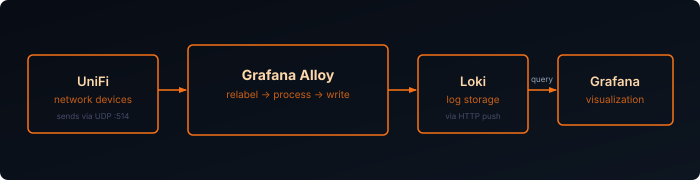

Unifi network devices generate valuable logs that can help you troubleshoot network issues and monitor your devices. By sending these syslog messages to Loki using Grafana Alloy, you can centralize your network logs alongside your application logs for unified observability.

This guide only covers device logs — security and firewall logs are out of scope.



## Prerequisites

- Grafana Alloy installed — see [Installing on Docker]() or [Installing on Bare Metal]()
- Grafana and Loki instance running (see my [Building the Stack]() post)
- Unifi Controller with network devices configured

## Why Grafana Alloy?

Grafana Alloy is the next-generation telemetry collector that replaces Promtail. It supports multiple data formats including logs, metrics, traces, and profiles. For syslog collection, Alloy provides:

- Native syslog receiver (no need for external syslog daemons)
- Powerful log processing and relabeling capabilities
- Lower resource usage compared to traditional collectors
- Unified configuration for all telemetry types

## Open the Syslog Port

Alloy needs to listen on UDP 514 for incoming syslog messages. This uses the same Alloy instance set up in the install posts above, so you only need to expose the extra port — nothing else about the existing install changes.



Add the UDP port mapping to your existing `alloy/docker-compose.yml`:

```yaml {filename="docker-compose.yml"}
ports:
  - "12345:12345"
  - "514:514/udp"  # Syslog UDP
```

Recreate the container to pick up the new port:

```bash
docker compose -f alloy/docker-compose.yml up -d
```


No compose file to edit — the systemd service already listens on whatever ports its config defines. Just make sure your firewall allows inbound UDP/514, e.g. with `ufw`:

```bash
sudo ufw allow 514/udp
```



## Configure Alloy for Syslog

Add a new collector file to your existing Alloy config directory — `unifi-syslog.alloy`:



```bash
nano alloy/config/unifi-syslog.alloy
```


```bash
sudo nano /etc/alloy/config/unifi-syslog.alloy
```



```hcl {filename="unifi-syslog.alloy"}
/* UniFi Syslog (RFC3164) - Relabel rules to capture syslog metadata */
loki.relabel "unifi_syslog" {
  forward_to = []

  // Copy severity first (for error, debug, or unknown values)
  rule {
    source_labels = ["__syslog_message_severity"]
    target_label  = "detected_level"
  }
  // Then normalize specific values (these overwrite the above)
  rule {
    source_labels = ["__syslog_message_severity"]
    regex         = "(?i)^(emergency|alert|critical)$"
    target_label  = "detected_level"
    replacement   = "critical"
  }
  rule {
    source_labels = ["__syslog_message_severity"]
    regex         = "(?i)^warning$"
    target_label  = "detected_level"
    replacement   = "warn"
  }
  rule {
    source_labels = ["__syslog_message_severity"]
    regex         = "(?i)^(notice|informational)$"
    target_label  = "detected_level"
    replacement   = "info"
  }

  rule {
    source_labels = ["__syslog_message_hostname"]
    target_label  = "host"
  }
}

loki.source.syslog "unifi" {
  listener {
    address       = "0.0.0.0:514"
    protocol      = "udp"
    syslog_format = "rfc3164"
    use_incoming_timestamp = false
    labels        = {
      job      = "unifi",
    }
  }

  relabel_rules = loki.relabel.unifi_syslog.rules
  forward_to    = [loki.process.unifi.receiver]
}

loki.process "unifi" {
  // Extract device MAC and firmware from AP/Switch prefix: "1c6a1b3f7059,U7-Pro-Wall-8.5.21+18681: ..."
  // Gateway logs don't have this prefix — stages are no-ops for those.
  stage.regex {
    expression = `^(?P<device_mac>[0-9a-f]{12}),(?P<firmware>[^:\s]+):\s+`
  }

  stage.labels {
    values = {
      device_mac = "",
      firmware   = "",
    }
  }

  // Extract app and message from UniFi syslog content
  // Format 1 (AP/Switch): "mac,device-firmware: process[pid][pid2]: message"
  //   Example: "6c63f8863465,U7-Pro-Wall-8.3.2+18064: hostapd[5343]: wifi1ap6: STA ..."
  //   Example: "1c6a1b3f7059,...: syswrapper[2807][16721]: [configure_vap] up wifi0ap0"
  // Format 2 (Gateway): "hostname process[pid]: message"
  //   Example: "UCG-Fiber bash[2616997]: HISTORY: ..."
  stage.regex {
    expression = `^(?:[\w,\-\.\+]+:\s+|[\w\-]+\s+)?(?P<app>[\w\-]+)(?:\[\d+\])?:\s*(?P<message>.*)`
  }

  stage.labels {
    values = {
      app = "",
    }
  }

  // For stahtd lines, extract the embedded JSON payload into structured metadata
  stage.match {
    selector = `{app="stahtd"}`

    stage.regex {
      expression = `(?P<json_payload>\{.*?\})`
    }

    stage.structured_metadata {
      values = {
        json_payload = "",
      }
    }
  }

  stage.output {
    source = "message"
  }

  forward_to = [loki.write.default.receiver]
}
```

### Configuration Breakdown

#### 1. Relabel Rules (`loki.relabel "unifi_syslog"`)

Runs before log processing to normalize metadata from the raw syslog headers:

- **`detected_level`**: Maps RFC3164 severity words (emergency, alert, critical → `critical`; warning → `warn`; notice, informational → `info`) to standard Loki level labels
- **`host`**: Copies the syslog hostname field so you can filter by device name

#### 2. Syslog Listener (`loki.source.syslog "unifi"`)

Listens on UDP port 514, parsing RFC3164 — the format UniFi devices use by default. All logs get `job="unifi"` as a static label, then pass through the relabel rules above before moving to the process stage.

`use_incoming_timestamp` is set to `false` so Alloy's receive time is used instead of the device clock, which can drift.

#### 3. Log Processing (`loki.process "unifi"`)

This stage does the heavy lifting. UniFi devices produce two distinct log formats:

- **Access Points / Switches**: prefix includes MAC address and firmware version
  - `1c6a1b3f7059,U7-Pro-Wall-8.5.21+18681: hostapd[5343]: STA connected`
- **Gateways**: no prefix, just hostname and process
  - `UCG-Fiber bash[2616997]: HISTORY: command run`

The pipeline handles both:

1. A first regex extracts `device_mac` and `firmware` from the AP/Switch prefix and promotes them to labels — gateway logs simply produce no match and skip this step.
2. A second regex extracts the `app` (process name) and strips the cleaned `message` as the log line output.
3. A `stage.match` block runs only for `stahtd` logs, pulling the embedded JSON payload out into structured metadata for richer querying.

#### 4. Loki Write

The pipeline forwards to `loki.write.default.receiver` — the same `loki.write "default"` component already defined in `endpoint.alloy` from the install post. No new write endpoint is needed; every collector in the config directory shares it.

## Reload Alloy

Since Alloy loads every file in the config directory automatically, dropping in `unifi-syslog.alloy` is enough — restart the service to pick it up:



```bash
docker compose -f alloy/docker-compose.yml up -d alloy
```


```bash
sudo systemctl restart alloy
```



Open the Alloy web UI at `http://<HOST_IP>:12345` and confirm `loki.source.syslog.unifi` shows healthy.

## Configure Unifi Devices

Now configure your Unifi Controller to send syslog messages to Alloy.

### Using Unifi Controller

1. Open your Unifi Controller
2. Navigate to **Settings** > **Cyber Secure**
3. Go to **Traffic Logging**
4. Set **Activity Logging (Syslog)** to **SIEM Server**
5. Set the **IP Address** to your Alloy server IP (e.g., `192.168.1.100`)
6. Set the **Port** to `514`
7. Click **Apply Changes**

## Verify Log Collection

After configuring your Unifi devices, logs should start flowing to Loki within seconds. Open Grafana's **Explore** view, select the **Loki** datasource, and run:

```logql
{job="unifi"}
```

You should see syslog messages from your Unifi devices, including authentication events, DHCP assignments, and wireless connections.

## Example Queries

With the labels and processing configured above, you can filter down further:

**Logs from a specific device:**
```logql
{job="unifi", host="UCG-Fiber"}
```

**Logs from a specific application:**
```logql
{job="unifi", app="hostapd"}
```

With Unifi logs flowing into the same Loki instance as the rest of your stack, you can correlate them with the host, container, and system logs set up in [Building the Stack]() — or move on to [alerting and dashboards as code]() to provision both from version control.
