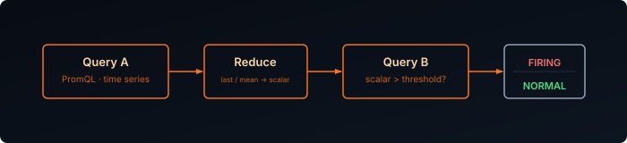
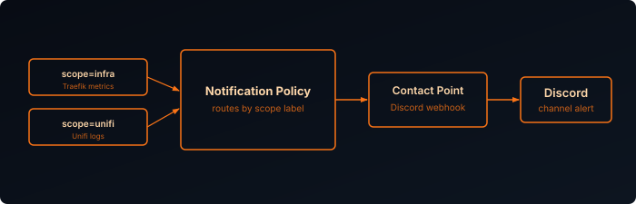
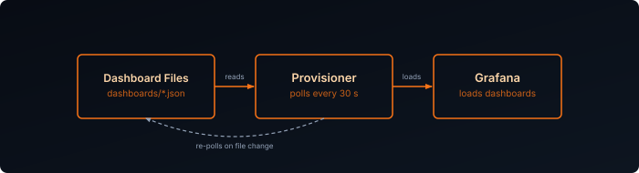

Collecting metrics and logs is only half the picture — you also need to know when something breaks, and you need your dashboards to survive a container rebuild. This post covers both: Grafana Alerting evaluates rules against your Prometheus metrics or Loki logs and fires notifications to a contact point of your choice, and dashboard provisioning loads dashboards from JSON files on disk so they're never lost and always in version control.

## Prerequisites

- Prometheus and Loki running, with Grafana added as a datasource for both
- Traefik metrics flowing into Prometheus — see [Traefik Observability]()
- Unifi logs flowing into Loki — see [Unifi Syslog with Alloy and Loki]()
- Setup from [Building the Stack]()

## How Grafana Alerting Works

Three components work together:

- **Alert Rules** — PromQL or LogQL expressions evaluated on a schedule; fire when a condition is met
- **Contact Points** — where notifications are sent (Discord, webhook, email)
- **Notification Policies** — route alerts to the right contact point

All three can be provisioned from YAML files, keeping your alerting config in version control alongside the rest of your stack.



## Directory Structure

This is the first time file-based provisioning shows up in this series — in [Building the Stack]() the Prometheus and Loki datasources were added by hand through the Grafana UI, and they can stay that way; provisioning here only applies to alerting (and, further down, dashboards).

Create a `provisioning/` folder next to your Grafana `docker-compose.yml`, with an `alerting/` subfolder:

```bash
grafana/
└── provisioning/
    └── alerting/
        ├── contact-points.yaml
        ├── policies.yaml
        ├── rules.yaml
        └── templates.yaml
```

Mount it into the Grafana container so the files above are actually picked up. Add the volume to your existing `docker-compose.yml`:

```yaml {filename="docker-compose.yml"}
volumes:
  - grafana_data:/var/lib/grafana
  - ./provisioning:/etc/grafana/provisioning
```

## Contact Point

In your Discord server go to **Settings → Integrations → Webhooks → New Webhook** and copy the webhook URL.

Instead of sending Grafana's default Discord payload, define a notification template so the message is easier to scan in chat:

```yaml {filename="alerting/templates.yaml"}
apiVersion: 1
templates:
  - orgId: 1
    name: discord.message
    template: |
      {{ define "discord.message" }}
      {{ if eq .Status "resolved" }}✅ **Resolved**{{ else }}🔴 **Firing**{{ end }}
      {{ range .Alerts }}
      **{{ .Labels.alertname }}**
      {{ .Annotations.summary }}
      {{ if .Labels.name }}Container: `{{ .Labels.name }}`{{ else if .Labels.cn }}Certificate: `{{ .Labels.cn }}`{{ else if .Labels.instance }}Instance: `{{ .Labels.instance }}`{{ end }}{{ if .Labels.severity }} | Severity: {{ .Labels.severity }}{{ end }}
      {{ end }}
      {{ end }}
```

Then provision the Discord contact point and render that template into the message body:

```yaml {filename="alerting/contact-points.yaml"}
apiVersion: 1
contactPoints:
  - orgId: 1
    name: Discord
    receivers:
      - uid: discord
        type: discord
        settings:
          url: "${DISCORD_WEBHOOK_URL}"
          message: "{{ template \"discord.message\" . }}"
```

Add the webhook URL to your Grafana container environment:

```yaml {filename="docker-compose.yml"}
environment:
  - DISCORD_WEBHOOK_URL=https://discord.com/api/webhooks/your-id/your-token
```

## Notification Policy

Route all alerts to Discord by default:

```yaml {filename="alerting/policies.yaml"}
apiVersion: 1
policies:
  - orgId: 1
    receiver: Discord
```

You can also split alerts into categories such as `infra` and `unifi`. The useful part is not just the folder layout in Grafana, but the labels on each rule. Once a rule carries a label like `scope: unifi`, you can route or filter it however you like later.



```yaml {filename="alerting/policies.yaml"}
apiVersion: 1
policies:
  - orgId: 1
    receiver: Discord
    routes:
      - receiver: Discord
        object_matchers:
          - ["scope", "=", "infra"]
      - receiver: Discord
        object_matchers:
          - ["scope", "=", "unifi"]
```

## Notification Template

Grafana notification templates use Go templating syntax. In this example, the template does three things:

- Shows a different header for firing and resolved alerts
- Loops over `.Alerts` so grouped notifications still include every alert
- Pulls fields from labels and annotations, including the `summary` we define on each rule

That keeps the Discord message compact while still including the instance and severity at a glance.

## Alert Rules

### Structure

Each rule uses two query steps — a Prometheus or Loki query (refId `A`) and a threshold expression (refId `B`). Keeping the threshold separate from the query prevents Grafana from treating an empty result (condition not met) as missing data and firing a false `DatasourceNoData` alert.

You do not need to keep everything in one alert group either. This series splits rules by source:

- `Infrastructure` for Traefik's Prometheus metrics — service availability, error rates, latency, certificate expiry
- `Unifi` for Unifi's Loki logs — network-device events rather than metrics

All rules across both groups live together in a single `alerting/rules.yaml` file. Here's the full definition of one representative Traefik rule, followed by a summary table of the rest, then the Unifi log-based group.

#### Infrastructure: Traefik Down

```yaml {filename="alerting/rules.yaml (excerpt — infrastructure group)"}
apiVersion: 1
groups:
  - orgId: 1
    name: infrastructure
    folder: Infrastructure
    interval: 1m
    rules:
      - uid: traefik-down
        title: Traefik Down
        condition: A
        data:
          - refId: A
            datasourceUid: prometheus
            relativeTimeRange:
              from: 300
              to: 0
            model:
              expr: up{job="traefik"} == 0
              instant: true
              refId: A
        noDataState: Alerting
        execErrState: Alerting
        for: 2m
        labels:
          scope: infra
          severity: critical
        annotations:
          __dashboardUid__: "ddmvax2tzuv40c"
          __panelId__: "1"
          summary: "Traefik metrics endpoint is unreachable"
```

This one skips the two-step pattern — `up{job="traefik"} == 0` already evaluates to a clean boolean, so `condition: A` is enough on its own. The important difference from the threshold-style rules is `noDataState: Alerting` and `execErrState: Alerting`: for every other rule a missing scrape resolves to `OK`, but here a target that stops responding entirely looks exactly like "no data", so both are flipped to `Alerting` to make sure a fully-dead target still pages you instead of going quiet.

#### The rest of the Infrastructure ruleset

The remaining Traefik rules follow the same two-step query/threshold pattern used elsewhere in this post, just with a different PromQL expression and threshold per check:

| Rule | What it checks | Threshold | Severity |
|---|---|---|---|
| Traefik 5xx Rate High (`traefik-5xx-high`) | Rate of HTTP 5xx responses served by Traefik | > 0.1 req/s for 5m | warning |
| Traefik Response Time High (`traefik-latency-high`) | Average request duration across Traefik services | > 1s for 10m | warning |
| Traefik Certificate Expiring Soon (`traefik-cert-expiring`) | Days remaining until TLS cert expiry | < 14 days | warning |

#### Unifi: Log-Based Alerts

Unifi doesn't expose Prometheus metrics — its data lives in Loki as log lines, from the [Unifi Syslog with Alloy and Loki]() pipeline. Grafana can still alert on it: point the query at the Loki datasource instead of Prometheus, and use a LogQL `count_over_time` expression in place of a PromQL one. The same two-step query/threshold structure applies — count matching log lines over a window in refId `A`, then compare that count against a threshold in refId `B`:

```yaml {filename="alerting/rules.yaml (excerpt — unifi group)"}
apiVersion: 1
groups:
  - orgId: 1
    name: unifi
    folder: Unifi
    interval: 1m
    rules:
      - uid: unifi-example
        title: <TODO — name the condition this catches>
        condition: B
        data:
          - refId: A
            datasourceUid: loki
            relativeTimeRange:
              from: 300
              to: 0
            model:
              expr: 'count_over_time({job="unifi"} |= "<TODO — log line to match>" [5m])'
              instant: true
              refId: A
          - refId: B
            datasourceUid: "__expr__"
            model:
              type: threshold
              expression: "A"
              refId: B
              conditions:
                - evaluator:
                    params:
                      - 0
                    type: gt
                  operator:
                    type: and
                  query:
                    params:
                      - A
                  reducer:
                    type: last
        noDataState: OK
        execErrState: Error
        for: 0m
        labels:
          scope: unifi
          severity: warning
        annotations:
          summary: "<TODO — what fired and why it matters>"
```

<!-- TODO(Sven): fill in the actual Unifi log lines/thresholds you want to alert on — e.g. AP disconnects, DHCP failures, WAN flaps — once you've confirmed the exact log text from your own devices. -->

### Dashboard Linking

The `__dashboardUid__` and `__panelId__` annotations link each rule to a specific panel. When an alert fires, Grafana adds a red annotation line directly on the chart and a **Go to dashboard** button appears in the alert detail view, making it easy to jump straight to the relevant graph.

Replace `ddmvax2tzuv40c` with your own dashboard UID, found at the bottom of the dashboard JSON or in the dashboard URL.

## Apply Configuration

Recreate the Grafana container so it picks up the new `provisioning/` volume mount along with the alerting files:

```bash
docker compose -f grafana/docker-compose.yml up -d
```

## Verification

Open Grafana → **Alerting → Alert rules** and confirm the rules appear under the expected folders, **Infrastructure** or **Unifi**, with state **Normal**.

To trigger a test notification, open **Alerting → Contact points**, find Discord, and click **Test**.

To verify the Traefik Down rule end-to-end, stop the Traefik container for longer than the 2-minute pending window and confirm the alert fires:

```bash
docker stop traefik
```

## Dashboards as Code

Dashboards created through the Grafana UI are stored in its SQLite database inside the `grafana_data` volume. The volume survives container rebuilds, but it is not in version control — there is no history, no way to diff changes, and no easy path to reproducing the same setup on another machine. Provisioning solves this by loading dashboards from JSON files on disk at startup, keeping them alongside the rest of your stack config in git.

### How Dashboard Provisioning Works

Grafana's provisioning system reads a configuration file at startup that points to one or more directories. Any `.json` file it finds there is loaded as a dashboard and placed in the specified folder. If the file changes on disk, Grafana picks up the update within the configured interval — no restart required.



### Directory Structure

Add a `dashboards/` directory inside the `provisioning/` folder you created earlier for alerting — it's already mounted into the container, so no new volume is needed:

```bash
grafana/
└── provisioning/
    ├── alerting/
    └── dashboards/
        ├── dashboards.yaml
        ├── infrastructure/
        │   └── traefik-proxy.json
        └── unifi/
            └── unifi-logs.json
```

Each subdirectory maps to a folder in the Grafana UI. You can add as many folders and JSON files as you like.

### Provisioner Config

Create the provider configuration file:

```yaml {filename="provisioning/dashboards/dashboards.yaml"}
apiVersion: 1

providers:
  - name: "infrastructure"
    orgId: 1
    folder: "Infrastructure"
    type: file
    disableDeletion: false
    updateIntervalSeconds: 30
    allowUiUpdates: true
    options:
      path: /etc/grafana/provisioning/dashboards/infrastructure

  - name: "unifi"
    orgId: 1
    folder: "Unifi"
    type: file
    disableDeletion: false
    updateIntervalSeconds: 30
    allowUiUpdates: true
    options:
      path: /etc/grafana/provisioning/dashboards/unifi
```

A few settings worth noting:

- **`updateIntervalSeconds: 30`** — Grafana polls the directory every 30 seconds and reloads any changed JSON files. This means you can update a dashboard file and see the change in the UI without restarting the container.
- **`allowUiUpdates: true`** — You can still edit the dashboard in the Grafana UI. Changes made through the UI are written back to the JSON file on disk. Without this, any UI edits are discarded on the next reload.
- **`disableDeletion: false`** — If you delete a JSON file, Grafana removes the dashboard from the UI on the next poll.

### Exporting Dashboards from the UI

To get a dashboard's JSON from an existing Grafana instance:

1. Open the dashboard
2. Click the **Share** icon (top toolbar) → **Export**
3. Enable **Export for sharing externally** to replace internal datasource UIDs with variable names
4. Click **Save to file**

Save the downloaded file into the appropriate subdirectory under `provisioning/dashboards/`. Grafana will pick it up within 30 seconds.

### Apply Configuration

Restart Grafana to load the provisioner config for the first time:

```bash
docker restart grafana
```

After that, any new or updated JSON files in the dashboard directories are picked up automatically within 30 seconds.

### Verification

Open Grafana → **Dashboards** and confirm the folders appear: **Infrastructure** and **Unifi**. Each folder should contain the dashboards from the corresponding JSON files.

To confirm provisioning is working correctly, check the Grafana logs:

```bash
docker logs grafana | grep -i provision
```

You should see lines like:

```
provisioning.dashboard: Provisioned dashboard from file ...
```

If a JSON file has a syntax error, Grafana logs the error and skips that file without affecting the others.
