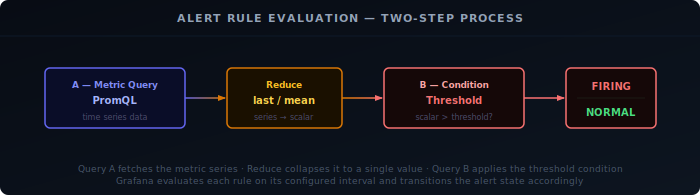
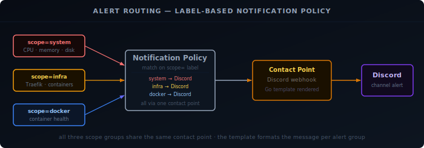

Collecting metrics is only half the picture — you also need to know when something breaks. Grafana Alerting evaluates rules against your Prometheus data and fires notifications to a contact point of your choice.

## Prerequisites

- Prometheus running with metrics flowing in
- Grafana running with Prometheus added as a datasource
- Setup from [Setting Up Your Observability Stack]()

## How Grafana Alerting Works

Three components work together:

- **Alert Rules** — PromQL expressions evaluated on a schedule; fire when a condition is met
- **Contact Points** — where notifications are sent (Discord, webhook, email)
- **Notification Policies** — route alerts to the right contact point

All three can be provisioned from YAML files, keeping your alerting config in version control alongside the rest of your stack.



## Directory Structure

Add an `alerting/` folder inside your existing Grafana provisioning directory:

```bash
grafana/
└── provisioning/
    ├── datasources/
    ├── dashboards/
    └── alerting/
        ├── contact-points.yaml
        ├── policies.yaml
        ├── rules.yaml
        └── templates.yaml
```

## Contact Point

In your Discord server go to **Settings → Integrations → Webhooks → New Webhook** and copy the webhook URL.

Instead of sending Grafana's default Discord payload, define a notification template so the message is easier to scan in chat:

```yaml {filename="alerting/templates.yaml"}
apiVersion: 1
templates:
  - orgId: 1
    name: discord.message
    template: |
      {{ define "discord.message" }}
      {{ if eq .Status "resolved" }}✅ **Resolved**{{ else }}🔴 **Firing**{{ end }}
      {{ range .Alerts }}
      **{{ .Labels.alertname }}**
      {{ .Annotations.summary }}
      {{ if .Labels.name }}Container: `{{ .Labels.name }}`{{ else if .Labels.cn }}Certificate: `{{ .Labels.cn }}`{{ else if .Labels.instance }}Instance: `{{ .Labels.instance }}`{{ end }}{{ if .Labels.severity }} | Severity: {{ .Labels.severity }}{{ end }}
      {{ end }}
      {{ end }}
```

Then provision the Discord contact point and render that template into the message body:

```yaml {filename="alerting/contact-points.yaml"}
apiVersion: 1
contactPoints:
  - orgId: 1
    name: Discord
    receivers:
      - uid: discord
        type: discord
        settings:
          url: "${DISCORD_WEBHOOK_URL}"
          message: "{{ template \"discord.message\" . }}"
```

Add the webhook URL to your Grafana container environment:

```yaml {filename="docker-compose.yml"}
environment:
  - DISCORD_WEBHOOK_URL=https://discord.com/api/webhooks/your-id/your-token
```

## Notification Policy

Route all alerts to Discord by default:

```yaml {filename="alerting/policies.yaml"}
apiVersion: 1
policies:
  - orgId: 1
    receiver: Discord
```

You can also split alerts into categories such as `system`, `infra`, and `docker`. The useful part is not just the folder layout in Grafana, but the labels on each rule. Once a rule carries a label like `scope: system`, you can route or filter it however you like later.



```yaml {filename="alerting/policies.yaml"}
apiVersion: 1
policies:
  - orgId: 1
    receiver: Discord
    routes:
      - receiver: Discord
        object_matchers:
          - ["scope", "=", "system"]
      - receiver: Discord
        object_matchers:
          - ["scope", "=", "infra"]
      - receiver: Discord
        object_matchers:
          - ["scope", "=", "docker"]
```

## Notification Template

Grafana notification templates use Go templating syntax. In this example, the template does three things:

- Shows a different header for firing and resolved alerts
- Loops over `.Alerts` so grouped notifications still include every alert
- Pulls fields from labels and annotations, including the `summary` we define on each rule

That keeps the Discord message compact while still including the instance and severity at a glance.

## Alert Rules

### Structure

Each rule uses two query steps — a Prometheus query (refId `A`) and a threshold expression (refId `B`). Keeping the threshold separate from the PromQL prevents Grafana from treating an empty result (condition not met) as missing data and firing a false `DatasourceNoData` alert.

You do not need to keep everything in one alert group either. A common split is:

- `Systems` for host-level CPU, memory, disk, temperature, and reboot alerts
- `Infrastructure` for service availability and network-level checks
- `Docker` for container restarts, unhealthy containers, or missing exporters

All rules across all three groups live together in a single `alerting/rules.yaml` file. Rather than reprint all eighteen rules — most of which just swap out the PromQL expression and threshold — here's the full definition of one representative rule from each group, followed by a summary table of the rest.

#### Systems: CPU Usage High

```yaml {filename="alerting/rules.yaml (excerpt — systems group)"}
apiVersion: 1
groups:
  - orgId: 1
    name: systems
    folder: Systems
    interval: 1m
    rules:
      - uid: cpu-high
        title: CPU Usage High
        condition: B
        data:
          - refId: A
            datasourceUid: prometheus
            relativeTimeRange:
              from: 300
              to: 0
            model:
              expr: 100 - (avg by(instance) (rate(node_cpu_seconds_total{mode="idle"}[2m])) * 100)
              instant: true
              refId: A
          - refId: B
            datasourceUid: "__expr__"
            model:
              type: threshold
              expression: "A"
              refId: B
              conditions:
                - evaluator:
                    params:
                      - 80
                    type: gt
                  operator:
                    type: and
                  query:
                    params:
                      - A
                  reducer:
                    type: last
        noDataState: OK
        execErrState: Error
        for: 5m
        labels:
          scope: system
          severity: warning
        annotations:
          __dashboardUid__: "ddmvax2tzuv40c"
          __panelId__: "5"
          summary: "{{ $labels.instance }} CPU above 80% (current: {{ $values.A.Value | printf \"%.1f\" }}%)"
```

The query (refId `A`) averages CPU utilization across all cores over a 2-minute window; the threshold step (refId `B`) compares that average against 80% separately, so a scrape gap doesn't get misread as "no data = alert". It only fires once CPU has stayed above 80% for a full 5 minutes (`for: 5m`), and the summary annotation reuses the evaluated value (`$values.A.Value`) so the Discord message shows the exact percentage that tripped it.

#### Infrastructure: Host Down

```yaml {filename="alerting/rules.yaml (excerpt — infrastructure group)"}
apiVersion: 1
groups:
  - orgId: 1
    name: infrastructure
    folder: Infrastructure
    interval: 1m
    rules:
      - uid: host-down
        title: Host Down
        condition: A
        data:
          - refId: A
            datasourceUid: prometheus
            relativeTimeRange:
              from: 300
              to: 0
            model:
              expr: up{job="unix"} == 0
              instant: true
              refId: A
        noDataState: Alerting
        execErrState: Alerting
        for: 2m
        labels:
          scope: infra
          severity: critical
        annotations:
          __dashboardUid__: "ddmvax2tzuv40c"
          __panelId__: "1"
          summary: "{{ $labels.instance }} is unreachable"
```

This one skips the two-step pattern — `up{job="unix"} == 0` already evaluates to a clean boolean, so `condition: A` is enough on its own. The important difference from the threshold-style rules is `noDataState: Alerting` and `execErrState: Alerting`: for every other rule a missing scrape resolves to `OK`, but here a host that stops responding entirely looks exactly like "no data", so both are flipped to `Alerting` to make sure a fully-dead host still pages you instead of going quiet.

#### Docker: Docker Container Down

```yaml {filename="alerting/rules.yaml (excerpt — docker group)"}
apiVersion: 1
groups:
  - orgId: 1
    name: docker
    folder: Docker
    interval: 1m
    rules:
      - uid: docker-container-down
        title: Docker Container Down
        condition: B
        data:
          - refId: A
            datasourceUid: prometheus
            relativeTimeRange:
              from: 300
              to: 0
            model:
              expr: time() - container_last_seen{container_label_com_docker_compose_project!="", name!=""} > 60
              instant: true
              refId: A
          - refId: B
            datasourceUid: "__expr__"
            model:
              type: threshold
              expression: "A"
              refId: B
              conditions:
                - evaluator:
                    params:
                      - 0
                    type: gt
                  operator:
                    type: and
                  query:
                    params:
                      - A
                  reducer:
                    type: last
        noDataState: OK
        execErrState: Error
        for: 2m
        labels:
          scope: docker
          severity: critical
        annotations:
          __dashboardUid__: "docker-metrics"
          __panelId__: "200"
          summary: "{{ $labels.name }} has not reported metrics for more than 60 seconds"
```

This one uses `container_last_seen` rather than `up{job="docker"}`, because cAdvisor's own scrape target stays up even when an individual container has stopped — only that container's last-seen timestamp goes stale. The PromQL already contains the threshold (`> 60`), which evaluates to `1` once a container hasn't reported in over 60 seconds; refId `B` just checks that this result is greater than `0`, i.e. true. The label filters `container_label_com_docker_compose_project!=""` and `name!=""` exclude cAdvisor's own internal/pause-container series that don't carry a real container name.

#### The rest of the ruleset

The remaining rules follow the same two-step query/threshold pattern shown above, just with a different PromQL expression and threshold per check. The full YAML for all of them is in the project's alerting config; here's what each one does:

| Rule | What it checks | Threshold | Severity |
|---|---|---|---|
| Memory Usage High (`memory-high`) | % of RAM in use | > 85% for 5m | warning |
| Swap Usage High (`swap-high`) | % of swap in use | > 80% for 5m | warning |
| Disk Space Low (`disk-low`) | % free space on the root filesystem | < 10% for 5m | warning |
| High Load Average (`load-high`) | 15-minute load average, normalized per CPU core | > 1 per core for 10m | warning |
| High Temperature (`temp-high`) | Highest hwmon sensor reading | > 85°C for 5m | warning |
| System Reboot Detected (`system-reboot`) | Seconds since boot | < 300s uptime, fires immediately | warning |
| Network Errors (`network-errors`) | Combined rx+tx error rate on physical interfaces | > 10 errors/s for 5m | warning |
| Network Throughput High (`network-high`) | Combined rx+tx byte rate on physical interfaces | > 100 MB/s for 5m | warning |
| Traefik Down (`traefik-down`) | Traefik metrics endpoint reachability | unreachable for 2m | critical |
| Traefik 5xx Rate High (`traefik-5xx-high`) | Rate of HTTP 5xx responses served by Traefik | > 0.1 req/s for 5m | warning |
| Traefik Response Time High (`traefik-latency-high`) | Average request duration across Traefik services | > 1s for 10m | warning |
| Traefik Certificate Expiring Soon (`traefik-cert-expiring`) | Days remaining until TLS cert expiry | < 14 days | warning |
| Docker Container Restart Loop (`docker-container-restart-loop`) | Number of container start-time changes in a 15m window | > 2 restarts / 15m | critical |
| Docker Container CPU High (`docker-container-cpu-high`) | Per-container CPU usage rate | > 0.8 cores for 10m | warning |
| Docker Container Memory High (`docker-container-memory-high`) | Per-container working set memory | > 1 GiB for 10m | warning |

### Dashboard Linking

The `__dashboardUid__` and `__panelId__` annotations link each rule to a specific panel. When an alert fires, Grafana adds a red annotation line directly on the chart and a **Go to dashboard** button appears in the alert detail view, making it easy to jump straight to the relevant graph.

Replace `ddmvax2tzuv40c` with your own dashboard UID, found at the bottom of the dashboard JSON or in the dashboard URL.

## Apply Configuration

Restart Grafana to load the provisioned files:

```bash
docker restart grafana
```

## Verification

Open Grafana → **Alerting → Alert rules** and confirm the rules appear under the expected folders such as **Systems**, **Infrastructure**, or **Docker**, with state **Normal**.

To trigger a test notification, open **Alerting → Contact points**, find Discord, and click **Test**.

To verify the CPU alert end-to-end, stress all cores for long enough to survive the 5-minute pending window:

```bash
stress-ng --cpu $(nproc) --timeout 360s
```
