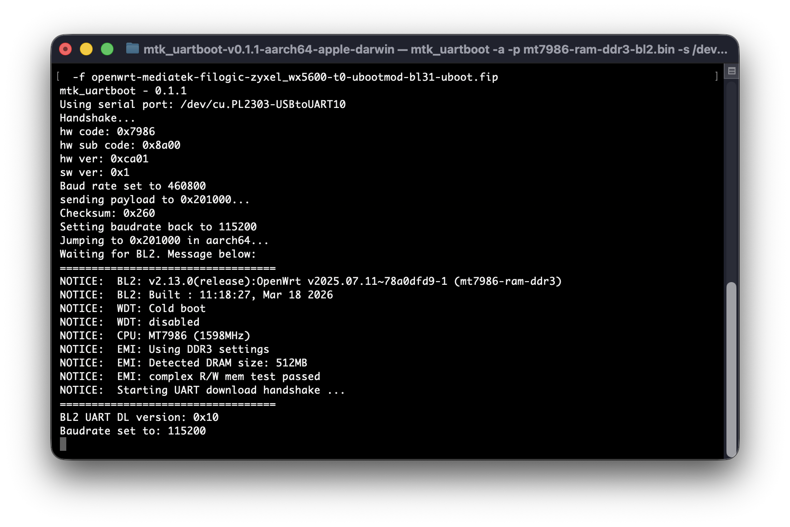
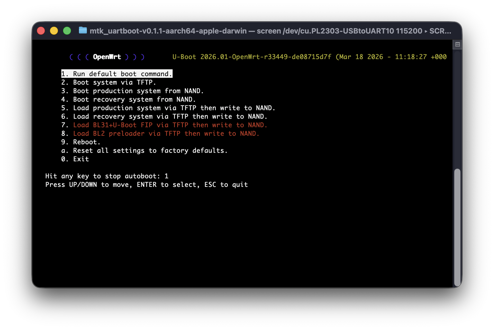
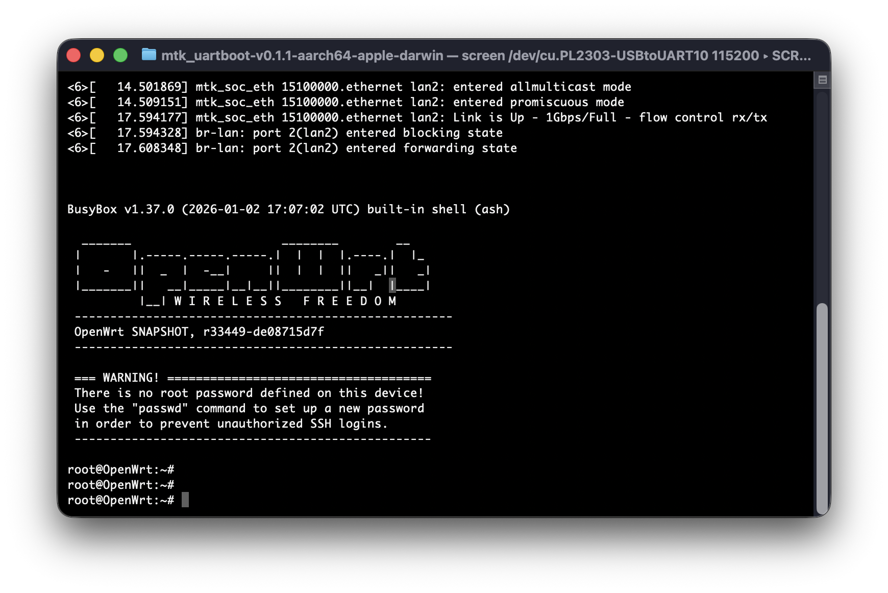

The Zyxel WX5600-T0 is a capable AX5400 Wi-Fi 6 access point built around the MediaTek MT7986A (Filogic 830) SoC. It ships with 512 MB RAM and 128 MB of NAND flash, giving it plenty of headroom for OpenWRT and its packages.

This guide walks through replacing the stock firmware with OpenWRT via serial port and TFTP.

## What you need

- Zyxel WX5600-T0
- Ethernet cable
- USB to TTL serial converter (CP2102)
- A computer running a TFTP server

## Preparation

### Download the files

Download [mtk_uartboot][1] from GitHub — this tool loads the bootloader over serial.

Download the following files from the [OpenWRT mediatek/filogic snapshot directory][2] and place them in the same folder as `mtk_uartboot`:

- `mt7986-ram-ddr3-bl2.bin`
- `openwrt-mediatek-filogic-zyxel_wx5600-t0-ubootmod-bl31-uboot.fip`

Also download the `zyxel_wx5600-t0-ubootmod` production and recovery images from the same directory and place them in your TFTP server root folder.

### Set up the TFTP server

Point your TFTP server at the folder containing the `zyxel_wx5600-t0-ubootmod` images and set a static IP of `192.168.1.254` on the network interface you will use. 

## Connect via serial

Disassemble the WX5600-T0 to access the serial console. The console port is located on the left side of the board. The housing is glued together and integrated with the wireless antennas, so the easiest approach is to carefully make a small hole in the casing to route the serial wires without fully separating it.

Connect the USB to TTL adapter to the serial header and open your serial software at **115200 baud**. Power on the device and verify you see boot output — then power it off again.

## Load the bootloader over serial

With the device powered off, run `mtk_uartboot` and power on the WX5600-T0:

```bash
./mtk_uartboot -a -p mt7986-ram-ddr3-bl2.bin -s YOUR_SERIAL_PORT_HERE --bl2-load-baudrate 115200 -f openwrt-mediatek-filogic-zyxel_wx5600-t0-ubootmod-bl31-uboot.fip
```



Once `mtk_uartboot` finishes, quickly switch to your serial software. A U-Boot menu will appear — use the arrow keys to stop auto-boot. If the device is already in a TFTP loop, press `CTRL-C` to abort.

## Flash OpenWRT

Connect an Ethernet cable from **LAN2** (the port next to the WPS button) on the WX5600-T0 to your computer running the TFTP server.

### Prepare UBI

In the Boot Menu, press `0` to drop to the U-Boot shell. A `WX5600>` prompt will appear. Erase and attach the UBI partition:

```bash {filename="U-Boot shell"}
mtd erase ubi
ubi part ubi
```

> Do **not** use `run ubi_format` — it reboots the device after formatting, which means you would have to re-run the `mtk_uartboot` step since BL2/BL31 have not been written to flash yet.

Return to the boot menu:

```bash {filename="U-Boot shell"}
bootmenu
```



### Flash each component via TFTP

From the boot menu, run the following steps in order:

| Key | Action |
|-----|--------|
| `8` | Load BL2 via TFTP and flash it |
| `7` | Load BL31 + U-Boot via TFTP and flash it |
| `6` | Load recovery image via TFTP and flash it |
| `5` | Load production image via TFTP and flash it |

Press `9` to reboot. OpenWRT will start up.



## Configure as an access point

Since this device will be used as a wireless access point rather than a router, disable the DHCP server and switch the LAN interface to DHCP client mode so it picks up an address from the upstream router.

**Disable DHCP:**

```bash
uci set dhcp.lan.dhcpv6=disabled
uci set dhcp.lan.ra=disabled
uci set dhcp.lan.ignore=1
uci commit dhcp
/etc/init.d/dnsmasq restart
```

**Switch LAN to DHCP client:**

```bash
uci set network.lan.proto=dhcp
uci delete network.lan.ipaddr
uci delete network.lan.netmask
uci commit network
/etc/init.d/network restart
```

You can now connect it the rest of your network. 

## Install LuCI

The web interface is not included in the default OpenWRT snapshot image. Install it with:

```bash
apk update
apk add luci
```

The LuCI web interface will then be available at the IP address assigned to the device by your router.

## Wrapping up

The WX5600-T0 is now running OpenWRT as a clean access point — no bloatware, no cloud dependency, and full control over your wireless network. From here you can configure SSIDs, set up VLANs, fine-tune transmit power, or install additional packages via `apk`.

[1]: https://github.com/981213/mtk_uartboot/releases
[2]: https://downloads.openwrt.org/snapshots/targets/mediatek/filogic/
