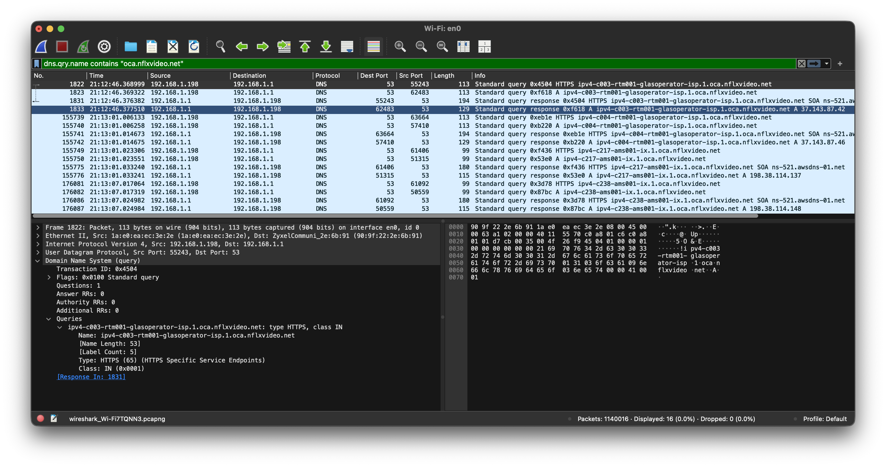

When you stream a video, open a website, or scroll through social media, the traffic rarely travels all the way to an origin server in some distant data center. Instead, it comes from a CDN edge node — a server sitting close to you, typically at an Internet Exchange Point (IXP), a facility where ISPs and content networks interconnect, near your ISP. Understanding this is key to choosing monitoring targets that actually reflect your internet experience.

## Major CDN Providers

| Provider | ASN | Serves |
|----------|-----|--------|
| Cloudflare | AS13335 | Web, DNS, streaming, SaaS |
| Google | AS15169 | YouTube, Search, Play, Workspace |
| Meta | AS32934 | Facebook, Instagram, WhatsApp |

Most large CDNs peer directly with ISPs at internet exchange points, so a CDN edge node typically sits just 1–2 hops past your ISP's network. CDNs use anycast — the same IP is announced from multiple locations, so your traffic always lands on the nearest edge. This makes CDN IPs ideal monitoring targets: stable, geographically consistent, and right at the boundary between your ISP and the wider internet.

## Finding CDN Edge Nodes

### DNS Resolution

CDNs use DNS to steer users to the nearest edge node — resolving a CDN domain gives you a local edge IP. Use the content delivery domain, not the website frontend (e.g. `googlevideo.com` serves YouTube video traffic, `youtube.com` serves the website UI — they're often different servers):

```bash
dig A speed.cloudflare.com       # Cloudflare edge
dig A googlevideo.com            # Google / YouTube video CDN
dig A scontent.cdninstagram.com  # Meta CDN
```

The returned IPs are geographically close to you. Verify any candidate with MTR as described in the [previous post]() before adding it to Smokeping. If a CDN IP shows loss or unstable RTT, try another — edge nodes are numerous and there's usually a better one nearby.

## ISP-Hosted CDN Caches

Some content providers go a step further than peering at an IXP — they place caching servers directly inside ISP networks. Netflix does this with Open Connect Appliances (OCAs): purpose-built servers pre-filled with popular content, installed in the ISP's own infrastructure. When you stream Netflix, the video comes from one of these local servers, not from a Netflix data center across the internet.

This makes them excellent monitoring targets:

- **Very low RTT** — significantly lower than internet-facing targets, since traffic never leaves your ISP's AS
- **No rate-limiting** — these servers are built to handle high traffic volumes
- **Reflects real traffic paths** — your Netflix streams come from exactly these servers
- **Clear fault isolation** — if a local node degrades, the problem is between your home and your ISP; if it's fine but internet-facing targets degrade, the problem is further upstream

Start with fast.com — it takes 30 seconds. Use Wireshark if you want to dig deeper or fast.com doesn't give clean results.

### Using fast.com

[fast.com][2] is Netflix's speed test, which runs against the same OCA infrastructure used for streaming. Open your browser's developer tools (Network tab), run the speed test, and look at the request IPs — these are live OCA endpoints actively serving your region. Use [bgp.tools][1] to confirm: if the IP belongs to your ISP's AS (not Netflix's), it's locally hosted.

### Wireshark

Start a Wireshark capture on your network interface before opening Netflix. When a stream begins, your device queries DNS for OCA hostnames and immediately connects to the returned IPs.

Apply this display filter by pasting it into Wireshark's display filter bar (the bar at the top that reads *Apply a display filter*):

```
dns.qry.name contains "oca.nflxvideo.net"
```

> [!NOTE]+ Known domains used by other local caches
> - Apple → `edge.apple`
> - Google / YouTube → `googlevideo.com`
> - Steam / Valve → `steamcontent.com`

The DNS response A records are your OCA IPs. The hostname typically includes an abbreviation of your ISP's name, making it easy to confirm you're looking at a locally hosted node.



### MTR

Run MTR against one of the IPs you found:

```bash
mtr --aslookup --report-cycles 30 --report-wide <oca-ip>
```

Example output for a locally hosted OCA:

```
Start: 2026-04-13T21:30:26+0200
HOST: un100p                                     Loss%   Snt   Last   Avg  Best  Wrst StDev
  1. AS???    home                                0.0%    60    1.1   0.9   0.6   1.1   0.2
  2. AS50266  1-96-254-92.ftth.glasoperator.nl    0.0%    60    3.8   3.2   2.3   5.1   0.4
  3. AS???    10.227.173.213                      0.0%    60    2.9   3.0   2.5   3.6   0.3
  4. AS???    10.226.11.37                        0.0%    60    2.6   2.9   2.4   3.6   0.2
  5. AS50266  42-87-143-37.ftth.glasoperator.nl   0.0%    60    3.8   3.5   2.7   4.7   0.4
```

The OCA is reachable in 5 hops with 0% packet loss. All hops stay within AS50266 (Autonomous System 50266 — your ISP's routing domain), which is expected: Netflix OCAs hosted inside an ISP use IPs from the ISP's own address space, not Netflix's. If you see all hops within your ISP's AS, the node is locally hosted.

A confirmed local CDN node should stay entirely within your ISP's AS with no packet loss — as shown above. If hops leave your ISP's AS, the node isn't locally hosted and isn't worth using as a monitoring target.

## Building Your Target List

You should now have a set of verified IPs covering different network distances:

- **CDN edge nodes** (1–2 hops past your ISP) — degrade when there's a problem between your ISP and the internet
- **ISP-hosted caches** (entirely within your ISP's AS) — degrade when there's a problem between your home and your ISP

Combined with the ISP gateway and DNS targets from the [previous post](), these give you complete coverage to isolate exactly where a problem is.

In the next post we set up Smokeping to monitor all of these targets continuously and graph latency and packet loss over time.

[1]: https://bgp.tools
[2]: https://fast.com
