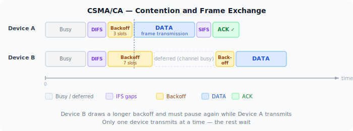
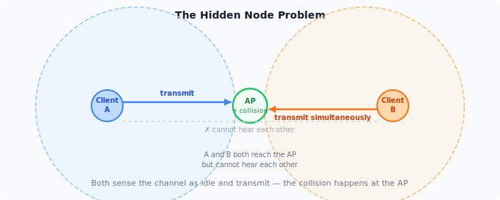
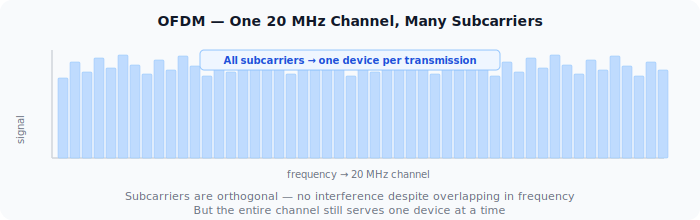
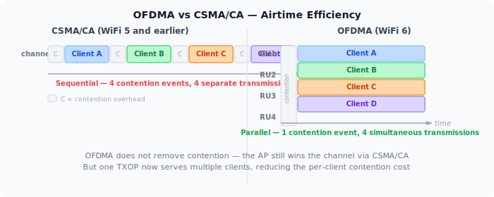
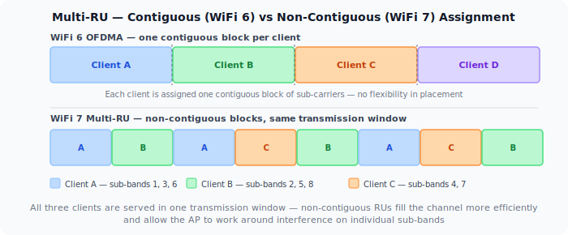

WiFi is a shared medium. Every device on the same channel uses the same slice of radio spectrum, and only one device can transmit at a time without causing a collision. Managing who gets to transmit — and when — is the job of the MAC layer. For the first 25+ years of WiFi, that meant CSMA/CA. WiFi 6 changed the model with OFDMA.

## CSMA/CA: Listen Before You Talk

The core rule of WiFi access: before transmitting, a device listens to check if the channel is busy. If it is, the device waits. If it's clear, the device waits a random backoff period to reduce the chance of simultaneous transmissions from multiple waiting devices, then transmits.

The backoff is drawn from a **contention window**: a range of slot times from which each device picks a random number. After successfully transmitting, the contention window resets. After a collision, both devices back off again with a larger window — this is binary exponential backoff.

The structure around every data frame is fixed overhead:

1. **DIFS** — Distributed Inter-Frame Space. A mandatory idle period before any frame.
2. **Backoff** — A random number of idle slots from the contention window.
3. **DATA** — The actual frame.
4. **SIFS** — Short Inter-Frame Space. A shorter gap before the ACK.
5. **ACK** — The receiver confirms delivery.

At low client counts, this overhead is manageable. At high client counts, devices spend more time waiting than transmitting. The channel is mostly idle — not because there's no traffic, but because all devices are in their backoff period simultaneously.

## The Hidden Node Problem

CSMA/CA assumes every device can hear every other device on the channel. In practice, two clients may both be in range of the AP but out of range of each other. Both sense the channel as idle simultaneously and transmit, causing a collision at the AP that neither device could have predicted.

This is the hidden node problem. The standard fix is **RTS/CTS**: the sending device transmits a short Request-to-Send frame; the AP responds with Clear-to-Send; all devices that hear either frame defer. The collision potential is contained to two small control frames rather than full data frames.

RTS/CTS adds overhead for every exchange, so it's typically enabled only for large frames — small frames aren't worth the extra roundtrip. But when hidden nodes are causing repeated collisions and retransmissions, it's the right tool.

## OFDM: One Channel, Many Subcarriers

Before OFDMA, it helps to understand OFDM — the modulation that all modern WiFi (802.11a onwards) uses.

Rather than using the channel as a single wideband carrier, OFDM divides it into many narrow, closely-spaced subcarriers. Each subcarrier is modulated independently, carrying a portion of the data stream. The subcarriers are mathematically orthogonal — they don't interfere with each other despite overlapping in frequency.

The practical benefit is resilience. A single wideband carrier is vulnerable to frequency-selective fading: interference or attenuation at specific frequencies damages the entire signal. With OFDM, a fade at one frequency affects only a few subcarriers; the rest continue unaffected.

But in pre-WiFi 6 OFDM, all subcarriers still go to one device per transmission. The channel is shared between devices using CSMA/CA. One device wins the channel, uses all the subcarriers, finishes, and the contention cycle starts again.

## OFDMA: Splitting the Channel Between Devices

OFDMA is OFDM with per-device subcarrier allocation. Instead of assigning all subcarriers to one device per transmission, the AP groups subcarriers into **Resource Units (RUs)** and assigns different RUs to different clients simultaneously.

A 20 MHz channel in WiFi 6 can be divided into RUs as small as 26 subcarriers, allowing up to 9 devices to transmit or receive in parallel on that channel. Wider channels support more simultaneous users.

**Downlink OFDMA**: The AP transmits to multiple clients in the same TXOP (transmission opportunity), each using their own RU. One contention event, many deliveries.

**Uplink OFDMA**: The AP sends a **Trigger Frame** to schedule which clients transmit on which RUs and when. Clients transmit simultaneously on their assigned RUs. The AP coordinates uplink access instead of leaving it to per-device CSMA/CA contention.

## OFDMA vs CSMA/CA: Where It Helps

OFDMA does not replace CSMA/CA. The AP still uses CSMA/CA to win the channel, but once it holds the TXOP, it can serve multiple clients within that single window. The contention problem is reduced, not eliminated.

| Scenario | CSMA/CA | OFDMA |
|----------|---------|-------|
| Many small frames (IoT, VoIP, ACKs) | High overhead — each tiny frame triggers a full contention cycle | Low overhead — multiple clients served per TXOP |
| Few large transfers (file download) | Efficient — client holds the channel for the full transfer | No benefit — one client already uses the whole channel |
| Dense deployments (offices, venues) | Contention scales poorly with client count | Parallelism reduces per-client wait time |
| Legacy clients | Fully supported | Requires WiFi 6 on both AP and client; older clients fall back to CSMA/CA |

## What This Means in Practice

**IoT-heavy networks** are where OFDMA delivers the clearest benefit. Dozens of devices sending small packets — sensor readings, status updates, ACKs — each triggering a full CSMA/CA contention cycle is exactly the problem OFDMA was designed to solve. With uplink OFDMA, the AP schedules many of those transmissions into a single coordinated window.

**Home networks with a handful of devices** won't see dramatic gains. When client count is low and traffic is light, CSMA/CA overhead isn't the bottleneck. OFDMA is there, and it helps at the margins, but it's not the reason to upgrade.

**Dense enterprise and venue deployments** — conference halls, open-plan offices, stadiums — are the design target. High client count, bursty traffic, many concurrent small transactions. OFDMA directly addresses why these environments historically performed poorly even with fast APs.

**Client support determines whether OFDMA is used**. Both the AP and the client must support WiFi 6. A WiFi 5 client connecting to a WiFi 6 AP gets OFDM + CSMA/CA, which is still fast — the AP handles the fallback transparently.

## Multi-RU: WiFi 7's Flexible Spectrum Allocation

WiFi 6 OFDMA assigns each client a single contiguous Resource Unit — a fixed block of subcarriers within the channel. This works well when the channel is clean, but it creates a constraint: clients must fit into the fixed blocks the AP carves out. Gaps between differently-sized clients waste spectrum.

WiFi 7 (802.11be) introduces **Multi-RU assignment**: a single client can be assigned multiple Resource Units that are non-contiguous within the same channel. The AP can place those RUs anywhere across the spectrum — they don't have to be adjacent.

Two key benefits follow from this:

- **Better spectrum efficiency.** The AP fills the channel more completely by mixing RU sizes across clients. A client needing 40 MHz can receive two 20 MHz RUs that happen to be on opposite sides of the channel, rather than requiring a contiguous 40 MHz block.
- **Works around localised interference.** If a portion of the spectrum has interference on a specific sub-band, that segment can be left unassigned while both sides of it remain productive. This pairs directly with Preamble Puncturing (below).

Multi-RU is negotiated through the same Trigger Frame mechanism as WiFi 6 OFDMA, extended to carry per-client RU lists rather than single RU assignments. The AP is in full control of the allocation — the client receives exactly the sub-bands the Trigger Frame specifies.

## Preamble Puncturing: Wide Channels Around Interference

WiFi 7's maximum channel width is 320 MHz. In practice, finding 320 MHz of contiguous clean spectrum is rare — radar systems, neighbouring APs, or legacy devices may occupy part of that range. In WiFi 6, the only response is to fall back to a narrower channel that avoids the interference entirely. A 320 MHz channel with 80 MHz of interference becomes a 160 MHz channel.

WiFi 7 adds **Preamble Puncturing**: the ability to mark specific 20 MHz sub-channels within a wide channel as inactive, while transmitting normally on the rest. The mechanism sits in the preamble — the header at the start of every WiFi 7 frame. The preamble carries a bitmap indicating which 20 MHz sub-channels are active and which are punctured. Receiving devices read the bitmap and ignore the punctured sub-channels.

The result: a 320 MHz channel with 80 MHz of interference becomes a 240 MHz active channel rather than a 160 MHz fallback. The throughput difference between 240 MHz and 160 MHz is significant.

Puncturing is not arbitrary. The standard defines valid puncturing patterns — typically edge or fixed-position 20 MHz or 40 MHz segments. You can't punch a hole in any random position. In practice, this covers the common cases: radar avoidance on a DFS sub-band, a legacy network on an adjacent portion, or intermittent interference at the edge of the channel.

**Preamble Puncturing is most useful in:**
- 6 GHz deployments where 320 MHz channels are practical but partial congestion exists
- DFS environments where a radar detection on one sub-band would otherwise force the whole channel down
- Coexistence scenarios where a neighbouring legacy network occupies a fixed portion of the spectrum

## WiFi 7 Spectrum Features Together

Multi-RU and Preamble Puncturing address different problems but work as a system. Puncturing carves out the unusable sub-bands from the channel. Multi-RU then fills the remaining usable sub-bands efficiently by assigning non-contiguous RUs across multiple clients. A single 320 MHz channel with one 80 MHz interference zone can still serve multiple clients simultaneously across the clean 240 MHz — all within one TXOP, coordinated by the AP.

Both features require WiFi 7 on both the AP and the client. For MLO — how WiFi 7 bonds multiple bands into a single logical link — see the [WiFi 7: Multi-Link Operation](/posts/2026-05-21-wifi-explained-mlo) post in this series.
