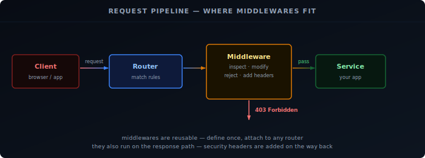
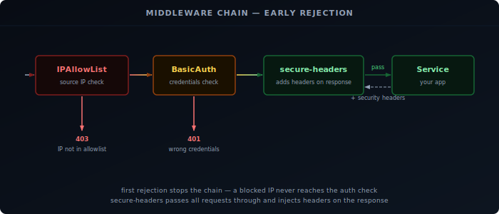

When a request reaches Traefik, it is matched against a router. Before that request is forwarded to your service, middlewares have a chance to inspect or modify it. A middleware can reject the request outright (wrong IP, missing credentials), rewrite headers, or add security headers to the response on the way back.

Middlewares are reusable — you define one and attach it to as many routers as you want. You never change the app itself.



## Prerequisites

- Traefik running — see the [installation guide][1]

## How Middlewares Work

Each middleware has two parts: a **definition** (what it does and how it is configured) and an **attachment** (which routers it applies to).

In Docker, both happen in labels on the service container. For bare metal, or when you want to share a middleware across many services, you define them once in a `conf.d/` file and reference them by name from any router.

Throughout this guide we use `lan-only`, `my-auth`, and `secure-headers` as the middleware names. You can name them anything — the name is just how Traefik identifies them internally.

## IPAllowList

IPAllowList lets requests through only if the source IP matches an allowed range. Everything else gets a 403 immediately, before the request reaches your service.

This is useful for services that should only be reachable from your home network — Grafana, Home Assistant, internal dashboards.

```yaml {filename="docker-compose.yml"}
labels:
  - "traefik.http.middlewares.lan-only.ipallowlist.sourcerange=192.168.0.0/16,127.0.0.1/32"
  - "traefik.http.routers.myapp.middlewares=lan-only"
```

For bare metal, or to reuse the middleware across multiple services, define it once in a shared file:

```yaml {filename="conf.d/middlewares.yml"}
http:
  middlewares:
    lan-only:
      ipAllowList:
        sourceRange:
          - "192.168.0.0/16"
          - "127.0.0.1/32"
```

Then reference it by name from any router config:

```yaml {filename="conf.d/myapp.yml"}
http:
  routers:
    myapp:
      rule: "Host(`myapp.example.com`)"
      entryPoints: [websecure]
      middlewares: [lan-only]
      service: myapp
      tls:
        certResolver: letsencrypt
```

## BasicAuth

BasicAuth adds a username/password prompt in the browser before the request reaches your service. The browser sends the credentials as a base64-encoded header on every request — Traefik checks the hash and either forwards or rejects.

This is a good fit for services that have no built-in login page, like Prometheus or a simple status page.

First, generate a hashed password with `htpasswd`:

```bash
sudo apt install apache2-utils
htpasswd -nb admin your-password
# admin:$apr1$xyz...
```

Copy the full output — you need the hash, not the plain password.

In Docker labels, every `$` in the hash must be escaped as `$$` because Docker interprets single `$` as a variable:

```yaml {filename="docker-compose.yml"}
labels:
  - "traefik.http.middlewares.my-auth.basicauth.users=admin:$$apr1$$xyz..."
  - "traefik.http.routers.myapp.middlewares=my-auth"
```

In dynamic config no escaping is needed — paste the hash directly:

```yaml {filename="conf.d/middlewares.yml"}
http:
  middlewares:
    my-auth:
      basicAuth:
        users:
          - "admin:$apr1$xyz..."
```

## Security Headers

Browsers trust a lot of content by default. Security headers are instructions you send back in the HTTP response that tell the browser to be stricter — don't load this page in an iframe, don't sniff the content type, only connect over HTTPS.

These headers protect your users even if someone finds a URL to one of your services.

Because there are many options and the values are long, defining them as Docker labels is impractical. Use a dynamic config file:

```yaml {filename="conf.d/middlewares.yml"}
http:
  middlewares:
    secure-headers:
      headers:
        stsSeconds: 31536000          # tell browsers to use HTTPS for 1 year
        stsIncludeSubdomains: true
        forceSTSHeader: true          # send HSTS even on plain HTTP responses
        contentTypeNosniff: true      # stop browsers guessing content types
        frameDeny: true               # block the page from loading in an iframe
        browserXssFilter: true        # enable browser XSS protection
        referrerPolicy: "strict-origin-when-cross-origin"
```

## Chaining

You can attach multiple middlewares to a single router. Traefik runs them in the order listed — if one rejects the request, the rest are skipped.

A sensible order for homelab use: filter by IP first (cheapest check), then require auth, then add headers on the way out.

In Docker labels, list them comma-separated:

```yaml {filename="docker-compose.yml"}
labels:
  - "traefik.http.routers.myapp.middlewares=lan-only,my-auth,secure-headers"
```

In dynamic config:

```yaml
http:
  routers:
    myapp:
      middlewares:
        - lan-only
        - my-auth
        - secure-headers
```



A request from outside your LAN is blocked by `lan-only` and never reaches `my-auth`. A request from inside with wrong credentials is blocked by `my-auth` and never reaches the service. Only a request that passes all checks gets through — and it arrives at your service with the security headers already attached to the response.

With `lan-only`, `my-auth`, and `secure-headers` defined, we can put them to use right away — starting with the Traefik dashboard itself.

## What the Dashboard Shows

The Traefik dashboard gives you a live view of everything Traefik has loaded — routers, services, middlewares, and entry points. It is the first place to check when a service is not routing correctly, and the API that powers it can be queried directly from the terminal.

The dashboard has four sections:

- **Routers** — every routing rule Traefik has loaded, with its current status (green = active, red = error)
- **Services** — the backends requests are forwarded to, including health check state
- **Middlewares** — all defined middlewares and which routers they are attached to
- **Entry Points** — the ports Traefik is listening on (typically `web :80` and `websecure :443`)

When a service is not routing, the dashboard tells you whether the router was picked up, whether the TLS certificate resolved, and whether a middleware is rejecting the request before it reaches the service.

## Initial Access

From the [installation guide][1], the dashboard is already available on `http://<server-ip>:8080` via `--api.insecure=true`. That is convenient for initial testing, but it exposes the API over plain HTTP with no authentication.

The better approach is to route the dashboard through Traefik itself — behind TLS and your existing middlewares.

## Securing the Dashboard

The dashboard is served by `api@internal`, a built-in Traefik service. You create a router that points to it and attach middlewares exactly as you would for any other service.

### Docker

Remove `--api.insecure=true` from your command flags and add a router via labels on the Traefik container itself:

```yaml {filename="docker-compose.yml"}
command:
  - "--api=true"
  - "--api.dashboard=true"
  # remove: --api.insecure=true
  # ... rest of your existing flags

labels:
  - "traefik.enable=true"
  - "traefik.http.routers.dashboard.rule=Host(`traefik.example.com`)"
  - "traefik.http.routers.dashboard.entrypoints=websecure"
  - "traefik.http.routers.dashboard.tls=true"
  - "traefik.http.routers.dashboard.tls.certresolver=le"
  - "traefik.http.routers.dashboard.service=api@internal"
  - "traefik.http.routers.dashboard.middlewares=lan-only,my-auth"
```

Replace `traefik.example.com` with your domain and point a DNS record to your server.

### Bare Metal

Add a dynamic config file for the dashboard router. The rule must cover both `/api` and `/dashboard` path prefixes — the dashboard UI calls the API internally:

```yaml {filename="conf.d/dashboard.yml"}
http:
  routers:
    dashboard:
      rule: "Host(`traefik.example.com`) && (PathPrefix(`/api`) || PathPrefix(`/dashboard`))"
      entryPoints: [websecure]
      middlewares: [lan-only, my-auth]
      service: api@internal
      tls:
        certResolver: letsencrypt
```

Update your static config to disable insecure mode:

```yaml {filename="/etc/traefik/traefik.yml"}
api:
  dashboard: true
  insecure: false
```

Restart Traefik to apply:

```bash
sudo systemctl restart traefik
```

## Querying the API

The API is available under the same domain as the dashboard and accepts the same BasicAuth credentials:

```bash
# list all HTTP routers
curl -s -u admin:your-password https://traefik.example.com/api/http/routers | jq

# list all HTTP services
curl -s -u admin:your-password https://traefik.example.com/api/http/services | jq

# list all middlewares
curl -s -u admin:your-password https://traefik.example.com/api/http/middlewares | jq
```

## Further Reading

The three middlewares above cover the most common homelab needs, but Traefik has many more — rate limiting, redirects, compression, and request rewriting among them. The full list is in the [Traefik middleware documentation][2]. The full API endpoint reference is in the [Traefik API documentation][3].

[1]: 
[2]: https://doc.traefik.io/traefik/middlewares/http/overview/
[3]: https://doc.traefik.io/traefik/operations/api/
