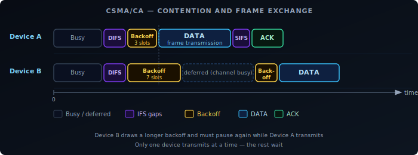
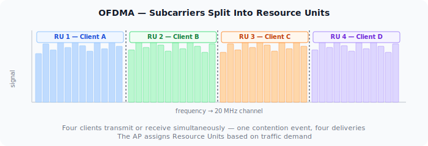

WiFi is a shared medium. Every device on the same channel uses the same slice of radio spectrum, and only one device can transmit at a time without causing a collision. Managing who gets to transmit — and when — is the job of the MAC layer. For the first 25+ years of WiFi, that meant CSMA/CA. WiFi 6 changed the model with OFDMA.

## CSMA/CA: Listen Before You Talk

The core rule of WiFi access: before transmitting, a device listens to check if the channel is busy. If it is, the device waits. If it's clear, the device waits a random backoff period to reduce the chance of simultaneous transmissions from multiple waiting devices, then transmits.

The backoff is drawn from a **contention window**: a range of slot times from which each device picks a random number. After successfully transmitting, the contention window resets. After a collision, both devices back off again with a larger window — this is binary exponential backoff.

The structure around every data frame is fixed overhead:

1. **DIFS** — Distributed Inter-Frame Space. A mandatory idle period before any frame.
2. **Backoff** — A random number of idle slots from the contention window.
3. **DATA** — The actual frame.
4. **SIFS** — Short Inter-Frame Space. A shorter gap before the ACK.
5. **ACK** — The receiver confirms delivery.

At low client counts, this overhead is manageable. At high client counts, devices spend more time waiting than transmitting. The channel is mostly idle — not because there's no traffic, but because all devices are in their backoff period simultaneously.

## EDCA: QoS Queues on Top of CSMA/CA

The CSMA/CA description above is DCF (Distributed Coordination Function) — the baseline access mechanism. All modern WiFi (since 802.11e, now part of every WiFi 4+ device) runs EDCA (Enhanced Distributed Channel Access), which layers four priority queues on top of DCF.

Instead of a single contention window for all traffic, EDCA defines four **Access Categories (ACs)**, each with its own AIFSN (Arbitration Inter-Frame Space Number) and contention window size:

| Access Category | Traffic type | AIFSN | CWmin | CWmax |
|----------------|-------------|-------|-------|-------|
| AC_VO (Voice) | VoIP, real-time audio | 2 | 3 | 7 |
| AC_VI (Video) | Video streaming | 2 | 7 | 15 |
| AC_BE (Best Effort) | Default — web, data | 3 | 15 | 1023 |
| AC_BK (Background) | Bulk transfers, backups | 7 | 15 | 1023 |

A lower AIFSN means a shorter mandatory idle period before the backoff starts. A smaller CWmin means a shorter average backoff. Both together give high-priority queues a statistical advantage in winning channel access over lower-priority traffic.

The DIFS described in the CSMA/CA section is the inter-frame space for AC_BE (best effort) in the default configuration. Voice and video traffic use AIFS[AC_VO] and AIFS[AC_VI], which are shorter — they get to start their backoff sooner.

In practice: on a congested network, a VoIP packet waits less than a file download packet for the same channel. The mechanism is probabilistic, not a hard reservation, but it is effective at keeping latency down for time-sensitive traffic.

## The Hidden Node Problem

CSMA/CA assumes every device can hear every other device on the channel. In practice, two clients may both be in range of the AP but out of range of each other. Both sense the channel as idle simultaneously and transmit, causing a collision at the AP that neither device could have predicted.

This is the hidden node problem. The standard fix is **RTS/CTS**: the sending device transmits a short Request-to-Send frame; the AP responds with Clear-to-Send; all devices that hear either frame defer. The collision potential is contained to two small control frames rather than full data frames.

RTS/CTS adds overhead for every exchange, so it's typically enabled only for large frames — small frames aren't worth the extra roundtrip. But when hidden nodes are causing repeated collisions and retransmissions, it's the right tool.

## OFDM: One Channel, Many Subcarriers

Before OFDMA, it helps to understand OFDM — the modulation that all modern WiFi (802.11a onwards) uses.

Rather than using the channel as a single wideband carrier, OFDM divides it into many narrow, closely-spaced subcarriers. Each subcarrier is modulated independently, carrying a portion of the data stream. The subcarriers are mathematically orthogonal — they don't interfere with each other despite overlapping in frequency.

The practical benefit is resilience. A single wideband carrier is vulnerable to frequency-selective fading: interference or attenuation at specific frequencies damages the entire signal. With OFDM, a fade at one frequency affects only a few subcarriers; the rest continue unaffected.

But in pre-WiFi 6 OFDM, all subcarriers still go to one device per transmission. The channel is shared between devices using CSMA/CA. One device wins the channel, uses all the subcarriers, finishes, and the contention cycle starts again.

## OFDMA: Splitting the Channel Between Devices

OFDMA is OFDM with per-device subcarrier allocation. Instead of assigning all subcarriers to one device per transmission, the AP groups subcarriers into **Resource Units (RUs)** and assigns different RUs to different clients simultaneously.

A 20 MHz channel in WiFi 6 can be divided into RUs as small as 26 subcarriers, allowing up to 9 devices to transmit or receive in parallel on that channel. Wider channels support more simultaneous users.

**Downlink OFDMA**: The AP transmits to multiple clients in the same TXOP (transmission opportunity), each using their own RU. One contention event, many deliveries.

**Uplink OFDMA**: The AP sends a **Trigger Frame** to schedule which clients transmit on which RUs and when. Clients transmit simultaneously on their assigned RUs. The AP coordinates uplink access instead of leaving it to per-device CSMA/CA contention.

## A-MPDU: Filling the TXOP

OFDMA addresses the contention problem at scale — many devices sharing the channel. But there is an equally important mechanism for single-device throughput: **A-MPDU** (Aggregated MAC Protocol Data Unit), available since 802.11n.

The core idea: once a device wins channel access, it doesn't have to send one frame and go back to contention. It can fill the entire TXOP with a burst of aggregated frames bundled into a single physical transmission.

- A single A-MPDU can carry up to 64 sub-frames in 802.11n, and up to 256 in 802.11ac and 802.11ax.
- Each sub-frame carries its own sequence number. The receiver sends a **Block ACK** with a bitmap indicating which sub-frames were received and which need retransmission.
- Lost sub-frames are selectively retransmitted — without re-winning the channel for each retry.

The result: the CSMA/CA overhead described earlier (DIFS + backoff + ACK) is paid once per aggregated burst, not once per frame. At 802.11ax rates on a 80 MHz channel, a single TXOP can move hundreds of kilobytes. CSMA/CA overhead becomes nearly irrelevant for single-client throughput.

This is why modern WiFi can achieve close to its theoretical throughput on a clear channel even with CSMA/CA in place. The contention mechanism protects shared access but doesn't throttle performance when a device has exclusive access to the channel.

A-MPDU and OFDMA address different layers of the same problem: A-MPDU maximises throughput per device per TXOP; OFDMA maximises how many devices are served per TXOP.

## OFDMA vs CSMA/CA: Where It Helps

OFDMA does not replace CSMA/CA. The AP still uses CSMA/CA to win the channel, but once it holds the TXOP, it can serve multiple clients within that single window. The contention problem is reduced, not eliminated.

| Scenario | CSMA/CA | OFDMA |
|----------|---------|-------|
| Many small frames (IoT, VoIP, ACKs) | High overhead — each tiny frame triggers a full contention cycle | Low overhead — multiple clients served per TXOP |
| Few large transfers (file download) | Efficient — client holds the channel for the full transfer | No benefit — one client already uses the whole channel |
| Dense deployments (offices, venues) | Contention scales poorly with client count | Parallelism reduces per-client wait time |
| Legacy clients | Fully supported | Requires WiFi 6 on both AP and client; older clients fall back to CSMA/CA |

## What This Means in Practice

**IoT-heavy networks** are where OFDMA delivers the clearest benefit. Dozens of devices sending small packets — sensor readings, status updates, ACKs — each triggering a full CSMA/CA contention cycle is exactly the problem OFDMA was designed to solve. With uplink OFDMA, the AP schedules many of those transmissions into a single coordinated window.

**Home networks with a handful of devices** won't see dramatic gains. When client count is low and traffic is light, CSMA/CA overhead isn't the bottleneck. OFDMA is there, and it helps at the margins, but it's not the reason to upgrade.

**Dense enterprise and venue deployments** — conference halls, open-plan offices, stadiums — are the design target. High client count, bursty traffic, many concurrent small transactions. OFDMA directly addresses why these environments historically performed poorly even with fast APs.

**Client support determines whether OFDMA is used**. Both the AP and the client must support WiFi 6. A WiFi 5 client connecting to a WiFi 6 AP gets OFDM + CSMA/CA, which is still fast — the AP handles the fallback transparently.

