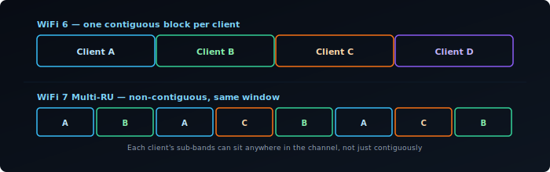
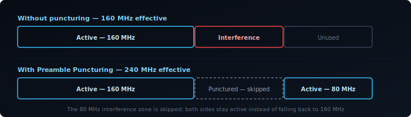
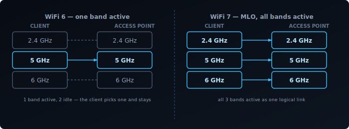
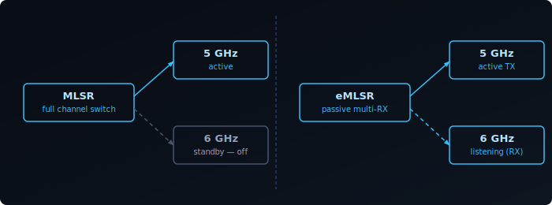
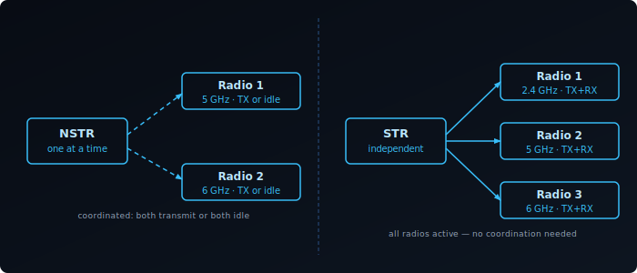
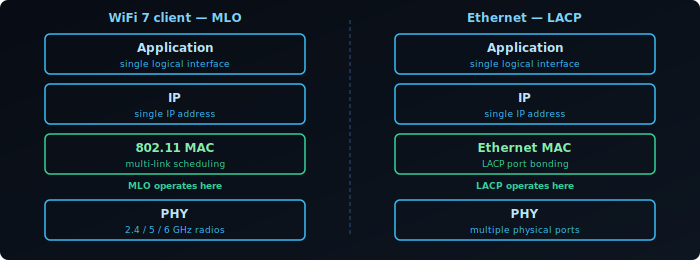

Every WiFi generation before 802.11be improved throughput mainly by making individual links faster — wider channels, more spatial streams, better modulation. WiFi 7 does that too, but it also changes how a client uses spectrum in the first place: **Multi-RU** and **Preamble Puncturing** make wide channels usable even when part of the spectrum is occupied, and **Multi-Link Operation (MLO)** lets a client maintain simultaneous connections across multiple bands instead of picking one and staying on it.

## Multi-RU: WiFi 7's Flexible Spectrum Allocation

WiFi 6 OFDMA assigns each client a single contiguous Resource Unit — a fixed block of subcarriers within the channel. This works well when the channel is clean, but it creates a constraint: clients must fit into the fixed blocks the AP carves out. Gaps between differently-sized clients waste spectrum.

WiFi 7 (802.11be) introduces **Multi-RU assignment**: a single client can be assigned multiple Resource Units that are non-contiguous within the same channel. The AP can place those RUs anywhere across the spectrum — they don't have to be adjacent.

Two key benefits follow from this:

- **Better spectrum efficiency.** The AP fills the channel more completely by mixing RU sizes across clients. A client needing 40 MHz can receive two 20 MHz RUs that happen to be on opposite sides of the channel, rather than requiring a contiguous 40 MHz block.
- **Works around localised interference.** If a portion of the spectrum has interference on a specific sub-band, that segment can be left unassigned while both sides of it remain productive. This pairs directly with Preamble Puncturing (below).

Multi-RU is negotiated through the same Trigger Frame mechanism as WiFi 6 OFDMA, extended to carry per-client RU lists rather than single RU assignments. The AP is in full control of the allocation — the client receives exactly the sub-bands the Trigger Frame specifies.

## Preamble Puncturing: Wide Channels Around Interference

WiFi 7's maximum channel width is 320 MHz. In practice, finding 320 MHz of contiguous clean spectrum is rare — radar systems, neighbouring APs, or legacy devices may occupy part of that range. In WiFi 6, the only response is to fall back to a narrower channel that avoids the interference entirely. A 320 MHz channel with 80 MHz of interference becomes a 160 MHz channel.

WiFi 7 adds **Preamble Puncturing**: the ability to mark specific 20 MHz sub-channels within a wide channel as inactive, while transmitting normally on the rest. The mechanism sits in the preamble — the header at the start of every WiFi 7 frame. The preamble carries a bitmap indicating which 20 MHz sub-channels are active and which are punctured. Receiving devices read the bitmap and ignore the punctured sub-channels.

The result: a 320 MHz channel with 80 MHz of interference becomes a 240 MHz active channel rather than a 160 MHz fallback. The throughput difference between 240 MHz and 160 MHz is significant.

Puncturing is not arbitrary. The standard defines valid puncturing patterns — typically edge or fixed-position 20 MHz or 40 MHz segments. You can't punch a hole in any random position. In practice, this covers the common cases: radar avoidance on a DFS sub-band, a legacy network on an adjacent portion, or intermittent interference at the edge of the channel.

**Preamble Puncturing is most useful in:**
- 6 GHz deployments where 320 MHz channels are practical but partial congestion exists
- DFS environments where a radar detection on one sub-band would otherwise force the whole channel down
- Coexistence scenarios where a neighbouring legacy network occupies a fixed portion of the spectrum

## WiFi 7 Spectrum Features Together

Multi-RU and Preamble Puncturing address different problems but work as a system. Puncturing carves out the unusable sub-bands from the channel. Multi-RU then fills the remaining usable sub-bands efficiently by assigning non-contiguous RUs across multiple clients. A single 320 MHz channel with one 80 MHz interference zone can still serve multiple clients simultaneously across the clean 240 MHz — all within one TXOP, coordinated by the AP.

## Multi-Link Operation: One Client, Multiple Bands at Once

Multi-RU and Preamble Puncturing make better use of the spectrum within a single band. WiFi 7's other headline feature works at a different layer entirely: **Multi-Link Operation (MLO)** lets a client and AP maintain simultaneous connections across multiple bands and use them as a single logical link, instead of picking one band and staying on it.

### The Problem Before MLO

A WiFi 6 client connected to a tri-band AP is still on one band at a time. If it's on 5GHz and that band gets congested, the client either stays and degrades, or roams to 6GHz — a process that takes time and interrupts traffic. The AP can't split a single flow across bands, and the client can't receive on 2.4GHz while transmitting on 5GHz.

Band steering and load balancing are workarounds for this: the AP nudges clients between bands based on load. But the client always has one radio active per connection.

MLO eliminates that constraint.

### What MLO Does

With MLO, a client and AP negotiate a multi-link setup during association. Instead of one link, they establish multiple — one per band. These operate under a single MAC address and appear to the upper layers as one connection.

The AP and client can then:

- **Transmit and receive on multiple links simultaneously** — independent data streams on each band.
- **Distribute frames across links dynamically** — pick the least congested or lowest-latency link per packet.
- **Maintain redundancy** — if one link degrades, traffic shifts to the others without a roam event.

The result is lower latency (always use the best available path), higher aggregate throughput (multiple channels active simultaneously), and better reliability.

There is a common misconception that MLO is a single feature that either works or doesn't. In practice, MLO is a family of modes — and an AP and a client device can both advertise WiFi 7 with MLO support while using entirely different modes. The mode with the highest capability, STR, is rarely found on client devices: fitting multiple fully isolated radios into a thin laptop or phone is a genuine hardware challenge, and running them all simultaneously carries a real battery cost. Most client devices implement eMLSR instead, which delivers MLO's latency benefits at much lower power and hardware cost. Understanding which mode a device actually uses matters more than whether it supports MLO at all.

### The Main MLO Modes

Not all MLO is equal. The standard defines four operating modes based on hardware capability, ordered here from simplest to most capable.

#### MLSR — Multi-Link Single Radio

The baseline MLO mode. The device uses a single radio that can only be tuned to one channel at a time and must perform a full channel switch when moving between links. It cannot monitor multiple links simultaneously, and switching decisions are reactive — the device has no visibility of a secondary link while its radio is parked on another.

MLSR enables basic multi-link functionality such as link fallback and simple load distribution, but the switching overhead limits how quickly it can react to changing conditions. It is primarily a baseline implementation for devices with strict cost or hardware constraints.

#### eMLSR — Enhanced Multi-Link Single Radio

eMLSR uses a single transmit radio like MLSR, but adds multiple receive chains that can passively listen on more than one band at the same time. The radio can monitor several links simultaneously for incoming frames and switch its transmit path to whichever link has pending traffic, without waiting for a full channel scan. This is the key improvement over MLSR: eMLSR never loses sight of secondary links while the transmitter is elsewhere, so it reacts to incoming traffic much faster.

eMLSR doesn't deliver parallel throughput — only one link carries active data at a time. But its ability to listen on multiple bands simultaneously gives it noticeably better latency than MLSR, at similar hardware cost. It's the primary MLO mode for power-constrained devices like phones and laptops. See the diagram above for how eMLSR's passive listening compares to MLSR's full channel switch.

#### NSTR — Non-Simultaneous Transmit and Receive

NSTR introduces a second radio, but with a constraint: the device cannot transmit on one link while receiving on another simultaneously. The transmit signal from one radio leaks into the receive chain of the other — a hardware limitation that RF isolation alone can't fully solve. To avoid this, the protocol coordinates both links so that neither is receiving while the other is transmitting: both transmit together, or both are idle.

NSTR provides better channel utilization, dynamic load distribution, and redundancy compared to single-radio modes. But throughput gains are lower than STR because the two links can't independently carry bidirectional traffic at the same time.

#### STR — Simultaneous Transmit and Receive

The device has independent radios for each band and can transmit on one while receiving on another simultaneously — with no coordination constraint between links. This is the highest-capability single-mode and delivers the full MLO benefit: true concurrent use of all links.

The constraint is RF isolation. If the 2.4GHz and 5GHz radios are physically too close, transmitting on one can interfere with reception on the other. STR requires that the AP and client hardware achieve adequate isolation between bands — a non-trivial design challenge, especially for thin client devices. See the diagram above for how STR's fully independent radios compare to NSTR's coordinated pair.

### Mode Comparison

| Mode | Radios required | Concurrent TX/RX | Throughput gain | Latency gain |
|------|----------------|------------------|-----------------|--------------|
| MLSR | Single | No | Low | Low |
| eMLSR | Single | No | Low | Medium |
| NSTR | Multiple (coordinated) | No | Medium | Medium |
| STR | Multiple (isolated) | Yes | High | High |

These four modes are the ones formally defined in the 802.11be amendment. In practice, higher-end multi-radio devices may implement smarter link scheduling and dynamic traffic steering on top of STR — adapting in real time to RF conditions, prioritising latency-sensitive flows, and steering frames across links — but this is vendor firmware territory rather than a distinct standard mode.

### What MLO Requires

MLO is not backwards compatible at the protocol level. Both the AP and the client must support WiFi 7 and negotiate MLO during association. A WiFi 7 AP provides no MLO benefit to a WiFi 6 client — that client connects on a single link as usual.

On the infrastructure side, the AP needs hardware capable of managing multi-link associations: coordinating frame scheduling across bands, maintaining per-link block-ack agreements, and presenting a unified MAC to the client. This is more complex than a standard tri-band AP.

On the client side, driver and firmware maturity matters. Early WiFi 7 devices have shipped with incomplete MLO implementations — some advertise STR capability but fall back to NSTR or single-link in practice due to firmware limitations. Checking vendor release notes for MLO-specific fixes is worthwhile.

### MLO vs. Link Aggregation

MLO operates at the 802.11 MAC layer. It is not the same as 802.3ad link aggregation (LACP), which bonds multiple Ethernet ports. MLO is specific to the wireless association between a client and an AP — it's invisible to the IP layer above it.

From the perspective of the OS and applications, an MLO connection is a single network interface with a single IP address. The multi-link coordination happens below that level.

### Real-World Status

As of 2025-2026, WiFi 7 APs from major vendors (UniFi, TP-Link BE series, Netgear Orbi 970) support MLO. Client support is growing: recent Qualcomm and MediaTek chipsets implement it, and it's present in newer laptops and phones with WiFi 7 adapters.

The areas to watch:

- **eMLSR support on mobile** — Important for battery-powered devices. Support is arriving but not universal.
- **STR in thin clients** — RF isolation is a genuine hardware challenge. Some devices claiming STR operate in NSTR in practice.
- **Driver maturity on Linux** — Linux WiFi 7 / MLO support has improved rapidly in kernel 6.x but is still catching up to the Windows and macOS stacks.

MLO's practical impact will grow as client support matures. The AP side is largely ready — the constraint now is the client device installed base.
