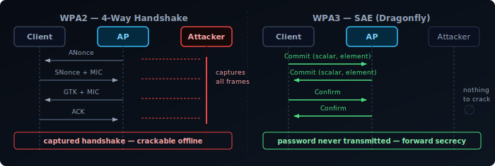
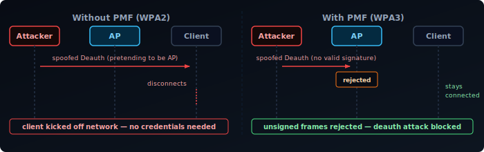

WPA3 has been around since 2018, but most people enabled it because their router's UI said to — without knowing what actually changed. Some of the improvements are subtle, some are significant, and a few things WPA3 is assumed to fix it doesn't. This post covers the four main components: SAE (the new handshake), PMF (protected management frames), OWE (open network encryption), and the Enterprise 192-bit mode — plus where WPA3 still falls short.

## What Was Wrong with WPA2

WPA2-Personal uses a Pre-Shared Key (PSK): a password known to both the AP and the client. The 4-way handshake that authenticates a client can be captured passively — you don't need to be on the network or even interact with it. Once you have the handshake, you can run a dictionary or brute-force attack against it offline, at GPU speed, with no rate limiting.

Two attacks made this concrete:

- **KRACK (2017)** — Key Reinstallation Attack. A flaw in the 4-way handshake implementation allowed an attacker to force nonce reuse, breaking encryption for active sessions.
- **PMKID attack (2018)** — An attacker can request a single PMKID frame from an AP without a client being present, then crack the PSK offline. No handshake capture required.

Both attacks share the same root problem: the PSK is a static secret, and any captured material can be attacked indefinitely after the fact.

## SAE: Simultaneous Authentication of Equals

SAE replaces the PSK-based 4-way handshake with a Password Authenticated Key Exchange (PAKE) called the Dragonfly handshake (defined in RFC 7664). The key properties:

- **The password is never transmitted.** Both sides prove they know the password without revealing it. An attacker capturing the exchange gets nothing crackable.
- **Forward secrecy.** A unique session key is derived per connection. Capturing today's traffic and cracking the password later doesn't decrypt it — the session key is gone.
- **Commit-Confirm structure.** Both sides exchange commit frames (deriving a shared secret from the password and random values), then confirm frames (proving both arrived at the same secret). Neither side can complete authentication without knowing the password.

This directly kills the PMKID and handshake-capture attacks. Offline cracking is no longer possible because there's nothing to crack.

SAE does have one known weakness: **Dragonblood (2019)** — a timing and cache side-channel that could leak information about the password under specific conditions. The root cause was the original password derivation method, which had variable execution time that could be measured by an attacker. This was fixed in WPA3 Release 2 (2020) with **Hash-to-Element (H2E)**: a constant-time derivation that removes the timing signal entirely. Most current APs and clients default to H2E, but older firmware may still fall back to the original method.

## PMF: Protected Management Frames

Management frames (probe requests, authentication, association, deauthentication) were never encrypted in WPA2. An attacker could send a spoofed deauthentication frame to any client, forcing it off the network — no credentials needed. This is the basis of deauth attacks used in everything from wifi jammers to evil twin setups.

WPA3 mandates PMF (802.11w). Management frames are now cryptographically protected:

- **Deauth and disassoc frames** are signed, so a spoofed frame from an attacker is rejected.
- **Unicast management frames** are encrypted between client and AP.
- **Broadcast management frames** use a group key to prevent spoofing.

PMF was optional in WPA2 (and widely ignored). Making it mandatory in WPA3 removes a class of denial-of-service attacks that have existed since the beginning of wifi.

## OWE: Opportunistic Wireless Encryption

Open networks (coffee shops, hotels, airports) have always been unencrypted. Everyone on the network shares the same encryption key — which is nothing. Any device on the network can read any other device's traffic.

OWE (RFC 8110) addresses this without requiring a password. During association, the client and AP perform a Diffie-Hellman exchange and derive a unique per-client session key. The network is still "open" from a user perspective — no password prompt — but each client's traffic is encrypted with a key only that client and the AP know.

OWE doesn't provide authentication. You still don't know if you're on the legitimate AP or an evil twin. But it eliminates passive sniffing by other clients on the same network, which is the most common threat on open networks.

## FILS: Fast Initial Link Setup

OWE improves open networks; FILS (802.11ai, included in WPA3 certification) improves how fast devices reconnect to networks they already know.

On 802.1X/RADIUS enterprise networks, a full EAP exchange on every reconnect adds 300–500 ms before traffic can flow. For a phone moving between APs in a large building, this latency is noticeable on VoIP calls and video streams. FILS shortens this significantly for returning clients:

- The first association is a full EAP exchange. FILS derives and caches a **FILS key** from that session.
- On subsequent associations to any AP in the same mobility domain, the client presents the cached FILS key material. Most of the EAP exchange is skipped.
- Authentication completes in 1–2 RTTs rather than a multi-step EAP ladder.

FILS is most relevant in high-density environments — stadiums, hospitals, transit hubs — where many devices reconnect frequently and 802.1X is already in use. It requires support on both the AP and the RADIUS server/supplicant stack. Adoption is narrower than SAE or PMF because it only matters for enterprise networks with 802.1X, not for home WPA3-Personal deployments.

## WPA3-Enterprise

WPA3-Personal (SAE) is for home and small business use. WPA3-Enterprise targets environments that already use 802.1X authentication (RADIUS) and adds a 192-bit security suite:

- **AES-256-GCMP** for data encryption (up from AES-128-CCMP in WPA2-Enterprise)
- **HMAC-SHA-384** for key derivation
- **ECDHE and ECDSA** with 384-bit elliptic curves for key exchange and authentication

This is aimed at high-security environments: government, financial, healthcare. For most corporate networks still using WPA2-Enterprise with proper EAP methods (EAP-TLS), the practical security difference is minimal.

## Transition Mode

Most modern APs support WPA2/WPA3 transition mode — the same SSID accepts both WPA2 and WPA3 clients simultaneously. This is necessary during the years-long period where device support is mixed.

The tradeoff: in transition mode, the network must still support WPA2 to accommodate older clients. An attacker can attempt to downgrade a WPA3-capable client to WPA2 by interfering with the negotiation. This is harder with PMF enabled (since deauth spoofing is blocked), but it reduces the security guarantee compared to a WPA3-only network.

One specific risk worth naming: WPA2 clients on the same SSID are still vulnerable to the PMKID attack. An attacker targeting those clients doesn't need to engage the WPA3 clients at all — the same shared password is exposed through the WPA2 material. Transition mode keeps the full WPA2 attack surface alive alongside WPA3.

A WPA3-only network gives the full benefit. Transition mode is a practical compromise.

## What WPA3 Doesn't Fix

| Problem | WPA3 helps? | Why not |
|---------|-------------|---------|
| Weak passwords | No | SAE raises the cost of cracking, but a short password is still guessable |
| Evil twin / rogue AP | No | SAE proves both sides know the password, but anyone who knows the password can impersonate the AP. There is no certificate-based identity. |
| Client implementation bugs | No | Dragonblood showed correct-spec implementations can still have exploitable side-channels |
| Traffic analysis | No | Metadata — timing, packet sizes, destinations — is still visible regardless of encryption |
| Insider threats | No | Anyone with the password can still observe their own session traffic |

WPA3 solves the offline cracking and deauth spoofing problems well. It doesn't solve phishing, misconfigured networks, or weak passwords.

## WPA2 vs WPA3 at a Glance

| Feature | WPA2-Personal | WPA3-Personal |
|---------|--------------|--------------|
| Key exchange | PSK 4-way handshake | SAE (Dragonfly) |
| Offline cracking | Possible from captured handshake | Not possible |
| Forward secrecy | No | Yes |
| Management frame protection | Optional (802.11w) | Mandatory |
| Open network encryption | No | OWE (optional) |
| Minimum password requirement | None | None (but harder to crack) |
| Password element derivation | Hunting-and-pecking | H2E (mandatory since WPA3 R2) |
