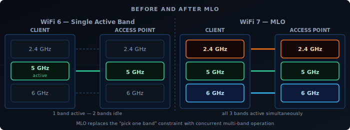
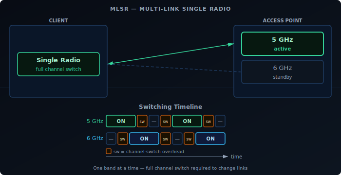
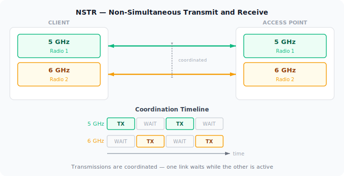
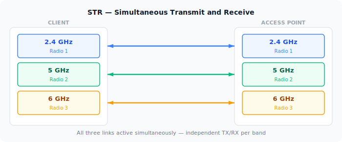
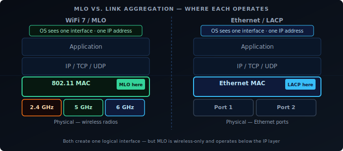
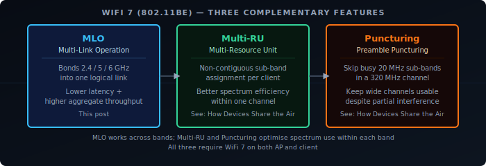

Every WiFi generation since 802.11a has improved throughput by making individual links faster — wider channels, more spatial streams, better modulation. WiFi 7 (802.11be) does that too, but it also changes something more fundamental: a device no longer has to pick one band and stay on it. Multi-Link Operation lets a client and AP maintain simultaneous connections across multiple bands and use them as a single logical link.

## The Problem Before MLO

A WiFi 6 client connected to a tri-band AP is still on one band at a time. If it's on 5GHz and that band gets congested, the client either stays and degrades, or roams to 6GHz — a process that takes time and interrupts traffic. The AP can't split a single flow across bands, and the client can't receive on 2.4GHz while transmitting on 5GHz.

Band steering and load balancing are workarounds for this: the AP nudges clients between bands based on load. But the client always has one radio active per connection.

MLO eliminates that constraint.

## What MLO Does

With MLO, a client and AP negotiate a multi-link setup during association. Instead of one link, they establish multiple — one per band. These operate under a single MAC address and appear to the upper layers as one connection.

The AP and client can then:

- **Transmit and receive on multiple links simultaneously** — independent data streams on each band.
- **Distribute frames across links dynamically** — pick the least congested or lowest-latency link per packet.
- **Maintain redundancy** — if one link degrades, traffic shifts to the others without a roam event.

The result is lower latency (always use the best available path), higher aggregate throughput (multiple channels active simultaneously), and better reliability.

There is a common misconception that MLO is a single feature that either works or doesn't. In practice, MLO is a family of modes — and an AP and a client device can both advertise WiFi 7 with MLO support while using entirely different modes. The mode with the highest capability, STR, is rarely found on client devices: fitting multiple fully isolated radios into a thin laptop or phone is a genuine hardware challenge, and running them all simultaneously carries a real battery cost. Most client devices implement eMLSR instead, which delivers MLO's latency benefits at much lower power and hardware cost. Understanding which mode a device actually uses matters more than whether it supports MLO at all.

## The Main MLO Modes

Not all MLO is equal. The standard defines five operating modes based on hardware capability, ordered here from simplest to most capable.

### MLSR — Multi-Link Single Radio

The baseline MLO mode. The device uses a single radio that can only be tuned to one channel at a time and must perform a full channel switch when moving between links. It cannot monitor multiple links simultaneously, and switching decisions are reactive — the device has no visibility of a secondary link while its radio is parked on another.

MLSR enables basic multi-link functionality such as link fallback and simple load distribution, but the switching overhead limits how quickly it can react to changing conditions. It is primarily a baseline implementation for devices with strict cost or hardware constraints.

### eMLSR — Enhanced Multi-Link Single Radio

eMLSR uses a single transmit radio like MLSR, but adds multiple receive chains that can passively listen on more than one band at the same time. The radio can monitor several links simultaneously for incoming frames and switch its transmit path to whichever link has pending traffic, without waiting for a full channel scan. This is the key improvement over MLSR: eMLSR never loses sight of secondary links while the transmitter is elsewhere, so it reacts to incoming traffic much faster.

eMLSR doesn't deliver parallel throughput — only one link carries active data at a time. But its ability to listen on multiple bands simultaneously gives it noticeably better latency than MLSR, at similar hardware cost. It's the primary MLO mode for power-constrained devices like phones and laptops.

### NSTR — Non-Simultaneous Transmit and Receive

NSTR introduces a second radio, but with a constraint: the device cannot transmit on one link while receiving on another simultaneously. The transmit signal from one radio leaks into the receive chain of the other — a hardware limitation that RF isolation alone can't fully solve. To avoid this, the protocol coordinates both links so that neither is receiving while the other is transmitting: both transmit together, or both are idle.

NSTR provides better channel utilization, dynamic load distribution, and redundancy compared to single-radio modes. But throughput gains are lower than STR because the two links can't independently carry bidirectional traffic at the same time.

### STR — Simultaneous Transmit and Receive

The device has independent radios for each band and can transmit on one while receiving on another simultaneously — with no coordination constraint between links. This is the highest-capability single-mode and delivers the full MLO benefit: true concurrent use of all links.

The constraint is RF isolation. If the 2.4GHz and 5GHz radios are physically too close, transmitting on one can interfere with reception on the other. STR requires that the AP and client hardware achieve adequate isolation between bands — a non-trivial design challenge, especially for thin client devices.

## Mode Comparison

| Mode | Radios required | Concurrent TX/RX | Throughput gain | Latency gain |
|------|----------------|------------------|-----------------|--------------|
| MLSR | Single | No | Low | Low |
| eMLSR | Single | No | Low | Medium |
| NSTR | Multiple (coordinated) | No | Medium | Medium |
| STR | Multiple (isolated) | Yes | High | High |

These four modes are the ones formally defined in the 802.11be amendment. In practice, higher-end multi-radio devices may implement smarter link scheduling and dynamic traffic steering on top of STR — adapting in real time to RF conditions, prioritising latency-sensitive flows, and steering frames across links — but this is vendor firmware territory rather than a distinct standard mode.

## What MLO Requires

MLO is not backwards compatible at the protocol level. Both the AP and the client must support WiFi 7 and negotiate MLO during association. A WiFi 7 AP provides no MLO benefit to a WiFi 6 client — that client connects on a single link as usual.

On the infrastructure side, the AP needs hardware capable of managing multi-link associations: coordinating frame scheduling across bands, maintaining per-link block-ack agreements, and presenting a unified MAC to the client. This is more complex than a standard tri-band AP.

On the client side, driver and firmware maturity matters. Early WiFi 7 devices have shipped with incomplete MLO implementations — some advertise STR capability but fall back to NSTR or single-link in practice due to firmware limitations. Checking vendor release notes for MLO-specific fixes is worthwhile.

## MLO vs. Link Aggregation

MLO operates at the 802.11 MAC layer. It is not the same as 802.3ad link aggregation (LACP), which bonds multiple Ethernet ports. MLO is specific to the wireless association between a client and an AP — it's invisible to the IP layer above it.

From the perspective of the OS and applications, an MLO connection is a single network interface with a single IP address. The multi-link coordination happens below that level.

## Real-World Status

As of 2025-2026, WiFi 7 APs from major vendors (UniFi, TP-Link BE series, Netgear Orbi 970) support MLO. Client support is growing: recent Qualcomm and MediaTek chipsets implement it, and it's present in newer laptops and phones with WiFi 7 adapters.

The areas to watch:

- **eMLSR support on mobile** — Important for battery-powered devices. Support is arriving but not universal.
- **STR in thin clients** — RF isolation is a genuine hardware challenge. Some devices claiming STR operate in NSTR in practice.
- **Driver maturity on Linux** — Linux WiFi 7 / MLO support has improved rapidly in kernel 6.x but is still catching up to the Windows and macOS stacks.

MLO's practical impact will grow as client support matures. The AP side is largely ready — the constraint now is the client device installed base.

## WiFi 7 in Full: MLO, Multi-RU, and Preamble Puncturing

MLO is WiFi 7's headline feature, but it works alongside two other spectrum improvements that together make 320 MHz channels practical:

**Multi-RU** extends OFDMA so a single client can receive on multiple non-contiguous Resource Units within one channel — filling spectrum more efficiently than WiFi 6's fixed contiguous blocks.

**Preamble Puncturing** lets an AP skip specific 20 MHz sub-channels within a wide channel when they're occupied by interference or radar, keeping the rest of the channel active instead of falling back to a narrower width.

The three features address different layers of the same problem: MLO bonds multiple bands into one logical link, Multi-RU fills each band's spectrum efficiently, and Puncturing keeps wide channels usable despite partial interference.

For the full explanation of Multi-RU and Preamble Puncturing, see [How Devices Share the Air](/posts/2026-04-30-wifi-explained-medium) in this series.
