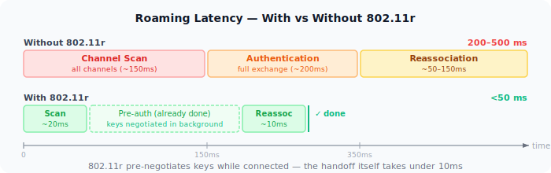
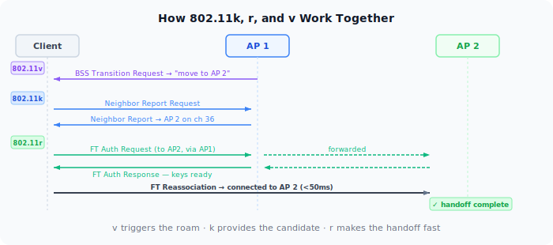
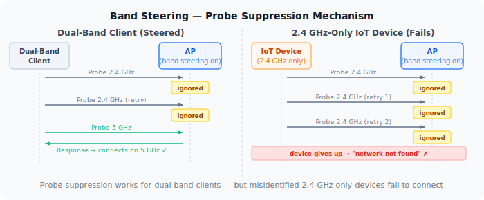
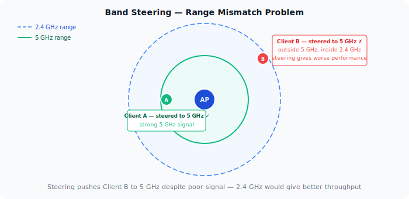
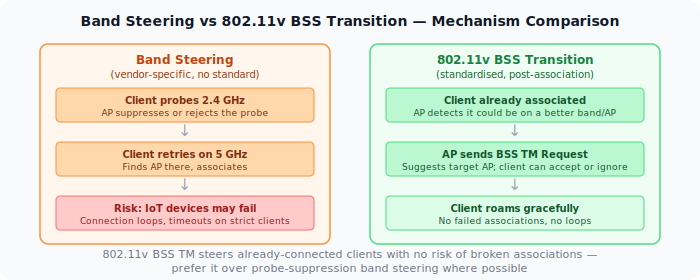

Move far enough from your router and your device will eventually roam to a closer AP. The question is when — and with multiple APs in a home or office, the answer is often "much later than it should." This is the sticky client problem. Solving it requires understanding both how clients decide when to roam and how the AP can guide them — including band steering, which is the bluntest tool in this kit.

## Who Decides When to Roam

The client does. Always. The AP cannot force a client off its radio — it can only suggest (more on that later). The client monitors its current signal, decides when it's degraded enough to justify roaming, scans for alternatives, authenticates with the new AP, and reassociates.

Without any roaming standards, this process is slow and dumb:

1. Client's signal degrades. It notices.
2. Client scans all channels to find other APs — this takes hundreds of milliseconds and interrupts traffic.
3. Client picks the best AP, runs a full authentication exchange.
4. Client reassociates. Total interruption: 200–500ms or more.

For browsing, this is invisible. For a VoIP call or video stream, it's a stutter. For applications that time out on connection loss, it can be a dropped session.

The deeper problem: clients are conservative. They evolved in a world where scanning for alternatives consumed battery and interrupted traffic, so they delay roaming as long as possible. A phone walking away from an AP will often cling to -80 dBm signal on the original AP when a closer one at -55 dBm is available, because switching costs something and the current connection technically still works.

## 802.11k — Neighbor Reports

Before a client can roam, it needs to know which APs to consider. Without 802.11k, it scans every channel — slow and disruptive. With 802.11k, the client asks its current AP for a **neighbor report**: a list of nearby APs, their channels, and signal information.

The client can now build a roam candidate list without scanning every channel. It scans only the channels where candidates exist, cutting scan time significantly.

802.11k doesn't trigger roaming or speed up the handoff. It just makes the candidate discovery step faster and less disruptive.

## 802.11r — Fast BSS Transition

The biggest delay in roaming is the authentication exchange with the new AP. In WPA2/WPA3, this involves deriving keys, exchanging frames, and completing a 4-way handshake. On a congested network or a slow AP, this takes time.

802.11r (Fast BSS Transition, or FT) solves this with **pre-authentication**. While the client is still connected to the current AP, it pre-negotiates keys with the target AP. There are two ways this happens: **over-the-DS**, where the FT frames travel through the wired backhaul between APs, or **over-the-air**, where the client contacts the target AP directly while still associated to the current one. The end result is the same — when the client decides to roam:

1. It already has the keys for the target AP.
2. It sends a single FT Action frame to the target AP.
3. The target AP responds. Reassociation completes.

The result: handoff time drops from 200ms+ to under 50ms. For voice calls, this is the threshold below which users don't perceive a gap.

802.11r requires that all APs in the network share a mobility domain — a common identifier that tells clients the APs coordinate with each other. APs not in the same mobility domain can't participate in FT.

One caveat: some older clients have buggy 802.11r implementations and fail to connect at all when it's enabled. Most modern devices handle it correctly, but this is worth checking if you see connection failures after enabling it.

## 802.11v — BSS Transition Management

802.11v gives the AP a voice in roaming decisions. It can send a **BSS Transition Management Request** to a client — essentially a suggestion to roam to a specific AP.

The client can accept or ignore it. It cannot be forced. But in practice, most clients respect the suggestion, especially when the AP includes signal information that makes a clear case for switching.

The request can also include a **Disassociation Imminent** flag with a countdown timer — the AP announces it will disconnect the client in X seconds if it hasn't moved on its own. This is the closest the standard comes to a mandate: the client still picks where to go, but staying put means being kicked. It's a meaningful step up from a pure suggestion.

APs use 802.11v for two things:

- **Load balancing** — Steering clients away from a congested radio toward a less loaded one.
- **Kicking weak clients** — If a client is too far away and holding a slow MCS rate that consumes airtime, the AP can suggest it move.

Without 802.11v, the AP has no mechanism to nudge a sticky client. It can only wait.

## How k, r, and v Work Together

The three standards complement each other:

| Standard | What it does | When it fires |
|----------|-------------|---------------|
| 802.11k | Provides a neighbor report — nearby APs and their channels | Before the roam: speeds up candidate discovery |
| 802.11r | Pre-negotiates keys with the target AP | At roam time: cuts handoff from 200ms+ to under 50ms |
| 802.11v | Sends a BSS Transition Request suggesting the client move | Proactively, from AP to client, to trigger the roam |

A well-configured network with all three: the AP suggests the client roam (v), the client already has a candidate list (k), and the handoff completes in under 50ms (r).

These are sometimes marketed together as **802.11kvr** or **Fast Roaming**. The exact label varies by vendor.

## Why Clients Still Stick

Even with all three standards enabled, clients roam later than they should. The reasons:

- **RSSI thresholds are conservative by default.** Client firmware developers set thresholds that minimize unnecessary roams, since each roam has a cost. The result is clients staying on a degrading signal longer than needed.
- **802.11r compatibility issues.** Some enterprise APs or older infrastructure have quirks. If a client can't complete FT, it may fall back to full re-authentication — or fail entirely and not roam.
- **OS-level roaming logic varies.** iOS, Android, Windows, and Linux all implement roaming differently. Apple devices tend to roam earlier and more aggressively. Some Android devices are notoriously sticky. Apple publishes [recommended WiFi settings for deploying Apple devices][1], including which 802.11r/k/v features to enable.
- **802.11v is advisory.** A client can simply ignore the suggestion. There's no enforcement mechanism.

## Band Steering: Guiding Clients Between Bands

Roaming moves clients between access points. Band steering solves a related problem: clients that are in range of a faster band but associate on a slower one anyway.

Dual-band and tri-band APs broadcast multiple radios on the same SSID. A 2.4 GHz radio and a 5 GHz radio both advertise the same network name, and the client picks which one to associate with. The problem: clients default to 2.4 GHz more often than expected. 2.4 GHz has longer range and better wall penetration, so devices within range of both bands sometimes pick 2.4 GHz anyway — especially older devices and IoT hardware. The result is a crowded 2.4 GHz radio carrying devices that could be on the faster, less congested 5 GHz band.

Band steering is the AP's attempt to correct this by nudging capable clients toward the preferred band.

### How Band Steering Works

Band steering doesn't have a standard. Every vendor implements it differently, but the common mechanisms are:

**Probe suppression** — The AP ignores or delays responding to probe requests on 2.4 GHz from clients it believes are 5 GHz capable. The client, hearing no response on 2.4 GHz, falls back to scanning 5 GHz and finds the AP there instead.

**Association rejection** — The AP responds to probes on 2.4 GHz but rejects the association request, forcing the client to retry on 5 GHz.

**BSS Transition Request (802.11v)** — For already-connected clients, the AP sends a BSS transition management frame suggesting the client move to the 5 GHz radio. This is the least disruptive mechanism since it's advisory and only applies post-association.

**Minimum RSSI to connect** — Some APs expose a separate control: a signal floor below which the AP won't allow association on a given radio. This is distinct from band steering — it's a hard per-band threshold, not a redirection mechanism. It directly addresses the range-mismatch problem: a client with a weak 5 GHz signal is left on 2.4 GHz rather than steered onto a band where it will perform poorly.

### Why Band Steering Often Causes Problems

**Aggressive rejection breaks connections.** A client that gets its 2.4 GHz association rejected will retry a few times, then give up or report no network found. Devices with minimal retry logic — many IoT devices — fail entirely. The user sees a device that "won't connect" with no useful error.

**Range mismatch.** 5 GHz has shorter range than 2.4 GHz. A client at the edge of 5 GHz coverage but solidly in 2.4 GHz range may be steered to the faster band and end up with worse actual performance — more retransmissions, lower MCS rate, higher latency — than it would have had on 2.4 GHz.

**No standard means no consistency.** Probe suppression from one vendor interacts unpredictably with the retry behaviour of clients from another vendor. The result is connection timing issues, long association delays, and behaviour that changes with firmware updates on either side.

**2.4 GHz-only devices get caught.** Steering logic is imperfect. Some APs will attempt to steer devices that only support 2.4 GHz, either because their heuristic misidentified the device or because a firmware bug broadened the steering criteria.

### The Three-Band Problem: WiFi 6E and WiFi 7

WiFi 6E and WiFi 7 APs add a 6 GHz radio, which makes the steering calculus more complex. 6 GHz has even shorter range than 5 GHz — walls and distance attenuate it more aggressively — but it offers significantly less congestion and wider channels.

The same range-mismatch problem that exists between 2.4 GHz and 5 GHz now also exists between 5 GHz and 6 GHz. With three bands, the gap between a well-tuned minimum RSSI threshold and a poorly tuned one becomes more consequential. When in doubt, be conservative — only steer clients with a strong signal on the target band.

### Band Steering vs 802.11v BSS Transition

The better mechanism for per-band steering is 802.11v BSS Transition Management — the same standard used for AP-to-AP roaming. Because it operates post-association, there is no risk of broken connections or IoT device failures. The AP suggests a move to the better band after the client has already successfully connected; the client decides whether to switch.

## Practical Configuration

These recommendations are ordered from most impactful to most specific:

**Use the same SSID across all APs.** Clients treat different SSIDs as different networks and won't roam between them — even if the underlying infrastructure is the same.

**Match security settings across all APs.** Mixing WPA2 and WPA3 transition configurations can introduce re-authentication delays at roam time. Keep the security mode identical on every AP serving the same SSID.

**Separate IoT onto a dedicated 2.4 GHz SSID.** Smart home devices — sensors, cameras, plugs — belong on 2.4 GHz, and segregating them removes them from band steering entirely. This eliminates the most common steering failure mode without touching any steering configuration.

**Disable band steering on your main SSID if IoT devices share it.** If a dedicated IoT SSID isn't practical right now, disabling steering for the primary SSID is the safer default for a mixed device environment. Band steering failures are hard to debug; removing the variable is faster than tuning it.

**Enable 802.11r within a shared mobility domain.** All APs handling the same SSID must share a mobility domain identifier. APs outside the domain can't participate in fast BSS transition, so clients roaming to them fall back to full re-authentication. Test 802.11r before deploying — some clients have buggy FT implementations that cause connection failures when it's enabled.

**Set RSSI kick thresholds for 802.11v.** Configure the signal level below which clients receive a BSS Transition Request — around -70 to -75 dBm is a common starting point. This nudges weak clients toward a better AP or band without forcing a band change through probe suppression.

**Isolate IoT on a dedicated SSID.** Smart home devices often have minimal roaming logic. A dedicated SSID lets you apply conservative or disabled roaming settings to IoT without affecting the behaviour for regular clients.

**If you're on WiFi 7, let MLO handle band selection.** Multi-Link Operation makes band steering largely obsolete for WiFi 7 clients — the device maintains links on multiple bands simultaneously and the AP distributes traffic dynamically. MLO is a structural solution rather than a heuristic one. See the [WiFi 7: Multi-Link Operation](/posts/2026-05-21-wifi-explained-mlo) post for details.

[1]: https://support.apple.com/nl-nl/guide/deployment/dep98f116c0f/web
