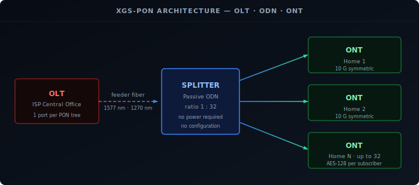
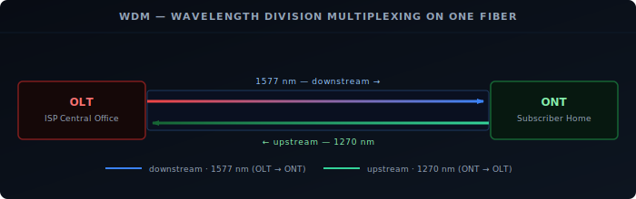
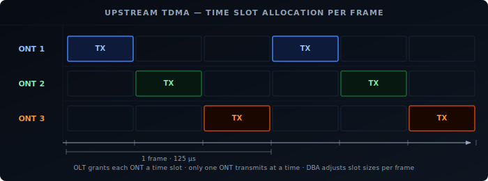

Most fiber-to-the-home connections today run on XGS-PON — a 10-gigabit symmetric passive optical network standard defined by ITU-T G.9807.1. This post covers the physical layer: how the OLT, splitter, and ONT fit together, how two wavelengths share one fiber strand, and how the access network coordinates who transmits when.

## What Is a Passive Optical Network?

A **PON** is a point-to-multipoint fiber access architecture with no active electronics between the ISP and the subscriber. The word "passive" refers specifically to the optical splitters in the distribution network — they require no power and no configuration. They are purely glass optical components that split light.

This is the key difference from active Ethernet, where the ISP runs a dedicated fiber to each subscriber. With PON, the ISP runs a single fiber to a neighborhood cabinet or pole-mounted enclosure, then splits it passively to each home. A typical split ratio is 1:32, meaning one fiber from the ISP serves 32 homes. This makes PON economical for mass FTTH deployment: less fiber to lay, no powered equipment to maintain in the field.

## The Three Components: OLT, ODN, and ONT

Every XGS-PON deployment has three architectural layers:

- **OLT (Optical Line Terminal):** The ISP-side equipment, typically in a central office or street cabinet. One OLT port serves one PON tree — a single fiber strand and all the subscribers hanging off it.
- **ODN (Optical Distribution Network):** Everything between the OLT and the subscribers' homes — fiber cables, connectors, and passive optical splitters. A 1:32 splitter takes one incoming fiber and splits it into 32 outgoing fibers. Splitters can be cascaded: a 1:4 feeding into four 1:8 splitters gives an effective 1:32 ratio.
- **ONT (Optical Network Terminal):** The device at the subscriber's home. The ISP often calls it an ONU (Optical Network Unit) or "fiber modem." It converts the optical signal to Ethernet and handles all the PON protocol logic. From your router's perspective, it looks like a standard Ethernet interface.

## Wavelengths: How Upstream and Downstream Share One Fiber

A single fiber strand carries both directions simultaneously using different wavelengths — colors of light. This is **WDM (Wavelength Division Multiplexing)**.

XGS-PON uses:
- **1577 nm** for downstream (OLT → ONT)
- **1270 nm** for upstream (ONT → OLT)

These wavelengths do not interfere with each other. The ONT contains optical filters that cleanly separate the two directions — 1577 nm light from the OLT passes to the receiver, and the ONT's 1270 nm transmitter sends upstream without affecting the incoming signal.

This matters if you plan to replace the ISP's ONT with a third-party SFP+ transceiver. The module must match these exact wavelengths to communicate with the OLT. GPON uses different wavelengths (1490 nm downstream, 1310 nm upstream), which is why GPON and XGS-PON ONTs are not interchangeable — they speak different wavelengths to different OLTs.

## How Downstream Works: Broadcast and AES-128 Encryption

The OLT broadcasts all downstream traffic at 1577 nm. Every ONT on the PON tree physically receives every downstream frame — this is an unavoidable consequence of how optical splitters work. Light going into a splitter from the OLT direction comes out all the branches.

Privacy is enforced through encryption. During registration, each ONT is provisioned with its own **AES-128** encryption key via the PLOAM (Physical Layer OAM) message exchange. The OLT encrypts each ONT's traffic with that ONT's key. When an ONT receives a frame, it checks the **GEM Port ID** and **ALLOC-ID** — identifiers assigned by the OLT during provisioning — to determine if the frame is addressed to it. If it is, the ONT decrypts it with its key. Frames for other ONTs arrive encrypted with a key the ONT doesn't have, so they are discarded.

This is fundamentally different from how Ethernet switches work. A switch sends unicast frames only to the correct port. On a PON, the hardware model is broadcast-then-filter, with per-subscriber AES-128 encryption enforcing privacy at the optical layer.

## How Upstream Works: TDMA

Upstream presents a collision problem. If all ONTs transmitted simultaneously on 1270 nm, their signals would combine at the splitter and arrive at the OLT as unintelligible noise. PON solves this with **TDMA (Time Division Multiple Access)**: the OLT assigns each ONT a specific time slot in which it is permitted to transmit, and only one ONT transmits at any given moment.

The mechanism works like this:

1. The OLT sends **bandwidth grants** to each ONT specifying when it may transmit and how many bytes it is permitted to send.
2. The ONT waits for its grant window, transmits exactly the permitted amount, then goes silent.
3. The OLT also compensates for **ranging** — each ONT is at a different physical distance, so signals take different amounts of time to reach the OLT. The OLT measures the round-trip delay for each ONT during initialization and adjusts its grant timing so that all bursts arrive at the OLT without overlapping, regardless of cable length.

The grant cycle runs at 125 µs per frame. XGS-PON's upstream line rate is 9.95328 Gbit/s — the "symmetric" in the name means downstream and upstream are both rated at 10G nominal.

## Recap

- A PON shares one fiber among many subscribers using passive optical splitters — no active elements, no power, no config between the ISP and your home.
- XGS-PON uses **1577 nm** downstream (broadcast to all ONTs, AES-128 encrypted per subscriber) and **1270 nm** upstream (TDMA — one ONT transmits at a time, OLT-granted time slots).
- The OLT broadcasts all downstream frames; each ONT decrypts only its own traffic using an AES-128 key provisioned during PLOAM registration.
- Upstream TDMA grants are issued per-ONT by the OLT every 125 µs frame; ranging calibration ensures no two bursts overlap at the splitter regardless of fiber length.

[Part 2](../xgspon-explained-protocol/) covers the protocol layer: GEM port encapsulation, T-CONT QoS classes, dynamic bandwidth allocation, and the PLOAM registration sequence that brings an ONT online.
