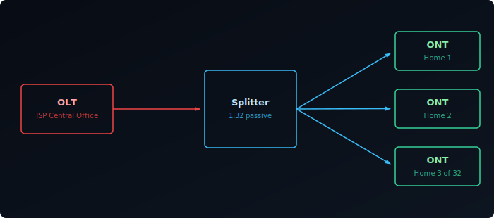
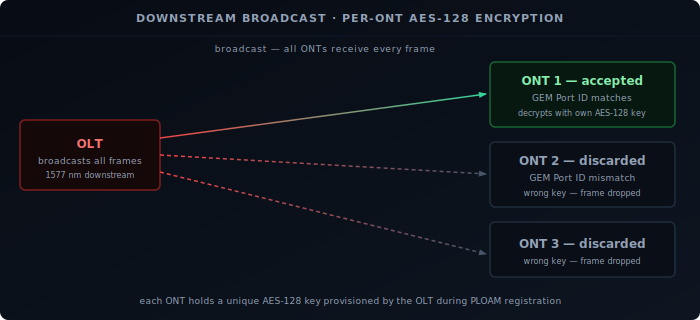
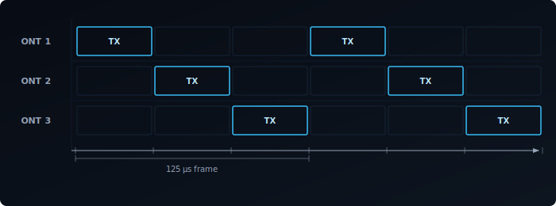

Most fiber-to-the-home connections today run on XGS-PON — a 10-gigabit symmetric passive optical network standard defined by ITU-T G.9807.1. This post covers the full stack, from physical layer to protocol.

## What Is a Passive Optical Network?

A **PON** is a point-to-multipoint fiber access architecture with no active electronics between the ISP and the subscriber. The word "passive" refers specifically to the optical splitters in the distribution network — they require no power and no configuration.

With active Ethernet, the ISP runs a dedicated fiber to each subscriber. PON instead runs one fiber to a neighborhood cabinet and splits it passively to each home — a typical 1:32 ratio means one fiber serves 32 homes, with less fiber to lay and no powered equipment in the field.

## The Three Components: OLT, ODN, and ONT

- **OLT (Optical Line Terminal):** The ISP-side equipment, typically in a central office or street cabinet. One OLT port serves one PON tree — a single fiber strand and all the subscribers hanging off it.
- **ODN (Optical Distribution Network):** Everything between the OLT and the subscribers' homes — fiber cables, connectors, and passive optical splitters. Splitters can be cascaded: a 1:4 feeding into four 1:8 splitters gives an effective 1:32 ratio.
- **ONT (Optical Network Terminal):** The device at the subscriber's home. The ISP often calls it an ONU (Optical Network Unit) or "fiber modem." It converts the optical signal to Ethernet and handles all PON protocol logic.

## Wavelengths: How Upstream and Downstream Share One Fiber

A single fiber strand carries both directions simultaneously using different wavelengths — **WDM (Wavelength Division Multiplexing)**.

XGS-PON uses:
- **1577 nm** for downstream (OLT → ONT)
- **1270 nm** for upstream (ONT → OLT)

The ONT's optical filters cleanly separate the two directions — 1577 nm to the receiver, 1270 nm from the transmitter. Third-party SFP+ transceivers must match these exact wavelengths to communicate with the OLT. GPON uses different wavelengths, so GPON and XGS-PON ONTs are not interchangeable.

## How Downstream Works: Broadcast and AES-128 Encryption

The OLT broadcasts all downstream traffic at 1577 nm. Every ONT on the PON tree physically receives every downstream frame — an unavoidable consequence of how optical splitters work.

During registration, each ONT is provisioned with its own **AES-128** key. The OLT encrypts each ONT's traffic with that key; each ONT checks the **GEM Port ID** to filter its own frames and discards the rest.

The PON model is broadcast-then-filter — AES-128 per subscriber enforces privacy where a switch would use unicast forwarding.

## How Upstream Works: TDMA

If ONTs transmitted simultaneously, signals would collide at the splitter. PON solves this with **TDMA (Time Division Multiple Access)**: the OLT assigns each ONT a specific time slot, and only one ONT transmits at a time.

1. The OLT sends **bandwidth grants** to each ONT specifying when it may transmit and how many bytes it may send.
2. The ONT waits for its grant window, transmits exactly the permitted amount, then goes silent.
3. The OLT compensates for **ranging** — each ONT is at a different physical distance, so the OLT measures round-trip delay during initialization and adjusts grant timing so all bursts arrive without overlapping.

The grant cycle runs at 125 µs per frame. XGS-PON's upstream line rate is 9.95328 Gbit/s — "symmetric" means downstream and upstream are both rated at 10G nominal.

## PLOAM Registration: How an ONT Comes Online

Before an ONT can pass any traffic, it must register with the OLT through **PLOAM (Physical Layer OAM)** — messages carried out-of-band in dedicated frame fields.

The registration sequence:

1. **Serial Number Discovery.** The ONT listens for a "Quiet Window" — a period the OLT reserves for new ONTs. The ONT transmits its serial number (a globally unique 8-byte identifier burned into the device at manufacture); the OLT assigns a temporary identifier.
2. **ALLOC-ID Assignment.** The OLT assigns an ALLOC-ID — the upstream bandwidth handle all subsequent grants reference.
3. **Ranging.** The OLT measures round-trip delay and calculates an **Equalization Delay (EqD)** — the timing offset the ONT applies to its bursts so they arrive in the correct slot regardless of physical distance.
4. **AES-128 Key Exchange.** The OLT provisions the ONT's per-subscriber AES-128 encryption key.
5. **Data Path Active.** The OLT activates GEM port mappings and T-CONT assignments; the ONT begins passing subscriber traffic.

Third-party transceivers must present the serial number the OLT has provisioned. Some ISPs also require an LOID and password; a mismatch means the OLT rejects registration at step 1.

## GEM Ports and T-CONTs

**GEM ports** (GPON Encapsulation Method) are the basic traffic containers. All Ethernet frames are encapsulated into GEM frames before transmission on the PON. Each GEM port has a unique **GEM Port ID** (0–4095). A single ONT typically has multiple GEM ports — one per VLAN or service (data, VoIP, IPTV).

**T-CONTs** (Transmission Containers) are the upstream bandwidth allocation unit. Each T-CONT maps to one or more GEM ports and is assigned to a specific ALLOC-ID. The OLT grants upstream bandwidth to T-CONTs, not directly to GEM ports. Different T-CONT types carry different QoS guarantees:

| T-CONT Type | Behavior | Typical Use |
|-------------|----------|-------------|
| 1 | Fixed bandwidth, always guaranteed | VoIP |
| 4 | Best-effort, no guarantee | Background data |
| 5 | Assured minimum with a best-effort cap above | Mixed priority |

Types 2 and 3 are intermediate cases — assured-minimum-burstable and non-assured-capped respectively. Most residential ISP profiles use type 1 for VoIP and type 4 or 5 for data.

## DBA: Dynamic Bandwidth Allocation

**DBA (Dynamic Bandwidth Allocation)** adjusts grants based on real-time demand rather than a static per-ONT split (which would cap each of 32 subscribers at ~312 Mbit/s).

Each ONT embeds a **Status Report (SR)** in every upstream burst, reporting how many bytes are queued in each T-CONT. The OLT reads these reports and recalculates grants for the next frame cycle — if only three ONTs are active, those three share proportionally larger grants, potentially the full 10G.

The OLT runs DBA entirely on its side every 125 µs frame — the ONT only reports demand and waits for grants. Statistical multiplexing means active subscribers can burst well above a static share.

## XGS-PON vs Other PON Standards

| Standard | Downstream | Upstream | DS Wavelength | Notes |
|----------|-----------|----------|--------------|-------|
| GPON | 2.488 Gbit/s | 1.244 Gbit/s | 1490 nm | Most common legacy standard; widely deployed |
| XG-PON | 9.953 Gbit/s | 2.488 Gbit/s | 1577 nm | Asymmetric; limited ISP deployment |
| XGS-PON | 9.953 Gbit/s | 9.953 Gbit/s | 1577 nm | Symmetric 10G; current standard for new FTTH |
| NG-PON2 | 4×10 Gbit/s | 4×10 Gbit/s | Multiple (TWDM) | 40G aggregate; operator and enterprise use |

XGS-PON and XG-PON share the 1577 nm downstream wavelength, so an OLT can serve both simultaneously — ISPs can swap ONTs gradually without re-fibering. GPON's different downstream wavelength (1490 nm) means it cannot coexist on the same fiber without additional multiplexing gear.

NG-PON2 stacks four 10G TWDM channels for 40G aggregate — dense urban and enterprise use, not residential FTTH.

## Recap

- A PON shares one fiber among many subscribers using passive optical splitters — no active elements between the ISP and your home.
- XGS-PON uses **1577 nm** downstream (broadcast, AES-128 encrypted per ONT) and **1270 nm** upstream (TDMA — one ONT at a time, OLT-granted slots).
- **PLOAM registration** is five steps: Serial Number → ALLOC-ID → Ranging/EqD → AES-128 key → data path active. Third-party ONTs must match the OLT's provisioned serial number (and optionally LOID).
- **GEM ports** encapsulate all Ethernet traffic; one ONT carries multiple GEM ports, one per VLAN or service.
- **T-CONTs** are the upstream QoS unit — type 1 is fixed/guaranteed (VoIP), type 4 is best-effort, type 5 mixes both.
- **DBA** recalculates grants every 125 µs based on each ONT's buffer demand, letting active subscribers burst above a static share.
- XGS-PON shares its downstream wavelength with XG-PON (gradual ISP upgrades without re-fibering); GPON uses a different wavelength and is incompatible without additional multiplexing gear.
