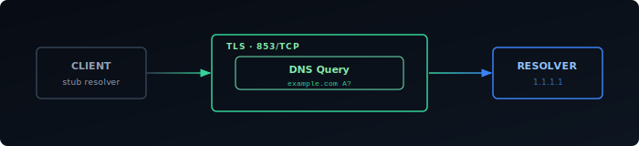
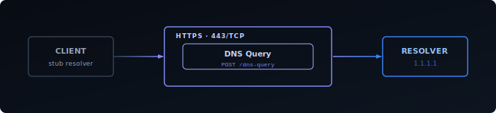
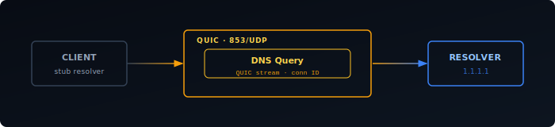

Every time your device opens a website, it first asks a DNS resolver to translate the hostname into an IP address. That query travels in plaintext over UDP on port 53 — visible to your ISP, your router, and anyone on the network path. The response comes back the same way. This is true even when the connection that follows is HTTPS.

Encrypted DNS fixes the query layer. DNS-over-TLS, DNS-over-HTTPS, and DNS-over-QUIC all do the same fundamental thing — wrap DNS traffic in an encrypted transport — but they make different choices about how, and those choices have real consequences.

## Why Plain DNS Is a Problem

A DNS query for `example.com` tells anyone watching exactly which domain you're about to contact. This happens before any TLS handshake. Even if the site uses HTTPS and all the data in transit is encrypted, the DNS query has already revealed the hostname.

This matters in several scenarios:

- **ISP surveillance** — ISPs log DNS queries by default. Most residential connections are configured to use the ISP's resolver, so the ISP has a record of every domain you've visited.
- **Network-level filtering** — DNS is the most common mechanism for content filtering. That's why it's also the most common attack surface: DNS hijacking redirects queries to return false answers.
- **On-path observers** — On a public WiFi network, anyone running a packet capture sees your DNS traffic in full. There's no equivalent of certificate pinning for plain DNS.

DNSSEC addresses a different problem: it signs DNS records so a client can verify the answer came from the authoritative source. It doesn't encrypt queries. Your ISP still sees every hostname you look up — they just can't tamper with the response without detection.

Encrypted DNS also doesn't hide the hostname from the TLS layer. When a browser connects to a site over HTTPS, the hostname is transmitted in the **TLS SNI (Server Name Indication)** field during the handshake — in plaintext, visible to any on-path observer. Encrypting the DNS query removes one leak but not both. **ECH (Encrypted Client Hello)** is the mechanism designed to close the SNI gap; it encrypts the ClientHello using a public key fetched from DNS (via HTTPS records), so the hostname is hidden end-to-end. ECH support is still rolling out across browsers and CDNs as of 2026.

## DNS-over-TLS (DoT)

DoT ([RFC 7858][1]) wraps DNS in a standard TLS connection. Queries and responses are encrypted, and the connection is authenticated by the resolver's certificate — the same model as HTTPS. It runs on a dedicated port: **853/TCP**.

The dedicated port is both its strength and its weakness. It makes DoT easy to configure and monitor — a firewall rule on port 853 is enough to block or allow it. For network administrators who want to enforce a specific resolver for all clients, that predictability is valuable. For users trying to bypass restrictive network policies, a firewall that blocks port 853 is enough to stop DoT entirely.

DoT uses a persistent TCP connection rather than opening a new connection per query, which amortizes the TLS handshake cost. In practice, latency is comparable to plain DNS once the connection is established.

Like DoH, DoT supports two privacy profiles (RFC 8310):

- **Opportunistic** — the client upgrades to DoT if the resolver supports it, falls back to plain DNS if not.
- **Strict** — the client requires a verified TLS connection and refuses to fall back. Queries fail rather than leak unencrypted.

## DNS-over-HTTPS (DoH)

DoH ([RFC 8484][2]) sends DNS queries inside standard HTTPS requests on **port 443**. From the network's perspective, DoH traffic is indistinguishable from any other HTTPS connection to the resolver's hostname. It can't be blocked without blocking HTTPS broadly, or without SNI-based filtering.

The main resolver endpoints — `1.1.1.1` (Cloudflare), `8.8.8.8` (Google), `9.9.9.9` (Quad9) — all support DoH. Browsers implement it at the application level, independently of the OS resolver — which means a browser using DoH bypasses any local resolver like Pi-hole or AdGuard Home.

There are two modes of DoH deployment:

- **Opportunistic mode** — the client upgrades to DoH if the resolver supports it, falls back to plain DNS if it doesn't. Provides encryption when available but doesn't guarantee it.
- **Strict mode** — the client refuses to fall back to plain DNS if DoH fails. Queries fail rather than leak unencrypted. This is what you want for a security guarantee.

## DNS-over-QUIC (DoQ)

DoQ is the newest of the three. Defined in [RFC 9250][3], it runs DNS over QUIC — the same transport protocol that underpins HTTP/3. It uses **port 853/UDP** by default (same port number as DoT, different transport).

QUIC provides two advantages over TLS-over-TCP:

- **Faster handshake** — QUIC combines the transport and cryptographic handshakes, reducing round-trips to establish an encrypted connection. On high-latency connections this is measurable.
- **Connection migration** — a QUIC connection is identified by a connection ID, not a 4-tuple. If your IP address changes (moving from WiFi to cellular), the connection survives without renegotiation.

DoQ's trade-off is maturity. Client support is narrower than DoH or DoT — it's available in `kdig`, `dnslookup`, and some mobile resolvers, but not yet in most OS stub resolvers or browsers. Resolver support is also limited; Cloudflare supports it, but it's not as universally deployed as DoH.

## Trade-offs

| | DoT | DoH | DoQ |
|---|---|---|---|
| Port | 853/TCP | 443/TCP | 853/UDP |
| Encrypted | Yes | Yes | Yes |
| Easy to block | Yes (port 853) | No | Partial (UDP 853) |
| Bypasses local resolver | No | Yes (browsers) | No |
| Connection overhead | Low (persistent TCP) | Moderate | Lowest |
| Client support | Wide | Widest | Limited |
| Resolver support | Wide | Widest | Growing |

The centralization concern is worth highlighting. Both DoH and DoT push DNS queries toward a small set of large resolvers. A browser hard-coded to use a single DoH provider concentrates DNS visibility at that provider rather than distributing it across ISPs. This is a different threat model, not a solved one — you're trading ISP visibility for provider visibility.

## Where to Enable Encrypted DNS

The right place to configure encrypted DNS depends on how broadly you want it to apply.

**Browser** — covers only browser traffic. Easy to set up but the narrowest scope, and doesn't protect other applications on the device.

**OS stub resolver** — covers all traffic on the device. Most modern operating systems support DoT or DoH natively; configuration is typically one setting in network preferences or in `systemd-resolved` on Linux.

**Local resolver or router** — covers all devices on the network without any per-device configuration. Clients still query the local resolver, so ad blocking and split-horizon DNS keep working. Only the upstream hop from the local resolver to the upstream recursive resolver (e.g. Cloudflare, Quad9) is encrypted — the recursive resolver's own queries to authoritative nameservers remain unencrypted standard DNS.

For a homelab the resolver level is the right choice. One place to configure, full network coverage, and local DNS behavior is unchanged.

[1]: https://datatracker.ietf.org/doc/html/rfc7858
[2]: https://datatracker.ietf.org/doc/html/rfc8484
[3]: https://datatracker.ietf.org/doc/html/rfc9250
