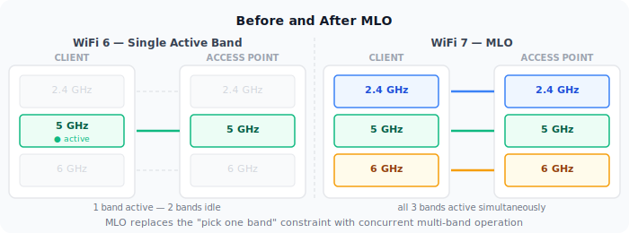
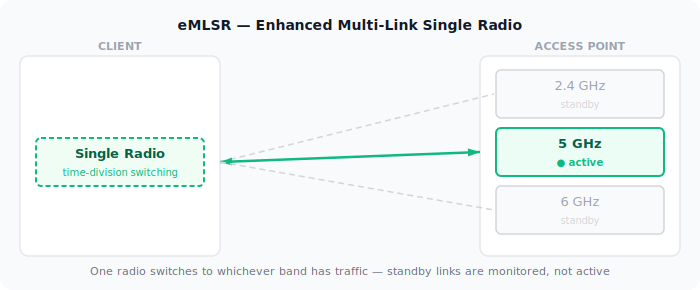
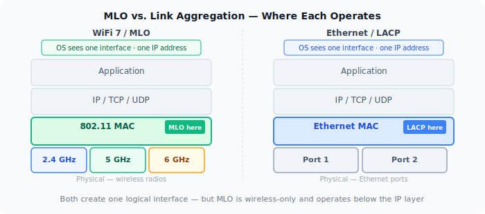
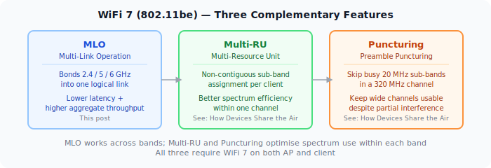

Every WiFi generation since 802.11a has improved throughput by making individual links faster — wider channels, more spatial streams, better modulation. WiFi 7 (802.11be) does that too, but it also changes something more fundamental: a device no longer has to pick one band and stay on it. Multi-Link Operation lets a client and AP maintain simultaneous connections across multiple bands and use them as a single logical link.

## The Problem Before MLO

A WiFi 6 client connected to a tri-band AP is still on one band at a time. If it's on 5GHz and that band gets congested, the client either stays and degrades, or roams to 6GHz — a process that takes time and interrupts traffic. The AP can't split a single flow across bands, and the client can't receive on 2.4GHz while transmitting on 5GHz.

Band steering and load balancing are workarounds for this: the AP nudges clients between bands based on load. But the client always has one radio active per connection.

MLO eliminates that constraint.

## What MLO Does

With MLO, a client and AP negotiate a multi-link setup during association. Instead of one link, they establish multiple — one per band. These operate under a single MAC address and appear to the upper layers as one connection.

The AP and client can then:

- **Transmit and receive on multiple links simultaneously** — independent data streams on each band.
- **Distribute frames across links dynamically** — pick the least congested or lowest-latency link per packet.
- **Maintain redundancy** — if one link degrades, traffic shifts to the others without a roam event.

The result is lower latency (always use the best available path), higher aggregate throughput (multiple channels active simultaneously), and better reliability.

## The Main MLO Modes

Not all MLO is equal. The standard defines several operating modes based on hardware capability — this post covers the three you're most likely to encounter in current hardware. The full 802.11be spec includes additional variants (MLSR, EMLMR) that are less common today.

### STR — Simultaneous Transmit and Receive

The device has independent radios for each band and can transmit on one while receiving on another simultaneously. This is the highest-capability mode and delivers the full MLO benefit: true concurrent use of all links.

The constraint is RF isolation. If the 2.4GHz and 5GHz radios are physically too close, transmitting on one can interfere with reception on the other. STR requires that the AP and client hardware achieve adequate isolation between bands — a non-trivial design challenge, especially for thin client devices.

### NSTR — Non-Simultaneous Transmit and Receive

The device cannot truly transmit and receive at the same time across links due to RF constraints. Instead, the links are coordinated so they don't interfere with each other — transmissions on one link are synchronized with idle periods on the other.

NSTR still provides benefits over single-band operation: better channel utilization, dynamic load distribution, and redundancy. But throughput gains are lower than STR because the links can't be fully concurrent.

### eMLSR — Enhanced Multi-Link Single Radio

A single radio switches rapidly between multiple links. Because there is only one physical radio, it cannot monitor multiple channels at the same time — instead, the protocol defines scheduled listening windows during which the radio checks a secondary link, then switches back. It responds on whichever link has pending traffic during its active window. This is the lowest-hardware-cost MLO mode — it doesn't require multiple independent radios.

eMLSR improves responsiveness and reduces latency by avoiding the delay of full channel scans, but it doesn't deliver parallel throughput. It's mainly targeted at power-constrained devices that want MLO's latency benefits without the cost of multiple radios.

## Mode Comparison

| Mode | Radios required | Concurrent TX/RX | Throughput gain | Latency gain |
|------|----------------|------------------|-----------------|--------------|
| STR | Multiple (isolated) | Yes | High | High |
| NSTR | Multiple (coordinated) | No | Medium | Medium |
| eMLSR | Single | No | Low | Medium |

## What MLO Requires

MLO is not backwards compatible at the protocol level. Both the AP and the client must support WiFi 7 and negotiate MLO during association. A WiFi 7 AP provides no MLO benefit to a WiFi 6 client — that client connects on a single link as usual.

On the infrastructure side, the AP needs hardware capable of managing multi-link associations: coordinating frame scheduling across bands, maintaining per-link block-ack agreements, and presenting a unified MAC to the client. This is more complex than a standard tri-band AP.

On the client side, driver and firmware maturity matters. Early WiFi 7 devices have shipped with incomplete MLO implementations — some advertise STR capability but fall back to NSTR or single-link in practice due to firmware limitations. Checking vendor release notes for MLO-specific fixes is worthwhile.

## MLO vs. Link Aggregation

MLO operates at the 802.11 MAC layer. It is not the same as 802.3ad link aggregation (LACP), which bonds multiple Ethernet ports. MLO is specific to the wireless association between a client and an AP — it's invisible to the IP layer above it.

From the perspective of the OS and applications, an MLO connection is a single network interface with a single IP address. The multi-link coordination happens below that level.

## Real-World Status

As of 2025-2026, WiFi 7 APs from major vendors (UniFi, TP-Link BE series, Netgear Orbi 970) support MLO. Client support is growing: recent Qualcomm and MediaTek chipsets implement it, and it's present in newer laptops and phones with WiFi 7 adapters.

The areas to watch:

- **eMLSR support on mobile** — Important for battery-powered devices. Support is arriving but not universal.
- **STR in thin clients** — RF isolation is a genuine hardware challenge. Some devices claiming STR operate in NSTR in practice.
- **Driver maturity on Linux** — Linux WiFi 7 / MLO support has improved rapidly in kernel 6.x but is still catching up to the Windows and macOS stacks.

MLO's practical impact will grow as client support matures. The AP side is largely ready — the constraint now is the client device installed base.

## WiFi 7 in Full: MLO, Multi-RU, and Preamble Puncturing

MLO is WiFi 7's headline feature, but it works alongside two other spectrum improvements that together make 320 MHz channels practical:

**Multi-RU** extends OFDMA so a single client can receive on multiple non-contiguous Resource Units within one channel — filling spectrum more efficiently than WiFi 6's fixed contiguous blocks.

**Preamble Puncturing** lets an AP skip specific 20 MHz sub-channels within a wide channel when they're occupied by interference or radar, keeping the rest of the channel active instead of falling back to a narrower width.

The three features address different layers of the same problem: MLO bonds multiple bands into one logical link, Multi-RU fills each band's spectrum efficiently, and Puncturing keeps wide channels usable despite partial interference.

For the full explanation of Multi-RU and Preamble Puncturing, see [How Devices Share the Air](/posts/2026-04-23-wifi-explained-medium) in this series.
