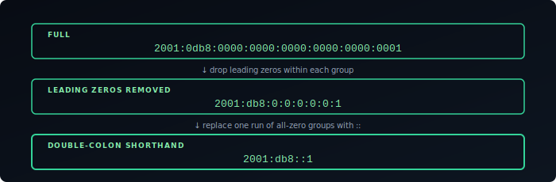
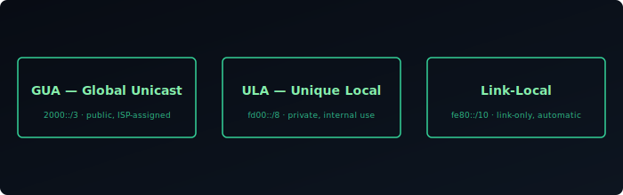
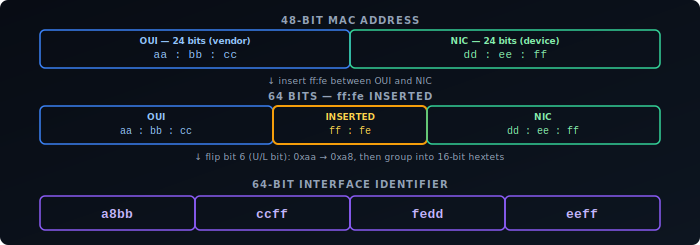
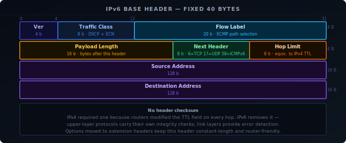
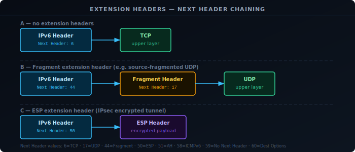

IPv4 uses 32-bit addresses. That gives roughly 4.3 billion unique values — a number that made sense in 1981 and became a serious problem by the 2000s. IANA exhausted its IPv4 pool in 2011. IPv6 uses 128-bit addresses, which provides 340 undecillion unique values — enough that address conservation is no longer a design constraint.

The address space alone justifies the switch, but IPv6 also changes how addresses are notated, typed, and structured, and moves everything IPv4 handled with a variable-length options field into a chain of extension headers instead. This guide covers all of that: notation, address types and scopes, the prefix/interface-ID split, subnetting, and the packet header itself.

## Notation

An IPv6 address is 128 bits written as eight groups of four hexadecimal digits, separated by colons:

```
2001:0db8:0000:0000:0000:0000:0000:0001
```

Two shortening rules apply. First, leading zeros within each group can be dropped:

```
2001:db8:0:0:0:0:0:1
```

Second, one contiguous run of all-zero groups can be replaced with `::`:

```
2001:db8::1
```

The `::` can only appear once in an address. `::1` is the loopback address (equivalent to `127.0.0.1`). `::` alone is the unspecified address.



## Address Types

IPv6 has no broadcast. Instead it has three address types:

**Unicast** — identifies a single interface. Packets delivered to exactly one destination. The common case.

**Multicast** — identifies a group of interfaces. Packets delivered to all members of the group. Replaces broadcast for most purposes and underpins Neighbor Discovery.

**Anycast** — the same address assigned to multiple interfaces. Packets routed to whichever interface is topologically nearest. Used for DNS root servers and CDN infrastructure.

## Scope and Address Ranges

Not all unicast addresses are the same. IPv6 defines several ranges with different scopes:

**Global Unicast Addresses (GUA)** — publicly routable, globally unique. The `2000::/3` block covers most of this range. These are what devices use to communicate on the internet. ISPs assign GUA prefixes to home and business networks.

**Unique Local Addresses (ULA)** — private, not routed on the internet. The `fc00::/7` range (in practice `fd00::/8`). Equivalent to RFC 1918 space in IPv4 (`192.168.x.x`, `10.x.x.x`). Use these for internal services that should never be reachable from outside.

**Link-Local Addresses** — valid only on a single link (network segment), never forwarded by routers. Always start with `fe80::/10`. Every IPv6 interface has one automatically — they're used for router discovery and Neighbor Discovery Protocol before any other address is configured.

**Documentation prefix** — `2001:db8::/32` is reserved by IANA (RFC 3849) exclusively for documentation and examples. It is never routed on the internet. All address examples throughout this guide use `2001:db8::` addresses for this reason — they cannot be confused with real addresses.



## Address Structure

A GUA address has two parts: a **network prefix** and an **interface identifier**.

```
| <-- 64 bits prefix --> | <-- 64 bits interface ID --> |
  2001:db8:1234:abcd     :     0201:c0ff:fee0:1234
```

The prefix identifies the network — assigned by the ISP down to the router, then subdivided per subnet. The interface identifier uniquely identifies the device within that network.

The `/64` boundary is the standard subnet size in IPv6. Routers are not expected to subnet below `/64` (with few exceptions). This means every IPv6 subnet has 2⁶⁴ addresses — more than enough that address conservation within a subnet is irrelevant.

## Interface Identifiers

The interface identifier can be generated several ways:

**EUI-64** — derived from the device's MAC address. The 48-bit MAC is split in two, `fffe` is inserted in the middle, and bit 6 of the first byte is flipped (the Universal/Local bit, signalling the address was derived from a MAC). This produces a globally unique 64-bit identifier — but also embeds the MAC, which is a privacy concern.



**Privacy extensions (RFC 8981)** — the interface ID is randomly generated and rotated periodically. Most modern operating systems use this by default for outbound connections to prevent tracking across networks.

**Manual / static** — set explicitly. Common on routers, servers, and infrastructure where a stable address matters.

## Subnetting

ISPs typically hand a `/48` or `/56` prefix to a customer. The bits between the ISP's prefix and `/64` are yours to allocate as subnets.

With a `/48`, you have 16 bits of subnet space — 65,536 possible `/64` subnets. With a `/56`, you have 8 bits — 256 subnets. Either is enough for any homelab or small business, with room to spare.

```
ISP assigns:   2001:db8:abcd::/48
Your subnets:  2001:db8:abcd:0001::/64  ← VLAN 1
               2001:db8:abcd:0002::/64  ← VLAN 2
               2001:db8:abcd:0003::/64  ← VLAN 3
               ...
```

The notation `/64` after the address specifies the prefix length — how many bits are the network part. Everything after is the interface ID.

## Packet Header

The IPv6 base header is fixed at **40 bytes**. Unlike IPv4 — which has a variable-length header with an options field — all options in IPv6 are pushed into extension headers, keeping the base header constant-length and router-friendly.

| Field | Bits | Description |
|---|---|---|
| Version | 4 | Always 6 |
| Traffic Class | 8 | Upper 6 bits: DSCP (QoS marking). Lower 2 bits: ECN (Explicit Congestion Notification). Equivalent to the IPv4 DS field. |
| Flow Label | 20 | Identifies a flow between source and destination. Routers use it for consistent ECMP path selection without inspecting upper-layer headers. |
| Payload Length | 16 | Length of everything after the 40-byte header, in bytes. Does not include the header itself. |
| Next Header | 8 | Type of the next header — either an extension header or an upper-layer protocol (6=TCP, 17=UDP, 58=ICMPv6). |
| Hop Limit | 8 | Decremented by each router. Packet dropped and ICMPv6 Time Exceeded sent when it reaches zero. Equivalent to IPv4's TTL. |
| Source Address | 128 | — |
| Destination Address | 128 | — |

There is no header checksum. IPv4 included one because routers modified the TTL field in transit, requiring recomputation at every hop. IPv6's Hop Limit fills the same role but without a checksum — upper-layer protocols carry their own integrity checks, and link layers provide error detection.



## Extension Headers

IPv6 replaces the IPv4 options field with **extension headers** — additional headers chained between the base header and the upper-layer protocol. Each header identifies the next via its own Next Header field, forming a linked list that terminates at the upper-layer protocol or at Next Header 59 (No Next Header).

| Next Header | Extension Header | Purpose |
|---|---|---|
| 0 | Hop-by-Hop Options | Processed by every router on the path. Rarely used — per-hop processing is expensive and many operators drop these packets at the border as a DoS precaution. |
| 43 | Routing | Specifies intermediate nodes the packet must traverse. Type 0 (RH0) was deprecated (RFC 5095) due to DoS amplification. Type 2 is used in Mobile IPv6. |
| 44 | Fragment | Carries fragmentation state when the source has split a packet that exceeds path MTU. Routers never fragment — only sources do. |
| 50 | ESP | IPsec Encapsulating Security Payload — encryption. |
| 51 | AH | IPsec Authentication Header — integrity and origin authentication without encryption. |
| 60 | Destination Options | Processed only by the final destination. |
| 59 | No Next Header | Marks the end of the chain — no upper-layer payload follows. |

Extension headers must appear in the order listed above, as defined by RFC 8200. In practice, the only ones commonly encountered are Fragment (source fragmentation and PMTUD) and ESP/AH (VPN traffic). Hop-by-Hop Options is the most restricted: because every router on the path must process it, it has been used as a DoS amplification vector and is widely filtered at network borders.


