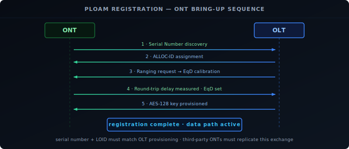

[Part 1](../xgspon-explained-physical/) covered the physical layer: how the OLT, passive splitter, and ONT share a single fiber using two wavelengths, how downstream broadcast is made private with AES-128 encryption, and how upstream TDMA keeps ONTs from colliding. This part covers what happens above that — the protocol sequence that brings an ONT online, and the mechanisms that manage how 32 subscribers share 10G of upstream capacity.

## PLOAM Registration: How an ONT Comes Online

Before an ONT can pass any traffic, it must register with the OLT through the **PLOAM (Physical Layer OAM)** protocol. PLOAM messages are exchanged out-of-band from data traffic — they run in dedicated fields of the XGS-PON frame structure.

Each ONT gets an **ALLOC-ID** during this sequence — the handle the OLT uses to schedule that ONT's upstream grants. Everything from ranging compensation to traffic delivery references this identifier.

The registration sequence:

1. **Serial Number Discovery.** The ONT listens for a "Quiet Window" in the upstream grant schedule — a period the OLT reserves for new ONTs to announce themselves. The ONT transmits its serial number (a globally unique 8-byte identifier burned into the device at manufacture). The OLT reads this and assigns a temporary identifier.
2. **ALLOC-ID Assignment.** The OLT sends a PLOAM message assigning an ALLOC-ID — the upstream bandwidth allocation handle that all subsequent grants will reference. The ONT now has a slot identity it can be scheduled against.
3. **Ranging.** The OLT measures the round-trip delay to the ONT by sending a ranging request and timing the response. It calculates an **Equalization Delay (EqD)** — the adjustment the ONT must apply to its upstream bursts so they arrive at the OLT in the correct time slot, regardless of the ONT's physical distance on the fiber plant.
4. **AES-128 Key Exchange.** The OLT provisions the ONT's per-subscriber AES-128 encryption key via a PLOAM Key Exchange sequence. After this step, the OLT encrypts all downstream frames for this ONT with that key, and the ONT can decrypt them.
5. **Data Path Active.** The OLT activates GEM port mappings and T-CONT assignments, and the ONT begins passing subscriber traffic.

If you replace the ISP's ONT with a third-party SFP+ transceiver, this sequence must complete successfully. The serial number the ONT presents must match what the OLT has provisioned for your line — most ISPs provision by serial number. Some also require an LOID (Logical ONT ID) and password in the PLOAM exchange; if those don't match, the OLT will reject the registration at step 1.

## GEM Ports and T-CONTs

Inside the TDMA slot structure, XGS-PON has two traffic management primitives.

**GEM ports** (GPON Encapsulation Method) are the basic traffic containers. All Ethernet frames are encapsulated into GEM frames before transmission on the PON. Each GEM port has a unique **GEM Port ID** (0–4095). A single ONT typically has multiple GEM ports — one per VLAN, one for data, one for VoIP, one for IPTV. This is how the ISP separates services on a single fiber connection.

**T-CONTs** (Transmission Containers) are the upstream bandwidth allocation unit. Each T-CONT maps to one or more GEM ports and is assigned to a specific ALLOC-ID. The OLT grants upstream bandwidth to T-CONTs, not directly to GEM ports. Different T-CONT types carry different QoS guarantees:

| T-CONT Type | Behavior | Typical Use |
|-------------|----------|-------------|
| 1 | Fixed bandwidth, always guaranteed | VoIP |
| 4 | Best-effort, no guarantee | Background data |
| 5 | Assured minimum with a best-effort cap above | Mixed priority |

Types 2 and 3 are intermediate cases between 1 and 4 — assured-minimum-burstable and non-assured-capped respectively. Most residential ISP profiles use type 1 for VoIP and type 4 or 5 for data.

## DBA: Dynamic Bandwidth Allocation

With 32 ONTs sharing a 10G upstream, a static per-ONT split would give each subscriber roughly 312 Mbit/s. **DBA (Dynamic Bandwidth Allocation)** avoids this by adjusting grants based on real-time demand.

Each ONT embeds a **Status Report (SR)** in every upstream burst, reporting how many bytes are queued in each T-CONT. The OLT reads these reports and recalculates grants for the next frame cycle. If only three ONTs are actively transmitting, those three receive proportionally larger grants — potentially the full 10G shared between them. Idle ONTs receive no grant that cycle.

The allocation cycle is one 125 µs frame. The OLT runs DBA entirely on its side; the ONT has no say in how much bandwidth it receives beyond what the T-CONT configuration defines. The ONT only reports demand and waits for grants.

This is why XGS-PON can offer "up to 10G" to many subscribers simultaneously. Real-world usage patterns mean subscribers are rarely all transmitting at full rate at the same time, so DBA allows each active subscriber to burst well above their statistically assigned share.

## XGS-PON vs Other PON Standards

| Standard | Downstream | Upstream | DS Wavelength | Notes |
|----------|-----------|----------|--------------|-------|
| GPON | 2.488 Gbit/s | 1.244 Gbit/s | 1490 nm | Most common legacy standard; widely deployed |
| XG-PON | 9.953 Gbit/s | 2.488 Gbit/s | 1577 nm | Asymmetric; limited ISP deployment |
| XGS-PON | 9.953 Gbit/s | 9.953 Gbit/s | 1577 nm | Symmetric 10G; current standard for new FTTH |
| NG-PON2 | 4×10 Gbit/s | 4×10 Gbit/s | Multiple (TWDM) | 40G aggregate; operator and enterprise use |

XGS-PON and XG-PON share the same 1577 nm downstream wavelength. This matters for ISP upgrades: an OLT can serve both XG-PON and XGS-PON ONTs simultaneously on the same fiber plant by assigning them different upstream wavelengths. ISPs upgrading from an older XG-PON deployment to XGS-PON don't need to re-fiber the neighborhood — they can swap out ONTs gradually. GPON operates on a completely different downstream wavelength (1490 nm), so it cannot coexist on the same fiber with XGS-PON without additional wavelength multiplexing gear.

NG-PON2 is a different category: it stacks multiple wavelength channels using TWDM (Time and Wavelength Division Multiplexing), achieving 40G aggregate across four 10G channels. It's designed for dense urban deployments and enterprise handoffs, not typical residential FTTH.

## Recap

- **PLOAM registration** brings an ONT online in five steps: Serial Number → ALLOC-ID → Ranging/EqD → AES-128 key → data path active. Third-party ONTs must present the serial number (and optionally LOID) the OLT has provisioned.
- **GEM ports** encapsulate all Ethernet traffic into the PON frame structure; one ONT can carry multiple GEM ports (one per VLAN or service).
- **T-CONTs** are the upstream QoS unit; the OLT grants bandwidth to T-CONTs, not GEM ports. Type 1 is fixed/guaranteed (VoIP), type 4 is best-effort, type 5 mixes both.
- **DBA** adjusts upstream grants every 125 µs frame based on each ONT's reported buffer demand — allowing the full 10G to flow to whoever needs it rather than dividing it statically.
- XGS-PON is symmetric 10G; it shares the 1577 nm downstream wavelength with XG-PON (enabling incremental ISP upgrades); GPON uses a different wavelength and is incompatible without additional multiplexing gear.
