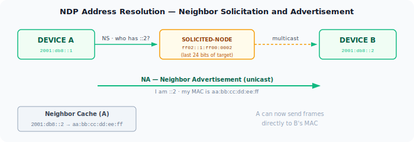
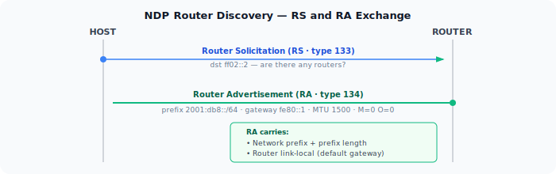
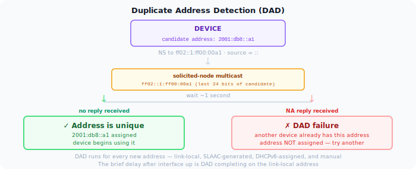

ARP (Address Resolution Protocol) is how IPv4 devices find each other on a local network. A device broadcasts "who has 192.168.1.1?" and the owner replies with its MAC address. It works, but it has problems: it's broadcast-based (every device on the segment sees every ARP request), it has no built-in authentication, and it's vulnerable to spoofing.

IPv6 replaces ARP entirely with the Neighbor Discovery Protocol (NDP), defined in [RFC 4861][1]. NDP uses ICMPv6 messages and multicast instead of broadcast, handles more functions than ARP, and integrates directly with the rest of IPv6 autoconfiguration.

## NDP Message Types

NDP defines five ICMPv6 message types, each with a distinct role:

**Router Solicitation (RS, type 133)** — sent by a host when an interface comes up, asking routers on the link to announce themselves immediately rather than waiting for the next scheduled advertisement.

**Router Advertisement (RA, type 134)** — sent periodically by routers, and in response to RS messages. Carries the network prefix, default gateway address, MTU, and flags controlling how clients should configure addresses (SLAAC, DHCPv6, or both).

**Neighbor Solicitation (NS, type 135)** — sent to resolve an IPv6 address to a MAC address. The NDP equivalent of an ARP request. Also used for Duplicate Address Detection.

**Neighbor Advertisement (NA, type 136)** — the reply to an NS, carrying the sender's MAC address. Also sent unsolicited when a node's address or reachability status changes.

**Redirect (type 137)** — sent by a router to inform a host of a better first-hop for a particular destination. Same function as the ICMP Redirect in IPv4.

## Address Resolution

When a device wants to send a packet to another IPv6 address on the same link, it needs the destination's MAC address. NDP handles this with NS and NA:

1. The sender computes the **solicited-node multicast address** for the target: `ff02::1:ff` followed by the last 24 bits of the target's IPv6 address.
2. It sends a Neighbor Solicitation to that multicast address, asking for the target's MAC.
3. The target — and only the target — is listening on that multicast address. It replies with a Neighbor Advertisement containing its MAC.

The solicited-node multicast address is the key improvement over ARP broadcast. Instead of every device processing the request, only devices whose address matches the last 24 bits receive it. On a large segment this significantly reduces interrupt load.

Resolved mappings are stored in the **neighbor cache**, equivalent to ARP's cache. Entries have states: Incomplete, Reachable, Stale, Delay, Probe. A STALE entry can still be used for sending immediately — it is not discarded. Using a STALE entry starts a DELAY timer (5 seconds). If no upper-layer reachability confirmation arrives (e.g., a TCP ACK confirming the path is live), the entry moves to PROBE state and the device sends Neighbor Solicitations to actively verify the neighbor is still reachable. Only if those probes go unanswered is the entry removed.

## Router Discovery

On startup, a device doesn't know which router to use. NDP handles this automatically:

1. The device sends a **Router Solicitation** to `ff02::2` (the all-routers multicast address).
2. Any router on the link replies with a **Router Advertisement** containing its link-local address, the network prefix, and configuration flags.
3. The device installs the router's link-local address as its default gateway and begins address configuration.

Routers also send periodic unsolicited RAs — RFC 4861 specifies the interval is chosen randomly between `MinRtrAdvInterval` (default 200 s) and `MaxRtrAdvInterval` (default 600 s) to prevent synchronisation across devices. A device that receives an RA with a lifetime of zero treats that router as no longer available.

## Duplicate Address Detection

Before using any unicast address — whether SLAAC-generated, DHCPv6-assigned, or manually configured — a device must verify the address isn't already in use on the link. This is **Duplicate Address Detection (DAD)**.

DAD uses a Neighbor Solicitation with the unspecified address (`::`) as the source, targeting the address the device wants to use. If another device on the link already has that address, it responds with a Neighbor Advertisement and DAD fails — the address is not used.

DAD happens for every new address, including link-local. The brief delay between interface up and address assignment is DAD in progress.

## NDP vs ARP

| | ARP | NDP |
|---|---|---|
| Layer | IPv4 | IPv6 (ICMPv6) |
| Mechanism | Broadcast | Solicited-node multicast |
| Router discovery | Separate (DHCP / manual) | Built-in (RS/RA) |
| Address conflict detection | Gratuitous ARP (optional) | DAD (mandatory) |
| Authentication | None | Optional (SEND) |
| Scope | Link-local | Link-local |

The multicast model means NDP is quieter than ARP on large segments — each NS reaches at most a small fraction of devices. It also means IPv6 is more dependent on multicast working correctly on the underlying network. Switches and wireless APs that filter multicast aggressively can break NDP.

[1]: https://datatracker.ietf.org/doc/html/rfc4861
