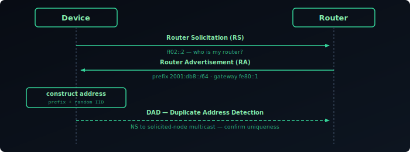
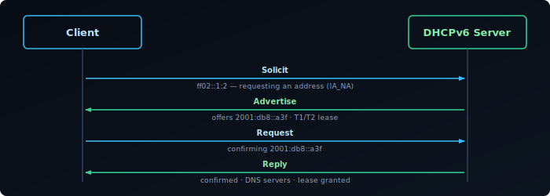
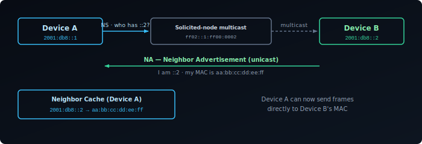
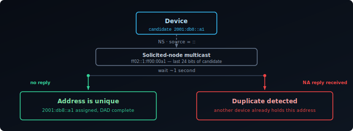
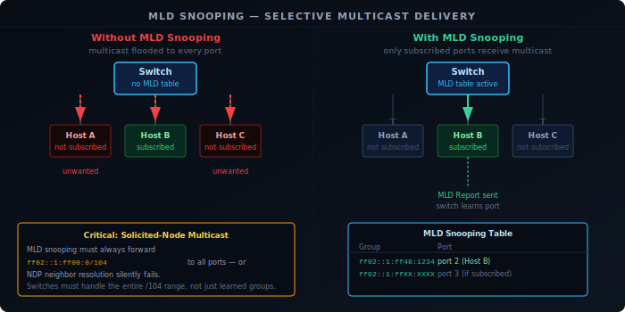

IPv4 needed two separate protocols to get a device onto a network: ARP to resolve layer-2 addresses, and DHCP to assign an IP. IPv6 replaces both with a single unified system built on multicast rather than broadcast — the Neighbor Discovery Protocol (NDP), defined in [RFC 4861][1]. SLAAC (Stateless Address Autoconfiguration) is built on top of NDP, and DHCPv6 extends it where stateful assignment is needed. None of it would work without IPv6's multicast model, which is why this guide covers both together: how a device gets and resolves an address, and the multicast mechanics that make it possible.

## NDP Message Types

NDP defines five ICMPv6 message types, each with a distinct role:

**Router Solicitation (RS, type 133)** — sent by a host when an interface comes up, asking routers on the link to announce themselves immediately rather than waiting for the next scheduled advertisement.

**Router Advertisement (RA, type 134)** — sent periodically by routers, and in response to RS messages. Carries the network prefix, default gateway address, MTU, and flags controlling how clients should configure addresses (SLAAC, DHCPv6, or both).

**Neighbor Solicitation (NS, type 135)** — sent to resolve an IPv6 address to a MAC address. The NDP equivalent of an ARP request. Also used for Duplicate Address Detection.

**Neighbor Advertisement (NA, type 136)** — the reply to an NS, carrying the sender's MAC address. Also sent unsolicited when a node's address or reachability status changes.

**Redirect (type 137)** — sent by a router to inform a host of a better first-hop for a particular destination. Same function as the ICMP Redirect in IPv4.

## SLAAC

SLAAC proceeds through four steps, all without a server:

1. **Generate a link-local address** — the device forms a `fe80::/10` address using a self-generated interface identifier (EUI-64 or random). This requires nothing from the network and is ready immediately after the interface comes up.

2. **Duplicate Address Detection (DAD)** — before using the link-local address, the device sends a Neighbor Solicitation (NS) with the **unspecified address (`::`)** as source, targeting the candidate address. If no reply arrives within a short timeout, the address is unique and confirmed for use. DAD repeats for every new address.

3. **Router Solicitation (RS)** — with a confirmed link-local address, the device sends an RS to `ff02::2` (all-routers multicast), asking any router on the link to identify itself.

4. **Router Advertisement (RA) and address construction** — the router replies with an RA containing the network prefix (e.g. `2001:db8::/64`), its own link-local address as the default gateway, and MTU. The device combines the prefix with its self-generated interface identifier to form a full 128-bit global unicast address, then runs DAD again before using it.

No server is needed for any of this. The router also sends its own link-local address as the default gateway, so the device can reach the internet as soon as address construction and DAD complete.



Routers also send periodic unsolicited RAs — RFC 4861 specifies the interval is chosen randomly between `MinRtrAdvInterval` (default 200 s) and `MaxRtrAdvInterval` (default 600 s) to prevent synchronisation across devices. A device that receives an RA with a lifetime of zero treats that router as no longer available.

## RA Flags

The RA carries two sets of flags. The router-level flags control which address mechanism to use:

- **M flag (Managed)** — use DHCPv6 for address assignment
- **O flag (Other)** — use DHCPv6 for other configuration (DNS, domain search) but not addresses

With both flags unset, pure SLAAC is in effect.

Each prefix in the RA is carried in a **Prefix Information Option (PIO)**, which has its own per-prefix flags:

- **A flag (Autonomous)** — if set, the device may use this prefix to form a SLAAC address. If unset, the prefix is advertised but SLAAC does not trigger for it.
- **L flag (on-link)** — if set, the prefix is declared on-link: the device can communicate directly with other addresses in this prefix without going through the router. If unset, the device sends all traffic — even to addresses in the same prefix — via the default gateway.

The A and L flags default to 1 in most deployments and can be set independently: a prefix can be advertised as on-link without triggering SLAAC (A=0, L=1), or used for SLAAC without being on-link (A=1, L=0). The M and O flags tell the device *how* to get an address; the A flag controls *whether this prefix is used for SLAAC*.

Each PIO also carries two lifetimes that control how long an address formed from the prefix remains usable:

- **Valid lifetime** — how long the address is valid at all. After expiry it is removed entirely. RFC 4861 defaults to 30 days.
- **Preferred lifetime** — how long the address is preferred for new outgoing connections. Must be ≤ valid lifetime. Once the preferred lifetime expires, the address enters a **deprecated** state: existing connections continue using it, but the OS will not pick it as the source for new connections.

This distinction is what lets an ISP rotate a delegated prefix gracefully: the old prefix gets a shortened preferred lifetime so devices stop starting new connections from it, while it stays valid long enough for existing sessions to finish.

## Interface Identifier in SLAAC

SLAAC lets the device choose how it generates the interface ID — EUI-64 (derived from the MAC) or a random privacy-extension address (RFC 8981). The mechanics and trade-offs are covered under [Interface Identifiers](#interface-identifiers) in the Addressing guide; the short version is that most operating systems default to random, periodically rotated IDs for outbound connections.

## DHCPv6

DHCPv6 works similarly to DHCPv4 in structure — client sends a Solicit, server replies with an Advertise, client sends a Request, server confirms with a Reply — but there are meaningful differences.

**Stateful DHCPv6** assigns addresses from a pool, just like DHCPv4. The server tracks which device has which address. This is what the M flag in the RA triggers.

**Stateless DHCPv6** doesn't assign addresses. The device uses SLAAC for its address, but contacts DHCPv6 to get DNS servers and other options. This is what the O flag triggers. It's very common — SLAAC handles the address, DHCPv6 handles the configuration.



One important difference from DHCPv4: DHCPv6 does not carry the default gateway. That information comes only from Router Advertisements. This means even on a network using stateful DHCPv6 for addresses, the router still needs to send RAs for gateway discovery.

## RDNSS

RDNSS (Recursive DNS Server option, [RFC 8106][2]) carries DNS resolver addresses directly in Router Advertisements, without any DHCPv6 exchange. The RA includes one or more IPv6 addresses of DNS resolvers, each with a lifetime indicating how long the entry should be trusted. A related option, DNSSL (DNS Search List), carries the domain search list the same way.

This makes pure SLAAC deployments viable end-to-end: the device gets its address via SLAAC and its DNS resolvers via RDNSS, with no server of any kind required. The one trade-off versus DHCPv6: a DNS change can't be pushed immediately, it waits for the next scheduled RA.

## Address Resolution

When a device wants to send a packet to another IPv6 address on the same link, it needs the destination's MAC address. NDP handles this with NS and NA:

1. The sender computes the target's solicited-node multicast address (see [Solicited-Node Multicast](#solicited-node-multicast) below) and sends a Neighbor Solicitation to that multicast address, asking for the target's MAC.
2. The target — and only the target — is listening on that multicast address. It replies with a Neighbor Advertisement containing its MAC.

This is the key improvement over ARP broadcast: instead of every device on the segment processing the request, only the device (or small handful of devices) whose address matches receives it — significantly reducing interrupt load on a large segment.



Resolved mappings are stored in the **neighbor cache**, equivalent to ARP's cache. Entries have states: Incomplete, Reachable, Stale, Delay, Probe. A STALE entry can still be used for sending immediately — it is not discarded. Using a STALE entry starts a DELAY timer (5 seconds). If no upper-layer reachability confirmation arrives (e.g., a TCP ACK confirming the path is live), the entry moves to PROBE state and the device sends Neighbor Solicitations to actively verify the neighbor is still reachable. Only if those probes go unanswered is the entry removed.

## Duplicate Address Detection

DAD applies to every new unicast address — SLAAC-generated, DHCPv6-assigned, or manually configured — not just the link-local address covered in step 2 above. The brief delay visible between interface up and address availability is DAD in progress. If a conflict is detected (another device replies with a NA), the address is abandoned and not used.



## NDP vs ARP

| | ARP | NDP |
|---|---|---|
| Layer | IPv4 | IPv6 (ICMPv6) |
| Mechanism | Broadcast | Solicited-node multicast |
| Router discovery | Separate (DHCP / manual) | Built-in (RS/RA) |
| Address conflict detection | Gratuitous ARP (optional) | DAD (mandatory) |
| Authentication | None | Optional ([SEND]()) |
| Scope | Link-local | Link-local |

The multicast model means NDP is quieter than ARP on large segments — each NS reaches at most a small fraction of devices. It also means IPv6 is more dependent on multicast working correctly on the underlying network. Switches and wireless APs that filter multicast aggressively can break NDP.

## Source Address Selection

A device with multiple IPv6 addresses — which is the norm, not the exception — must choose which one to use as the source for each outgoing connection. RFC 6724 defines the **default address selection** algorithm that operating systems implement.

The algorithm works through a ranked list of preference rules. The most impactful in practice:

1. **Same scope wins** — prefer an address whose scope matches the destination. Link-local addresses are preferred for link-local destinations; global addresses for global destinations.
2. **Prefix match wins** — if one candidate address shares a longer prefix with the destination, prefer it. This avoids routing asymmetry where traffic leaves via one path but replies arrive via another.
3. **Preferred over deprecated** — a deprecated address (past its preferred lifetime) loses to a currently preferred one.
4. **Temporary over public** — for outbound connections, a temporary (RFC 8981) address is preferred over a stable public one to limit trackability.

In practice: a host with both a GUA and a ULA will use its GUA for internet traffic and its ULA for destinations within the ULA prefix — provided routing is correct. Source address selection does not substitute for routing; if no route to a ULA destination exists, the algorithm may still select a GUA source and the packet will be misrouted or dropped.

On dual-stack hosts, the same algorithm ranks IPv6 above IPv4 whenever a AAAA record exists — which is why dual-stack hosts reach dual-stack servers over IPv6 by default.

## SLAAC vs DHCPv6

| | SLAAC | Stateless DHCPv6 | Stateful DHCPv6 |
|---|---|---|---|
| Address source | Self-generated | Self-generated | Server-assigned |
| DNS / options | From RA (RDNSS) or DHCPv6 | From DHCPv6 | From DHCPv6 |
| Default gateway | From RA | From RA | From RA |
| Server required | No | Yes | Yes |
| Address log | No | No | Yes |

The absence of an address log is the most operationally significant difference. With SLAAC, there's no central record of which device has which address unless you're collecting RA or NDP data separately. For networks where address-to-device mapping matters (audit, security), stateful DHCPv6 or NDP logging is needed.

## Multicast and MLD

IPv4 has broadcast — a packet sent to all devices on a segment, whether they care about it or not. IPv6 removes broadcast entirely. Everything broadcast was used for — router discovery, address resolution, group membership — is handled by multicast, which delivers packets only to devices that have expressed interest in receiving them.

This is not just a naming change. Multicast in IPv6 is a structured system with scoped address space, mandatory group management, and deep integration into NDP and SLAAC, as seen throughout this guide.

## Multicast Address Structure

IPv6 multicast addresses always start with `ff`. The next 8 bits encode two fields:

```
ff  |flags (4 bits)| scope (4 bits) | group ID (112 bits)
```

**Flags** — the most significant flag bit is unused (0). The remaining three bits are:

- **R (Rendezvous Point)** — used in PIM-SM multicast routing; the RP address is embedded in the group address (RFC 3956).
- **P (Prefix-based)** — the group address is derived from a unicast prefix (RFC 3306), allowing locally scoped multicast without a central allocation.
- **T (Transient)** — 0 means the address is a well-known, permanently assigned group. 1 means it was dynamically assigned and is not a permanent IANA allocation.

**Scope** — controls how far the multicast packet travels:

| Scope value | Name | Reach |
|---|---|---|
| 1 | Interface-local | Loopback only — never leaves the interface |
| 2 | Link-local | Single link segment — routers do not forward |
| 4 | Admin-local | Administratively defined local scope |
| 5 | Site-local | A site — routers may forward within a site |
| 8 | Organization-local | An organisation — forwarded within an org |
| e | Global | Internet-wide |

Most multicast traffic relevant to NDP and SLAAC uses scope 2 (link-local). These packets never cross a router, regardless of the routing table.

, scope, and 112-bit group ID")

## Well-Known Multicast Groups

Several multicast addresses are permanently assigned and used by every IPv6 host:

| Address | Group | Who listens |
|---|---|---|
| `ff02::1` | All nodes (link-local) | Every IPv6 interface |
| `ff02::2` | All routers (link-local) | Every IPv6 router |
| `ff02::1:2` | All DHCPv6 relay/server agents | DHCPv6 servers and relays |
| `ff02::fb` | mDNS | Hosts running mDNS (e.g. Avahi, Apple Bonjour) |
| `ff02::101` | NTP | NTP servers |
| `ff02::1:ff00:0/104` | Solicited-node multicast | Per-address group used by NDP |

## Solicited-Node Multicast

Every unicast and anycast address has a corresponding **solicited-node multicast address**: `ff02::1:ff` followed by the last 24 bits of the unicast address. When NDP needs to resolve a neighbor's MAC address (as covered under [Address Resolution](#address-resolution) above), it sends a Neighbor Solicitation to this multicast group rather than to all nodes — ensuring only the device with a matching address (or, at most, a handful of devices sharing those 24 bits) processes the packet.

This is the key improvement over ARP broadcast: instead of every device on the segment processing every request, only devices whose address matches the last 24 bits receive it. On a large segment this significantly reduces interrupt load. Correct switch-level forwarding of these groups is essential for NDP to work at all — see [MLD Snooping](#mld-snooping) below.

## Multicast Listener Discovery (MLD)

On a link with multiple devices and a multicast-capable switch, the switch needs to know which ports have listeners for which groups. Without this information, it floods multicast to every port — the same problem broadcast causes. **MLD (Multicast Listener Discovery)** is the protocol that solves this.

MLD is IPv6's replacement for IGMP (used in IPv4). It runs between hosts and their directly connected router, letting hosts signal which multicast groups they want to receive. The router uses this information, and switches running MLD snooping use the same signalling to populate their multicast forwarding tables.

### MLD Versions

**MLDv1** (RFC 2710) — works at the group level. A host joins or leaves a group. The router periodically sends General Queries; hosts respond with Reports for each group they belong to. A leave triggers a Group-Specific Query to check whether any other host on the link still wants the group before the router stops forwarding.

**MLDv2** (RFC 3810) — adds source filtering. A host can specify not just which groups it wants, but also which sources within a group it will accept (INCLUDE mode) or exclude (EXCLUDE mode). This is required for SSM (Source-Specific Multicast) and allows more precise traffic control.

Most modern deployments use MLDv2. MLDv1 interoperability is maintained.

### MLD Message Types (ICMPv6)

| Type | Name | Direction |
|---|---|---|
| 130 | Multicast Listener Query | Router → hosts. General query (all groups) or group-specific. |
| 131 | Multicast Listener Report (v1) | Host → router. Announces group membership. |
| 132 | Multicast Listener Done (v1) | Host → router. Announces departure from a group. |
| 143 | Multicast Listener Report (v2) | Host → router. Includes source-filter information. |

All MLD messages are sent with a Hop Limit of 1 and the Router Alert option in a [Hop-by-Hop extension header](#extension-headers) — this ensures they are not forwarded beyond the local link and that routers process them even if they are not the destination.

## MLD Snooping

A switch that does not understand MLD treats multicast as broadcast and floods it to every port. This is fine for correctness but wasteful at scale — and becomes a real problem when multicast traffic is high-rate (video streams, for example) or when there are many groups.

**MLD snooping** is a switch feature that listens to MLD exchanges between hosts and routers, building a table of which ports have active listeners for each group. Multicast is then forwarded only to ports with interested receivers, plus the router port.

For IPv6, MLD snooping has one critical implication: **solicited-node multicast groups must always be forwarded correctly**. These groups underpin NDP — if a switch incorrectly filters solicited-node multicast, Neighbor Solicitations do not reach their target, neighbor resolution fails, and connectivity breaks entirely. A switch running MLD snooping must either:

- Forward all `ff02::1:ff::/104` traffic to all ports (treating the entire solicited-node range as always-flooded), or
- Learn which ports subscribe to specific solicited-node groups via MLD snooping and forward selectively.

Switches that implement MLD snooping without correctly handling the solicited-node range are a common source of intermittent IPv6 connectivity failures on managed networks.



Multicast does not automatically cross routers — a group joined on one link isn't reachable from another link without a multicast routing protocol (PIM) coordinating between them. That's a separate concern from everything above, which is all about a single link, and not one most dual-stack deployments need to touch.

[1]: https://datatracker.ietf.org/doc/html/rfc4861
[2]: https://datatracker.ietf.org/doc/html/rfc8106
