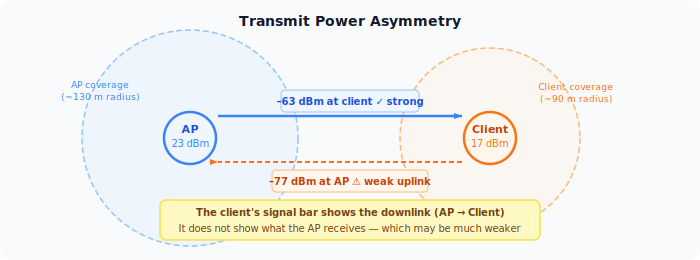
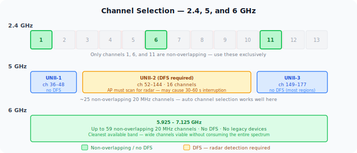
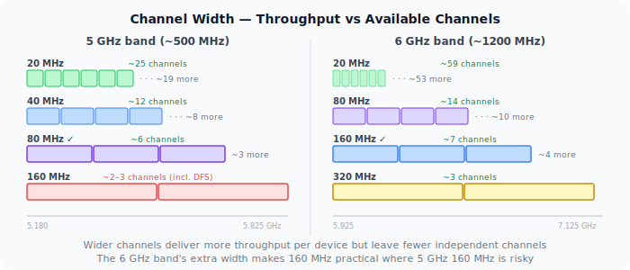

Three settings sit on every AP's radio configuration page: transmit power, channel, and channel width. Most installs leave them on auto and move on. Auto is often fine — but understanding what these settings actually control makes the difference between a network that works and one that works well, especially when multiple APs share the same space.

## Transmit Power and the Asymmetric Link

An AP typically transmits at 20–23 dBm (100–200 mW). A smartphone transmits at 15–20 dBm (30–100 mW), often less under battery saving. A laptop sits somewhere in between.

This asymmetry creates a link that's stronger in one direction than the other. A client at 25 metres from the AP may decode the AP's beacon at -65 dBm and show a full signal bar. The AP, receiving the client's weaker uplink, may see that same device at -80 dBm — at the edge of reliable decode.

**The RSSI shown on the client is downlink signal** — what the AP transmits and the client receives. It says nothing about what the AP can hear back. A client with a full signal bar but a poor uplink retransmits constantly, holds a low data rate, and consumes airtime — without the user seeing any obvious problem.

**High transmit power isn't always better.** At maximum power, the AP's coverage circle expands — but it creates a zone at the outer edge where clients associate based on strong downlink but can't transmit back effectively. It also increases co-channel interference for neighbouring APs. In dense multi-AP environments, lower per-AP power combined with closer spacing outperforms high power with sparse placement.

The right transmit power is set so that the -70 dBm downlink contour roughly matches the range at which client uplinks are still usable — typically 14–18 dBm in multi-AP environments rather than the 23 dBm maximum.

## Channel Selection

WiFi channels are slices of the radio spectrum. Choosing them well minimises interference between APs sharing the same physical space.

### 2.4 GHz — Only Three Usable Channels

The 2.4 GHz band is 83.5 MHz wide and divided into 13 channels (14 in Japan) spaced 5 MHz apart. A 20 MHz channel overlaps with the four channels on either side. The only three channels that don't overlap with each other in most regions are **1, 6, and 11**.

Using any other channel — 3, 8, 4 — means your transmissions partially overlap with neighbours, causing worse interference than full co-channel overlap would. Co-channel devices at least detect each other via CSMA/CA and back off. Partially-overlapping devices don't detect each other — they transmit simultaneously and corrupt each other's frames without backing off.

The practical result: every 2.4 GHz radio in a building should be on 1, 6, or 11. Nothing else.

### 5 GHz — More Channels, More Flexibility

The 5 GHz band offers up to 25 non-overlapping 20 MHz channels in most regions. It's divided into three sub-bands:

- **UNII-1 (channels 36–48)** — available everywhere, no restrictions, no DFS required. Use these first.
- **UNII-2 (channels 52–144)** — require **DFS** (Dynamic Frequency Selection). The AP must scan for radar and vacate the channel within 10 seconds if detected. DFS channel changes cause a 30–60 second service interruption on that radio.
- **UNII-3 (channels 149–177)** — available without DFS in most regions. Good second option after UNII-1.

Auto channel selection works well on 5 GHz because the band has enough channels that APs can find clean ones without user help.

### 6 GHz — The Cleanest Band

WiFi 6E and WiFi 7 add the 6 GHz band (5.925–7.125 GHz), providing up to 59 non-overlapping 20 MHz channels depending on region. No legacy devices use it, no DFS is required in most regions, and the band is effectively empty compared to the crowded 2.4 and 5 GHz bands. The trade-off is range — 6 GHz attenuates faster through walls and with distance.

## Channel Width

Channel width controls how much spectrum a radio uses per transmission. Wider channels carry more data per frame — an 80 MHz channel has four times the raw capacity of a 20 MHz channel — but they consume more spectrum, leave fewer non-overlapping options, and pick up interference from a wider frequency range.

### 2.4 GHz: Always 20 MHz

The 2.4 GHz band is only 83.5 MHz wide. A 40 MHz channel consumes nearly half of it, leaving at most two non-overlapping options — and those two options overlap with neighbouring networks. 20 MHz is the correct width for 2.4 GHz in any environment with neighbours. The throughput gain from 40 MHz doesn't compensate for the interference it creates.

### 5 GHz: 80 MHz as the Practical Default

5 GHz is wide enough that 80 MHz channels are practical. An 80 MHz channel gives most clients excellent throughput and still leaves 5–6 non-overlapping options across the full band. 160 MHz is available but spans most of UNII-2, which requires DFS, introduces radar-avoidance risk, and primarily benefits clients doing large close-range transfers. For most deployments, 80 MHz on 5 GHz is the right default.

### 6 GHz: 160 MHz and 320 MHz Are Viable

The 6 GHz band is wide enough that 160 MHz channels still leave meaningful non-overlapping alternatives. WiFi 7's 320 MHz channel is designed for 6 GHz and delivers very high throughput where the band is available. The shorter range of 6 GHz limits interference from distant networks, making wide channels more practical here than in 5 GHz.

**Non-overlapping channel availability by width:**

| Band | 20 MHz | 40 MHz | 80 MHz | 160 MHz |
|------|--------|--------|--------|---------|
| 2.4 GHz | 3 | 1–2 | — | — |
| 5 GHz | ~25 | ~12 | ~6 | ~2–3 (DFS) |
| 6 GHz | ~59 | ~29 | ~14 | ~7 |

## How They Interact

These three settings pull against each other.

**High transmit power + wide channels** maximises range and per-device throughput — but creates large interference zones and leaves fewer clean channels for neighbouring APs.

**Low transmit power + narrow channels** allows denser AP spacing with less mutual interference — but reduces per-device throughput and coverage radius.

**Auto settings** balance these dynamically. They work well in stable environments and fail in dense or high-change environments where the algorithm can't converge, or when auto logic doesn't account for the client uplink constraint.

A reasonable starting point for a multi-AP environment:

| Band | Channel width | Channel | Transmit power |
|------|--------------|---------|----------------|
| 2.4 GHz | 20 MHz | 1, 6, or 11 (manual) | 14–17 dBm |
| 5 GHz | 80 MHz | Auto (UNII-1/3 preferred) | 17–20 dBm |
| 6 GHz | 160 MHz | Auto | 17–20 dBm |

These are starting points, not rules. A single-AP home network can run full power and wide channels without issue. A venue with 50 APs needs tighter power and narrower channel discipline to keep the co-channel interference manageable.
