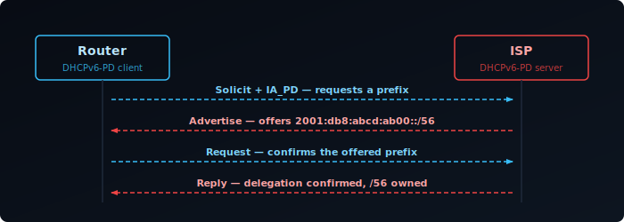
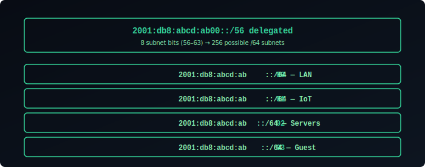
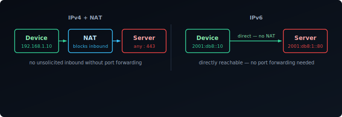
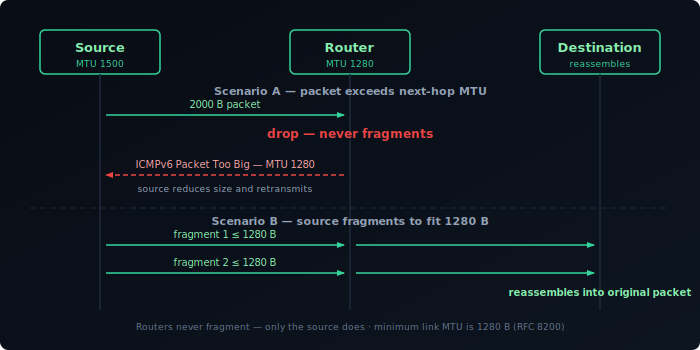
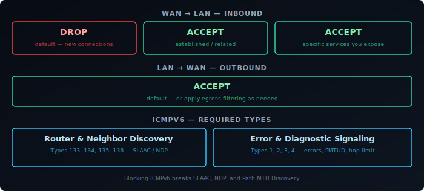
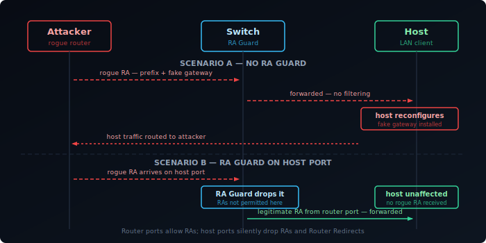
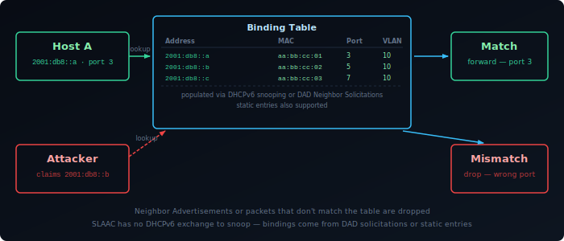
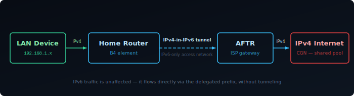
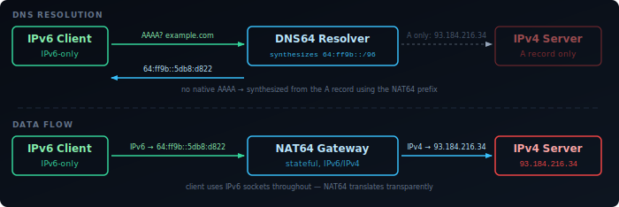

In IPv4, a home router gets one public IP address from the ISP and uses NAT to share it across all devices on the LAN. IPv6 is designed differently: there's no NAT, so every device needs a public address. The mechanism that makes this work at scale is **prefix delegation** — the ISP delegates an entire address block to your router, which subdivides it and advertises smaller prefixes to each of its networks. Understanding how the router acquires that block is the foundation for understanding IPv6 routing — and, once every device is directly addressable, for understanding how to secure the network at the border and at the link layer.

## DHCPv6-PD

Prefix delegation is negotiated through **DHCPv6-PD** (DHCPv6 Prefix Delegation), defined in [RFC 8415][1]. It uses the same 4-step exchange as DHCPv6 (covered in [Addressing, Autoconfiguration & Multicast]()), but the router requests a prefix block rather than a single address. The router acts as a DHCPv6-PD client on its WAN interface; the ISP's DHCPv6 server assigns a prefix and its lease time.

The router now owns that prefix for the duration of the lease and is responsible for routing all traffic destined to it.



## Prefix Sizes

ISPs vary in how much space they delegate:

| Prefix | Subnets available (/64) | Typical assignment |
|--------|------------------------|-------------------|
| `/48`  | 65,536 | Business, some residential ISPs |
| `/56`  | 256 | Common residential |
| `/60`  | 16 | Some ISPs, minimal allocation |
| `/64`  | 1 | Single subnet — no room to divide |

A `/64` delegation is the worst case: the router can use it for exactly one subnet and cannot subdivide further (since `/64` is the standard subnet size). A `/56` is the practical minimum for a homelab — 256 subnets covers any reasonable VLAN segmentation. A `/48` gives essentially unlimited subnets.

## Subdividing the Prefix

Once the router has a delegated prefix, it carves it into `/64` subnets and assigns one to each interface or VLAN. It then sends Router Advertisements on each interface with the appropriate prefix, triggering [SLAAC]() on the clients.

With a `/56` delegation of `2001:db8:abcd:ab00::/56`, the router has 8 bits of subnet space — bits 56 to 63. In the fourth 16-bit group `abXX`, the first byte `ab` is part of the ISP's fixed /56 prefix; the second byte `XX` (00–ff) is the subnet field the router controls:

```
2001:db8:abcd:ab00::/64  ← LAN (VLAN 1)
2001:db8:abcd:ab01::/64  ← IoT (VLAN 2)
2001:db8:abcd:ab02::/64  ← Servers (VLAN 3)
2001:db8:abcd:ab03::/64  ← Guest (VLAN 4)
...
2001:db8:abcd:abff::/64  ← subnet 255
```



The router adds a route for the entire delegated prefix pointing to itself on the WAN side, and routes individual `/64` subnets to the correct internal interfaces.

## Prefix Stability

Delegated prefixes are not always stable. Many ISPs rotate prefixes on reconnect or lease expiry, which means every device's public address changes. This matters if you're running services reachable by IPv6 address, DNS records point to specific addresses, or firewall rules reference specific prefixes.

Some ISPs offer stable prefix delegation as an add-on. Dynamic DNS that updates IPv6 records on prefix change can also mitigate the problem.

## NPTv6

NPTv6 (Network Prefix Translation for IPv6, [RFC 6296][2]) is a stateless 1:1 prefix translation mechanism. It maps one IPv6 prefix to another at the network boundary, rewriting only the network part while leaving the interface identifier unchanged.

The primary use case is working around a `/64` delegation: the router translates the single delegated `/64` into multiple internal ULA prefixes, one per subnet. From the outside, all traffic appears to come from addresses within the delegated `/64`. Internally, each VLAN has its own ULA `/64`.

```
ISP delegates:  2001:db8:abcd:1::/64

Internal VLAN 1 (ULA): fd00:1::/64  ←→  2001:db8:abcd:1::/64  (NPTv6)
Internal VLAN 2 (ULA): fd00:2::/64  ←→  (no external mapping — internal only)
```

NPTv6 differs fundamentally from NAT44. It is stateless — there are no connection tracking tables and no port remapping. Each internal address maps deterministically to exactly one external address. End-to-end reachability is preserved for inbound connections, unlike NAT. But it still breaks the end-to-end address transparency that IPv6 was designed to provide, and some protocols that embed addresses in their payload will fail without application-layer gateways.

NPTv6 is a workaround for a constrained delegation, not a recommended design. The correct solution is to obtain a larger prefix from your ISP.

## End-to-End Reachability

With the router's prefix subdivided across subnets and advertised via RA, every device has a globally routable address. The original internet model assumed exactly this — NAT broke it: a device behind NAT cannot receive unsolicited inbound connections without port forwarding, complicating peer-to-peer applications, VoIP, gaming, and anything that needs to accept inbound traffic.

IPv6 restores end-to-end connectivity. A device with a GUA (Global Unicast Address) is directly reachable from anywhere on the internet — no port forwarding required. The router forwards packets to the correct internal host based on the destination address.



## NAT Is Not Security

A common misconception is that NAT provides security by hiding internal addresses. This conflates two things: address translation and access control.

NAT does provide a degree of implicit filtering — unsolicited inbound connections are dropped because there's no translation state for them. But this is a side effect, not the mechanism. A stateful firewall achieves the same result explicitly and with far more control.

In IPv6, the firewall must do what the stateful firewall in an IPv4 router does — and nothing about this is harder. It's just more visible: the firewall policy is explicit, rather than being hidden inside the NAT state table.

## IPv6 Routing

Routing in IPv6 follows the same principles as IPv4. Routers forward packets based on the longest matching prefix in their routing table. The source address of a packet does not affect forwarding decisions (except for policy routing).

The routing hierarchy with prefix delegation:

- The ISP's core routers have a route for your delegated prefix pointing toward your CPE.
- Your router has the delegated prefix in its table, with individual `/64` subnets pointing to internal interfaces.
- Devices use their link-local router as the default gateway (learned via RA).

Because there's no NAT, traffic from an internal device leaves with its actual source address. The ISP's routers see `2001:db8:abcd:ab01::a3f2` as the source, not a single shared public IP.

## Firewalling IPv6

The principle is the same as firewalling IPv4: default-deny inbound, allow established and related traffic, explicitly permit what you want to accept. The difference is that every device is directly addressed, so the firewall must actually enforce the policy rather than relying on NAT state.

A correct IPv6 firewall on a home or homelab router:

**WAN → LAN (inbound):** Drop everything by default. Explicitly allow return traffic for established connections using stateful tracking. Permit specific services you intentionally expose.

**LAN → WAN (outbound):** Allow by default, or apply egress filtering as needed.

## Fragmentation

IPv6 removes in-path fragmentation entirely. In IPv4, routers can fragment packets that exceed the link MTU and reassemble at the destination. IPv6 **routers never fragment** — only the source node does, using a Fragment extension header. If a router receives an IPv6 packet too large for the next-hop link, it drops it and sends an ICMPv6 **Packet Too Big** message back to the source. The source then reduces its packet size and retransmits.

This mechanism is Path MTU Discovery (PMTUD). It requires Packet Too Big messages to reach the sender. Firewalls that block all ICMPv6 break PMTUD and cause silent black holes — large packets are dropped with no feedback, causing connections to stall after the initial TCP handshake.

IPv6 also mandates a minimum link MTU of **1280 bytes** (RFC 8200 §5). Any IPv6-capable link must support at least this size without fragmentation. Hosts that need to send larger packets must either use PMTUD or fragment at the source.



**ICMPv6:** Must not be blocked globally. Several ICMPv6 types are required for IPv6 to function:

| Type | Name | Required |
|------|------|---------|
| 133 | Router Solicitation | Yes — SLAAC |
| 134 | Router Advertisement | Yes — SLAAC |
| 135 | Neighbor Solicitation | Yes — NDP |
| 136 | Neighbor Advertisement | Yes — NDP |
| 2 | Packet Too Big | Yes — PMTUD (blocking causes silent black holes) |
| 1 | Destination Unreachable | Yes — error signalling |
| 3 | Time Exceeded | Yes — traceroute and hop limit expiry |
| 4 | Parameter Problem | Yes — malformed header error signalling |

Blocking all ICMPv6 is a common mistake that breaks address autoconfiguration, neighbor discovery, and path MTU discovery.



## ULA for Internal Services

Not every internal service should be reachable from the internet. A database, a management interface, or an internal monitoring stack should be accessible within the network but not from outside.

In IPv4 this is handled by not port-forwarding. In IPv6, the equivalent is assigning the service a **ULA address** (`fd00::/8`) instead of or in addition to its GUA. ULA addresses are not routed on the internet — the ISP drops them at the border. The firewall can also block inbound traffic to GUA addresses of internal-only services.

Using ULA for internal services makes the intent explicit in the address itself, rather than relying solely on firewall rules that might change.

## First-Hop Security

Everything above secures the border: the firewall decides what may cross from the WAN onto the LAN. But IPv6 also moves address assignment and router discovery onto the LAN's own link layer, where hosts trust Router Advertisements from any router and Neighbor Advertisements from any host by default — the rogue-RA and neighbor-cache risks already touched on in [Addressing, Autoconfiguration & Multicast]() are just as real on a well-firewalled network, because they never cross the border at all. Closing them takes switch-level mechanisms, not firewall rules.

## RA Guard

RA Guard ([RFC 6105][3]) is a switch-level feature that drops Router Advertisement and Router Redirect messages arriving on ports that should not be sending them. The switch is configured with a policy: router ports are allowed to send RAs; host ports are not. Any RA arriving on a host port is silently discarded before it reaches other devices.

RA Guard operates at layer 2, making it transparent to hosts. Configuration is per-port:

- **Router ports** — uplinks, trunk ports, or ports connected to known routers. RAs are permitted.
- **Host ports** — access ports connected to end devices. RAs are dropped.

The limitation of basic RA Guard is extension header evasion. An attacker can encapsulate a Router Advertisement inside a fragmented packet — the RA payload is split across multiple Fragment extension headers, and a naive RA Guard implementation that only inspects unfragmented packets will not recognize it as an RA. RFC 7113 updates RA Guard to require that implementations either:

- Reassemble fragments before applying the policy, or
- Drop all fragmented packets that could contain RA content on host ports.

RA Guard does not protect against attacks on the router port itself or from devices connected to unmanaged switches.



## DHCPv6 Guard

DHCPv6 Guard ([RFC 7610][4]) applies the same principle to DHCPv6 server messages. The switch drops DHCPv6 Advertise and Reply messages arriving on host ports — only designated server ports may send them. A device on a host port attempting to run a rogue DHCPv6 server will have its responses silently dropped before they reach clients.

DHCPv6 Guard can also validate that DHCPv6 Replies contain prefixes consistent with what the legitimate server would assign, though this requires the switch to be aware of the server's allocation policy.

## ND Inspection (IPv6 Source Guard)

ND Inspection — sometimes called IPv6 Source Guard or Neighbor Discovery Inspection — is the IPv6 equivalent of IPv4's Dynamic ARP Inspection and IP Source Guard combined.

The switch builds a **binding table** associating:
- IPv6 address
- MAC address
- Switch port
- VLAN

Entries are populated from observed DHCPv6 exchanges (if DHCPv6 snooping is enabled) or from NDP traffic (Neighbor Advertisements, DAD Neighbor Solicitations). Statically configured entries can also be added.

With ND Inspection active, the switch validates every Neighbor Advertisement and data packet:

- A Neighbor Advertisement claiming a binding that does not match the table (wrong MAC, wrong port) is dropped — preventing neighbor cache poisoning.
- A data packet whose source IPv6 address does not match the binding for that port is dropped — preventing IP source spoofing.

The binding table must be populated before it enforces — typically via DHCPv6 snooping on stateful networks, or via explicit seeding on SLAAC networks. SLAAC poses a challenge: addresses are self-generated, so there is no DHCP exchange for the switch to observe. Some implementations learn bindings from DAD Neighbor Solicitations, which are sent from `::` and include the candidate address in the target field. Others require manual binding entry or rely on NDP inspection of Neighbor Advertisements during address assignment.



## SEND

SEND (SEcure Neighbor Discovery, [RFC 3971][5]) takes a different approach to the same problem: instead of relying on switch enforcement, it cryptographically authenticates RAs and NAs at the protocol level, using Cryptographically Generated Addresses (CGAs, tying an interface identifier to the sender's public key) and a Router Authorization Certificate chain that proves a router is entitled to advertise on the link. In theory this closes the rogue-RA and neighbor-cache-poisoning problem without any switch involvement at all. In practice it requires universal host, router, and PKI support, adds computation overhead to address configuration, and no major operating system enables it by default — so RA Guard and DHCPv6 Guard, which need no host changes, are what actually gets deployed.

## Summary

| Mechanism | Mitigates | Where it runs | Requires |
|---|---|---|---|
| Stateful firewall | Unsolicited inbound connections from the WAN | Router (border) | Default-deny inbound policy, required ICMPv6 permitted |
| RA Guard | Rogue Router Advertisements | Switch (per-port policy) | Managed switch with RA Guard support |
| DHCPv6 Guard | Rogue DHCPv6 servers | Switch (per-port policy) | Managed switch with DHCPv6 Guard support |
| ND Inspection | Neighbor cache poisoning, IP source spoofing | Switch (binding table) | Managed switch; DHCPv6 snooping or manual bindings |
| SEND | Rogue RAs, neighbor cache poisoning | Host and router | PKI, host and router OS support |

The border and the link layer are two different attack surfaces, and both need coverage: a default-deny stateful firewall at the WAN edge, plus RA Guard and DHCPv6 Guard on access ports, plus ND Inspection wherever stateful DHCPv6 provides a binding table to enforce against. SEND remains the theoretically complete answer, deferred until host and router ecosystem support actually materializes.

## Transition Mechanisms

The internet is not going to be fully IPv6 overnight. IPv4 servers will exist for years, and ISPs that have already moved their core infrastructure to IPv6 still need their customers to reach them. The mechanisms that bridge the gap — DS-Lite, NAT64, DNS64, and 464XLAT — are not curiosities. If you have a residential internet connection in Europe, your router is probably using one of them right now.

### DS-Lite

DS-Lite (Dual-Stack Lite, [RFC 6333][6]) is how many ISPs provide IPv4 access over an IPv6-only access network. The ISP has already removed IPv4 from the link between your home and their core — you get a single IPv6 address on the WAN interface. DS-Lite lets IPv4 traffic ride over that IPv6 link.

The mechanism has two components:

- **B4** (Basic Bridging BroadBand element): the function in your home router that encapsulates outbound IPv4 packets inside IPv6 and forwards them toward the ISP.
- **AFTR** (Address Family Transition Router): the ISP-side gateway that decapsulates the IPv6 tunnel, recovers the original IPv4 packets, and applies NAT44 to forward them onto the IPv4 internet.

Traffic flow: your device sends an IPv4 packet → B4 wraps it in an IPv6 header addressed to the AFTR → tunneled over the ISP's IPv6 network → AFTR unwraps and NATs it to the IPv4 internet.



Your devices still see an IPv4 address on your LAN. You still run a private range like `192.168.0.0/24` internally. What changes is that you never get a public IPv4 address — you share one with other customers behind the AFTR. This is carrier-grade NAT (CGN), which means your public IPv4 is not exclusive, and port forwarding is not possible unless the ISP provides an exception.

IPv6 traffic is unaffected. It flows directly using your delegated prefix, without tunneling.

### NAT64 and DNS64

NAT64 ([RFC 6146][7]) solves the opposite problem: an IPv6-only client that needs to reach an IPv4-only server. It is widely deployed on mobile networks, where LTE and 5G carry IPv6 traffic natively and operators want to avoid the cost of maintaining IPv4 infrastructure.

A NAT64 gateway sits at the network edge. It owns a block of IPv6 address space — by convention the well-known prefix `64:ff9b::/96` ([RFC 6052][8]) — and translates packets addressed to that range into IPv4. The last 32 bits of the IPv6 address encode the IPv4 destination:

```
64:ff9b::93.184.216.34  →  93.184.216.34
```

The problem is that an IPv6-only client asking for `example.com` will only get a AAAA record if one exists. For IPv4-only servers, there is no AAAA record. This is where **DNS64** ([RFC 6147][9]) comes in.

DNS64 is a resolver that synthesises AAAA records. When a client queries for `example.com` and the authoritative DNS returns only an A record (`93.184.216.34`), DNS64 generates a synthetic AAAA using the NAT64 prefix: `64:ff9b::93.184.216.34`. The client receives a AAAA and sends a normal IPv6 packet to that address. The NAT64 gateway receives it, strips the `64:ff9b::` prefix, and forwards the packet to `93.184.216.34` over IPv4.

From the client's perspective, it made an IPv6 connection to `example.com`. It never needed an IPv4 stack.

DNS64 only synthesises records when no native AAAA exists. Servers that already have IPv6 are reached directly, without NAT64.



### 464XLAT

NAT64 handles hostnames cleanly — DNS64 makes them reachable. It does not handle applications that bypass DNS and connect directly to an IPv4 address literal. An app that opens a socket to `1.2.3.4` cannot use DNS64, because there is no DNS query to intercept. On IPv6-only mobile networks, such apps would fail.

464XLAT ([RFC 7335][10]) solves this with client-side translation. It has two parts:

- **CLAT** (Customer-side transLATor): runs on the client device itself. It presents a synthetic IPv4 interface to the operating system and applications. When an app sends an IPv4 packet, CLAT translates it to IPv6 using the NAT64 prefix and sends it across the IPv6 network.
- **PLAT** (Provider-side transLATor): the NAT64 gateway at the network edge. It performs the IPv6-to-IPv4 translation on the far side, exactly as it does for DNS64-synthesised addresses.

Traffic flow: app sends IPv4 → CLAT translates IPv4→IPv6 → IPv6 network → PLAT/NAT64 translates IPv6→IPv4 → IPv4 internet.

The app never knows it is on an IPv6-only network. It calls the standard IPv4 socket APIs, and CLAT makes them work transparently.

This is why Android requires 464XLAT to carry Wi-Fi Calling (IMS) on IPv6-only mobile networks — the underlying SIP stack uses IPv4 addresses, and without CLAT it would fail entirely.

### When Each Is Used

| Mechanism | Direction | Who deploys it | What it preserves |
|-----------|-----------|---------------|-------------------|
| DS-Lite | IPv4 client → IPv4 internet over IPv6 access | ISP (cable, DSL) | IPv4 access without a public IPv4 address |
| NAT64 + DNS64 | IPv6-only client → IPv4 server | Mobile operators, IPv6-only networks | DNS-based IPv4 reachability for IPv6-only hosts |
| 464XLAT | IPv4 app → IPv4 internet over IPv6-only network | Mobile operators (paired with NAT64) | IPv4 socket API compatibility for apps that don't use hostnames |

DS-Lite and NAT64 address the same goal from different directions. DS-Lite starts from a dual-stack LAN and tunnels IPv4 traffic over an IPv6-only access link. NAT64 starts from an IPv6-only host and gives it IPv4 reach via translation at the gateway. 464XLAT extends NAT64 down to the application layer, covering apps that cannot use hostnames.

These mechanisms are invisible to most users. They matter for homelab use when port forwarding does not work as expected on a DS-Lite connection, or when self-hosted services are unreachable from mobile networks that use NAT64.

[1]: https://datatracker.ietf.org/doc/html/rfc8415
[2]: https://datatracker.ietf.org/doc/html/rfc6296
[3]: https://datatracker.ietf.org/doc/html/rfc6105
[4]: https://datatracker.ietf.org/doc/html/rfc7610
[5]: https://datatracker.ietf.org/doc/html/rfc3971
[6]: https://datatracker.ietf.org/doc/html/rfc6333
[7]: https://datatracker.ietf.org/doc/html/rfc6146
[8]: https://datatracker.ietf.org/doc/html/rfc6052
[9]: https://datatracker.ietf.org/doc/html/rfc6147
[10]: https://datatracker.ietf.org/doc/html/rfc7335
