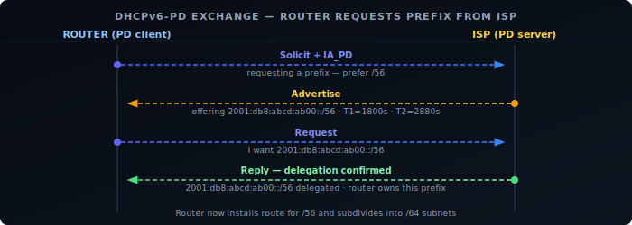
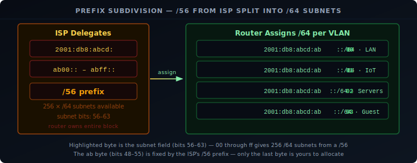

In IPv4, a home router gets one public IP address from the ISP and uses NAT to share it across all devices on the LAN. IPv6 is designed differently: there's no NAT, so every device needs a public address. The mechanism that makes this work at scale is **prefix delegation** — the ISP delegates an entire address block to your router, which subdivides it and advertises smaller prefixes to each of its networks. Understanding how the router acquires that block is the foundation for understanding IPv6 routing.

## DHCPv6-PD

Prefix delegation is negotiated through **DHCPv6-PD** (DHCPv6 Prefix Delegation), defined in [RFC 8415][1]. It uses the same 4-step exchange as DHCPv6 (covered in [SLAAC and Neighbor Discovery](/posts/2026-06-01-ipv6-explained-slaac/)), but the router requests a prefix block rather than a single address. The router acts as a DHCPv6-PD client on its WAN interface; the ISP's DHCPv6 server assigns a prefix and its lease time.

The router now owns that prefix for the duration of the lease and is responsible for routing all traffic destined to it.



## Prefix Sizes

ISPs vary in how much space they delegate:

| Prefix | Subnets available (/64) | Typical assignment |
|--------|------------------------|-------------------|
| `/48`  | 65,536 | Business, some residential ISPs |
| `/56`  | 256 | Common residential |
| `/60`  | 16 | Some ISPs, minimal allocation |
| `/64`  | 1 | Single subnet — no room to divide |

A `/64` delegation is the worst case: the router can use it for exactly one subnet and cannot subdivide further (since `/64` is the standard subnet size). A `/56` is the practical minimum for a homelab — 256 subnets covers any reasonable VLAN segmentation. A `/48` gives essentially unlimited subnets.

## Subdividing the Prefix

Once the router has a delegated prefix, it carves it into `/64` subnets and assigns one to each interface or VLAN. It then sends Router Advertisements on each interface with the appropriate prefix, triggering [SLAAC](/posts/2026-06-01-ipv6-explained-slaac/) on the clients.

With a `/56` delegation of `2001:db8:abcd:ab00::/56`, the router has 8 bits of subnet space — bits 56 to 63. In the fourth 16-bit group `abXX`, the first byte `ab` is part of the ISP's fixed /56 prefix; the second byte `XX` (00–ff) is the subnet field the router controls:

```
2001:db8:abcd:ab00::/64  ← LAN (VLAN 1)
2001:db8:abcd:ab01::/64  ← IoT (VLAN 2)
2001:db8:abcd:ab02::/64  ← Servers (VLAN 3)
2001:db8:abcd:ab03::/64  ← Guest (VLAN 4)
...
2001:db8:abcd:abff::/64  ← subnet 255
```



The router adds a route for the entire delegated prefix pointing to itself on the WAN side, and routes individual `/64` subnets to the correct internal interfaces.

## Prefix Stability

Delegated prefixes are not always stable. Many ISPs rotate prefixes on reconnect or lease expiry, which means every device's public address changes. This matters if you're running services reachable by IPv6 address, DNS records point to specific addresses, or firewall rules reference specific prefixes.

Some ISPs offer stable prefix delegation as an add-on. Dynamic DNS that updates IPv6 records on prefix change can also mitigate the problem.

## NPTv6

NPTv6 (Network Prefix Translation for IPv6, [RFC 6296][2]) is a stateless 1:1 prefix translation mechanism. It maps one IPv6 prefix to another at the network boundary, rewriting only the network part while leaving the interface identifier unchanged.

The primary use case is working around a `/64` delegation: the router translates the single delegated `/64` into multiple internal ULA prefixes, one per subnet. From the outside, all traffic appears to come from addresses within the delegated `/64`. Internally, each VLAN has its own ULA `/64`.

```
ISP delegates:  2001:db8:abcd:1::/64

Internal VLAN 1 (ULA): fd00:1::/64  ←→  2001:db8:abcd:1::/64  (NPTv6)
Internal VLAN 2 (ULA): fd00:2::/64  ←→  (no external mapping — internal only)
```

NPTv6 differs fundamentally from NAT44. It is stateless — there are no connection tracking tables and no port remapping. Each internal address maps deterministically to exactly one external address. End-to-end reachability is preserved for inbound connections, unlike NAT. But it still breaks the end-to-end address transparency that IPv6 was designed to provide, and some protocols that embed addresses in their payload will fail without application-layer gateways.

NPTv6 is a workaround for a constrained delegation, not a recommended design. The correct solution is to obtain a larger prefix from your ISP.

## End-to-End Reachability

With the router's prefix subdivided across subnets and advertised via RA, every device has a globally routable address. The original internet model assumed exactly this — NAT broke it: a device behind NAT cannot receive unsolicited inbound connections without port forwarding, complicating peer-to-peer applications, VoIP, gaming, and anything that needs to accept inbound traffic.

IPv6 restores end-to-end connectivity. A device with a GUA (Global Unicast Address) is directly reachable from anywhere on the internet — no port forwarding required. The router forwards packets to the correct internal host based on the destination address.


## NAT Is Not Security

A common misconception is that NAT provides security by hiding internal addresses. This conflates two things: address translation and access control.

NAT does provide a degree of implicit filtering — unsolicited inbound connections are dropped because there's no translation state for them. But this is a side effect, not the mechanism. A stateful firewall achieves the same result explicitly and with far more control.

In IPv6, the firewall must do what the stateful firewall in an IPv4 router does — and nothing about this is harder. It's just more visible: the firewall policy is explicit, rather than being hidden inside the NAT state table.

## IPv6 Routing

Routing in IPv6 follows the same principles as IPv4. Routers forward packets based on the longest matching prefix in their routing table. The source address of a packet does not affect forwarding decisions (except for policy routing).

The routing hierarchy with prefix delegation:

- The ISP's core routers have a route for your delegated prefix pointing toward your CPE.
- Your router has the delegated prefix in its table, with individual `/64` subnets pointing to internal interfaces.
- Devices use their link-local router as the default gateway (learned via RA).

Because there's no NAT, traffic from an internal device leaves with its actual source address. The ISP's routers see `2001:db8:abcd:ab01::a3f2` as the source, not a single shared public IP.

## Firewalling IPv6

The principle is the same as firewalling IPv4: default-deny inbound, allow established and related traffic, explicitly permit what you want to accept. The difference is that every device is directly addressed, so the firewall must actually enforce the policy rather than relying on NAT state.

A correct IPv6 firewall on a home or homelab router:

**WAN → LAN (inbound):** Drop everything by default. Explicitly allow return traffic for established connections using stateful tracking. Permit specific services you intentionally expose.

**LAN → WAN (outbound):** Allow by default, or apply egress filtering as needed.

## Fragmentation

IPv6 removes in-path fragmentation entirely. In IPv4, routers can fragment packets that exceed the link MTU and reassemble at the destination. IPv6 **routers never fragment** — only the source node does, using a Fragment extension header. If a router receives an IPv6 packet too large for the next-hop link, it drops it and sends an ICMPv6 **Packet Too Big** message back to the source. The source then reduces its packet size and retransmits.

This mechanism is Path MTU Discovery (PMTUD). It requires Packet Too Big messages to reach the sender. Firewalls that block all ICMPv6 break PMTUD and cause silent black holes — large packets are dropped with no feedback, causing connections to stall after the initial TCP handshake.

IPv6 also mandates a minimum link MTU of **1280 bytes** (RFC 8200 §5). Any IPv6-capable link must support at least this size without fragmentation. Hosts that need to send larger packets must either use PMTUD or fragment at the source.


**ICMPv6:** Must not be blocked globally. Several ICMPv6 types are required for IPv6 to function:

| Type | Name | Required |
|------|------|---------|
| 133 | Router Solicitation | Yes — SLAAC |
| 134 | Router Advertisement | Yes — SLAAC |
| 135 | Neighbor Solicitation | Yes — NDP |
| 136 | Neighbor Advertisement | Yes — NDP |
| 2 | Packet Too Big | Yes — PMTUD (blocking causes silent black holes) |
| 1 | Destination Unreachable | Yes — error signalling |
| 3 | Time Exceeded | Yes — traceroute and hop limit expiry |
| 4 | Parameter Problem | Yes — malformed header error signalling |

Blocking all ICMPv6 is a common mistake that breaks address autoconfiguration, neighbor discovery, and path MTU discovery.


## ULA for Internal Services

Not every internal service should be reachable from the internet. A database, a management interface, or an internal monitoring stack should be accessible within the network but not from outside.

In IPv4 this is handled by not port-forwarding. In IPv6, the equivalent is assigning the service a **ULA address** (`fd00::/8`) instead of or in addition to its GUA. ULA addresses are not routed on the internet — the ISP drops them at the border. The firewall can also block inbound traffic to GUA addresses of internal-only services.

Using ULA for internal services makes the intent explicit in the address itself, rather than relying solely on firewall rules that might change.

[1]: https://datatracker.ietf.org/doc/html/rfc8415
[2]: https://datatracker.ietf.org/doc/html/rfc6296
