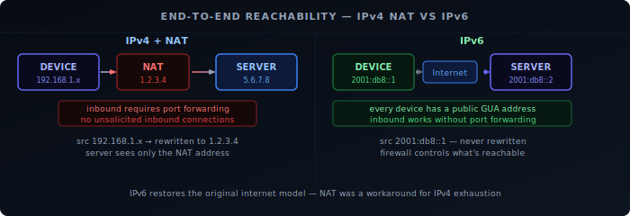
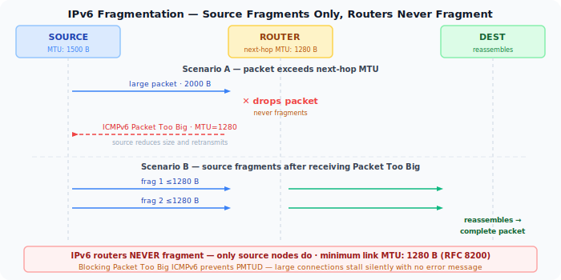
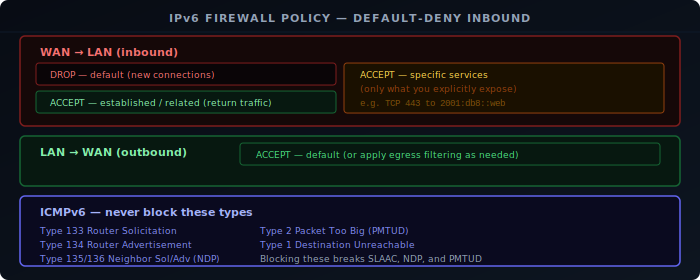

IPv4 networks almost universally use NAT — Network Address Translation. A router maps many private addresses to a single public one, and keeps state to route replies back to the right device. It works, but it's a workaround for address exhaustion, not a design goal.

IPv6 was designed with enough address space to give every device a globally routable address. NAT is not needed and largely absent from IPv6 deployments. This changes how routing and firewalling work — and forces a clear separation between them.

## End-to-End Reachability

The original internet model assumed every host had a globally routable address. NAT broke that model: a device behind NAT cannot receive unsolicited inbound connections without port forwarding. This complicates peer-to-peer applications, VoIP, gaming, and anything that needs to accept inbound traffic.

IPv6 restores end-to-end connectivity. A device with a GUA (Global Unicast Address) is directly reachable from anywhere on the internet — no port forwarding required. The router forwards packets to the correct internal host based on the destination address.

## NAT Is Not Security

A common misconception is that NAT provides security by hiding internal addresses. This conflates two things: address translation and access control.

NAT does provide a degree of implicit filtering — unsolicited inbound connections are dropped because there's no translation state for them. But this is a side effect, not the mechanism. A stateful firewall achieves the same result explicitly and with far more control.

In IPv6, the firewall must do what the stateful firewall in an IPv4 router does — and nothing about this is harder. It's just more visible: the firewall policy is explicit, rather than being hidden inside the NAT state table.

## IPv6 Routing

Routing in IPv6 follows the same principles as IPv4. Routers forward packets based on the longest matching prefix in their routing table. The source address of a packet does not affect forwarding decisions (except for policy routing).

What changes with prefix delegation is the routing hierarchy:

- The ISP's core routers have a route for your delegated prefix pointing toward your CPE.
- Your router has the delegated prefix in its table, with individual `/64` subnets pointing to internal interfaces.
- Devices use their link-local router as the default gateway (learned via RA).

Because there's no NAT, traffic from an internal device leaves with its actual source address. The ISP's routers see `2001:db8:abcd:ab01::a3f2` as the source, not a single shared public IP.

## Firewalling IPv6

The principle is the same as firewalling IPv4: default-deny inbound, allow established and related traffic, explicitly permit what you want to accept. The difference is that every device is directly addressed, so the firewall must actually enforce the policy rather than relying on NAT state.

A correct IPv6 firewall on a home or homelab router:

**WAN → LAN (inbound):** Drop everything by default. Explicitly allow return traffic for established connections using stateful tracking. Permit specific services you intentionally expose.

**LAN → WAN (outbound):** Allow by default, or apply egress filtering as needed.

## Fragmentation

IPv6 removes in-path fragmentation entirely. In IPv4, routers can fragment packets that exceed the link MTU and reassemble at the destination. IPv6 **routers never fragment** — only the source node does, using a Fragment extension header. If a router receives an IPv6 packet too large for the next-hop link, it drops it and sends an ICMPv6 **Packet Too Big** message back to the source. The source then reduces its packet size and retransmits.

This mechanism is Path MTU Discovery (PMTUD). It requires Packet Too Big messages to reach the sender. Firewalls that block all ICMPv6 break PMTUD and cause silent black holes — large packets are dropped with no feedback, causing connections to stall after the initial TCP handshake.

IPv6 also mandates a minimum link MTU of **1280 bytes** (RFC 8200 §5). Any IPv6-capable link must support at least this size without fragmentation. Hosts that need to send larger packets must either use PMTUD or fragment at the source.

**ICMPv6:** Must not be blocked globally. Several ICMPv6 types are required for IPv6 to function:

| Type | Name | Required |
|------|------|---------|
| 133 | Router Solicitation | Yes — SLAAC |
| 134 | Router Advertisement | Yes — SLAAC |
| 135 | Neighbor Solicitation | Yes — NDP |
| 136 | Neighbor Advertisement | Yes — NDP |
| 2 | Packet Too Big | Yes — PMTUD (blocking causes silent black holes) |
| 1 | Destination Unreachable | Yes — error signalling |
| 3 | Time Exceeded | Yes — traceroute and hop limit expiry |
| 4 | Parameter Problem | Yes — malformed header error signalling |

Blocking all ICMPv6 is a common mistake that breaks address autoconfiguration, neighbor discovery, and path MTU discovery.

## ULA for Internal Services

Not every internal service should be reachable from the internet. A database, a management interface, or an internal monitoring stack should be accessible within the network but not from outside.

In IPv4 this is handled by not port-forwarding. In IPv6, the equivalent is assigning the service a **ULA address** (`fd00::/8`) instead of or in addition to its GUA. ULA addresses are not routed on the internet — the ISP drops them at the border. The firewall can also block inbound traffic to GUA addresses of internal-only services.

Using ULA for internal services makes the intent explicit in the address itself, rather than relying solely on firewall rules that might change.
