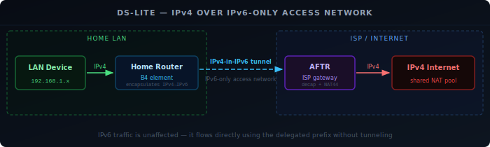
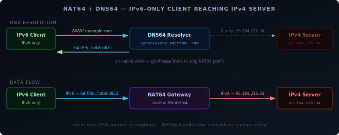

The internet is not going to be fully IPv6 overnight. IPv4 servers will exist for years, and ISPs that have already moved their core infrastructure to IPv6 still need their customers to reach them. The mechanisms that bridge the gap — DS-Lite, NAT64, DNS64, and 464XLAT — are not curiosities. If you have a residential internet connection in Europe, your router is probably using one of them right now.

## DS-Lite

DS-Lite (Dual-Stack Lite, [RFC 6333][1]) is how many ISPs provide IPv4 access over an IPv6-only access network. The ISP has already removed IPv4 from the link between your home and their core — you get a single IPv6 address on the WAN interface. DS-Lite lets IPv4 traffic ride over that IPv6 link.

The mechanism has two components:

- **B4** (Basic Bridging BroadBand element): the function in your home router that encapsulates outbound IPv4 packets inside IPv6 and forwards them toward the ISP.
- **AFTR** (Address Family Transition Router): the ISP-side gateway that decapsulates the IPv6 tunnel, recovers the original IPv4 packets, and applies NAT44 to forward them onto the IPv4 internet.

Traffic flow: your device sends an IPv4 packet → B4 wraps it in an IPv6 header addressed to the AFTR → tunneled over the ISP's IPv6 network → AFTR unwraps and NATs it to the IPv4 internet.



Your devices still see an IPv4 address on your LAN. You still run a private range like `192.168.0.0/24` internally. What changes is that you never get a public IPv4 address — you share one with other customers behind the AFTR. This is carrier-grade NAT (CGN), which means your public IPv4 is not exclusive, and port forwarding is not possible unless the ISP provides an exception.

IPv6 traffic is unaffected. It flows directly using your delegated prefix, without tunneling.

## NAT64 and DNS64

NAT64 ([RFC 6146][2]) solves the opposite problem: an IPv6-only client that needs to reach an IPv4-only server. It is widely deployed on mobile networks, where LTE and 5G carry IPv6 traffic natively and operators want to avoid the cost of maintaining IPv4 infrastructure.

A NAT64 gateway sits at the network edge. It owns a block of IPv6 address space — by convention the well-known prefix `64:ff9b::/96` ([RFC 6052][3]) — and translates packets addressed to that range into IPv4. The last 32 bits of the IPv6 address encode the IPv4 destination:

```
64:ff9b::93.184.216.34  →  93.184.216.34
```

The problem is that an IPv6-only client asking for `example.com` will only get a AAAA record if one exists. For IPv4-only servers, there is no AAAA record. This is where **DNS64** ([RFC 6147][4]) comes in.

DNS64 is a resolver that synthesises AAAA records. When a client queries for `example.com` and the authoritative DNS returns only an A record (`93.184.216.34`), DNS64 generates a synthetic AAAA using the NAT64 prefix: `64:ff9b::93.184.216.34`. The client receives a AAAA and sends a normal IPv6 packet to that address. The NAT64 gateway receives it, strips the `64:ff9b::` prefix, and forwards the packet to `93.184.216.34` over IPv4.

From the client's perspective, it made an IPv6 connection to `example.com`. It never needed an IPv4 stack.

DNS64 only synthesises records when no native AAAA exists. Servers that already have IPv6 are reached directly, without NAT64.



## 464XLAT

NAT64 handles hostnames cleanly — DNS64 makes them reachable. It does not handle applications that bypass DNS and connect directly to an IPv4 address literal. An app that opens a socket to `1.2.3.4` cannot use DNS64, because there is no DNS query to intercept. On IPv6-only mobile networks, such apps would fail.

464XLAT ([RFC 7335][5]) solves this with client-side translation. It has two parts:

- **CLAT** (Customer-side transLATor): runs on the client device itself. It presents a synthetic IPv4 interface to the operating system and applications. When an app sends an IPv4 packet, CLAT translates it to IPv6 using the NAT64 prefix and sends it across the IPv6 network.
- **PLAT** (Provider-side transLATor): the NAT64 gateway at the network edge. It performs the IPv6-to-IPv4 translation on the far side, exactly as it does for DNS64-synthesised addresses.

Traffic flow: app sends IPv4 → CLAT translates IPv4→IPv6 → IPv6 network → PLAT/NAT64 translates IPv6→IPv4 → IPv4 internet.

The app never knows it is on an IPv6-only network. It calls the standard IPv4 socket APIs, and CLAT makes them work transparently.

This is why Android requires 464XLAT to carry Wi-Fi Calling (IMS) on IPv6-only mobile networks — the underlying SIP stack uses IPv4 addresses, and without CLAT it would fail entirely.

## When Each Is Used

| Mechanism | Direction | Who deploys it | What it preserves |
|-----------|-----------|---------------|-------------------|
| DS-Lite | IPv4 client → IPv4 internet over IPv6 access | ISP (cable, DSL) | IPv4 access without a public IPv4 address |
| NAT64 + DNS64 | IPv6-only client → IPv4 server | Mobile operators, IPv6-only networks | DNS-based IPv4 reachability for IPv6-only hosts |
| 464XLAT | IPv4 app → IPv4 internet over IPv6-only network | Mobile operators (paired with NAT64) | IPv4 socket API compatibility for apps that don't use hostnames |

DS-Lite and NAT64 address the same goal from different directions. DS-Lite starts from a dual-stack LAN and tunnels IPv4 traffic over an IPv6-only access link. NAT64 starts from an IPv6-only host and gives it IPv4 reach via translation at the gateway. 464XLAT extends NAT64 down to the application layer, covering apps that cannot use hostnames.

These mechanisms are invisible to most users. They matter for homelab use when port forwarding does not work as expected on a DS-Lite connection, or when self-hosted services are unreachable from mobile networks that use NAT64.

[1]: https://datatracker.ietf.org/doc/html/rfc6333
[2]: https://datatracker.ietf.org/doc/html/rfc6146
[3]: https://datatracker.ietf.org/doc/html/rfc6052
[4]: https://datatracker.ietf.org/doc/html/rfc6147
[5]: https://datatracker.ietf.org/doc/html/rfc7335
