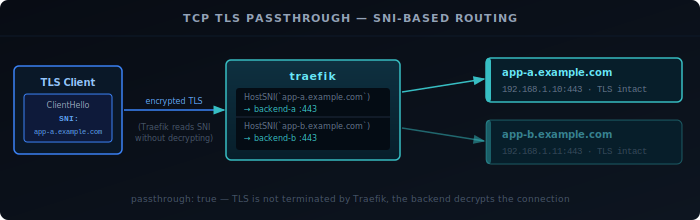

HTTP routing works because Traefik can read the request — the hostname, the path, the headers — and make a decision based on what it sees. Not every service speaks HTTP. For databases, DNS resolvers, game servers, or anything else that uses raw TCP or UDP, Traefik operates at Layer 4: it sees the port and, for TLS connections, the SNI name. That is enough to route most non-HTTP traffic without running a separate proxy.

## Prerequisites

- Traefik running — see the [installation guide][1]

## How TCP/UDP Routing Differs from HTTP

HTTP routing happens at Layer 7. Traefik reads the full request and can match on host, path, method, or headers. TCP and UDP routing is more limited:

- **TCP with TLS**: Traefik can read the SNI name from the TLS ClientHello before the handshake completes. This allows routing to different backends based on hostname — without decrypting the traffic.
- **TCP without TLS**: No application data to inspect. Every connection on that port goes to the same backend.
- **UDP**: No connections, no handshake, no SNI. One entry point maps to one service.

The config structure mirrors this. HTTP config lives under `http:` and uses `Host()` rules. TCP config lives under `tcp:` and uses `HostSNI()` rules. UDP config lives under `udp:` with no rules at all.

## Configuring Entry Points

TCP and UDP entry points are defined the same way as HTTP ones — in the static config, one per port. `/udp` at the end of the address marks the port as UDP.

**Docker:**

Add each port to both the `command` flags and the `ports` list:

```yaml {filename="docker-compose.yml"}
command:
  - "--entryPoints.postgres.address=:5432"
  - "--entryPoints.dns-udp.address=:53/udp"
  # ... rest of your existing flags

ports:
  - "80:80"
  - "443:443"
  - "5432:5432"
  - "53:53/udp"
```

**Bare metal:**

Add the entry points to the static config alongside your existing HTTP ones:

```yaml {filename="/etc/traefik/traefik.yml"}
entryPoints:
  web:
    address: ":80"
  websecure:
    address: ":443"
  postgres:
    address: ":5432"
  dns-udp:
    address: ":53/udp"
```

## TCP Router and SNI Routing

### TLS Passthrough

The most common TCP use case is forwarding TLS traffic without terminating it — the backend handles TLS itself, and Traefik reads only the SNI name to decide where to send it. Set `passthrough: true` so Traefik does not attempt to decrypt the connection.



```yaml {filename="conf.d/https-passthrough.yml"}
tcp:
  routers:
    https-passthrough:
      entryPoints: [websecure]
      rule: "HostSNI(`app.example.com`)"
      service: app-backend
      tls:
        passthrough: true

  services:
    app-backend:
      loadBalancer:
        servers:
          - address: "192.168.1.10:443"
```

To match all TLS connections on the entry point without inspecting the hostname, use `HostSNI(`*`)`. This is useful when you have one backend or want to catch all traffic that did not match a more specific rule:

```yaml
rule: "HostSNI(`*`)"
```

### Plain TCP (No TLS)

For services without TLS — PostgreSQL, MQTT, SMTP — there is no SNI to inspect. Use `HostSNI(`*`)` without a `tls` block. Traefik forwards the raw bytes unchanged:

```yaml {filename="conf.d/postgres.yml"}
tcp:
  routers:
    postgres:
      entryPoints: [postgres]
      rule: "HostSNI(`*`)"
      service: postgres

  services:
    postgres:
      loadBalancer:
        servers:
          - address: "192.168.1.20:5432"
```

Because there is no way to distinguish between plain-TCP connections on the same port, one entry point per service is the cleanest approach — you cannot multiplex two plain-TCP backends on `:5432`.

**Docker labels:**

The entry point still needs to be in the static config, but the router can be wired up via labels on the service container:

```yaml {filename="docker-compose.yml"}
labels:
  - "traefik.enable=true"
  - "traefik.tcp.routers.postgres.entrypoints=postgres"
  - "traefik.tcp.routers.postgres.rule=HostSNI(`*`)"
  - "traefik.tcp.services.postgres.loadbalancer.server.port=5432"
```

## UDP Routing

UDP has no connection state and no SNI. Traefik maps an entry point directly to a service — there are no routing rules to write:

```yaml {filename="conf.d/dns.yml"}
udp:
  routers:
    dns:
      entryPoints: [dns-udp]
      service: dns

  services:
    dns:
      loadBalancer:
        servers:
          - address: "192.168.1.1:53"
```

**Docker labels:**

```yaml {filename="docker-compose.yml"}
labels:
  - "traefik.enable=true"
  - "traefik.udp.routers.dns.entrypoints=dns-udp"
  - "traefik.udp.services.dns.loadbalancer.server.port=53"
```

UDP labels use `traefik.udp.` instead of `traefik.tcp.` or `traefik.http.`. There is no `rule` key — UDP routing does not support rules.

## Putting It Together

The example below combines all three in one config: TLS passthrough on `:443`, a PostgreSQL backend on `:5432`, and DNS forwarding on `:53/udp`.

Static config:

```yaml {filename="/etc/traefik/traefik.yml"}
entryPoints:
  web:
    address: ":80"
  websecure:
    address: ":443"
  postgres:
    address: ":5432"
  dns-udp:
    address: ":53/udp"
```

Dynamic config:

```yaml {filename="conf.d/layer4.yml"}
tcp:
  routers:
    tls-passthrough:
      entryPoints: [websecure]
      rule: "HostSNI(`*`)"
      service: backend-https
      tls:
        passthrough: true

    db:
      entryPoints: [postgres]
      rule: "HostSNI(`*`)"
      service: backend-db

  services:
    backend-https:
      loadBalancer:
        servers:
          - address: "192.168.1.10:443"
    backend-db:
      loadBalancer:
        servers:
          - address: "192.168.1.20:5432"

udp:
  routers:
    dns:
      entryPoints: [dns-udp]
      service: backend-dns

  services:
    backend-dns:
      loadBalancer:
        servers:
          - address: "192.168.1.1:53"
```

A TLS connection to `:443` is matched by SNI and forwarded encrypted to `192.168.1.10:443`. A connection to `:5432` goes straight to the PostgreSQL server on `192.168.1.20`. A UDP packet to `:53` is forwarded to the DNS resolver on `192.168.1.1`.

[1]: 
