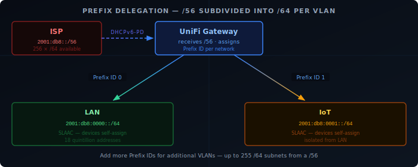

Getting IPv6 working properly on Unifi involves more than just flipping a switch — you need to configure prefix delegation from your ISP, set up SLAAC or DHCPv6 for client addressing, and make sure your firewall rules don't inadvertently expose your devices. This post walks through a complete Unifi IPv6 setup from ISP handoff to verified end-to-end connectivity.

## Prerequisites

Before starting, confirm:

- Your ISP provides native IPv6 with **prefix delegation** (PD) — ask support or check your ISP's IPv6 status page
- Your gateway is a UniFi Console (UDM Pro, UDM SE, UCG Ultra, Dream Router, or similar)
- UniFi Network application 8.x or newer

If your ISP only offers a single IPv6 address without PD, you won't be able to assign addresses to LAN clients natively — you'd need a tunnel (Hurricane Electric 6in4), which is out of scope here.

## How IPv6 on Unifi Works

Your ISP delegates a block of IPv6 addresses — typically a `/56` or `/48` — to your gateway via DHCPv6. Your gateway then carves that block into `/64` subnets, one per VLAN, and advertises the prefix to devices on each network so they can self-assign addresses (SLAAC).



Each `/64` gives you 18 quintillion addresses per network — enough that you never need NAT.

## Step 1 — Enable IPv6 on the WAN

Go to **Settings → Internet** and click your primary WAN connection. Scroll to **IPv6** and set:

| Field | Value |
|-------|-------|
| **IPv6 Connection Type** | DHCPv6 |
| **Prefix Delegation Size** | 56 (or 48 — match what your ISP provides) |

Save and give the gateway 30–60 seconds. The WAN IPv6 address and delegated prefix should appear under **Dashboard → Gateway**.

If your ISP uses PPPoE for IPv6, select **PPPoE** as the connection type and enable DHCPv6 PD within it.

## Step 2 — Assign IPv6 to Your Networks

For each VLAN you want IPv6 on, go to **Settings → Networks**, edit the network, and scroll to **IPv6**.

| Field | Value |
|-------|-------|
| **IPv6 Interface Type** | Prefix Delegation |
| **IPv6 Prefix Delegation Interface** | WAN (your primary WAN) |
| **Prefix ID** | 0 for LAN, 1 for IoT, 2 for next VLAN, etc. |
| **IPv6 Router Advertisement** | Enabled |
| **RA Mode** | Stateless (SLAAC) |

The Prefix ID carves a `/64` out of your delegated block. With a `/56` delegation:

- Prefix ID `0` → first `/64` of your block
- Prefix ID `1` → second `/64`
- Up to 255 unique VLANs with their own `/64`

**SLAAC** is the right choice for most home networks — devices generate their own addresses from the prefix, no DHCP server needed. If you need fixed IPv6 addresses for servers, enable DHCPv6 and assign static leases by DUID instead.

## Step 3 — IPv6 Firewall Rules

This is the step most guides skip. Unlike IPv4 where NAT blocks unsolicited inbound traffic by default, IPv6 is end-to-end — every device gets a globally routable address. Without firewall rules, devices on your LAN are directly reachable from the internet.

Unifi uses a **zone-based firewall**. Rules are defined between zones (Internet, LAN, IoT, etc.) rather than on individual interfaces. Go to **Settings → Firewall & Security** and open the **Zone Matrix**. Click the cell for **Internet → LAN** to add rules for traffic entering your LAN from the internet.

### Allow established and related traffic

| Field | Value |
|-------|-------|
| Action | Accept |
| Protocol | All |
| Match State Established | ✓ |
| Match State Related | ✓ |

This covers return traffic for connections your devices initiated — browsing, DNS, updates. Unifi applies this to both IPv4 and IPv6 within the zone pair.

### Allow ICMPv6

ICMPv6 is not optional — IPv6 neighbor discovery (NDP), router advertisements, and path MTU discovery all depend on it. Block it and IPv6 breaks silently.

Still in **Internet → LAN**:

| Field | Value |
|-------|-------|
| Action | Accept |
| Protocol | ICMPv6 |
| IP Version | IPv6 |

### Block everything else inbound

Add a final rule in **Internet → LAN** — place this **after** the two accept rules:

| Field | Value |
|-------|-------|
| Action | Drop |
| Protocol | All |
| IP Version | IPv6 |

Repeat the ICMPv6 allow and the drop rule for any other zone that gets IPv6 — **Internet → IoT**, **Internet → Guest**, and so on.

With these rules in place, inbound IPv6 behaves like NAT IPv4: only traffic your devices initiated can come back in.

## Step 4 — Verify Connectivity

Check that devices have received a global IPv6 address. On the device:

```bash
# Linux / macOS
ip -6 addr show        # look for a 2xxx:: or fdxx:: address
ping6 google.com

# Windows
ipconfig               # look for IPv6 Address under your adapter
ping -6 google.com
```

A global IPv6 address starts with `2` — something like `2001:db8:abcd:0:...`. An `fe80::` address is link-local only and means prefix delegation hasn't reached the device yet.

For a full connectivity test, visit **test-ipv6.com** from any browser on your network. It checks both connectivity and DNS resolution over IPv6 and gives a score out of 10.

On the gateway side, **Dashboard → Gateway** shows the active WAN IPv6 address and the delegated prefix. If you see neither, the ISP handshake hasn't completed — check that DHCPv6 PD is enabled and try rebooting the gateway.

## Common Issues

**Devices get `fe80::` only, no global address**
Router advertisements aren't reaching clients. Confirm IPv6 RA is enabled on the network and that no firewall rule is blocking ICMPv6 between the gateway and LAN.

**IPv6 works on LAN but not IoT VLAN**
Each VLAN needs its own IPv6 configuration. Go back to Step 2 and repeat for the IoT network, using a different Prefix ID.

**`test-ipv6.com` shows 0/10 despite having an address**
Your IPv6 DNS (AAAA records) may not be resolving. Check that your DNS server is reachable over IPv6, or set the gateway to use a known IPv6-capable resolver like `2606:4700:4700::1111` (Cloudflare) or `2001:4860:4860::8888` (Google).

**ISP gives a `/64` instead of a `/56` or `/48`**
With only a single `/64` delegated, you can only assign IPv6 to one network. You can work around this with Unique Local Addresses (ULA, `fd::/8`) on additional VLANs, but those won't route to the internet.

## Recap

You've learned how to:

- Request a delegated IPv6 prefix from your ISP over DHCPv6
- Assign a `/64` subnet per VLAN using Prefix IDs
- Write the three firewall rules that keep global IPv6 addresses safe
- Verify end-to-end connectivity from client to internet
