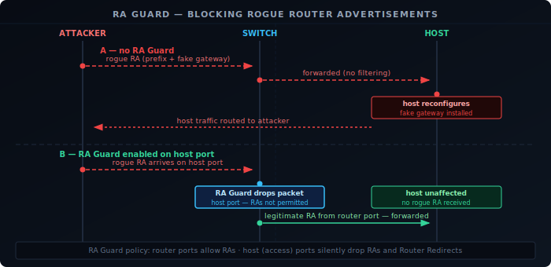
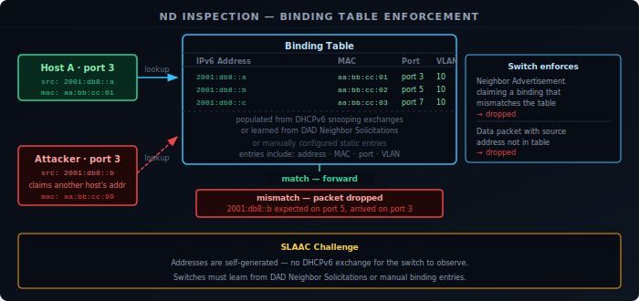

IPv6 moves address assignment and router discovery to the link layer — devices trust Router Advertisements from any router and Neighbor Advertisements from any host. In IPv4, DHCP snooping and ARP inspection are well-understood mitigations for equivalent threats. IPv6 has its own set of first-hop security mechanisms that address the same problem space.

## The Threat Model

On a shared link, any device can send ICMPv6 messages. Without protection, this enables several attacks:

**Rogue Router Advertisement** — an attacker sends an RA claiming to be the default router, with a prefix and potentially a higher router preference. Hosts that accept it reconfigure their default gateway and route traffic through the attacker. This is the most impactful first-hop attack in IPv6: it requires no privileges on most operating systems, and tools exist that automate it.

**DHCPv6 spoofing** — on networks using stateful DHCPv6, a rogue DHCPv6 server responds to client Solicits before the legitimate server, assigning addresses from an attacker-controlled pool with attacker-controlled DNS servers.

**Neighbor Cache poisoning** — equivalent to ARP spoofing. An attacker sends unsolicited Neighbor Advertisements claiming a target IPv6 address maps to the attacker's MAC, redirecting traffic intended for the target.

**Redirect attacks** — a rogue router sends ICMPv6 Redirect messages to hosts, telling them that a better next-hop exists for a specific destination — via the attacker's address.

## RA Guard

RA Guard ([RFC 6105][1]) is a switch-level feature that drops Router Advertisement and Router Redirect messages arriving on ports that should not be sending them. The switch is configured with a policy: router ports are allowed to send RAs; host ports are not. Any RA arriving on a host port is silently discarded before it reaches other devices.

RA Guard operates at layer 2, making it transparent to hosts. Configuration is per-port:

- **Router ports** — uplinks, trunk ports, or ports connected to known routers. RAs are permitted.
- **Host ports** — access ports connected to end devices. RAs are dropped.

The limitation of basic RA Guard is extension header evasion. An attacker can encapsulate a Router Advertisement inside a fragmented packet — the RA payload is split across multiple Fragment extension headers, and a naive RA Guard implementation that only inspects unfragmented packets will not recognize it as an RA. RFC 7113 updates RA Guard to require that implementations either:

- Reassemble fragments before applying the policy, or
- Drop all fragmented packets that could contain RA content on host ports.

RA Guard does not protect against attacks on the router port itself or from devices connected to unmanaged switches.

## DHCPv6 Guard

DHCPv6 Guard ([RFC 7610][2]) applies the same principle to DHCPv6 server messages. The switch drops DHCPv6 Advertise and Reply messages arriving on host ports — only designated server ports may send them. A device on a host port attempting to run a rogue DHCPv6 server will have its responses silently dropped before they reach clients.

DHCPv6 Guard can also validate that DHCPv6 Replies contain prefixes consistent with what the legitimate server would assign, though this requires the switch to be aware of the server's allocation policy.

## ND Inspection (IPv6 Source Guard)

ND Inspection — sometimes called IPv6 Source Guard or Neighbor Discovery Inspection — is the IPv6 equivalent of IPv4's Dynamic ARP Inspection and IP Source Guard combined.

The switch builds a **binding table** associating:
- IPv6 address
- MAC address
- Switch port
- VLAN

Entries are populated from observed DHCPv6 exchanges (if DHCPv6 snooping is enabled) or from NDP traffic (Neighbor Advertisements, DAD Neighbor Solicitations). Statically configured entries can also be added.

With ND Inspection active, the switch validates every Neighbor Advertisement and data packet:

- A Neighbor Advertisement claiming a binding that does not match the table (wrong MAC, wrong port) is dropped — preventing neighbor cache poisoning.
- A data packet whose source IPv6 address does not match the binding for that port is dropped — preventing IP source spoofing.

The binding table must be populated before it enforces — typically via DHCPv6 snooping on stateful networks, or via explicit seeding on SLAAC networks. SLAAC poses a challenge: addresses are self-generated, so there is no DHCP exchange for the switch to observe. Some implementations learn bindings from DAD Neighbor Solicitations, which are sent from `::` and include the candidate address in the target field. Others require manual binding entry or rely on NDP inspection of Neighbor Advertisements during address assignment.

## SEND

SEND (SEcure Neighbor Discovery, [RFC 3971][3]) is a cryptographic extension to NDP designed to authenticate Router Advertisements and Neighbor Advertisements at the protocol level, without relying on switch infrastructure.

SEND uses **Cryptographically Generated Addresses (CGAs, RFC 3972)**. A CGA is an IPv6 address whose interface identifier is derived from a hash of the owner's public key. To prove ownership of an address, the node includes its public key and an RSA signature in NDP messages. A recipient can verify:

1. The public key hashes to the interface identifier (proving the sender owns this address).
2. The signature over the NDP message is valid (proving the message was not tampered with).

For Router Advertisements, SEND introduces the **Router Authorization Certificate** — a certificate chain from a trust anchor (configured on hosts) to the router's key, proving the router is authorized to advertise on this link.

In theory, SEND eliminates rogue RA and neighbor cache poisoning attacks without any switch infrastructure. In practice, SEND has seen very limited deployment:

- It requires hosts, routers, and a PKI to all support it.
- CGA computation adds overhead during address configuration.
- The certificate infrastructure (trust anchors for routers) is operationally complex.
- No major operating system enables SEND by default.

RA Guard and DHCPv6 Guard, being switch-level and requiring no host changes, are the practical deployments. SEND remains theoretically sound but operationally rare.

## Summary

| Mechanism | Mitigates | Where it runs | Requires |
|---|---|---|---|
| RA Guard | Rogue Router Advertisements | Switch (per-port policy) | Managed switch with RA Guard support |
| DHCPv6 Guard | Rogue DHCPv6 servers | Switch (per-port policy) | Managed switch with DHCPv6 Guard support |
| ND Inspection | Neighbor cache poisoning, IP source spoofing | Switch (binding table) | Managed switch; DHCPv6 snooping or manual bindings |
| SEND | Rogue RAs, neighbor cache poisoning | Host and router | PKI, host and router OS support |

For most enterprise and campus networks, the practical deployment is RA Guard and DHCPv6 Guard on access ports, ND Inspection where stateful DHCPv6 provides the binding table, and SEND deferred until ecosystem support matures.

[1]: https://datatracker.ietf.org/doc/html/rfc6105
[2]: https://datatracker.ietf.org/doc/html/rfc7610
[3]: https://datatracker.ietf.org/doc/html/rfc3971
