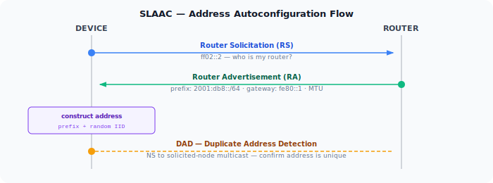
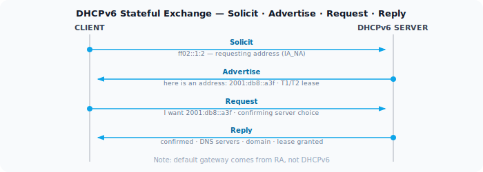

In IPv4, a device that wants an address asks a DHCP server. The server picks an address from a pool, hands it over with a lease time, and logs the assignment. This works, but it requires a DHCP server to be running and reachable before anything else on the network can function.

IPv6 was designed so that a device can configure a working address with no server at all. That mechanism is SLAAC — Stateless Address Autoconfiguration. Understanding it also clarifies where DHCPv6 fits in and why IPv6 networks often use both.

## SLAAC

SLAAC proceeds through four steps, all without a server:

1. **Generate a link-local address** — the device forms a `fe80::/10` address using a self-generated interface identifier (EUI-64 or random). This requires nothing from the network and is ready immediately after the interface comes up.

2. **Duplicate Address Detection (DAD)** — before using the link-local address, the device sends a Neighbor Solicitation with the **unspecified address (`::`)** as source, targeting the candidate address. If no reply arrives within a short timeout, the address is unique and confirmed for use. DAD repeats for every new address.

3. **Router Solicitation (RS)** — with a confirmed link-local address, the device sends an RS to `ff02::2` (all-routers multicast), asking any router on the link to identify itself.

4. **Router Advertisement (RA) and address construction** — the router replies with an RA containing the network prefix (e.g. `2001:db8::/64`), its own link-local address as the default gateway, and MTU. The device combines the prefix with its self-generated interface identifier to form a full 128-bit global unicast address, then runs DAD again before using it.

No server is needed for any of this. The router also advertises its own link-local address as the default gateway, so the device can reach the internet as soon as address construction and DAD complete.

The RA also carries flags that tell the device whether to use SLAAC, DHCPv6, or both:

- **M flag (Managed)** — use DHCPv6 for address assignment
- **O flag (Other)** — use DHCPv6 for other configuration (DNS, domain search) but not addresses

With both flags unset, pure SLAAC is in effect.

## Interface Identifier in SLAAC

SLAAC gives the device freedom in how it generates the interface ID. The original method was EUI-64 — derived from the MAC address — which produced a stable, globally unique identifier. The problem is that the same interface ID follows the device across every network it joins, making it trackable.

RFC 4941 introduced **privacy extensions**: the device generates a random interface ID and rotates it periodically. Most operating systems now use this by default for outbound connections. Servers and infrastructure that need stable addresses typically use EUI-64 or manually configured IDs instead.

## DHCPv6

DHCPv6 works similarly to DHCPv4 in structure — client sends a Solicit, server replies with an Advertise, client sends a Request, server confirms with a Reply — but there are meaningful differences.

**Stateful DHCPv6** assigns addresses from a pool, just like DHCPv4. The server tracks which device has which address. This is what the M flag in the RA triggers.

**Stateless DHCPv6** doesn't assign addresses. The device uses SLAAC for its address, but contacts DHCPv6 to get DNS servers and other options. This is what the O flag triggers. It's very common — SLAAC handles the address, DHCPv6 handles the configuration.

One important difference from DHCPv4: DHCPv6 does not carry the default gateway. That information comes only from Router Advertisements. This means even on a network using stateful DHCPv6 for addresses, the router still needs to send RAs for gateway discovery.

## Comparison

| | SLAAC | Stateless DHCPv6 | Stateful DHCPv6 |
|---|---|---|---|
| Address source | Self-generated | Self-generated | Server-assigned |
| DNS / options | From RA (RDNSS) or DHCPv6 | From DHCPv6 | From DHCPv6 |
| Default gateway | From RA | From RA | From RA |
| Server required | No | Yes | Yes |
| Address log | No | No | Yes |

The absence of an address log is the most operationally significant difference. With SLAAC, there's no central record of which device has which address unless you're collecting RA or NDP data separately. For networks where address-to-device mapping matters (audit, security), stateful DHCPv6 or NDP logging is needed.
