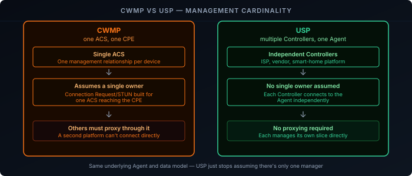
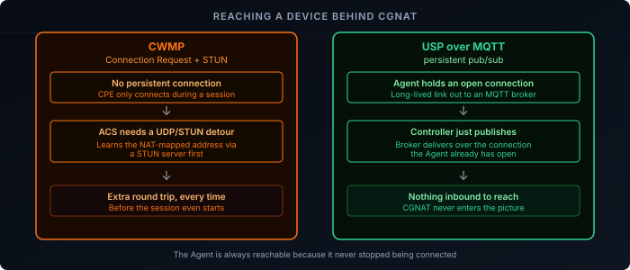

Everything in this series so far has been CWMP — the CPE WAN Management Protocol behind TR-069. The Broadband Forum's designated successor is **[TR-369, the User Services Platform (USP)][1]**. It's not a hypothetical future replacement; it's a published, deployed standard, and understanding what it actually changes (and what it deliberately keeps) matters for anyone working with CWMP today.

## Same Data Model, Different Protocol

Start with the good news: the parameter tree from the [RPCs and data model post]() mostly carries over unchanged. TR-181 Issue 2 is explicitly titled "Device Data Model for **CWMP Endpoints and USP Agents**" — the same `Device.WiFi.SSID.1.SSID`-style tree serves both protocols. What changes with USP isn't what gets managed, it's how the message asking for it gets there.

This is deliberate: a CPE vendor can adopt USP without redesigning its entire parameter model, and an ACS/Controller platform that already understands TR-181 isn't starting from zero.

## Terminology Shift: ACS/CPE Becomes Controller/Agent

USP renames the two roles — the management platform is a **Controller**, the managed device is an **Agent** — but the more consequential change isn't the naming, it's the cardinality. CWMP's practical model is one ACS managing a CPE (Connection Request, periodic Inform, and the STUN NAT-traversal workaround all assume a single management relationship). USP explicitly supports **multiple Controllers managing one Agent at the same time** — an ISP, the device manufacturer, and a smart-home platform can each hold an independent management relationship with the same device, without one having to proxy through another.

## Transport-Agnostic by Design: The MTP Layer

CWMP is welded to SOAP over HTTP(S) — that's not a configuration choice, it's the protocol. USP separates the message layer from the transport entirely, through a **Message Transfer Protocol (MTP)** abstraction. The same USP message can travel over CoAP, MQTT, WebSockets, or STOMP, chosen based on what fits the device and network — a battery-powered sensor and a fixed-line gateway don't have to use the same transport just because they both speak USP.

These four MTPs aren't interchangeable in what they solve, though. **MQTT, WebSockets, and STOMP are all connection-oriented and broker- or socket-based** — the Agent opens one long-lived connection and both directions ride on top of it, which is exactly what the next section relies on. **CoAP is different**: it's UDP-based and modeled on HTTP's request/response pattern rather than a persistent session, which is precisely why it's attractive for battery-powered, constrained devices that can't afford to hold a connection open. That efficiency comes at a cost — a CoAP Agent behind NAT is back to something closer to CWMP's original problem, needing periodic keepalives to hold a NAT binding open (or CoAP's `Observe` extension for subscribe-style notifications) rather than getting reachability for free the way a persistent connection provides it.

## Solving the NAT Problem for Real

This is where the change actually matters in practice. The [provisioning post]() covered how CWMP handles an ACS needing to reach a CPE behind CGNAT: a Connection Request to a WAN-side listener when possible, and a STUN-mediated UDP workaround when it isn't — a workaround built on top of a fundamentally poll/request-response protocol.

With MQTT (or WebSockets or STOMP) as the MTP, the problem doesn't need a workaround at all. The Agent holds a persistent outbound connection — to an MQTT broker, or a WebSocket held open to a Controller-side endpoint — the same kind of long-lived connection a chat app keeps open. The Controller sends a message whenever it needs to, and it's delivered over the connection the Agent already has open. There's no WAN-side listener to reach, no CGNAT mapping to punch through, because the Agent never needed to accept an inbound connection in the first place.

## RPCs Become Uniform: Get/Set/Add/Delete/Operate

CWMP's RPC set, covered in the [previous post](), mixes generic parameter access (`GetParameterValues`, `SetParameterValues`) with a handful of special-purpose methods bolted on separately (`Reboot`, `FactoryReset`, `Download`, `Upload` are each their own SOAP RPC). USP keeps the same four core verbs — Get, Set, Add, Delete — but formalizes actions as **Operate**, invoked against a command path in the data model itself, rather than as one-off RPCs outside it. Rebooting a USP Agent means calling Operate against `Device.Reboot()` in the data model, not calling a specially-defined `Reboot` method — one uniform mechanism instead of a growing list of special cases.

## Migration: Dual-Stack Devices

Because the data model is shared, a device isn't forced into a flag-day cutover. A CPE can run as a CWMP Endpoint and a USP Agent simultaneously during a transition period, exposing the same TR-181 tree to both an existing ACS and a new USP Controller. For an ISP with millions of deployed CWMP devices, this is what makes USP adoption a gradual migration rather than a fleet-wide replacement.

## Recap

- USP (TR-369) is the Broadband Forum's actual designated successor to CWMP, not a speculative future protocol.
- The data model doesn't change — TR-181 Issue 2 explicitly serves both CWMP Endpoints and USP Agents with the same parameter tree.
- ACS/CPE becomes Controller/Agent, and USP explicitly supports multiple Controllers managing one Agent at once — a real architectural shift from CWMP's single-management-relationship model.
- USP separates messages from transport via the MTP layer (CoAP, MQTT, WebSockets, STOMP), instead of CWMP's fixed SOAP-over-HTTP(S).
- MQTT's persistent connection makes CWMP's Connection Request/STUN NAT workaround unnecessary — the Agent is always reachable because it's always connected.
- CWMP's ad hoc special RPCs (`Reboot`, `Download`, ...) become a single uniform `Operate` verb against command paths in the data model.
- Shared data models let a device run as both a CWMP Endpoint and a USP Agent during migration — adoption doesn't require a hard cutover.

Multiple Controllers is the model — but how does an Agent find any of them in the first place, and what stops them from stepping on each other once it has? See [TR-369 Explained: Controller Discovery and Trust]() for the DHCP, DNS-SD, and mDNS discovery mechanisms, plus the Role/Permission model that keeps multiple Controllers safely scoped.

[1]: https://usp.technology/specification/
