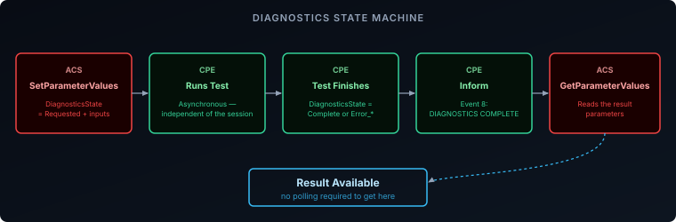
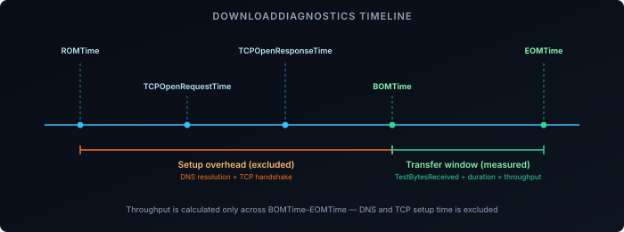

The [RPCs and data model post]() covered reading and writing configuration — calls that complete immediately, because they only touch values already sitting on the CPE. Diagnostics are different: running a ping sweep or a throughput test takes real time, sometimes tens of seconds, and can't just block an RPC call until it's done. CWMP handles this with an asynchronous state machine instead, and it's the same pattern regardless of which diagnostic is running.

## The Diagnostics State Machine

Every diagnostic test in [the data model][1] — ping, traceroute, a download speed test — follows the same shape:

1. The ACS calls `SetParameterValues` to configure the test: the target host or URL, repetition count, timeout, whatever inputs that specific test needs — and sets the test's `DiagnosticsState` parameter to `Requested`.
2. The CPE acknowledges the `SetParameterValues` call immediately, then runs the test in the background. The session can close normally; the test keeps running independently of it.
3. When the test finishes, the CPE sets `DiagnosticsState` to `Complete`, or to one of several `Error_*` values if it failed (`Error_CannotResolveHostName`, `Error_InitConnectionFailed`, `Error_NoResponse`, and others specific to each test type).
4. The CPE opens a new session and sends `Inform` with event code **`8 DIAGNOSTICS COMPLETE`** — a code that fits into the same event list covered in the provisioning post, alongside `BOOTSTRAP`, `BOOT`, and `PERIODIC`.
5. The ACS calls `GetParameterValues` against the test's result parameters to retrieve the outcome.

The test never runs as a direct response to an RPC. It's set up, runs independently, and reports back through the ordinary session mechanism — the same `Inform`-driven flow every other CWMP interaction uses.



## IPPing Diagnostics: Basic Reachability

`IPPing` is the simplest case, and a direct mapping onto an ICMP ping sweep:

**Inputs the ACS sets:**

| Parameter | Purpose |
|-----------|---------|
| `Host` | Target hostname or IP address |
| `NumberOfRepetitions` | How many pings to send |
| `Timeout` | Per-ping timeout in milliseconds |

**Results the ACS reads back:**

| Parameter | Meaning |
|-----------|---------|
| `SuccessCount` / `FailureCount` | How many pings got a response |
| `AverageResponseTime` | Mean round-trip time across successful pings |
| `MinimumResponseTime` / `MaximumResponseTime` | Best and worst round-trip times observed |

This is what an ACS uses for a basic "is this device's WAN actually reachable" check — pointed at a known-good host, it separates a dead WAN link from a slow one, without a technician needing to be on the phone walking someone through a ping command.

Requesting the test and reading back the result, stripped of SOAP envelope boilerplate:

```xml {filename="SetParameterValues request — starts the test"}
<cwmp:SetParameterValues>
  <ParameterList soap-enc:arrayType="cwmp:ParameterValueStruct[4]">
    <ParameterValueStruct>
      <Name>Device.IP.Diagnostics.IPPing.Host</Name>
      <Value xsi:type="xsd:string">8.8.8.8</Value>
    </ParameterValueStruct>
    <ParameterValueStruct>
      <Name>Device.IP.Diagnostics.IPPing.NumberOfRepetitions</Name>
      <Value xsi:type="xsd:unsignedInt">5</Value>
    </ParameterValueStruct>
    <ParameterValueStruct>
      <Name>Device.IP.Diagnostics.IPPing.Timeout</Name>
      <Value xsi:type="xsd:unsignedInt">1000</Value>
    </ParameterValueStruct>
    <ParameterValueStruct>
      <Name>Device.IP.Diagnostics.IPPing.DiagnosticsState</Name>
      <Value xsi:type="xsd:string">Requested</Value>
    </ParameterValueStruct>
  </ParameterList>
  <ParameterKey></ParameterKey>
</cwmp:SetParameterValues>
```

```xml {filename="GetParameterValuesResponse — after Inform event 8"}
<cwmp:GetParameterValuesResponse>
  <ParameterList soap-enc:arrayType="cwmp:ParameterValueStruct[3]">
    <ParameterValueStruct>
      <Name>Device.IP.Diagnostics.IPPing.DiagnosticsState</Name>
      <Value xsi:type="xsd:string">Complete</Value>
    </ParameterValueStruct>
    <ParameterValueStruct>
      <Name>Device.IP.Diagnostics.IPPing.SuccessCount</Name>
      <Value xsi:type="xsd:unsignedInt">5</Value>
    </ParameterValueStruct>
    <ParameterValueStruct>
      <Name>Device.IP.Diagnostics.IPPing.AverageResponseTime</Name>
      <Value xsi:type="xsd:unsignedInt">14</Value>
    </ParameterValueStruct>
  </ParameterList>
</cwmp:GetParameterValuesResponse>
```

The `DiagnosticsState` values on the way in (`Requested`) and out (`Complete`) are the same field — the ACS sets it to kick the test off, and reads it back later purely to confirm the test actually finished before trusting the rest of the values.

## DownloadDiagnostics and UploadDiagnostics: Remote Speed Tests

This is the pair that matters most for an ISP: `DownloadDiagnostics` and `UploadDiagnostics` let the ACS run a throughput test against the CPE without any app or website in the loop — the CPE fetches (or pushes) a file from a server the ACS points it at and reports back exactly how long each phase took.

The inputs are simple — a `DownloadURL` (or upload target), optionally a DSCP or Ethernet priority marking to test a specific traffic class. The results are a set of timestamps that break the transfer into phases:

| Timestamp | Marks |
|-----------|-------|
| `ROMTime` | Request Object Metadata — DNS resolution begins |
| `TCPOpenRequestTime` / `TCPOpenResponseTime` | TCP handshake start and completion |
| `BOMTime` | Beginning of Message — first byte of the actual transfer |
| `EOMTime` | End of Message — transfer complete |

`TestBytesReceived` (or sent, for upload) combined with the time between `BOMTime` and `EOMTime` gives the actual transfer throughput — deliberately excluding DNS lookup and TCP setup time, which would otherwise understate the link's real capacity on a short test.



This is the mechanism behind "speed test" buttons in ISP-provided router admin pages and support-portal tools — the button triggers exactly this diagnostic against a server the ISP controls, rather than running any special client software on the CPE.

## TraceRoute Diagnostics

`TraceRoute` follows the same state machine and reports a hop-by-hop path to a target host — each hop's address and round-trip time, up to a configurable maximum hop count. It's most useful for the escalation case IPPing can't resolve on its own: the WAN is reachable, but something in the path to a specific destination is dropping packets or adding latency, and the hop list narrows down where.

## Recap

- Diagnostics run asynchronously: `SetParameterValues` sets `DiagnosticsState` to `Requested` along with the test's inputs, the CPE runs the test independently of that session, and reports completion later.
- Completion arrives as a new `Inform` carrying event code `8 DIAGNOSTICS COMPLETE` — the ACS then calls `GetParameterValues` to read the results.
- `IPPing` gives basic reachability and round-trip time — the first check for "is this CPE's WAN actually up."
- `DownloadDiagnostics`/`UploadDiagnostics` are remote speed tests: the phase timestamps (`ROMTime`, `TCPOpen*Time`, `BOMTime`, `EOMTime`) let the ACS isolate pure transfer throughput from DNS and TCP setup overhead.
- `TraceRoute` gives the hop-by-hop path when the problem is somewhere between the CPE and a specific destination rather than on the WAN link itself.

Everything in this series so far is CWMP. See [TR-369 Explained: What Actually Changes from TR-069]() for what the Broadband Forum's designated successor protocol does differently — and what it deliberately keeps the same.

[1]: https://device-data-model.broadband-forum.org/
