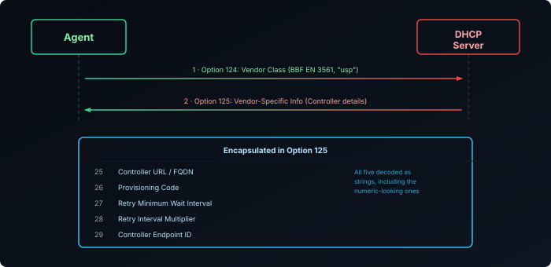

The [previous post]() covered why USP supports multiple independent Controllers managing one Agent. This one covers both halves of what that actually requires: how an Agent finds a Controller to talk to in the first place, since USP doesn't have a single "ACS URL" field the way a CWMP Endpoint does — [Discovery][1] is a defined process, and this post takes the DHCP path through it — and, once it's found one or several, what stops those Controllers from reaching into each other's territory.

## What the Agent Actually Needs to Learn

To reach a Controller, an Agent needs four things: which **MTP** to use (WebSockets, MQTT, or STOMP — or UDS for a Controller on the same device), an **address**, a **port**, and — for MTPs that need one — a **resource path**. Discovery can hand the Agent all of this bundled as a single URL, or as an FQDN the Agent resolves the rest from.

USP defines three mechanisms for this: **DHCP**, **DNS-SD** (looking a Controller up by service type), and **mDNS** (for a link with no DHCP server or DNS zone to lean on). DNS-SD and mDNS are their own topic; this post covers the DHCP one.

## How DHCP Hands Over the Controller

This is the USP analog of CWMP's ACS URL delivered via DHCP option 43 — but built to avoid the exact problem option 43 has. Option 43 is a flat, vendor-specific blob with no standard internal structure, so when a network has several unrelated vendors all repurposing the same option for their own provisioning needs, nothing stops their data from colliding or being misread by the wrong device.

USP avoids this by using DHCP's **vendor-identifying** options instead, which are keyed to an IANA-assigned enterprise number rather than shared blindly:

- The Agent's request carries the **DHCPv4 Vendor-Identifying Vendor Class Option (124)** — or **DHCPv6 Vendor Class (16)** — containing the Broadband Forum's enterprise number (`3561` / `0x0DE9`) and the literal string `usp`. This is how the Agent signals "I'm asking specifically for USP Controller information," not just any vendor data.
- The DHCP server responds with the **DHCPv4 Vendor-Identifying Vendor-Specific Information Option (125)** — or **DHCPv6 equivalent (17)** — scoped to that same enterprise number, carrying a defined set of encapsulated sub-options:

| Sub-option | Carries | Maps to |
|------------|---------|---------|
| `25` | Controller URL or FQDN | The MTP connection endpoint |
| `26` | Provisioning Code | `Device.LocalAgent.Controller.{i}.ProvisioningCode` |
| `27` | Retry minimum wait interval | `Device.LocalAgent.Controller.{i}.USPNotifRetryMinimumWaitInterval` |
| `28` | Retry interval multiplier | `Device.LocalAgent.Controller.{i}.USPNotifRetryIntervalMultiplier` |
| `29` | Controller Endpoint ID | `Device.LocalAgent.Controller.{i}.EndpointID` |

All five are decoded as strings — including the two that look numeric (the retry interval and multiplier) — so an Agent implementation can't assume it's safe to read them as raw integers off the wire.

Because DHCP itself has no built-in security, the specification is explicit that this is only safe to rely on when the link between the DHCP server and the Agent is one the operator actually controls — and that trust between the Agent and whatever Controller it discovers this way still needs to be established separately, typically with pre-configured certificates rather than assuming the DHCP response itself is trustworthy.

## Controller Trust

Finding a Controller is only half the story. USP explicitly allows an ISP, a device vendor, and a smart-home platform to all manage the same Agent independently — which raises an obvious question: what stops one Controller from reconfiguring settings another Controller depends on, or reading data it has no business seeing? The answer is **[Controller Trust][2]**: a role-based permission model that decides exactly what each Controller is allowed to touch.

### Roles: The Unit of Trust

A Controller in USP doesn't get default access to anything. It's assigned a **Role** — defined under `Device.LocalAgent.ControllerTrust.Role.{i}` — and a Role is nothing more than a named set of permissions. No Role, no access: whatever a Controller's Role doesn't explicitly grant, it doesn't have.

This is a structural difference from CWMP, which has no concept of a partially-trusted ACS at all — a CWMP session either authenticates successfully and gets full access to everything, or it doesn't authenticate and gets none. USP needed something more granular the moment it allowed more than one Controller to exist.

### Permissions: rwxn Across Four Target Types

Each Role holds one or more `Permission.{i}` entries, and each entry targets one of four things:

| Target | Covers |
|--------|--------|
| `Param` | Individual parameters |
| `Obj` | Objects — specifically, whether new instances can be created under them |
| `InstantiatedObj` | Already-existing object instances |
| `CommandEvent` | Commands (Operate) and events (subscriptions) |

Against each target, the permission is a four-character string — **`rwxn`** — Read, Write, Execute, Notify — with the meaning of `x` shifting slightly by target: on `Obj` it governs adding new instances, on `InstantiatedObj` it governs deleting existing ones, and on `CommandEvent` it governs invoking a command or subscribing to an event. A dash in any position means that right isn't granted; a Role with `r--n` on a parameter can read its value and get notified when it changes, but can't write to it at all.

### A Concrete Example: ISP vs. Smart-Home Controller

This is exactly the scenario an ISP's Controller and a smart-home platform's Controller both managing the same Agent runs into, with neither able to touch the other's territory:

| Path | ISP Controller's Role | Smart-Home Controller's Role |
|------|------------------------|-------------------------------|
| `Device.WAN.*` | `rwxn` — full control | `----` — no access at all |
| `Device.WiFi.*` | `r--n` — read and get notified only | `rwxn` — full control |
| `Device.LocalAgent.*` | `r---` — read-only | `----` — no access |

The ISP's Controller can change WAN configuration but only observe WiFi settings; the smart-home platform's Controller can manage WiFi and connected IoT devices but has no path into WAN configuration at all, and doesn't even know the Agent's own management configuration exists. Neither Controller needs to trust the other, and neither can accidentally (or otherwise) reach into the other's scope — the Agent enforces the boundary, not either Controller's good behavior.

### Enforcement Happens Per-Request

Every message a Controller sends is checked against its Role's permissions before the Agent acts on it — the same way CWMP validates a `SetParameterValues` request before applying it, just with an added layer of "is this Controller even allowed to ask this at all." A `Get` for a parameter the Role has no `r` on simply doesn't return that value; an `Operate` call against a command the Role has no `x` on for `CommandEvent` is refused outright. The Agent, not the Controller, is what's actually trusted to hold the line.

### What Permissions Don't Solve

Roles scope what each Controller *can* touch — they don't arbitrate what happens when two Controllers are both allowed to touch the *same* thing at the *same* time. USP has no distributed locking or transaction mechanism for overlapping writes; if two Controllers both hold `w` on the same parameter and write to it in quick succession, the usual last-write-wins outcome applies, same as any shared-state system without explicit coordination. The permission model's job is to make that scenario rare by design — an ISP and a smart-home platform simply shouldn't be granted overlapping write access to the same parameter in the first place — not to resolve it gracefully if it happens anyway.

## Recap

- An Agent needs an MTP, address, port, and (if the MTP requires it) a resource path to reach a Controller — delivered either as one URL or as an FQDN it resolves the rest from. USP defines DHCP, DNS-SD, and mDNS for this; this post covers DHCP.
- **DHCP discovery** uses vendor-identifying options keyed to the Broadband Forum's enterprise number (`3561`) rather than a flat blob like CWMP's option 43 — the Agent requests via option 124/16, the server responds via option 125/17 with five defined sub-options (URL, provisioning code, retry parameters, Endpoint ID), all decoded as strings.
- DHCP has no built-in security, so trust with a DHCP-discovered Controller still has to be established separately — usually with pre-configured certificates.
- USP Controllers get no default access; each is assigned a **Role** (`Device.LocalAgent.ControllerTrust.Role.{i}`) that defines exactly what it can do, via `Permission` entries scoped to `Param`, `Obj`, `InstantiatedObj`, or `CommandEvent` and granted as an `rwxn` string.
- This is how an ISP Controller and a smart-home platform's Controller can manage the same Agent safely: disjoint Roles give each exactly the scope it needs, enforced per-request at the Agent — not arbitration of simultaneous writes within a scope two Controllers both happen to share, which permissions don't solve.

This has all been about who can reach the Agent and what they're allowed to do once there — not what the messages doing it actually look like. See [TR-369 Explained: Messages, RPCs, and Notifications]() for `Get`, `Set`, and the rest, lined up against their CWMP equivalents.

[1]: https://usp.technology/specification/#sec:discovery
[2]: https://usp.technology/specification/#sec:auth
