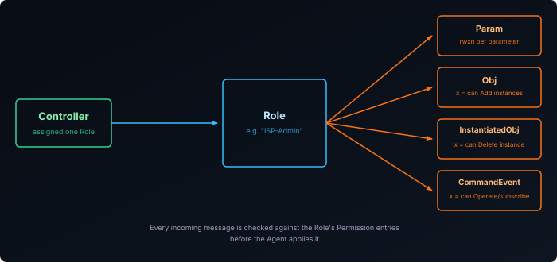
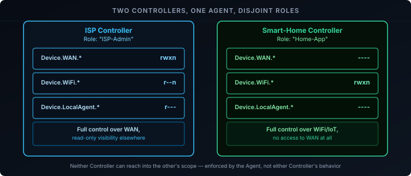

The [USP overview post]() covered the headline architectural change from CWMP: USP explicitly supports multiple Controllers managing one Agent at the same time. That raises an obvious question — what stops one Controller from reconfiguring settings another Controller depends on, or reading data it has no business seeing? The answer is **[Controller Trust][1]**: a role-based permission model that decides exactly what each Controller is allowed to touch.

## Roles: The Unit of Trust

A Controller in USP doesn't get default access to anything. It's assigned a **Role** — defined under `Device.LocalAgent.ControllerTrust.Role.{i}` — and a Role is nothing more than a named set of permissions. No Role, no access: whatever a Controller's Role doesn't explicitly grant, it doesn't have.

This is a structural difference from CWMP, which has no concept of a partially-trusted ACS at all — a CWMP session either authenticates successfully and gets full access to everything, or it doesn't authenticate and gets none. USP needed something more granular the moment it allowed more than one Controller to exist.

## Permissions: rwxn Across Four Target Types

Each Role holds one or more `Permission.{i}` entries, and each entry targets one of four things:

| Target | Covers |
|--------|--------|
| `Param` | Individual parameters |
| `Obj` | Objects — specifically, whether new instances can be created under them |
| `InstantiatedObj` | Already-existing object instances |
| `CommandEvent` | Commands (Operate) and events (subscriptions) |

Against each target, the permission is a four-character string — **`rwxn`** — Read, Write, Execute, Notify — with the meaning of `x` shifting slightly by target: on `Obj` it governs adding new instances, on `InstantiatedObj` it governs deleting existing ones, and on `CommandEvent` it governs invoking a command or subscribing to an event. A dash in any position means that right isn't granted; a Role with `r--n` on a parameter can read its value and get notified when it changes, but can't write to it at all.

## A Concrete Example: ISP vs. Smart-Home Controller

This is exactly the scenario the overview post's diagram gestured at — an ISP's Controller and a smart-home platform's Controller both managing the same Agent, with neither able to touch the other's territory:

| Path | ISP Controller's Role | Smart-Home Controller's Role |
|------|------------------------|-------------------------------|
| `Device.WAN.*` | `rwxn` — full control | `----` — no access at all |
| `Device.WiFi.*` | `r--n` — read and get notified only | `rwxn` — full control |
| `Device.LocalAgent.*` | `r---` — read-only | `----` — no access |

The ISP's Controller can change WAN configuration but only observe WiFi settings; the smart-home platform's Controller can manage WiFi and connected IoT devices but has no path into WAN configuration at all, and doesn't even know the Agent's own management configuration exists. Neither Controller needs to trust the other, and neither can accidentally (or otherwise) reach into the other's scope — the Agent enforces the boundary, not either Controller's good behavior.

## Enforcement Happens Per-Request

Every message a Controller sends is checked against its Role's permissions before the Agent acts on it — the same way [SetParameterValues fault checking]() validates a request before applying it, just with an added layer of "is this Controller even allowed to ask this at all." A `Get` for a parameter the Role has no `r` on simply doesn't return that value; an `Operate` call against a command the Role has no `x` on for `CommandEvent` is refused outright. The Agent, not the Controller, is what's actually trusted to hold the line.

## What Permissions Don't Solve

Roles scope what each Controller *can* touch — they don't arbitrate what happens when two Controllers are both allowed to touch the *same* thing at the *same* time. USP has no distributed locking or transaction mechanism for overlapping writes; if two Controllers both hold `w` on the same parameter and write to it in quick succession, the usual last-write-wins outcome applies, same as any shared-state system without explicit coordination. The permission model's job is to make that scenario rare by design — an ISP and a smart-home platform simply shouldn't be granted overlapping write access to the same parameter in the first place — not to resolve it gracefully if it happens anyway.

## Recap

- USP Controllers get no default access; each is assigned a **Role** (`Device.LocalAgent.ControllerTrust.Role.{i}`) that defines exactly what it can do.
- Roles are made of `Permission` entries scoped to one of four targets — `Param`, `Obj`, `InstantiatedObj`, `CommandEvent` — each granted as an `rwxn` (Read/Write/Execute/Notify) string.
- This is how an ISP Controller and a smart-home platform's Controller can manage the same Agent safely: disjoint Roles give each exactly the scope it needs and nothing else.
- Enforcement happens per-request at the Agent — a Controller without the right permission simply gets refused, not trusted to self-restrict.
- Permissions prevent Controllers from reaching into each other's scope; they don't arbitrate simultaneous writes within a scope two Controllers both happen to share.

This has all been about who's allowed to do what — not what the messages doing it actually look like. See [TR-369 Explained: Messages vs CWMP's RPCs]() for `Get`, `Set`, and the rest, lined up against their CWMP equivalents.

[1]: https://github.com/BroadbandForum/usp-test/blob/master/02-authentication-and-access-control.md
