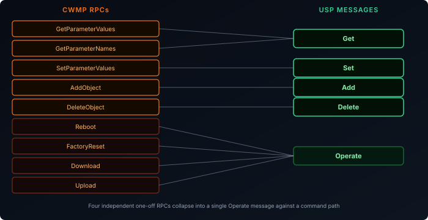
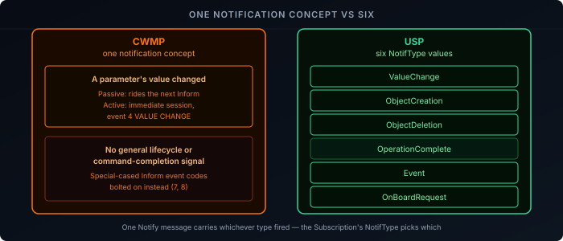

The [RPCs and data model post]() walked through CWMP's SOAP envelope and its RPC set. The [USP overview post]() mentioned in passing that USP collapses those RPCs into a smaller, more uniform set of messages. This post puts them side by side — the actual message shapes, not just the naming change — and covers the notification side CWMP handled with a single mechanism and USP splits into six distinct event types.

One note before diving in: USP normally encodes messages as binary Protocol Buffers, not human-readable text. The JSON shown below is the same structure in the readable form the Broadband Forum's own [message documentation][1] and [conformance tests][2] use — it's not the literal bytes on the wire, the way the CWMP SOAP/XML in the earlier posts genuinely was.

## The Envelope: SOAP vs Record + Msg

CWMP has one layer: the SOAP envelope carried directly over HTTP(S) is both the transport framing and the message. USP splits this into two:

- A **Record** — the transport-facing outer layer: `version`, `to_id` and `from_id` (Endpoint Identifiers — a Record whose `to_id` doesn't match is discarded outright), and `payload_security` (`PLAINTEXT` or `TLS12`, describing whether the payload inside is itself protected independently of whatever the MTP connection already provides).
- A **Msg** — carried as the Record's payload: a `header` (`msg_id` for correlating requests with responses and catching duplicates, `msg_type` naming the operation) and a `body` (`request`, `response`, or `error`).

CWMP's `cwmp:ID` SOAP header does the same correlation job as `msg_id`, but without the separate transport-facing envelope around it — CWMP doesn't need one, since a SOAP session is already scoped to a single authenticated CPE/ACS pair. USP's Record layer exists because a single Agent might be addressed by several different Controllers, each needing their own Records routed correctly.


## Get vs GetParameterValues

```json {filename="USP Get request"}
{
  "header": { "msg_id": "1001", "msg_type": "GET" },
  "body": {
    "request": {
      "get": { "param_paths": ["Device.WiFi.SSID.1.SSID"] }
    }
  }
}
```

```json {filename="USP GetResp"}
{
  "header": { "msg_id": "1001", "msg_type": "GET_RESP" },
  "body": {
    "response": {
      "get_resp": {
        "req_path_results": [{
          "requested_path": "Device.WiFi.SSID.1.SSID",
          "resolved_path_results": [{
            "resolved_path": "Device.WiFi.SSID.1.SSID",
            "result_params": [{ "key": "SSID", "value": "MyHomeNetwork" }]
          }]
        }]
      }
    }
  }
}
```

Structurally this is doing the same job as `GetParameterValues`/`GetParameterValuesResponse` from the RPCs post — but notice `param_paths` isn't restricted to leaf parameters. A `Get` against an *object* path (`Device.WiFi.SSID.` rather than a specific instance's `SSID` parameter) resolves to every matching instance and its children in one call. That's most of what CWMP needed `GetParameterNames` for, folded into the same message used for reading values, rather than kept as a separate discovery RPC.

## Set vs SetParameterValues

```json {filename="USP Set request"}
{
  "header": { "msg_id": "1002", "msg_type": "SET" },
  "body": {
    "request": {
      "set": {
        "allow_partial": true,
        "update_objs": [{
          "obj_path": "Device.WiFi.SSID.1.",
          "param_settings": [{ "param": "SSID", "value": "MyHomeNetwork-5G" }]
        }]
      }
    }
  }
}
```

The interesting field here is `allow_partial`. CWMP's `SetParameterValues`, covered in the RPCs post, is always all-or-nothing — one bad parameter fails the entire call. USP's `Set` makes that a choice: `allow_partial: false` keeps CWMP's atomic behavior, but `allow_partial: true` lets the Agent apply whatever parameters it can and report failures only for the ones that didn't take. USP added a strictness dial CWMP never had at all.

## Error Reporting: Fault vs OperationFailure

```json {filename="USP SetResp — failure"}
{
  "header": { "msg_id": "1002", "msg_type": "SET_RESP" },
  "body": {
    "response": {
      "set_resp": {
        "updated_obj_results": [{
          "requested_path": "Device.WiFi.SSID.1.",
          "oper_status": {
            "oper_failure": {
              "err_code": 7012,
              "err_msg": "Invalid parameter value",
              "param_errs": [{
                "param": "SSID",
                "err_code": 7012,
                "err_msg": "Value exceeds maximum length"
              }]
            }
          }
        }]
      }
    }
  }
}
```

Line this up against the [`SetParameterValuesFault` example]() from the RPCs post and the shape is nearly identical: a top-level failure code, plus a `param_errs` list naming exactly which parameter caused it and why — the same problem (atomic writes need per-parameter blame) solved the same way, just wearing USP's field names instead of CWMP's `SetParameterValuesFault`/`FaultCode`/`FaultString`.

## The Ad Hoc RPCs Collapse into Operate

CWMP has no single mechanism for "do a thing" — `Reboot`, `FactoryReset`, `Download`, and `Upload` are each their own SOAP RPC, defined independently. USP has exactly one message for invoking any of them: **`Operate`**, called against a command path in the data model — `Device.Reboot()` instead of a `Reboot` RPC, `Device.DeviceInfo.FirmwareImage.1.Download()` instead of a `Download` RPC. Whatever action-shaped capability a device exposes, it's invoked the same way, rather than each one needing its own message definition.



## Quick Reference

| CWMP RPC | USP Message | Notes |
|----------|-------------|-------|
| `GetParameterValues` | `Get` | Object-path `Get` also covers most `GetParameterNames` discovery use cases |
| `GetParameterNames` | *(folded into `Get`)* | A separate `GetSupportedDM` message exists for schema-level "what could exist," a different question |
| `SetParameterValues` | `Set` | Adds `allow_partial` — CWMP has no equivalent, it's always atomic |
| `AddObject` | `Add` | |
| `DeleteObject` | `Delete` | |
| `Reboot` / `FactoryReset` / `Download` / `Upload` | `Operate` | Four separate RPCs collapse into one generic command-invocation message |
| SOAP `Fault` | `Error` response / `oper_failure` + `param_errs` | Same shape — top-level code plus per-parameter detail |

Notification is a different enough problem to need its own comparison, next — CWMP's active/passive parameter attributes and USP's `Notify` message plus `Subscription` objects work differently enough that lining them up in the table above would flatten the distinction that actually matters.

## Subscriptions and the Notify Message

CWMP's notification story is the parameter attribute levels covered in the RPCs post — a parameter set to passive or active reports its own value changes, and that's the entire feature. USP replaces this with something considerably broader: **[Subscriptions][3]**, backed by a dedicated **[Notify][4]** message that covers six distinct kinds of event, not just "a value changed."

### The Subscription Object

A Controller doesn't flip an attribute on a parameter the way CWMP's `SetParameterAttributes` did. It creates an object instance — using the `Add` message from above — under `Device.LocalAgent.Subscription.{i}.`, with a handful of key fields:

| Field | Purpose |
|-------|---------|
| `Enable` | Whether this subscription is currently active |
| `NotifType` | Which of the six notification types this subscription watches for |
| `ReferenceList` | The parameter or object paths being watched |

Creating a subscription is a normal data model write, using the same message CWMP would need an entirely separate RPC family for.

### Six Notification Types

CWMP had one notification concept: a parameter's value changed. USP's `NotifType` covers six:

| Type | Triggered by |
|------|--------------|
| `ValueChange` | A watched parameter's value changes — the direct CWMP equivalent |
| `ObjectCreation` | A new instance is added to a watched multi-instance object |
| `ObjectDeletion` | An instance is removed from a watched multi-instance object |
| `OperationComplete` | An asynchronous `Operate` command finishes, successfully or not |
| `Event` | A data-model-defined event fires — arbitrary, object-specific occurrences |
| `OnBoardRequest` | An Agent contacts a Controller for the first time, or on `SendOnBoardRequest()` |

`ObjectCreation`, `ObjectDeletion`, and `OperationComplete` don't have a real CWMP equivalent at all. CWMP's closest attempts were the `Inform` event codes covered in the [provisioning post]() — `7 TRANSFER COMPLETE`, `8 DIAGNOSTICS COMPLETE` — special-cased signals bolted onto the one mechanism CWMP had, rather than a general-purpose way to say "this asynchronous thing finished." USP folds all of that into one message type.



### ValueChange in Practice


```json {filename="USP Notify — ValueChange"}
{
  "header": { "msg_id": "notify-001", "msg_type": "NOTIFY" },
  "body": {
    "request": {
      "notify": {
        "subscription_id": "wan-ip-watch",
        "send_resp": true,
        "value_change": {
          "param_path": "Device.DeviceInfo.FriendlyName",
          "param_value": "Living Room Gateway"
        }
      }
    }
  }
}
```

The Agent sends this on its own initiative the moment the watched value changes — there's no request from the Controller to trigger it, only the `Add`(Subscription) that set the watch up beforehand. `send_resp: true` means the Agent expects a `NotifyResponse` back before considering the notification delivered; a Controller that doesn't respond in time is exactly the kind of gap the Subscription's retry parameters exist to handle.

### No Passive Mode — And Why That's Fine

CWMP's notification levels split into passive (ride the next scheduled `Inform`) and active (open a new session immediately) specifically because opening an HTTP session for every minor value change was expensive — passive existed as a cost-saving compromise, covered in the RPCs post. USP's Subscription model doesn't have that split; every triggered notification results in its own `Notify` message.

That's a reasonable design point rather than an oversight: the [MTP post]() covered how MQTT and WebSockets keep a persistent connection open. Sending a `Notify` over a connection that's already up costs far less than CWMP paid to open a fresh session — the specific expense that justified a "cheap but delayed" passive tier mostly disappears once the transport itself stopped being the bottleneck.

## Recap

- CWMP's SOAP envelope is one layer; USP splits transport framing (**Record**: `to_id`/`from_id`/`payload_security`) from the operation itself (**Msg**: `header` + `body`) — because one Agent may need to route Records to and from several different Controllers.
- `Get` subsumes most of what `GetParameterValues` *and* `GetParameterNames` did in CWMP, since a `Get` against an object path resolves every matching instance.
- `Set` adds `allow_partial`, a strictness choice CWMP's always-atomic `SetParameterValues` never offered.
- Error reporting keeps the same shape as CWMP's `SetParameterValuesFault` — a top-level failure code plus a per-parameter `param_errs` list — just with USP's own field names.
- CWMP's four independent one-off RPCs (`Reboot`, `FactoryReset`, `Download`, `Upload`) all become a single `Operate` message invoked against a command path in the data model.
- Subscriptions are ordinary data model objects (`Device.LocalAgent.Subscription.{i}.`), created with the same `Add` message rather than a separate attribute-setting RPC, with `NotifType` covering six kinds of event — `ValueChange`, `ObjectCreation`, `ObjectDeletion`, `OperationComplete`, `Event`, and `OnBoardRequest` — where CWMP only ever had the first.
- USP has no passive/active split the way CWMP did, because the expense that justified CWMP's passive tier — opening a whole new session — mostly disappears once the Agent already holds a persistent MQTT or WebSocket connection open.

This closes out the TR-369 Explained series: from what changes architecturally, through how a Controller is found and kept in its lane, to what its messages actually look like on the wire.

[1]: https://tr369.org/understanding-usp-messages/
[2]: https://usp-test.broadband-forum.org/
[3]: https://tr369.org/tr-369-usp-notification-types/
[4]: https://tr369.org/tr369-usp-notify-messages/
