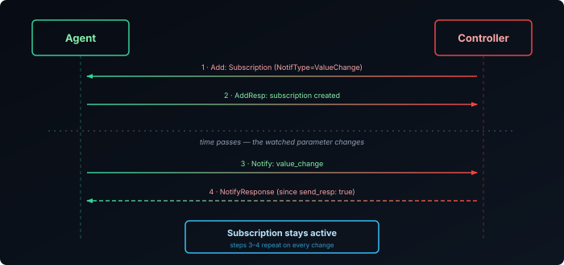

The [RPCs and data model post]() covered CWMP's notification levels — a parameter set to passive or active reports its own value changes, and that's the entire feature. USP replaces this with something considerably broader: **[Subscriptions][1]**, backed by a dedicated **[Notify][2]** message that covers six distinct kinds of event, not just "a value changed."

## The Subscription Object

A Controller doesn't flip an attribute on a parameter the way CWMP's `SetParameterAttributes` did. It creates an object instance — using the `Add` message from the [previous post]() — under `Device.LocalAgent.Subscription.{i}.`, with a handful of key fields:

| Field | Purpose |
|-------|---------|
| `Enable` | Whether this subscription is currently active |
| `NotifType` | Which of the six notification types this subscription watches for |
| `ReferenceList` | The parameter or object paths being watched |

Creating a subscription is a normal data model write, using the same message CWMP would need an entirely separate RPC family for.

## Six Notification Types

CWMP had one notification concept: a parameter's value changed. USP's `NotifType` covers six:

| Type | Triggered by |
|------|--------------|
| `ValueChange` | A watched parameter's value changes — the direct CWMP equivalent |
| `ObjectCreation` | A new instance is added to a watched multi-instance object |
| `ObjectDeletion` | An instance is removed from a watched multi-instance object |
| `OperationComplete` | An asynchronous `Operate` command finishes, successfully or not |
| `Event` | A data-model-defined event fires — arbitrary, object-specific occurrences |
| `OnBoardRequest` | An Agent contacts a Controller for the first time, or on `SendOnBoardRequest()` |

`ObjectCreation`, `ObjectDeletion`, and `OperationComplete` don't have a real CWMP equivalent at all. CWMP's closest attempts were the `Inform` event codes covered in the [provisioning post]() — `7 TRANSFER COMPLETE`, `8 DIAGNOSTICS COMPLETE` — special-cased signals bolted onto the one mechanism CWMP had, rather than a general-purpose way to say "this asynchronous thing finished." USP folds all of that into one message type.


## ValueChange in Practice



```json {filename="USP Notify — ValueChange"}
{
  "header": { "msg_id": "notify-001", "msg_type": "NOTIFY" },
  "body": {
    "request": {
      "notify": {
        "subscription_id": "wan-ip-watch",
        "send_resp": true,
        "value_change": {
          "param_path": "Device.DeviceInfo.FriendlyName",
          "param_value": "Living Room Gateway"
        }
      }
    }
  }
}
```

The Agent sends this on its own initiative the moment the watched value changes — there's no request from the Controller to trigger it, only the `Add`(Subscription) that set the watch up beforehand. `send_resp: true` means the Agent expects a `NotifyResponse` back before considering the notification delivered; a Controller that doesn't respond in time is exactly the kind of gap the Subscription's retry parameters exist to handle.

## No Passive Mode — And Why That's Fine

CWMP's notification levels split into passive (ride the next scheduled `Inform`) and active (open a new session immediately) specifically because opening an HTTP session for every minor value change was expensive — passive existed as a cost-saving compromise, covered in the RPCs post. USP's Subscription model doesn't have that split; every triggered notification results in its own `Notify` message.

That's a reasonable design point rather than an oversight: the [MTP post]() covered how MQTT and WebSockets keep a persistent connection open. Sending a `Notify` over a connection that's already up costs far less than CWMP paid to open a fresh session — the specific expense that justified a "cheap but delayed" passive tier mostly disappears once the transport itself stopped being the bottleneck.

## Recap

- Subscriptions are ordinary data model objects (`Device.LocalAgent.Subscription.{i}.`), created with the same `Add` message covered in the previous post — not a separate attribute-setting RPC.
- `NotifType` covers six kinds of event: `ValueChange`, `ObjectCreation`, `ObjectDeletion`, `OperationComplete`, `Event`, and `OnBoardRequest` — CWMP only ever had the first.
- `ObjectCreation`, `ObjectDeletion`, and `OperationComplete` have no real CWMP equivalent; CWMP's closest attempts were special-cased `Inform` event codes rather than a general mechanism.
- A triggered subscription sends a `Notify` message carrying the specific event type's data — `param_path`/`param_value` for `ValueChange`, and so on per type.
- USP has no passive/active split the way CWMP did, because the expense that justified CWMP's passive tier — opening a whole new session — mostly disappears once the Agent already holds a persistent MQTT or WebSocket connection open.

[1]: https://tr369.org/tr-369-usp-notification-types/
[2]: https://tr369.org/tr369-usp-notify-messages/
