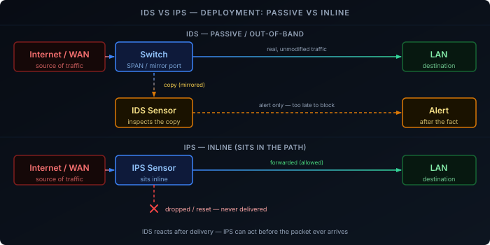

A firewall makes its decision from the packet header alone — source, destination, port, protocol. That's enough to block unwanted connections, but it says nothing about what's inside an *allowed* connection. A compromised device phoning home over port 443, or an exploit riding in on a permitted HTTP request, sails straight through. An Intrusion Detection System (IDS) or Intrusion Prevention System (IPS) is the layer that looks past the header, at the traffic itself.

## IDS vs IPS: Detection vs Prevention

The two acronyms describe the same inspection engine deployed two different ways.

**IDS (Intrusion Detection System)** — sits out of band, watching a copy of the traffic. When it matches something malicious, it raises an alert. It cannot block the packet that triggered it — by the time the alert fires, that packet has already been delivered.

**IPS (Intrusion Prevention System)** — sits inline, in the actual path of the traffic. When it matches something malicious, it can drop the packet before it reaches its destination, or reset the connection outright.

The difference isn't the detection logic — the same signatures and rules apply to both — it's *placement*. That placement decision is what the next section is about.

## Deployment: Passive vs Inline

**Passive (out-of-band)** — the sensor receives a copy of traffic from a switch SPAN/mirror port or a network tap. It never touches the original packet, so it adds zero latency and can't take the network down if it fails. This is the only way to run pure IDS — there's no original-path packet left to drop by the time the copy arrives.

**Inline** — the sensor sits directly in the traffic path, the same way a firewall does. Every packet passes through it before reaching the next hop. This is required for IPS — you can only drop a packet you're actually forwarding — but it means the sensor is now a potential bottleneck and a single point of failure. If it crashes, most deployments are configured to either fail open (traffic passes uninspected) or fail closed (traffic stops entirely), and that choice is a real availability-vs-security trade-off, not a default to leave unexamined.

Most consumer and prosumer gateways that advertise "IDS/IPS" or "Threat Management" run inline, since the gateway already sits in the traffic path by definition — there's no separate tap needed.

## Detection Methods

How the engine decides traffic is malicious in the first place comes down to a few distinct approaches, usually combined rather than used alone.

**Signature-based detection** — matches traffic against a database of known-bad patterns: a byte sequence in an exploit payload, a malware C2 beacon format, a specific malformed request a known CVE relies on. This is the same model antivirus uses. It's fast, precise, and produces very few false positives, but it can only catch what's already been seen and written into a rule — a genuinely novel attack passes right through until a signature exists for it. Rule sets need continuous updates; **Suricata** and **Snort** are the two dominant open-source engines, both commonly paired with the community-maintained Emerging Threats rule set.

**Anomaly-based detection** — instead of matching known-bad patterns, this builds a baseline of what "normal" traffic on the network looks like and flags deviations from it: a host suddenly sending large volumes of outbound data at 3am, a device that's never spoken to a country it now has an open connection to. This can catch attacks with no existing signature, including zero-days, but it trades that for a much higher false-positive rate — anything unusual gets flagged, whether it's malicious or just a backup job that changed schedule. It also needs a training period to learn what normal actually looks like before it's useful.

**Stateful protocol analysis** — the engine understands the expected structure of a protocol (HTTP, DNS, TLS) and flags traffic that technically matches the protocol but violates its expected behavior — a DNS response with an implausible number of records, an HTTP header sequence no real browser would produce. This sits between the two above: more structured than pure anomaly detection, but not dependent on a specific pre-written signature either.

**Reputation and threat intelligence** — blocklists of IP addresses, domains, and file hashes already known to be malicious, maintained by third-party feeds. Cheap to check and useful as a first pass, but only as good as the feed's freshness and coverage.

## The Encryption Problem

Signature and protocol-analysis detection both depend on being able to read the traffic's payload. The majority of traffic today is TLS-encrypted, and that fraction keeps growing — the [DoH/DoT/DoQ]() shift alone removed plaintext DNS as a visibility source for a lot of deployments, and [ECH](#why-plain-dns-is-a-problem) is starting to remove the TLS SNI field too. An inline IDS/IPS that can only pattern-match on payload bytes is increasingly inspecting traffic it cannot actually read.

There are three ways engines cope with this, none of them complete:

- **TLS termination/interception** — the IPS acts as a man-in-the-middle, decrypting traffic, inspecting it, and re-encrypting it before forwarding. Restores full visibility, but requires installing a trusted CA certificate on every client, breaks certificate pinning, and is a meaningful privacy and complexity cost most home and small-business deployments don't take on.
- **Metadata and fingerprinting** — without decrypting anything, an engine can still fingerprint the TLS handshake itself (JA3/JA3S), watch connection timing and packet-size patterns, and flag SNI or destination-IP reputation. This catches a meaningful amount of malware C2 traffic, which often has a distinctive, un-browser-like TLS fingerprint, but it's inference, not certainty.
- **Accept the blind spot on payload, keep flow-based anomaly detection** — volume, timing, and destination patterns are still visible even when content isn't, so anomaly-based detection degrades more gracefully under encryption than signature matching does.

## Alert Fatigue

An operational problem worth naming: a sensor tuned to catch everything catches a lot of noise. If genuine attacks are rare relative to total traffic — which they are, on almost any real network — then even a detector with a very low false-positive *rate* still produces mostly false positives in absolute terms, because there are so many more benign events to misfire on than actual attacks. This is the base-rate fallacy applied to IDS: a 99.9% accurate detector running against mostly-benign traffic still buries the rare genuine alert under noise. Tuning out irrelevant rules for your specific environment — rather than running every signature in the default set — is what makes the alert stream usable instead of ignored.

## Where This Fits in a Home Network

For a home network, an inline IPS on the gateway is the practical default — it's the one point all traffic already passes through, so no separate tap or mirror port is needed to get visibility. Signature-based detection catches known malware and exploit traffic without much tuning burden; anomaly-based detection is higher-maintenance and usually more relevant at a scale with a dedicated person watching alerts than for a single-gateway homelab. The encryption caveat above still applies — expect it to catch unencrypted or fingerprintable traffic reliably, and encrypted payloads only through metadata, not content.
