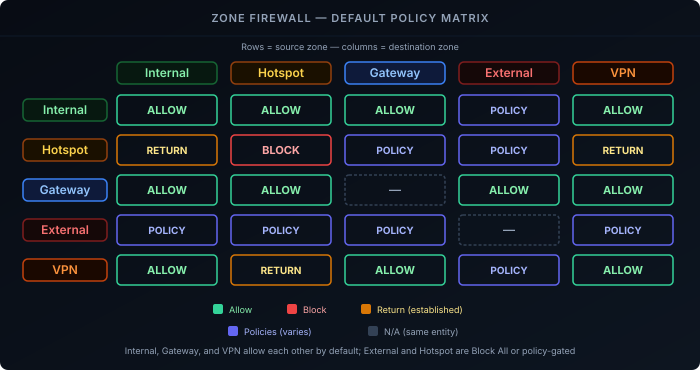

The [UniFi Gateway]() post ended with a single flat LAN — every device on one network, trusting every other device on that network by default. This post splits that into VLANs and controls what can talk to what, using UniFi's zone-based firewall to write policy between groups of networks instead of individual rules.

## Prerequisites

- A UniFi gateway with at least one network already configured — see [Setting Up a UniFi Gateway]()
- UniFi OS/Network application recent enough to have zone-based firewall (it's the default on current UniFi OS releases; older adopted gateways may need to opt in from the legacy firewall)

## How Zones Work

Instead of writing individual allow/deny rules between every pair of networks, UniFi groups networks into **zones** and writes policy between zones instead. Every network belongs to exactly one zone — you can't split a single VLAN's traffic across two.

UniFi ships with six predefined zones:

- **Internal** — locally trusted traffic. Every network you create lands here by default, except Guest-type networks.
- **External** — untrusted traffic from your WAN connection(s).
- **Gateway** — traffic to and from the gateway itself: DHCP, DNS, and HTTPS/SSH management.
- **VPN** — traffic from VPN clients and site-to-site tunnels (Teleport, WireGuard, OpenVPN, L2TP, Site Magic).
- **Hotspot** — guest networks behind a captive portal.
- **DMZ** — for anything that needs to be reachable from the internet, like a self-hosted public-facing service.

Predefined zones are locked and can't be deleted, but you can create your own custom zones for finer-grained control.

### Default behavior between zones

Zone defaults aren't uniformly deny — they split along a trust line. Internal, Gateway, and VPN represent infrastructure and networks you already own, so they ship **Allow All** toward almost everything else. External, Hotspot, and DMZ represent traffic origins you don't control, so their defaults are either **Block All** or a curated set of built-in policies rather than a blanket allow. This is UniFi's actual built-in matrix for the predefined zones:

| Source ↓ / Destination → | Internal | Hotspot | Gateway | External | VPN |
|---|---|---|---|---|---|
| **Internal** | Allow All | Allow All | Allow All | Policies | Allow All |
| **Hotspot** | Allow Return Traffic | Block All | Policies | Policies | Allow Return Traffic |
| **Gateway** | Allow All | Allow All | — | Allow All | Allow All |
| **External** | Policies | Policies | Policies | — | Policies |
| **VPN** | Allow All | Allow Return Traffic | Allow All | Policies | Allow All |

A few things worth unpacking:

- **Allow All** means no restriction, in that direction only. Internal → Hotspot is wide open by default; the reverse, Hotspot → Internal, is not.
- **Allow Return Traffic** only permits packets belonging to a connection the *destination* zone already initiated — it doesn't open new connections in that direction. Hotspot → Internal shows this: your trusted devices can already reach into Hotspot (Internal → Hotspot is Allow All), and Hotspot's replies are allowed back, but a guest device can't originate a new connection into Internal.
- **Policies** means the pair is governed by a specific built-in ruleset rather than one flag — e.g. Hotspot still gets DHCP/DNS from Gateway and can browse out through External on day one, but that's scoped policy, not a blanket allow. External's entire row is Policies, which functions as block-new/allow-established in practice — nothing from the WAN reaches in unsolicited, but your own outbound connections still get their replies.
- **Internal → Hotspot being wide open is easy to miss.** Trusted devices can already reach into your guest network by default, just not the other way around. Segmenting guest WiFi from your trusted devices isn't automatic just because they're different zones — you still write that rule if you want it.

**Hotspot → Hotspot is Block All** too — guest devices are isolated from *each other* by default, not just from other zones. That's client isolation, and unlike Internal (where two VLANs left in the same zone trust each other freely), it applies even within Hotspot itself.

**Custom zones are the actually-isolated default.** None of the table above applies to a zone you create yourself — it starts with zero built-in policy in either direction, blocked to and from everything, including the Internal/Gateway/VPN zones that are otherwise Allow All toward each other. The predefined zones above are not a flat default-deny; a custom zone is what gets you that.

In other words, "switching to zones" doesn't by itself close every hole — the predefined zones already give you a working baseline (trusted networks talk freely, WAN stays out), but a custom zone is what gets you a genuinely closed starting point to open exceptions from.

## Creating the VLANs

Under **Settings → Networks**, create a new network for each segment you want. At minimum, give each one a VLAN ID and a subnet:

<!-- TODO(Sven): fill in your actual VLAN layout here — how many networks, their purpose, VLAN IDs, and subnets. Example structure below uses placeholder 192.168.x.0/24 values. -->

| Network | VLAN ID | Subnet | Purpose |
|---|---|---|---|
| Trusted | 1 (native) | `192.168.1.0/24` | Your existing devices — same as the flat LAN from the gateway post |
| IoT | `[VLAN_ID]` | `192.168.10.0/24` | Smart-home devices that shouldn't reach your trusted network |
| Guest | `[VLAN_ID]` | `192.168.30.0/24` | Visitor WiFi — mark this one as a **Guest** network type so it lands in the Hotspot zone automatically |

Every network you create lands in the **Internal** zone by default — except a network explicitly marked as a Guest network, which is placed in **Hotspot** automatically.

## Assigning Networks to Zones

To move a network out of Internal into its own zone (or a custom zone you've created), go to **Settings → Security → Firewall**, select the zone, click **Edit**, add the network, and save. A network can only belong to one zone at a time, so moving it out of Internal removes it from Internal's automatic same-zone trust.

For the layout above: move **IoT** into its own custom zone (call it `IoT`) so it's isolated from Trusted by default. This matters specifically because leaving IoT in Internal — or even in Hotspot — wouldn't actually isolate it: Internal trusts itself internally, and Hotspot only blocks the *guest→trusted* direction, not trusted→guest. Only a custom zone starts genuinely closed in both directions. Leave **Trusted** in Internal, and leave **Guest** in Hotspot — its purpose (visitor WiFi with a captive portal) matches what Hotspot is actually for.

## Writing Policies Between Zones

Under **Settings → Security → Firewall**, the zone matrix shows every zone as both a row and a column. Click the intersection of a source and destination zone to create a policy for traffic in that direction — policies are directional, so IoT→Trusted and Trusted→IoT are configured separately.

Each policy has:

- **Source / Destination zone** — set by which matrix cell you clicked
- **Specific source/destination** — optionally narrow it further to a specific network, device, app, IP, website, or region instead of the whole zone
- **Action** — Allow or Block
- **Connection state** — New, Established, Invalid, Return
- **Protocol / port**
- **Schedule** — optionally time-limit the rule

Policies evaluate top to bottom. One easy-to-miss detail: only block the **New** and **Invalid** connection states. If you block **Established** or **Return** as well, you also block the reply traffic for connections that were actually initiated in the allowed direction.

### Example: letting IoT reach one trusted service

The default (IoT zone fully isolated) is often too strict — a smart-home hub on the IoT VLAN usually needs to reach one specific service on Trusted, not the whole network. Rather than opening IoT→Trusted broadly, add a narrow allow rule above the implicit deny:

- **Source zone**: IoT → **Destination zone**: Internal
- **Specific destination**: the single device/IP hosting the service
- **Protocol/port**: only what that service needs
- **Action**: Allow

Everything else from IoT to Internal stays blocked by the zone default.

<!-- TODO(Sven): swap in your actual cross-zone exceptions here — what does IoT/Guest actually need to reach, if anything? -->

## Migrating from Legacy Rules

If your gateway was adopted before zone-based firewall was the default, enabling it migrates your existing legacy firewall and traffic rules into equivalent zone policies automatically — but it tends to produce more individual policies than you started with, since each old rule maps fairly literally rather than being consolidated. Worth reviewing the generated policy list afterward and merging anything redundant, rather than assuming the migration is the final state.

---

With VLANs isolated by zone instead of by one flat network, remember the predefined zones aren't closed by default — Internal, Gateway, and VPN all trust each other out of the box. A custom zone is what gets you a genuinely closed starting point for anything that needs real isolation. If you're already feeding UniFi syslog into [Loki](), blocked cross-zone traffic shows up there too, which is a good way to sanity-check a new zone layout before trusting it.
