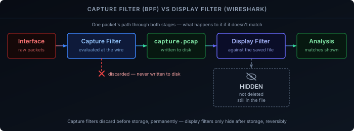

Logs and metrics tell you what a system *reported* happening. A packet capture tells you what actually crossed the wire — no application-layer interpretation in between, no chance the logging code swallowed the one detail that mattered. When a log says "connection refused" and you need to know whether that's a TCP RST, a timeout, or a firewall silently dropping the SYN, a capture is the only thing that actually answers it.

This covers the realistic end-to-end workflow: capturing with tcpdump, then analyzing in Wireshark — two different filter languages doing two different jobs, which is the single most common point of confusion for anyone starting out.

## Where You Can Actually See Traffic

A network interface in normal mode only hands the OS packets addressed to its own MAC address. **Promiscuous mode** tells the interface to pass every packet it physically receives up the stack, regardless of destination — the prerequisite for capturing anything that isn't addressed to the capturing machine itself. **Monitor mode** is the wireless-specific equivalent: it captures raw 802.11 frames, management and control frames included, without first associating to a network — required for capturing WiFi traffic that isn't your own client traffic.

Promiscuous mode alone doesn't help on a switched network, though. A switch forwards each frame only out the port where the destination MAC lives — your capturing machine physically never receives anyone else's unicast traffic, promiscuous or not. Seeing traffic between two *other* devices requires either a switch's SPAN/mirror port or a network tap feeding you a copy — the same passive-tap requirement covered in [IDS/IPS Explained](#deployment-passive-vs-inline). Capturing on the device that's actually one end of the conversation (the client, the server, or the gateway routing it) sidesteps the problem entirely — you don't need a mirror port to see traffic addressed to you.

## Capture Filters (tcpdump / BPF)

tcpdump's filter language is **BPF (Berkeley Packet Filter)** — a compact expression syntax evaluated against every packet the interface offers, *before* anything is written to disk or memory:

```bash
tcpdump -i eth0 host 192.168.1.50 and port 443
```

Primitives combine with `and`, `or`, and `not`:

```bash
tcpdump -i eth0 net 192.168.10.0/24 and not port 22
tcpdump -i eth0 host 192.168.1.1 and (port 67 or port 68)
```

Common primitives: `host <ip>`, `net <subnet>`, `port <n>`, `proto <tcp|udp|icmp>`, `src`/`dst` to constrain a primitive to one direction (`src host 10.0.0.5`).

The reason this runs *before* storage matters: a capture filter discards non-matching packets at the kernel level — they're never written anywhere, never touch disk I/O, never bloat the file you'll open later. On a busy interface, an unfiltered capture can drop packets under load simply from not being able to write fast enough; a tight capture filter is often what keeps a capture usable at all, not just tidier.

## Display Filters (Wireshark)

Wireshark's filter language is unrelated to BPF syntax, despite superficially similar goals. It's field-based, referencing named fields from the protocol dissectors that already parsed every packet in the file:

```
tcp.port == 443
ip.addr == 192.168.1.50 && http.request
dns.qry.name contains "example.com"
```

The critical distinction: a display filter doesn't discard anything. Every packet is still in the capture file — Wireshark just hides the ones that don't match your filter from the current view. Clear the filter and everything reappears; nothing was lost the way a mismatched capture filter would lose it permanently.

This is also why you can apply an aggressive, exploratory display filter without any downside — `tcp.analysis.retransmission` to find every retransmitted segment, `tcp.stream eq 4` to isolate one specific conversation after spotting it — and just as easily back out and try a different angle, since the underlying data never changed.

**Following a stream** — right-click any packet and *Follow → TCP Stream* (or UDP/HTTP/TLS) reassembles the full back-and-forth of that one conversation into readable order, instead of you manually piecing together interleaved packets from a mixed capture.



## Filter Recipes

A handful of filters that come up constantly enough to be worth having memorized rather than re-derived each time.

**DHCP negotiation** (tcpdump capture filter — DHCP has no dedicated BPF primitive, so it's expressed as UDP on the well-known ports):
```bash
tcpdump -i eth0 udp and (port 67 or port 68)
```

**DNS queries** (Wireshark display filter, after a broad capture):
```
dns
```

**A specific TLS handshake** (Wireshark, isolating the negotiation itself rather than the whole encrypted session that follows):
```
tls.handshake
```

**Traffic on a specific VLAN** (tcpdump, matching the 802.1Q tag — note `vlan` shifts the filter engine's notion of the Ethernet header offset for everything chained after it, so ordering matters):
```bash
tcpdump -i eth0 vlan 10 and host 192.168.10.5
```

**Excluding your own remote session** — capturing on a box you're SSH'd into means your own SSH traffic shows up in every capture, drowning out what you actually want to look at:
```bash
tcpdump -i eth0 not port 22
```

## Working with Capture Files

`-w capture.pcap` writes raw packets to a file instead of printing them; `-r capture.pcap` reads one back — the same file format Wireshark opens directly, so a headless capture on a router or server can be pulled over and analyzed on a workstation afterward.

**Snaplen** (`-s`) caps how many bytes of each packet are actually captured. The default on modern tcpdump captures the full packet, but explicitly limiting it (`-s 96`, enough for headers without payload) shrinks file size significantly when you only need header-level information — protocol, ports, flags — and don't care about payload contents.

**Ring buffers** (`-W <count> -C <size in MB>`) rotate through a fixed set of files, overwriting the oldest once the count is reached — the practical way to leave a capture running for hours waiting for an intermittent issue, without it eventually filling the disk.

## Practical Gotchas

**Capturing on a switch needs a mirror port or tap.** Covered above, but worth restating as the single most common reason a capture comes back empty: the traffic you wanted was never delivered to the interface you captured on in the first place, promiscuous mode or not.

**Encryption limits what a capture shows you.** TLS payload is opaque without the session keys; [DoH/DoT/DoQ]() removes even the DNS query from plaintext view. A capture still shows you *that* a connection happened, its timing, and its size — the same metadata-only visibility discussed in [IDS/IPS Explained's encryption section](#the-encryption-problem) — just not the content, unless you control the endpoint and can export its TLS session keys (`SSLKEYLOGFILE`, supported by most browsers and Wireshark's built-in decryption).

**Vantage point changes what you can conclude.** A capture on the client shows what the client sent and received — nothing about what a NAT rewrote it into, or whether a firewall dropped it further upstream. A capture on the gateway shows both sides of that translation. Matching captures at two points and comparing timestamps is how you actually localize where a packet stopped mattering, rather than guessing from one vantage point.

## Where to Run This

For a homelab, the gateway is usually the highest-value capture point — it's the one place nearly every conversation of interest already passes through, the same reasoning that makes it the default IPS placement. Client-side captures are worth it specifically when you need to rule out something happening below the network layer entirely (a misbehaving app, local firewall) before it ever reaches the wire.
