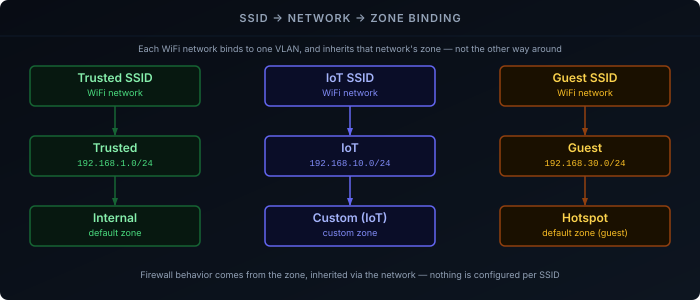

The [WiFi Explained]() series covers how roaming, band steering, and RSSI thresholds actually work, vendor-agnostically. This post is the other half: applying that to a real, multi-AP UniFi deployment — several U7-Pro-Wall access points, SSIDs mapped onto the VLANs from [UniFi VLANs & Firewall Zones]() — and showing which UniFi setting actually corresponds to which concept from that series.

## Prerequisites

- A UniFi gateway/controller already running — see [Setting Up a UniFi Gateway]()
- Networks/VLANs already created — see [UniFi VLANs & Firewall Zones](); this post assumes the Trusted/IoT/Guest layout from there
- One or more UniFi access points (U7-Pro-Wall here)

## Adopting the APs

An AP on the same VLAN/broadcast domain as the controller is typically discovered and adoptable automatically from **Settings → Devices** (or the mobile app) within a minute or two of powering on.

**The gotcha, directly relevant after segmenting with VLANs:** if an AP boots on a different VLAN than the controller's management traffic, L2 discovery doesn't reach it, and it never shows up as pending adoption. The fix is **L3 adoption** — SSH into the AP directly and point it at the controller manually:

```bash
set-inform http://<controller-ip>:8080/inform
```

Worth checking for up front if APs go on their own dedicated management VLAN rather than sitting in Trusted.

<!-- TODO(Sven): confirm which VLAN your APs' management traffic actually lands on, and whether you needed set-inform for any of them -->

## Creating WiFi Networks Mapped to VLANs

Under **Settings → WiFi**, each WiFi network (SSID) is bound to one underlying network — the same Trusted/IoT/Guest networks created in the VLANs post. Three separate SSIDs, one per network:

| SSID | Network | Zone |
|---|---|---|
| Trusted SSID | Trusted | Internal |
| IoT SSID | IoT | Custom (IoT) |
| Guest SSID | Guest | Hotspot |

Creating the Guest SSID against a network already marked as a Guest-type network is what puts it in the Hotspot zone and enables the captive portal — this was set up back in the VLANs post, not something to redo here.

<!-- TODO(Sven): confirm your actual SSID names -->



## Security Settings

Each SSID's security mode lives in its **Advanced** settings — WPA2/WPA3 Transition Mode is the sane default per the [WPA3 Explained](#transition-mode) post: WPA3-capable clients get SAE, older clients fall back to WPA2-PSK, on the same SSID.

The roaming post's advice to **match security settings across every AP serving the same SSID** is automatic here — UniFi applies WiFi network settings site-wide to every AP broadcasting that SSID, not per-AP. There's no per-AP security config to accidentally mismatch.

## Band Steering and the IoT Split

Since IoT already has its own dedicated SSID (the table above), the [roaming post's recommendation](#practical-configuration) to separate IoT off the main SSID is already satisfied structurally — the IoT SSID can just be **restricted to the 2.4 GHz radio only**, under that SSID's Advanced settings, removing it from band-steering consideration entirely rather than tuning steering to accommodate it.

For the Trusted SSID (dual/tri-band, no need to isolate anything on it), UniFi's **Band Steering** setting has three modes: Off, Balanced, and Prefer 5G. "Prefer 5G" is the aggressive probe-suppression behavior the roaming post warns can break minimal-retry IoT devices — since IoT is already off this SSID, that failure mode doesn't apply here, so Prefer 5G (or Balanced, if any borderline dual-band devices are still on Trusted) is reasonable rather than needing the conservative "Off" fallback the theory post recommends for a mixed environment.

## Fast Roaming (802.11r)

UniFi's **Fast Roaming** toggle, per SSID under Advanced settings, is 802.11r — enabling it configures a shared mobility domain across every AP broadcasting that SSID automatically, which is the part the roaming post flags as easy to get wrong when configuring 802.11r by hand. Still worth the theory post's warning: test client behavior after enabling it, since some client FT implementations are buggy enough to cause connection failures rather than smoother roams.

## Minimum RSSI

Also per-SSID under Advanced settings — a signal floor below which a client is disconnected rather than allowed to linger on a degrading link to a distant AP. The roaming post's **-70 to -75 dBm** starting point applies directly; UniFi exposes this as a single dBm value per SSID rather than separate per-band thresholds.

<!-- TODO(Sven): confirm the actual Minimum RSSI value(s) you're running, once tuned per SSID -->

## Channels and Transmit Power

Covered in depth in [Transmit Power, Channel Selection & Width](). UniFi's **RF Environment**/per-radio settings under each AP default to **Auto** for both channel and TX power, which re-scans and adjusts periodically. With multiple APs covering overlapping areas, Auto is the reasonable default to start from — manual planning only pays off once Auto's choices are visibly wrong for the actual floor plan.

## MLO

WiFi 7 Multi-Link Operation ([covered here](#multi-link-operation-one-client-multiple-bands-at-once)) is available as a toggle on U7-Pro-Wall APs, but isn't enabled in this deployment yet — client-side MLO support is still limited enough that it isn't part of this configuration.

## Verifying It Actually Works

UniFi's own **Insights** view under a client shows its roam and band-steering history without any extra tooling. For anything that needs more certainty than the UI summary gives — confirming a client actually completed an 802.11r fast transition rather than a full re-auth, for instance — capturing 802.11 management frames directly is the way to actually see it, as covered in [Packet Captures Explained]().
