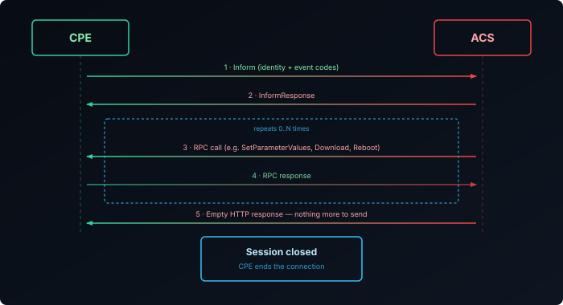
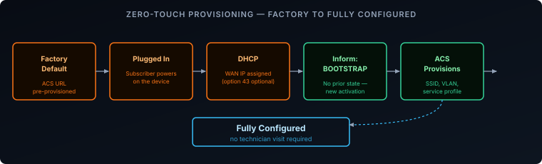
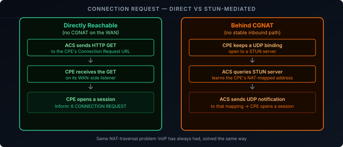

Every ISP-supplied router, ONT, or modem gets managed remotely without a technician ever logging into it. TR-069[1] — formally CWMP, the CPE WAN Management Protocol, defined by the Broadband Forum — is the standard behind most of that: it's how a CPE finds the operator's management server, registers itself, and gets configured with zero manual input. TR-369 (USP) is the newer successor, but TR-069 remains the dominant protocol on deployed CPE today. This post covers the session and provisioning flow — how a device gets from factory default to fully configured.

## What Is TR-069/CWMP

CWMP defines a client-server relationship between two roles:

- **ACS (Auto Configuration Server):** the operator-side management platform.
- **CPE (Customer Premises Equipment):** the router, ONT, or modem in the subscriber's home.

The two exchange **RPCs (Remote Procedure Calls)** — XML-encoded SOAP envelopes carried over HTTP or HTTPS. The ACS uses RPCs to read and write configuration parameters, trigger firmware upgrades, and reboot the device; the CPE uses RPCs to report its identity and current state.

## Who Initiates: The CPE Always Calls Home

The CPE opens every session. The ACS never establishes an outbound connection to the CPE on its own — it can only ask the CPE to connect (more on that later). This is a deliberate design choice: subscriber routers sit behind a WAN-side NAT or CGNAT, so an operator platform initiating an inbound connection to millions of residential IPs isn't reliable in general. A CPE-initiated, outbound-only session works through any NAT the same way a browser request does.

The trade-off: the ACS can't act the instant it decides to. It has to wait for the CPE to check in, or nudge it to check in sooner — which is exactly the problem the Connection Request mechanism, covered later, exists to solve.

## Finding the ACS

Before a CPE can start a session, it needs an ACS URL. Two common paths get it there:

- **Factory default.** Devices sold or leased directly by an ISP typically ship with the operator's ACS URL burned into firmware at manufacture.
- **DHCP option override.** For devices that aren't pre-provisioned per-operator, the ACS URL can be delivered via DHCP — most commonly option 43 (vendor-specific information), sometimes alongside option 60 (vendor class identifier) so the DHCP server can identify the device type before deciding what to hand back.

Either way, the moment a CPE has an ACS URL it didn't have before — first ever contact, or an operator-pushed change to a different ACS — it fires a **Bootstrap** event on its next session rather than an ordinary **Boot**. The ACS uses this signal to know it's dealing with a device that has no prior provisioning state and needs full initial configuration, not just a routine check-in.

## The Inform RPC and Event Codes

Every session opens the same way: the CPE sends an `Inform` RPC. It carries the CPE's identity — manufacturer OUI, product class, serial number — its current values for a small set of parameters the ACS has asked to always see, and one or more **Event Codes** describing why this session started.

The event codes relevant to provisioning:

| Event Code | Meaning |
|------------|---------|
| `0 BOOTSTRAP` | First contact ever, or the ACS URL just changed — no prior provisioning state assumed |
| `1 BOOT` | Normal power-on or reboot with existing provisioning intact |
| `2 PERIODIC` | Scheduled heartbeat check-in |
| `4 VALUE CHANGE` | A parameter the ACS is watching changed on its own (e.g. WAN IP) |
| `6 CONNECTION REQUEST` | This session exists because the ACS asked for it |
| `7 TRANSFER COMPLETE` | A prior `Download` or `Upload` RPC (e.g. a firmware update) finished |

A single `Inform` can carry more than one event code — a device coming back online after a firmware upgrade might report both `1 BOOT` and `7 TRANSFER COMPLETE` in the same message.

Stripped of SOAP envelope boilerplate, a first-contact `Inform` looks like this:

```xml {filename="Inform request — 0 BOOTSTRAP"}
<cwmp:Inform>
  <DeviceId>
    <Manufacturer>Acme Networks</Manufacturer>
    <OUI>001122</OUI>
    <ProductClass>HomeGateway</ProductClass>
    <SerialNumber>ACM123456789</SerialNumber>
  </DeviceId>
  <Event soap-enc:arrayType="cwmp:EventStruct[1]">
    <EventStruct>
      <EventCode>0 BOOTSTRAP</EventCode>
      <CommandKey></CommandKey>
    </EventStruct>
  </Event>
  <MaxEnvelopes>1</MaxEnvelopes>
  <CurrentTime>2026-08-25T09:14:32Z</CurrentTime>
  <RetryCount>0</RetryCount>
  <ParameterList soap-enc:arrayType="cwmp:ParameterValueStruct[2]">
    <ParameterValueStruct>
      <Name>Device.DeviceInfo.SoftwareVersion</Name>
      <Value xsi:type="xsd:string">1.0.4</Value>
    </ParameterValueStruct>
    <ParameterValueStruct>
      <Name>Device.ManagementServer.ConnectionRequestURL</Name>
      <Value xsi:type="xsd:string">http://192.0.2.10:7547/acs</Value>
    </ParameterValueStruct>
  </ParameterList>
</cwmp:Inform>
```

The `DeviceId` block is what the ACS uses to recognize the device (the OUI + SerialNumber pair from the Bootstrap-provisioning flow above); the `ParameterList` here always includes the CPE's `ConnectionRequestURL`, since the ACS needs it for everything covered in the next section.

## Session Flow: From Inform to Session Close

Once the CPE has an ACS URL and a reason to connect, the session itself follows a fixed shape:

1. The CPE opens an HTTP(S) connection to the ACS and sends `Inform`.
2. The ACS replies with `InformResponse`, acknowledging it.
3. The ACS may now issue any number of RPCs in the same session — reading parameters, writing new configuration, requesting a firmware download, scheduling a reboot. The CPE responds to each in turn.
4. When the ACS has nothing further to send, it responds with an empty HTTP body instead of another RPC.
5. The CPE sees the empty response and closes the session.



Every request in both directions is authenticated — typically HTTP Digest authentication over the connection, with the connection itself running over TLS in any modern deployment. A CPE presenting the wrong credentials, or an ACS the CPE doesn't recognize, doesn't get a session.

## Zero-Touch Provisioning in Practice

This is the payoff of the whole design: an ISP can ship a device to a subscriber's door with no per-unit manual configuration step, and it ends up fully provisioned anyway.

1. The device leaves the factory with the operator's ACS URL already set.
2. The subscriber plugs it in. It gets a WAN address via DHCP.
3. Having never contacted an ACS before, it sends an `Inform` with event code `0 BOOTSTRAP`.
4. The ACS looks up the device by its OUI and serial number, finds no existing provisioning record, and treats this as a new activation.
5. The ACS pushes the subscriber's actual service configuration in the same or a follow-up session — WiFi SSID and passphrase, VLAN tagging, voice service parameters, whatever the service plan requires.
6. From here on, the device reports `1 BOOT` on power cycles and `2 PERIODIC` on its regular check-in schedule — the ACS already has its provisioning record and just confirms nothing has drifted.



No technician visit, no subscriber-facing setup wizard required for the operator's own service parameters to land correctly.

## Getting Back In: Periodic Inform and Connection Requests

Between provisioning events, the ACS still needs a way to reach a CPE — to push an urgent configuration change, or kick off a firmware update, without waiting for the next scheduled check-in.

**Periodic Inform** is the baseline: the CPE is configured with a check-in interval (commonly every few hours) and opens a session on that schedule regardless of anything else happening, reporting `2 PERIODIC`. This alone guarantees the ACS is never more than one interval away from reaching the device, but it's not immediate.

**Connection Request** is the ACS-initiated alternative: the CPE exposes a small HTTP listener on its WAN side, and the ACS sends a GET to a URL the CPE reported earlier. On receiving it, the CPE starts a normal session with event code `6 CONNECTION REQUEST` — the ACS doesn't get to skip the Inform handshake, it just gets the CPE to initiate sooner.

The problem: that WAN-side listener is exactly what CGNAT breaks. A CPE behind carrier-grade NAT has no stable, reachable public port for the ACS to hit directly. CWMP's answer is a **STUN-based Connection Request**: the CPE keeps a UDP binding open to a STUN server, the ACS learns the CPE's current NAT-mapped address and port through that same server, and sends the connection request as a UDP packet to that mapping instead of a direct HTTP GET. It's the same NAT-traversal problem VoIP has always had, solved the same way.



## Recap

- TR-069/CWMP is a CPE-initiated, RPC-based protocol between a CPE and an ACS — the CPE always opens the session, which is what makes it NAT-friendly by default.
- The ACS URL reaches a CPE either as a factory default or via DHCP option 43; getting a new one for the first time fires a `BOOTSTRAP` event rather than a routine `BOOT`.
- Every session starts with `Inform`, carrying the CPE's identity and one or more event codes explaining why the session exists (`BOOTSTRAP`, `BOOT`, `PERIODIC`, `VALUE CHANGE`, `CONNECTION REQUEST`, `TRANSFER COMPLETE`).
- A session is `Inform` → `InformResponse` → zero or more ACS RPCs → an empty envelope closes it, all authenticated over TLS with HTTP Digest.
- Zero-touch provisioning works because `BOOTSTRAP` tells the ACS "this device has no state" — it can push a subscriber's full config on first contact with no manual setup.
- Between check-ins, the ACS reaches a CPE via Connection Request — a direct HTTP GET when possible, or a STUN-mediated UDP notification when the CPE sits behind CGNAT.

This covers when a session happens and how it opens and closes — see [TR-069 Explained: RPCs and the TR-181 Data Model]() for what actually gets read and written once it does.

[1]: https://www.broadband-forum.org/pdfs/tr-069-1-6-1.pdf
