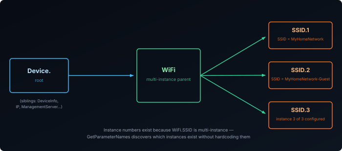
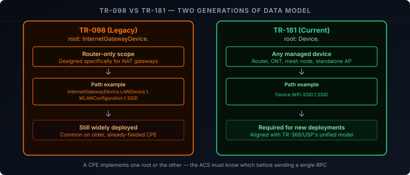
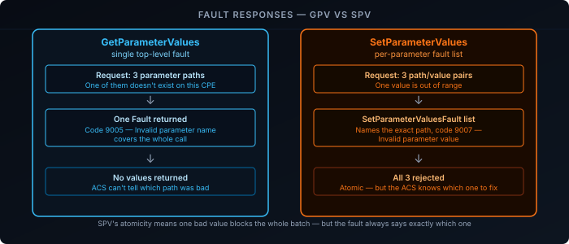
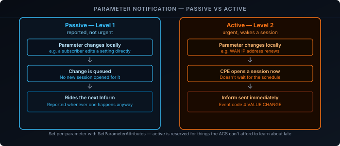

The [previous post]() covered when a CWMP session happens and how it opens and closes. This one covers what actually moves through it: the RPCs an ACS uses to read and write configuration, the data model those RPCs operate on, and how the ACS learns about changes it didn't make itself.

## The Core RPCs

Every CWMP interaction beyond the `Inform` handshake is one of a fairly small set of RPCs:

| RPC | Direction | Purpose |
|-----|-----------|---------|
| `GetParameterValues` | ACS → CPE | Read the current value of one or more parameters |
| `SetParameterValues` | ACS → CPE | Write new values to one or more parameters |
| `GetParameterNames` | ACS → CPE | Discover which parameters exist under a given path |
| `AddObject` / `DeleteObject` | ACS → CPE | Create or remove a multi-instance object (e.g. a new WiFi SSID, a new port-forward rule) |
| `Download` | ACS → CPE | Instruct the CPE to fetch a file — firmware, config backup, a CA certificate |
| `Upload` | ACS → CPE | Instruct the CPE to push a file to a server — a config backup, a log bundle |
| `Reboot` / `FactoryReset` | ACS → CPE | Restart the device, or wipe it back to factory defaults |

Almost everything an ACS does to a CPE is one of these seven calls made against the right parameter path. There's no separate "set the WiFi password" RPC — there's `SetParameterValues` pointed at `Device.WiFi.AccessPoint.1.Security.KeyPassphrase`.

A `GetParameterValues` call and its response, stripped of SOAP envelope boilerplate:

```xml {filename="GetParameterValues request"}
<cwmp:GetParameterValues>
  <ParameterNames soap-enc:arrayType="xsd:string[2]">
    <string>Device.WiFi.SSID.1.SSID</string>
    <string>Device.DeviceInfo.SoftwareVersion</string>
  </ParameterNames>
</cwmp:GetParameterValues>
```

```xml {filename="GetParameterValuesResponse"}
<cwmp:GetParameterValuesResponse>
  <ParameterList soap-enc:arrayType="cwmp:ParameterValueStruct[2]">
    <ParameterValueStruct>
      <Name>Device.WiFi.SSID.1.SSID</Name>
      <Value xsi:type="xsd:string">MyHomeNetwork</Value>
    </ParameterValueStruct>
    <ParameterValueStruct>
      <Name>Device.DeviceInfo.SoftwareVersion</Name>
      <Value xsi:type="xsd:string">1.0.4</Value>
    </ParameterValueStruct>
  </ParameterList>
</cwmp:GetParameterValuesResponse>
```

## Addressing Parameters: The Data Model Tree

Every setting and every piece of status on a CPE — WiFi config, WAN interface state, port forwards, connected device list — is exposed as a node in a hierarchical tree, addressed by a dot-separated path:

```
Device.WiFi.SSID.1.SSID
Device.WiFi.AccessPoint.1.Security.ModeEnabled
Device.DeviceInfo.SoftwareVersion
Device.IP.Interface.1.IPv4Address.1.IPAddress
```

Numbers in a path (the `1` in `SSID.1`) are **instance numbers** — they exist because some nodes are multi-instance objects. A CPE with three configured SSIDs has `Device.WiFi.SSID.1`, `.2`, and `.3`, each a full sub-tree of its own parameters. `AddObject` creates a new instance number under a multi-instance node; `DeleteObject` removes one.

An ACS doesn't need to hardcode which instance numbers exist on a given CPE. `GetParameterNames` walks the tree: called with a path and a `NextLevel` flag, it returns either the immediate children of that path or the full set of descendant parameter names beneath it — letting the ACS discover what's actually present before reading or writing anything.



## TR-098 vs TR-181: Two Generations of Data Model

The paths above all start with `Device.` — but plenty of deployed CPE, especially older ones, use a different root entirely: `InternetGatewayDevice.`.

- **[TR-098][1]** is the original data model, rooted at `InternetGatewayDevice.`, scoped specifically to a NAT gateway/router.
- **[TR-181][2]** is the current unified data model, rooted at `Device.`, designed to describe any managed device — router, ONT, mesh node, or a standalone access point — not just gateways.

A CPE supports one root or the other (some transitional devices exposed both for compatibility during migration, but that's the exception, not the rule). The ACS finds out which one it's dealing with from the CPE's `Inform` — the parameter list it carries includes enough of the root structure for the ACS to tell early rather than guessing from a failed `GetParameterValues` call. Getting this wrong means every subsequent RPC in the session is aimed at paths that don't exist on that device.



Practically, this is why an ACS platform maintains a per-device-profile mapping rather than one hardcoded set of paths — the same "WiFi passphrase" setting lives at a different path depending on which data model generation the CPE implements.

## Standard Parameters vs Vendor-Specific Extensions

Every path used so far — `Device.WiFi.SSID.1.SSID`, `Device.DeviceInfo.SoftwareVersion` — is defined by the Broadband Forum itself, in TR-098 or TR-181. These are **standard parameters**: any compliant ACS understands what they mean on any compliant CPE, without needing vendor documentation.

CPE vendors routinely add capabilities the standard doesn't cover — a proprietary mesh-steering setting, an extra telemetry field, a feature unique to that hardware. CWMP has a naming convention for exactly this rather than leaving it undefined: **vendor-specific parameters** are prefixed `X_<VENDOR>_`, where `<VENDOR>` is the vendor's registered prefix (historically their OUI in hex, though a registered short name is common too):

```
Device.WiFi.SSID.1.X_ACME_SignalQuality
Device.X_ACME_COM_MeshSteering.Enable
```

These show up in two shapes: bolted onto an existing standard object (a custom field added to a WiFi SSID instance, as above), or as an entirely new subtree hanging off a standard parent (a vendor's own diagnostics or telemetry branch).

Because they're outside the spec, nothing about `GetParameterNames` discovery treats them differently — they show up in the tree alongside everything standard, since discovery just walks whatever's actually present on the device. What's missing is meaning: the ACS has no built-in way to know what an `X_ACME_` parameter does or what values it accepts. That has to come from the vendor's own documentation, which is exactly why ACS platforms maintain per-vendor (often per-model) profiles on top of the standard TR-098/TR-181 support — the standard parameters work identically everywhere, but getting real value out of a specific CPE usually means also knowing its vendor extensions.

Fault codes follow the same split: `9000`–`9799` is reserved for codes the Broadband Forum defines (the `9002`–`9008` range covered next, plus the file-transfer-specific ones), while **`9800`–`9899` is reserved for vendor-defined fault codes** — so a vendor's own RPC extensions can report failures without colliding with the standard fault space.

## Writing Configuration: SetParameterValues and the Parameter Key

`SetParameterValues` takes a list of path/value pairs and applies them atomically — either every value in the call is accepted, or the CPE rejects the whole set and reports which parameter failed. There's no partial application to clean up after.

Alongside the parameter list, the ACS can pass a **Parameter Key** — an opaque string of its own choosing. The CPE stores whatever value it's given and echoes it back in its next `Inform` as `ParameterKey`. This gives the ACS a way to confirm that a specific configuration push actually took effect and survived a reboot, without needing to re-read every parameter it just set — it just checks whether the echoed key matches what it sent.

## Fault Codes: When GetParameterValues or SetParameterValues Fail

Any RPC can fail. CWMP reports failure as a SOAP Fault carrying a numeric `FaultCode` and a human-readable `FaultString`. The full range covers things like file transfer and provisioning failures, but the codes that actually show up day to day are the ones tied to bad parameter requests — which means they're almost always the result of a `GetParameterValues` or `SetParameterValues` call:

| Fault Code | Meaning | Typically seen on |
|------------|---------|--------------------|
| `9002` | Internal error | Either — something failed on the CPE unrelated to the request itself |
| `9003` | Invalid arguments | Either — malformed request, e.g. an empty parameter list |
| `9005` | Invalid parameter name | Either — the path doesn't exist in this CPE's data model, or is malformed |
| `9006` | Invalid parameter type | `SetParameterValues` — the value doesn't match the parameter's declared type |
| `9007` | Invalid parameter value | `SetParameterValues` — right type, but out of range or otherwise unacceptable |
| `9008` | Non-writable parameter | `SetParameterValues` — the path is valid and readable, but read-only |

**`GetParameterValues` faults are simple**: one top-level `Fault` covers the whole call, most often `9005` because a requested path isn't present on that particular CPE's data model — exactly the case `GetParameterNames` exists to avoid, by discovering the tree instead of assuming a path.

**`SetParameterValues` faults carry more detail**, because of the atomicity described above. When the fault is `9003`, `9006`, `9007`, or `9008`, the response includes a `SetParameterValuesFault` list — one entry per parameter that actually caused the rejection, each with its own path and code. An ACS that submitted ten parameters in a single call and gets a fault back isn't left guessing which one was the problem or resubmitting one at a time to find out; the fault names it directly. The other nine are simply not applied, since the whole call was rejected.



A rejected `SetParameterValues` call, stripped of SOAP envelope boilerplate:

```xml {filename="SetParameterValues request"}
<cwmp:SetParameterValues>
  <ParameterList soap-enc:arrayType="cwmp:ParameterValueStruct[1]">
    <ParameterValueStruct>
      <Name>Device.WiFi.SSID.1.SSID</Name>
      <Value xsi:type="xsd:string">ThisSSIDNameIsFarTooLongToBeValid</Value>
    </ParameterValueStruct>
  </ParameterList>
  <ParameterKey>config-push-2026-09-01T10:00:00Z</ParameterKey>
</cwmp:SetParameterValues>
```

```xml {filename="SOAP Fault response"}
<soap-env:Fault>
  <faultcode>Client</faultcode>
  <faultstring>CWMP fault</faultstring>
  <detail>
    <cwmp:Fault>
      <FaultCode>9007</FaultCode>
      <FaultString>Invalid parameter value</FaultString>
      <SetParameterValuesFault>
        <ParameterName>Device.WiFi.SSID.1.SSID</ParameterName>
        <FaultCode>9007</FaultCode>
        <FaultString>Value exceeds maximum length</FaultString>
      </SetParameterValuesFault>
    </cwmp:Fault>
  </detail>
</soap-env:Fault>
```

The top-level `FaultCode` matches the one entry in `SetParameterValuesFault` here because only one parameter was submitted — with several parameters in the request, the top-level code would still be `9007`, but the fault list would only contain the specific one(s) that actually failed.

In practice, this is part of why many ACS implementations group configuration changes into smaller, logically related `SetParameterValues` calls rather than one large one — a single bad value in an otherwise-unrelated batch would block every other change riding along with it.

## Active Notifications: Getting Told About Changes

Not every change to a CPE's configuration originates from the ACS. A subscriber can change their own WiFi password from a local admin page; a WAN IP can change on renewal; a device can drop off the LAN. The ACS finds out about these through **parameter attributes**, not by polling.

Every parameter has a notification setting, changed with `SetParameterAttributes`:

| Notification level | Behavior |
|---------------------|----------|
| `0` — Off | The CPE doesn't track changes to this parameter for notification purposes |
| `1` — Passive | A change is queued and reported in the parameter list of the *next* `Inform` the CPE sends anyway |
| `2` — Active | A change triggers an *immediate* new session: the CPE sends an `Inform` right away with event code `4 VALUE CHANGE` |

Active notification is reserved for parameters where the ACS needs to know promptly — a WAN IP address is the canonical example, since an ACS that only learns about an IP change at the next periodic Inform could be hours out of date. Passive notification covers everything else worth tracking but not worth waking up a session for.



## Recap

- The RPC set is small: `Get`/`SetParameterValues` for reading and writing, `GetParameterNames` for discovery, `Add`/`DeleteObject` for multi-instance objects, `Download`/`Upload` for file transfer, `Reboot`/`FactoryReset` for the blunt instruments.
- Parameters are addressed as dot-separated tree paths; numeric segments are instance numbers on multi-instance objects, and `GetParameterNames` lets an ACS discover the tree instead of hardcoding it.
- **TR-098** (`InternetGatewayDevice.`) and **TR-181** (`Device.`) are two generations of the same idea — a CPE implements one, and the ACS has to know which before it sends a single RPC.
- Paths without an `X_` prefix are **standard**, defined by the Broadband Forum and portable across vendors; `X_<VENDOR>_ParameterName` paths are **vendor-specific** extensions — discoverable the same way, but only meaningful with that vendor's own documentation.
- `SetParameterValues` is all-or-nothing, and the **Parameter Key** lets the ACS confirm a config push actually stuck without re-reading everything.
- RPC failures come back as a `Fault` with a numeric code (`9002`–`9008` cover the common parameter-related ones); `GetParameterValues` returns one top-level fault, while `SetParameterValues` returns a per-parameter `SetParameterValuesFault` list naming exactly which value in the batch was rejected.
- Notification level `1` (passive) reports a change on the next scheduled Inform; level `2` (active) triggers an immediate session with event code `4 VALUE CHANGE` — that's how the ACS learns about changes it didn't make itself.

Reading and writing values covers configuration — but some things a CPE does, like running a connectivity check or a speed test, take real time and can't complete inside a single RPC. See [TR-069 Explained: Remote Diagnostics]() for how CWMP handles that.

[1]: https://www.broadband-forum.org/pdfs/tr-098-1-0-0.pdf
[2]: https://device-data-model.broadband-forum.org/
