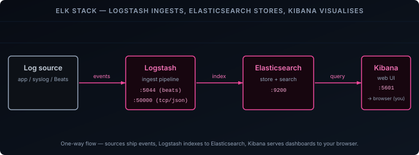

The ELK stack is the long-standing self-hosted answer to "where do my logs go?" — three services that ingest, store, and let you search everything your infrastructure produces. It predates most of the lighter alternatives and still shows up everywhere, largely because Elasticsearch's full-text search is hard to beat when you actually need to dig through log lines.

This post stands up all three components on a single Docker host with Docker Compose, wires them together on one network with authentication turned on, and pushes a test event through the pipeline to prove it works end to end.

- **Elasticsearch** — the search and storage engine. It holds documents in indices and answers queries.
- **Logstash** — the ingest pipeline. It receives events, parses and enriches them, and ships them to Elasticsearch.
- **Kibana** — the web UI. Explore data in Discover, then build visualizations and dashboards on top of it.

This is a single-node setup for a homelab: one Docker host, security enabled but HTTP TLS left off because all traffic stays on the internal Docker network. It is not a production cluster.



## Prerequisites

- A Docker host with Docker Engine and Docker Compose v2
- At least 4 GB of RAM free — Elasticsearch and Logstash each run a JVM, and this guide caps their heaps low to fit
- The ability to set a sysctl on the host (`vm.max_map_count`)
- Shell access to the host

## How the Pieces Fit Together

The data path is a straight line: Logstash receives events and writes them to Elasticsearch, Kibana reads from Elasticsearch, and your browser talks to Kibana. Nothing talks back upstream.

Run the **same version** for all three images, pin it explicitly, and never use `:latest` — a Kibana that is even a minor version ahead of its Elasticsearch will refuse to start. This guide uses `8.17.3`. Version 9.x is available and the setup is nearly identical; 8.x is the most broadly documented if you want to match existing material.

In the real world you would ship logs with [Filebeat](https://www.elastic.co/beats/filebeat) or Elastic Agent. Those are out of scope here — the smoke test at the end uses a raw Logstash TCP input so there is nothing else to install.

## Prepare the Host

Elasticsearch memory-maps its index files and needs a higher `mmap` count than most distributions ship with. Without this the container exits on startup.

```bash
sudo sysctl -w vm.max_map_count=262144
```

Make it persist across reboots:

```bash {filename="/etc/sysctl.d/99-elasticsearch.conf"}
vm.max_map_count=262144
```

Create a project directory — the whole stack lives in one Compose project:

```bash
mkdir elk && cd elk
```

Create an `.env` file for the image version and the two passwords. **Change both passwords before starting anything.**

```bash {filename=".env"}
STACK_VERSION=8.17.3
ELASTIC_PASSWORD=change-me-elastic
KIBANA_PASSWORD=change-me-kibana
```

## Elasticsearch

Create `docker-compose.yml` with the Elasticsearch service:

```yaml {filename="docker-compose.yml"}
services:
  elasticsearch:
    image: docker.elastic.co/elasticsearch/elasticsearch:${STACK_VERSION}
    container_name: elasticsearch
    environment:
      - node.name=elasticsearch
      - discovery.type=single-node
      - xpack.security.enabled=true
      - xpack.security.http.ssl.enabled=false
      - xpack.security.transport.ssl.enabled=false
      - ELASTIC_PASSWORD=${ELASTIC_PASSWORD}
      - "ES_JAVA_OPTS=-Xms1g -Xmx1g"
      - TZ=Europe/Amsterdam
    ulimits:
      memlock:
        soft: -1
        hard: -1
    healthcheck:
      test: ["CMD-SHELL", "curl -s -u elastic:${ELASTIC_PASSWORD} http://localhost:9200/_cluster/health | grep -qE '\"status\":\"(yellow|green)\"'"]
      interval: 10s
      timeout: 5s
      retries: 20
    volumes:
      - esdata:/usr/share/elasticsearch/data
    ports:
      - 9200:9200
    restart: unless-stopped
    networks:
      - elk

networks:
  elk:
    name: elk

volumes:
  esdata:
    name: esdata
```

Start it:

```bash
docker compose up -d elasticsearch
```

Give it a minute, then check cluster health. Passing `-u elastic` without the password makes `curl` prompt for it, so it never lands in your shell history:

```bash
curl -s -u elastic http://localhost:9200/_cluster/health?pretty
```

A single-node cluster reports `"status" : "yellow"` — that is expected, because replica shards have nowhere to go. `green` is only reachable with more than one node.

`discovery.type=single-node` skips the cluster bootstrap checks. `ELASTIC_PASSWORD` seeds the built-in `elastic` superuser on first start. Both TLS layers are disabled because every connection stays on the `elk` Docker network. The heap is pinned to 1 GB with `ES_JAVA_OPTS`, and `memlock` is unlimited so the JVM heap is never swapped to disk.

## Set the kibana_system Password

Kibana should not authenticate to Elasticsearch as the `elastic` superuser. It uses the built-in `kibana_system` account instead, which exists from the start but has no password until you set one:

```bash
curl -s -u elastic -X POST http://localhost:9200/_security/user/kibana_system/_password \
  -H 'Content-Type: application/json' \
  -d '{"password":"change-me-kibana"}'
```

Use the same value you put in `KIBANA_PASSWORD` in `.env`. A successful call returns `{}`.

## Kibana

Add the Kibana service to `docker-compose.yml`, under `services:`:

```yaml {filename="docker-compose.yml"}
  kibana:
    image: docker.elastic.co/kibana/kibana:${STACK_VERSION}
    container_name: kibana
    environment:
      - ELASTICSEARCH_HOSTS=http://elasticsearch:9200
      - ELASTICSEARCH_USERNAME=kibana_system
      - ELASTICSEARCH_PASSWORD=${KIBANA_PASSWORD}
      - TZ=Europe/Amsterdam
    ports:
      - 5601:5601
    depends_on:
      elasticsearch:
        condition: service_healthy
    restart: unless-stopped
    networks:
      - elk
```

Start it:

```bash
docker compose up -d kibana
```

Kibana takes a while to come up on the first run. Watch for it to report ready:

```bash
curl -s http://localhost:5601/api/status | grep -o '"level":"[a-z]*"'
```

Wait for `"level":"available"`, then open `http://<HOST_IP>:5601` and log in as `elastic` with your `ELASTIC_PASSWORD`.

Kibana authenticates to Elasticsearch as `kibana_system` — a limited account that can manage Kibana's own indices but not your data. You log in to the Kibana UI as `elastic`.

## Logstash

Logstash needs a pipeline definition. Create it first:

```ruby {filename="logstash/pipeline/logstash.conf"}
input {
  tcp {
    port  => 50000
    codec => json_lines
  }
  beats {
    port => 5044
  }
}

filter {
  date {
    match => ["timestamp", "ISO8601"]
  }
}

output {
  elasticsearch {
    hosts    => ["http://elasticsearch:9200"]
    user     => "elastic"
    password => "${ELASTIC_PASSWORD}"
    index    => "logs-%{+YYYY.MM.dd}"
  }
}
```

Add the Logstash service to `docker-compose.yml`, under `services:`:

```yaml {filename="docker-compose.yml"}
  logstash:
    image: docker.elastic.co/logstash/logstash:${STACK_VERSION}
    container_name: logstash
    environment:
      - "LS_JAVA_OPTS=-Xms512m -Xmx512m"
      - ELASTIC_PASSWORD=${ELASTIC_PASSWORD}
      - TZ=Europe/Amsterdam
    volumes:
      - ./logstash/pipeline:/usr/share/logstash/pipeline:ro
    ports:
      - 5044:5044
      - 50000:50000/tcp
    depends_on:
      elasticsearch:
        condition: service_healthy
    restart: unless-stopped
    networks:
      - elk
```

Start it:

```bash
docker compose up -d logstash
```

Follow the logs until the pipeline is running:

```bash
docker compose logs -f logstash
```

Look for `Pipeline started {"pipeline.id"=>"main"}` and no connection errors to Elasticsearch. Press `Ctrl+C` to stop following.

The `json_lines` codec on the TCP input parses one JSON object per line. The `date` filter reads a `timestamp` field off each event and promotes it to `@timestamp`, the field Kibana uses for its time axis. The output writes one index per day named `logs-YYYY.MM.dd`, authenticating as `elastic` — the `${ELASTIC_PASSWORD}` reference resolves from the environment variable passed into the container. The `beats` input is left in place so a real shipper can point at port 5044 later without touching the pipeline.

## Send a Test Event

Push a single JSON line into the Logstash TCP input. Bash can open the socket directly with its `/dev/tcp` builtin — no `nc` needed (though `nc localhost 50000` works too):

```bash
echo '{"message":"hello from the elk smoke test","service":"demo","timestamp":"'"$(date -u +%Y-%m-%dT%H:%M:%SZ)"'"}' > /dev/tcp/localhost/50000
```

Give it a few seconds, then ask Elasticsearch whether it arrived:

```bash
curl -s -u elastic 'http://localhost:9200/logs-*/_search?q=service:demo&pretty'
```

You should see `"value" : 1` under `hits.total`, with the event body in `_source`.

## See It in Kibana

1. Open `http://<HOST_IP>:5601` and log in as `elastic`.
2. Open the menu (**☰**) → **Stack Management** → **Data Views** → **Create data view**.
3. Set both the **Name** and the **Index pattern** to `logs-*`, confirm the timestamp field is `@timestamp`, and click **Save data view to Kibana**.
4. Open the menu (**☰**) → **Discover**, select the `logs-*` data view, and set the time range to **Last 15 minutes**.
5. The test event appears in the list. Expand it to see `message`, `service`, and the `@timestamp` that Logstash parsed from the `timestamp` field.

## The Full Compose File

For reference, the assembled `docker-compose.yml`:

```yaml {filename="docker-compose.yml"}
services:
  elasticsearch:
    image: docker.elastic.co/elasticsearch/elasticsearch:${STACK_VERSION}
    container_name: elasticsearch
    environment:
      - node.name=elasticsearch
      - discovery.type=single-node
      - xpack.security.enabled=true
      - xpack.security.http.ssl.enabled=false
      - xpack.security.transport.ssl.enabled=false
      - ELASTIC_PASSWORD=${ELASTIC_PASSWORD}
      - "ES_JAVA_OPTS=-Xms1g -Xmx1g"
      - TZ=Europe/Amsterdam
    ulimits:
      memlock:
        soft: -1
        hard: -1
    healthcheck:
      test: ["CMD-SHELL", "curl -s -u elastic:${ELASTIC_PASSWORD} http://localhost:9200/_cluster/health | grep -qE '\"status\":\"(yellow|green)\"'"]
      interval: 10s
      timeout: 5s
      retries: 20
    volumes:
      - esdata:/usr/share/elasticsearch/data
    ports:
      - 9200:9200
    restart: unless-stopped
    networks:
      - elk

  kibana:
    image: docker.elastic.co/kibana/kibana:${STACK_VERSION}
    container_name: kibana
    environment:
      - ELASTICSEARCH_HOSTS=http://elasticsearch:9200
      - ELASTICSEARCH_USERNAME=kibana_system
      - ELASTICSEARCH_PASSWORD=${KIBANA_PASSWORD}
      - TZ=Europe/Amsterdam
    ports:
      - 5601:5601
    depends_on:
      elasticsearch:
        condition: service_healthy
    restart: unless-stopped
    networks:
      - elk

  logstash:
    image: docker.elastic.co/logstash/logstash:${STACK_VERSION}
    container_name: logstash
    environment:
      - "LS_JAVA_OPTS=-Xms512m -Xmx512m"
      - ELASTIC_PASSWORD=${ELASTIC_PASSWORD}
      - TZ=Europe/Amsterdam
    volumes:
      - ./logstash/pipeline:/usr/share/logstash/pipeline:ro
    ports:
      - 5044:5044
      - 50000:50000/tcp
    depends_on:
      elasticsearch:
        condition: service_healthy
    restart: unless-stopped
    networks:
      - elk

networks:
  elk:
    name: elk

volumes:
  esdata:
    name: esdata
```

From a clean host, `docker compose up -d` brings all three up in dependency order — Kibana and Logstash wait for Elasticsearch to pass its health check first.

## Where to Go From Here

- **Ship real logs.** Install [Filebeat](https://www.elastic.co/beats/filebeat) or Elastic Agent on your other hosts and point them at Logstash on port 5044.
- **Set a retention policy.** `logs-*` indices fill disk quickly. Configure [Index Lifecycle Management](https://www.elastic.co/guide/en/elasticsearch/reference/current/index-lifecycle-management.html) to roll indices over and delete old ones automatically.
- **Back it up.** Register a snapshot repository so the data survives a rebuild.
- **Harden it.** Enable HTTP TLS and put Kibana behind a reverse proxy — the [Traefik installation guide]() covers that.

If this feels heavy for a homelab, the [Grafana observability stack]() covers a lighter Loki, Prometheus, and Grafana setup that handles both logs and metrics.
